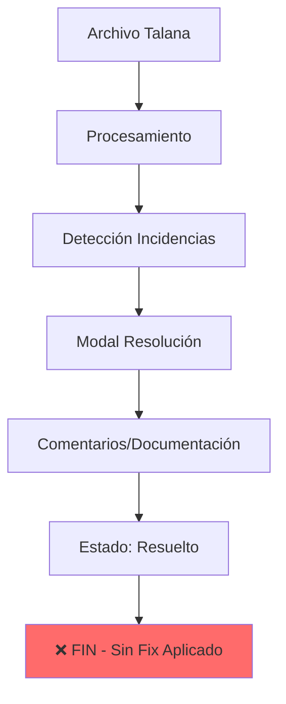
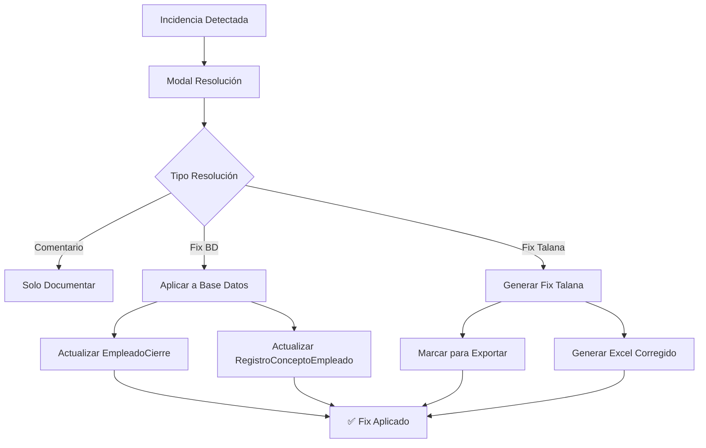
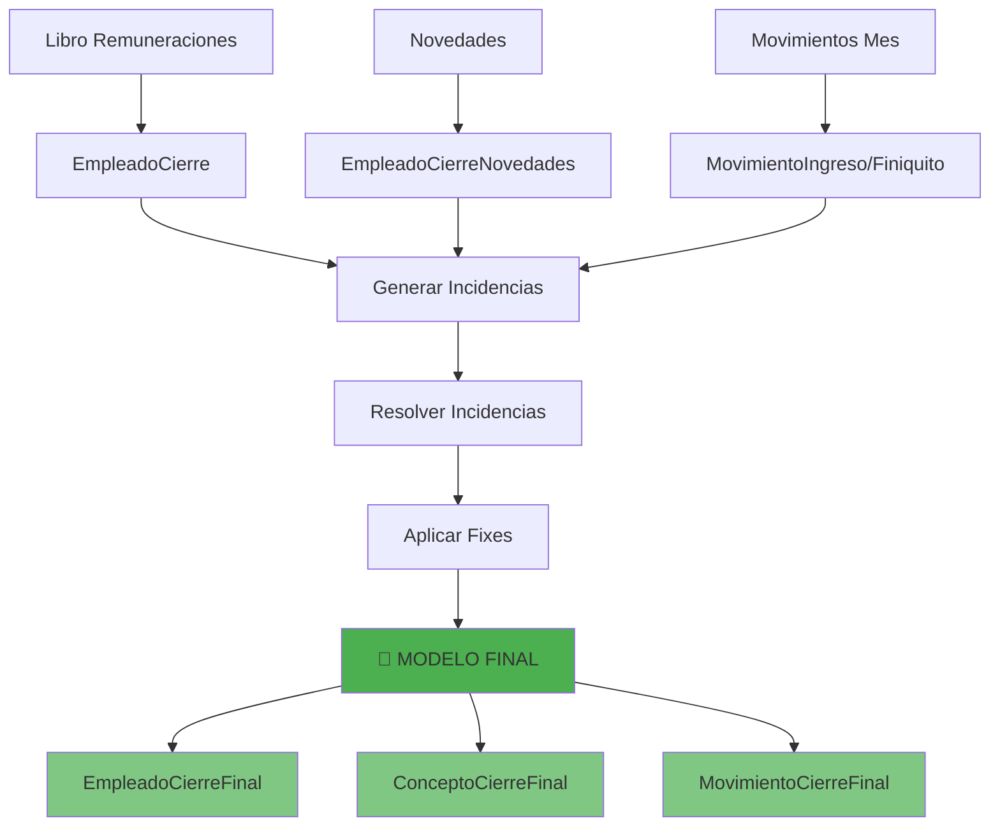
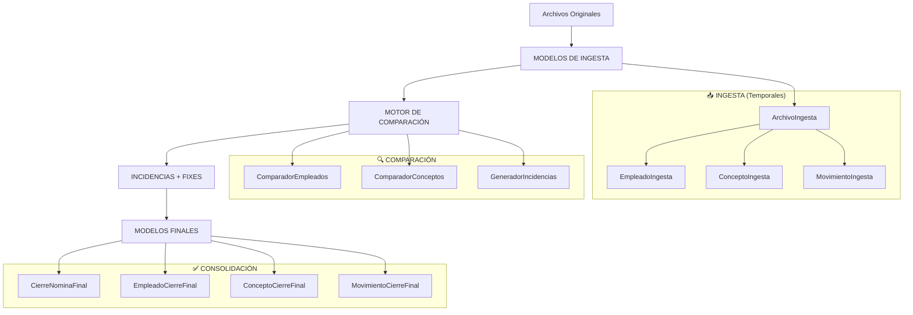

# 🚨 Análisis: Brecha Crítica en Aplicación de Fixes para Incidencias

## 🎯 **Problema Identificado**

El sistema actual permite **detectar, documentar y comentar** incidencias entre el Libro de Remuneraciones, Novedades y Movimientos del Mes, pero carece de un mecanismo para **aplicar fixes** cuando se determina que Talana debe ser corregido.

### **Estado Actual del Flujo de Incidencias**



### **Problema Identificado**
- ✅ Se detectan diferencias entre datos
- ✅ Se documentan las incidencias  
- ✅ Se añaden comentarios de resolución
- ❌ **NO se aplican fixes a los datos fuente**
- ❌ **NO hay lógica para actualizar Talana/BD**

---

## 🔍 **Análisis del Sistema Actual**

### **1. Modal de Resolución de Incidencias**
```jsx
// ModalResolucionIncidencia.jsx
const manejarEnvio = async (e) => {
  // Solo crea documentación, NO aplica fixes
  const formData = new FormData();
  formData.append('tipo_resolucion', tipoResolucion);
  formData.append('comentario', comentario);
  
  if (tipoResolucion === 'correccion') {
    formData.append('valor_corregido', valorCorregido);
    // ❌ Pero este valor NO se aplica a los datos originales
  }
}
```

### **2. Tipos de Incidencias Detectadas**
```python
# GenerarIncidencias.py
- EMPLEADO_SOLO_LIBRO
- EMPLEADO_SOLO_NOVEDADES  
- DIFERENCIA_SUELDO_BASE
- DIFERENCIA_MONTO_CONCEPTO
- DIFERENCIA_DATOS_PERSONALES
```

### **3. Gap Crítico Identificado**
> **Cuando se resuelve una incidencia marcando que "Talana debe ser corregido", el sistema NO tiene forma de aplicar ese fix a los datos originales.**

---

## 🛠️ **Propuesta de Solución**

### **Arquitectura Propuesta para Fixes**



### **1. Nuevos Tipos de Resolución**

```python
# models.py - Nueva tabla para fixes
class FixIncidencia(models.Model):
    incidencia = models.ForeignKey(IncidenciaCierre, on_delete=models.CASCADE)
    tipo_fix = models.CharField(max_length=20, choices=[
        ('bd_only', 'Solo Base de Datos'),
        ('talana_fix', 'Corregir Talana'),
        ('ambos', 'BD + Talana'),
    ])
    campo_corregido = models.CharField(max_length=100)
    valor_anterior = models.TextField()
    valor_nuevo = models.TextField()
    aplicado = models.BooleanField(default=False)
    fecha_aplicacion = models.DateTimeField(null=True, blank=True)
    usuario_aplica = models.ForeignKey(User, on_delete=models.CASCADE)
```

### **2. Lógica de Aplicación de Fixes**

```python
# utils/AplicarFixes.py
def aplicar_fix_base_datos(fix_incidencia):
    """
    Aplica corrección directamente a la BD del sistema
    """
    incidencia = fix_incidencia.incidencia
    
    if incidencia.tipo_incidencia == TipoIncidencia.DIFERENCIA_MONTO_CONCEPTO:
        # Actualizar RegistroConceptoEmpleado
        registro = RegistroConceptoEmpleado.objects.get(
            empleado=incidencia.empleado_libro,
            nombre_concepto_original=incidencia.campo_afectado
        )
        registro.monto = fix_incidencia.valor_nuevo
        registro.save()
        
    elif incidencia.tipo_incidencia == TipoIncidencia.DIFERENCIA_DATOS_PERSONALES:
        # Actualizar EmpleadoCierre
        empleado = incidencia.empleado_libro
        setattr(empleado, fix_incidencia.campo_corregido, fix_incidencia.valor_nuevo)
        empleado.save()

def generar_archivo_corregido_talana(cierre, fixes):
    """
    Genera nuevos archivos Excel con las correcciones aplicadas
    """
    fixes_libro = fixes.filter(incidencia__tipo_incidencia__contains='libro')
    fixes_movimientos = fixes.filter(incidencia__tipo_incidencia__contains='movimiento')
    
    # Recrear Libro de Remuneraciones con fixes
    if fixes_libro.exists():
        libro_original = LibroRemuneracionesUpload.objects.filter(cierre=cierre).latest()
        generar_libro_corregido(libro_original, fixes_libro)
    
    # Recrear Movimientos del Mes con fixes
    if fixes_movimientos.exists():
        movimientos_original = MovimientosMesUpload.objects.filter(cierre=cierre).latest()
        generar_movimientos_corregidos(movimientos_original, fixes_movimientos)
```

### **3. Interfaz Mejorada de Resolución**

```jsx
// ModalResolucionIncidencia.jsx - Extensión
const TipoResolucionSelector = () => {
  return (
    <div className="space-y-3">
      <label className="flex items-center gap-2">
        <input 
          type="radio" 
          value="comentario" 
          checked={tipoResolucion === 'comentario'}
          onChange={(e) => setTipoResolucion(e.target.value)}
        />
        <span>Solo comentar (no aplicar cambios)</span>
      </label>
      
      <label className="flex items-center gap-2">
        <input 
          type="radio" 
          value="fix_bd" 
          checked={tipoResolucion === 'fix_bd'}
          onChange={(e) => setTipoResolucion(e.target.value)}
        />
        <span>Corregir en Base de Datos (mantener BD como verdad)</span>
      </label>
      
      <label className="flex items-center gap-2">
        <input 
          type="radio" 
          value="fix_talana" 
          checked={tipoResolucion === 'fix_talana'}
          onChange={(e) => setTipoResolucion(e.target.value)}
        />
        <span>Generar corrección para Talana (exportar fix)</span>
      </label>
    </div>
  );
};
```

---

## 🎯 **Casos de Uso Específicos**

### **Caso 1: Diferencia en Monto de Concepto**
```
Problema: Libro dice $500.000, Novedades dice $550.000
Resolución Fix BD: Actualizar RegistroConceptoEmpleado.monto = 550000
Resolución Fix Talana: Generar Excel corregido con $550.000 en Libro
```

### **Caso 2: Empleado Solo en Novedades**
```
Problema: Empleado existe en Novedades pero no en Libro
Resolución Fix BD: Crear EmpleadoCierre con datos de novedades
Resolución Fix Talana: Agregar fila al Libro de Remuneraciones
```

### **Caso 3: Diferencia en Datos Personales**
```
Problema: Nombre diferentes entre Libro y Novedades
Resolución Fix BD: Actualizar EmpleadoCierre.nombre con valor correcto
Resolución Fix Talana: Corregir nombre en archivo Excel
```

---

## 📋 **Plan de Implementación**

### **Fase 1: Modelos y Backend (1-2 días)**
1. ✅ Crear modelo `FixIncidencia`
2. ✅ Implementar `utils/AplicarFixes.py`
3. ✅ Crear endpoints para aplicar fixes
4. ✅ Agregar lógica de generación de archivos corregidos

### **Fase 2: Frontend (1-2 días)**
1. ✅ Extender `ModalResolucionIncidencia.jsx`
2. ✅ Agregar selector de tipo de fix
3. ✅ Crear interfaz para preview de cambios
4. ✅ Implementar descarga de archivos corregidos

### **Fase 3: Integración y Testing (1 día)**
1. ✅ Testing de casos de uso principales
2. ✅ Validación de integridad de datos
3. ✅ Testing de generación de archivos

---

## 🚀 **Beneficios de la Solución**

### **Para el Proceso de Cierre**
- ✅ **Fixes automáticos**: Corrección directa en BD
- ✅ **Trazabilidad completa**: Registro de todos los cambios
- ✅ **Flexibilidad**: Elegir dónde aplicar el fix (BD vs Talana)
- ✅ **Auditabilidad**: Historial de modificaciones

### **Para la Tesis**
- ✅ **Workflow completo**: Desde detección hasta corrección
- ✅ **Gestión de fuente de verdad**: Decisión consciente sobre datos finales
- ✅ **Mejora continua**: Reducción de incidencias futuras
- ✅ **Automatización**: Menos intervención manual

---

## 🔮 **Próximos Pasos Recomendados**

1. **Implementar modelo `FixIncidencia`**
2. **Crear lógica de aplicación de fixes**
3. **Extender modal de resolución**
4. **Implementar exportación de archivos corregidos**
5. **Crear dashboard de fixes aplicados**

---

## 💡 **Reflexión para la Tesis**

Esta brecha identifica un punto crucial en la **transformación digital de procesos**: no basta con detectar problemas, sino que el sistema debe proporcionar **mecanismos de corrección** que mantengan la **integridad** y **trazabilidad** de los datos.

La implementación de esta funcionalidad representaría la **evolución** del sistema desde una herramienta de **detección** hacia una plataforma de **resolución activa** de incidencias.

---

## 🚀 **PROPUESTA MEJORADA: Modelo de Cierre Final**

### **🎯 Concepto Clave**
> **Los modelos actuales son para comparación y detección de incidencias. Una vez resueltas las incidencias, se consolida todo en un modelo "final" que representa la fuente de verdad definitiva del cierre.**

### **🏗️ Nueva Arquitectura Propuesta**



### **🗄️ Modelos Finales Propuestos**

```python
# models.py - Nuevos modelos para datos consolidados

class CierreNominaFinal(models.Model):
    """
    Representa el estado final consolidado de un cierre de nómina
    """
    cierre = models.OneToOneField(CierreNomina, on_delete=models.CASCADE, related_name='estado_final')
    fecha_consolidacion = models.DateTimeField(auto_now_add=True)
    usuario_consolida = models.ForeignKey(User, on_delete=models.CASCADE)
    total_incidencias_resueltas = models.IntegerField(default=0)
    total_fixes_aplicados = models.IntegerField(default=0)
    notas_finales = models.TextField(blank=True)
    
    # Metadatos del cierre
    total_empleados = models.IntegerField()
    total_conceptos = models.IntegerField()
    monto_total_haberes = models.DecimalField(max_digits=15, decimal_places=2)
    monto_total_descuentos = models.DecimalField(max_digits=15, decimal_places=2)
    
    estado = models.CharField(max_length=20, choices=[
        ('consolidado', 'Consolidado'),
        ('aprobado', 'Aprobado'),
        ('cerrado', 'Cerrado Definitivamente'),
    ], default='consolidado')

class EmpleadoCierreFinal(models.Model):
    """
    Datos consolidados y finales de empleados para el cierre
    """
    cierre_final = models.ForeignKey(CierreNominaFinal, on_delete=models.CASCADE, related_name='empleados')
    
    # Datos básicos (ya consolidados)
    rut = models.CharField(max_length=20)
    rut_empresa = models.CharField(max_length=20)
    nombre = models.CharField(max_length=100)
    apellido_paterno = models.CharField(max_length=100)
    apellido_materno = models.CharField(max_length=100)
    
    # Datos laborales
    cargo = models.CharField(max_length=100, blank=True)
    centro_costo = models.CharField(max_length=100, blank=True)
    sucursal = models.CharField(max_length=100, blank=True)
    fecha_ingreso = models.DateField(null=True, blank=True)
    
    # Resumen financiero
    total_haberes = models.DecimalField(max_digits=12, decimal_places=2, default=0)
    total_descuentos = models.DecimalField(max_digits=12, decimal_places=2, default=0)
    liquido_pagar = models.DecimalField(max_digits=12, decimal_places=2, default=0)
    
    # Metadatos
    origen_datos = models.CharField(max_length=50)  # 'libro', 'novedades', 'consolidado'
    incidencias_resueltas = models.IntegerField(default=0)
    
    class Meta:
        unique_together = ['cierre_final', 'rut']

class ConceptoCierreFinal(models.Model):
    """
    Conceptos consolidados por empleado en el cierre final
    """
    empleado_final = models.ForeignKey(EmpleadoCierreFinal, on_delete=models.CASCADE, related_name='conceptos')
    
    # Concepto
    nombre_concepto = models.CharField(max_length=200)
    clasificacion = models.CharField(max_length=20, choices=[
        ('haber', 'Haber'),
        ('descuento', 'Descuento'),
        ('informacion', 'Información'),
    ])
    
    # Valor final
    monto = models.DecimalField(max_digits=12, decimal_places=2)
    
    # Trazabilidad
    origen_valor = models.CharField(max_length=50)  # 'libro', 'novedades', 'fix_manual'
    valor_original = models.DecimalField(max_digits=12, decimal_places=2, null=True)
    fue_corregido = models.BooleanField(default=False)
    
    class Meta:
        unique_together = ['empleado_final', 'nombre_concepto']

class MovimientoCierreFinal(models.Model):
    """
    Movimientos consolidados del cierre (ingresos, finiquitos, etc.)
    """
    cierre_final = models.ForeignKey(CierreNominaFinal, on_delete=models.CASCADE, related_name='movimientos')
    empleado_final = models.ForeignKey(EmpleadoCierreFinal, on_delete=models.CASCADE, null=True, blank=True)
    
    tipo_movimiento = models.CharField(max_length=20, choices=[
        ('ingreso', 'Ingreso'),
        ('finiquito', 'Finiquito'),
        ('ausentismo', 'Ausentismo'),
        ('vacaciones', 'Vacaciones'),
        ('variacion_sueldo', 'Variación Sueldo'),
    ])
    
    # Datos del movimiento
    rut = models.CharField(max_length=20)
    nombre = models.CharField(max_length=200)
    fecha_movimiento = models.DateField()
    monto_asociado = models.DecimalField(max_digits=12, decimal_places=2, null=True, blank=True)
    
    # Metadatos
    origen_datos = models.CharField(max_length=50)
    fue_validado = models.BooleanField(default=True)
    observaciones = models.TextField(blank=True)
    
    # EJEMPLOS de detalles por tipo:
    # INGRESO: {
    #   "cargo": "ANALISTA SENIOR",
    #   "centro_costo": "CC001",
    #   "sueldo_base": 1500000,
    #   "fecha_contrato": "2024-12-01"
    # }
    # 
    # FINIQUITO: {
    #   "motivo": "Renuncia Voluntaria",
    #   "ultimo_dia_trabajado": "2024-12-31",
    #   "indemnizacion": 3000000,
    #   "vacaciones_pendientes": 500000
    # }
    # 
    # AUSENTISMO: {
    #   "tipo_ausentismo": "Licencia Médica",
    #   "fecha_inicio": "2024-12-15",
    #   "fecha_fin": "2024-12-30",
    #   "dias_total": 16,
    #   "afecta_haberes": true
    # }
```

### **🔄 Proceso de Consolidación**

```python
# utils/ConsolidarCierre.py

def consolidar_cierre_nomina(cierre_id):
    """
    Consolida todos los datos del cierre en los modelos finales
    después de resolver todas las incidencias
    """
    cierre = CierreNomina.objects.get(id=cierre_id)
    
    # 1. Verificar que todas las incidencias estén resueltas
    incidencias_pendientes = IncidenciaCierre.objects.filter(
        cierre=cierre,
        estado__in=['pendiente', 'en_revision']
    ).count()
    
    if incidencias_pendientes > 0:
        raise ValueError(f"Quedan {incidencias_pendientes} incidencias sin resolver")
    
    # 2. Crear el cierre final
    cierre_final = CierreNominaFinal.objects.create(
        cierre=cierre,
        usuario_consolida=request.user,
        total_incidencias_resueltas=IncidenciaCierre.objects.filter(cierre=cierre).count(),
        total_fixes_aplicados=FixIncidencia.objects.filter(
            incidencia__cierre=cierre,
            aplicado=True
        ).count()
    )
    
    # 3. Consolidar empleados
    consolidar_empleados_finales(cierre, cierre_final)
    
    # 4. Consolidar conceptos
    consolidar_conceptos_finales(cierre, cierre_final)
    
    # 5. Consolidar movimientos
    consolidar_movimientos_finales(cierre, cierre_final)
    
    # 6. Calcular totales
    calcular_totales_cierre(cierre_final)
    
    return cierre_final

def consolidar_empleados_finales(cierre, cierre_final):
    """
    Consolida empleados aplicando fixes y resolviendo conflictos
    """
    # Obtener empleados de todas las fuentes
    empleados_libro = EmpleadoCierre.objects.filter(cierre=cierre)
    empleados_novedades = EmpleadoCierreNovedades.objects.filter(cierre=cierre)
    
    # Aplicar lógica de consolidación según fixes aplicados
    for emp_libro in empleados_libro:
        # Verificar si hay fixes aplicados para este empleado
        fixes_empleado = FixIncidencia.objects.filter(
            incidencia__cierre=cierre,
            incidencia__rut_empleado=emp_libro.rut,
            aplicado=True
        )
        
        # Crear empleado final con datos consolidados
        empleado_final = EmpleadoCierreFinal.objects.create(
            cierre_final=cierre_final,
            rut=emp_libro.rut,
            nombre=aplicar_fixes_campo(emp_libro.nombre, fixes_empleado, 'nombre'),
            # ... aplicar fixes a todos los campos
            origen_datos='consolidado' if fixes_empleado.exists() else 'libro',
            incidencias_resueltas=fixes_empleado.count()
        )

def aplicar_fixes_campo(valor_original, fixes, campo):
    """
    Aplica fixes específicos a un campo
    """
    fix_campo = fixes.filter(campo_corregido=campo).first()
    if fix_campo:
        return fix_campo.valor_nuevo
    return valor_original
```

### **🎯 Ventajas de Esta Arquitectura**

#### **1. Separación de Responsabilidades**
- **Modelos actuales**: Solo para comparación y detección
- **Modelos finales**: Fuente de verdad consolidada
- **Incidencias**: Registro histórico del proceso

#### **2. Flexibilidad Total**
- Se puede "regenerar" el cierre cuantas veces sea necesario
- Las incidencias se mantienen como historial
- Los fixes quedan registrados y trazables

#### **3. Integridad de Datos**
- Los datos finales están garantizados sin conflictos
- Trazabilidad completa de cambios
- Posibilidad de auditoría

#### **4. Reutilización**
- Los modelos actuales siguen siendo útiles para comparaciones
- Se puede comparar contra cierres anteriores
- Facilita reportería y análisis

### **🔄 Flujo de Trabajo Mejorado**

```
1. Subir archivos (Libro, Novedades, Movimientos)
   ↓
2. Procesar en modelos actuales (EmpleadoCierre, etc.)
   ↓
3. Generar incidencias comparando modelos
   ↓
4. Resolver incidencias (comentarios + fixes)
   ↓
5. Consolidar en modelos finales
   ↓
6. Cierre queda "consolidado" y listo para aprobación
   ↓
7. Posibilidad de regenerar si se detectan nuevos problemas
```

### **📊 Beneficios para Reporting**

```python
# Ejemplos de consultas poderosas
def obtener_resumen_cierre(cierre_id):
    cierre_final = CierreNominaFinal.objects.get(cierre_id=cierre_id)
    
    return {
        'total_empleados': cierre_final.empleados.count(),
        'total_haberes': cierre_final.empleados.aggregate(Sum('total_haberes'))['total_haberes__sum'],
        'empleados_con_incidencias': cierre_final.empleados.filter(incidencias_resueltas__gt=0).count(),
        'conceptos_corregidos': ConceptoCierreFinal.objects.filter(
            empleado_final__cierre_final=cierre_final,
            fue_corregido=True
        ).count()
    }
```

---

## 🔄 **REPLANTEAMIENTO COMPLETO: Modelos Actuales + Finales**

### **🎯 Problema con Modelos Actuales**

Los modelos actuales tienen algunas inconsistencias y redundancias:

```python
# PROBLEMAS IDENTIFICADOS
EmpleadoCierre                   # Solo del Libro
EmpleadoCierreNovedades         # Solo de Novedades  
RegistroConceptoEmpleado        # Solo del Libro
RegistroConceptoEmpleadoNovedades # Solo de Novedades
MovimientoIngreso/Finiquito     # Solo de Movimientos Mes
```

**Problemas:**
- ❌ **Duplicación de lógica** entre modelos similares
- ❌ **Nombres inconsistentes** (algunos con "Cierre", otros no)
- ❌ **Separación artificial** por fuente de datos
- ❌ **Dificultad para comparar** entre fuentes

### **🏗️ Arquitectura Replanteada Completa**



### **📥 Nuevos Modelos de Ingesta (Reemplazan Actuales)**

```python
# models.py - models de ingesta

class ArchivoIngesta(models.Model):
    """
    🎯 PROPÓSITO: 
    Registrar y trackear cada archivo subido al sistema, manteniendo 
    metadatos completos para trazabilidad y control de versiones.
    
    📥 QUÉ ESPERA RECIBIR:
    - Archivos Excel (.xlsx) desde Talana o sistemas externos
    - Puede recibir múltiples versiones del mismo tipo
    - Headers pueden variar entre versiones
    - Formatos pueden ser inconsistentes
    
    🔄 CASOS DE USO:
    - Libro de Remuneraciones (formato estándar Talana)
    - Archivo de Novedades (formato variable por mes)
    - Movimientos del Mes (múltiples hojas)
    - Archivos adicionales del analista
    """
    
    cierre = models.ForeignKey(CierreNomina, on_delete=models.CASCADE, related_name='archivos_ingesta')
    
    tipo_archivo = models.CharField(max_length=30, choices=[
        ('libro_remuneraciones', 'Libro de Remuneraciones'),
        ('novedades', 'Archivo de Novedades'),
        ('movimientos_mes', 'Movimientos del Mes'),
        ('archivos_analista', 'Archivos del Analista'),
    ])
    
    archivo = models.FileField(upload_to='ingesta/%Y/%m/')
    nombre_original = models.CharField(max_length=255)
    fecha_subida = models.DateTimeField(auto_now_add=True)
    usuario_subida = models.ForeignKey(User, on_delete=models.CASCADE)
    
    # Estado de procesamiento
    estado = models.CharField(max_length=20, choices=[
        ('subido', 'Subido'),
        ('procesando', 'Procesando'),
        ('procesado', 'Procesado'),
        ('error', 'Error'),
    ], default='subido')
    
    # Metadatos del procesamiento - PRESERVA LA REALIDAD
    headers_detectados = models.JSONField(default=list)  # Headers exactos del Excel
    filas_procesadas = models.IntegerField(default=0)
    errores_procesamiento = models.JSONField(default=list)  # Errores sin pérdida
    fecha_procesamiento = models.DateTimeField(null=True, blank=True)

class EmpleadoIngesta(models.Model):
    """
    🎯 PROPÓSITO:
    Extraer y almacenar datos de empleados tal como aparecen en cada archivo,
    sin normalización ni validación, preservando inconsistencias para posterior análisis.
    
    📥 QUÉ ESPERA RECIBIR:
    LIBRO DE REMUNERACIONES:
    - RUT (puede venir con/sin puntos/guión)
    - Nombres completos o separados
    - Datos laborales básicos
    - Sueldo base
    
    NOVEDADES:
    - RUT (formato puede diferir del libro)
    - Nombres (pueden tener typos o formato diferente)
    - Conceptos adicionales no presentes en libro
    
    MOVIMIENTOS DEL MES:
    - RUT y nombres básicos
    - Información específica del movimiento
    - Fechas en varios formatos
    
    🚨 TOLERANCIA TOTAL A INCONSISTENCIAS:
    - Nombres escritos diferente entre fuentes
    - RUTs con formatos distintos
    - Campos vacíos o con valores extraños
    - Datos laborales parciales o incorrectos
    """
    
    archivo_origen = models.ForeignKey(ArchivoIngesta, on_delete=models.CASCADE, related_name='empleados')
    
    # Datos básicos - SIN NORMALIZACIÓN
    rut = models.CharField(max_length=20)  # "12.345.678-9" o "123456789" o "12345678-9"
    rut_empresa = models.CharField(max_length=20, blank=True)
    nombre = models.CharField(max_length=100)  # "JUAN CARLOS" o "Juan Carlos" o "juan carlos"
    apellido_paterno = models.CharField(max_length=100, blank=True)  # Puede venir en "nombre"
    apellido_materno = models.CharField(max_length=100, blank=True)
    
    # Datos laborales - COMO VENGAN
    cargo = models.CharField(max_length=100, blank=True)  # "Gerente" o "GERENTE VENTAS"
    centro_costo = models.CharField(max_length=100, blank=True)  # "CC001" o "Centro Costo 1"
    sucursal = models.CharField(max_length=100, blank=True)
    fecha_ingreso = models.DateField(null=True, blank=True)  # Varios formatos de fecha
    
    # Metadatos - TRAZABILIDAD TOTAL
    fila_origen = models.IntegerField()  # Fila exacta en el Excel (incluyendo headers)
    datos_raw = models.JSONField()  # TODOS los datos de la fila original
    
    # EJEMPLO de datos_raw:
    # {
    #   "RUT": "12.345.678-9",
    #   "NOMBRES": "JUAN CARLOS PÉREZ GONZÁLEZ",
    #   "SUELDO BASE": 1500000,
    #   "CONCEPTO EXTRA": 50000,
    #   "COLUMNA_DESCONOCIDA": "Valor extraño"
    # }
    
    class Meta:
        unique_together = ['archivo_origen', 'rut']

class ConceptoIngesta(models.Model):
    """
    🎯 PROPÓSITO:
    Extraer cada concepto/monto encontrado en los archivos, manteniendo
    nombres originales y valores exactos para posterior mapeo y clasificación.
    
    📥 QUÉ ESPERA RECIBIR:
    LIBRO DE REMUNERACIONES:
    - Columnas de conceptos con nombres variables:
      "SUELDO BASE", "HORAS EXTRAS", "COMISIONES", "BONOS"
      "DESCUENTO AFP", "DESCUENTO ISAPRE", "IMPUESTO"
    - Montos en diferentes formatos (con/sin separadores)
    
    NOVEDADES:
    - Conceptos adicionales no en libro:
      "BONO ESPECIAL", "DESCUENTO ESPECIAL", "AJUSTE SUELDO"
    - Nombres pueden ser abreviados o con typos
    - Valores pueden incluir conceptos informativos (días, horas)
    
    🔍 DETECCIÓN AUTOMÁTICA:
    - Intenta clasificar como Haber/Descuento por nombre o valor
    - Si no puede determinar, marca como "desconocido"
    - Busca mapeo a conceptos conocidos del sistema
    """
    
    empleado = models.ForeignKey(EmpleadoIngesta, on_delete=models.CASCADE, related_name='conceptos')
    
    # Concepto RAW - Sin normalización
    nombre_concepto_raw = models.CharField(max_length=200)  # "SUELDO BASE" o "sueldo base" o "SLD BASE"
    monto = models.DecimalField(max_digits=12, decimal_places=2)  # Valor exacto encontrado
    
    # Clasificación TENTATIVA - Puede estar mal
    clasificacion_detectada = models.CharField(max_length=20, choices=[
        ('haber', 'Haber'),           # Detectado por valor positivo o nombre conocido
        ('descuento', 'Descuento'),   # Detectado por valor negativo o nombre conocido
        ('informacion', 'Información'), # Detectado como días, horas, etc.
        ('desconocido', 'Desconocido'), # No se pudo clasificar automáticamente
    ], default='desconocido')
    
    # Mapeo TENTATIVO a concepto conocido
    concepto_mapeado = models.ForeignKey(
        'ConceptoRemuneracion', 
        on_delete=models.SET_NULL, 
        null=True, 
        blank=True
    )  # Si se encontró un mapeo automático, puede estar incorrecto
    
    # Metadatos - TRAZABILIDAD EXACTA
    columna_origen = models.CharField(max_length=200)  # Header exacto: "SUELDO BASE"
    fila_origen = models.IntegerField()  # Fila en Excel donde se encontró
    
    # EJEMPLOS de datos esperados:
    # nombre_concepto_raw: "SUELDO BASE", monto: 1500000, clasificacion: "haber"
    # nombre_concepto_raw: "DESC. AFP", monto: -120000, clasificacion: "descuento"  
    # nombre_concepto_raw: "DÍAS TRABAJADOS", monto: 30, clasificacion: "informacion"
    # nombre_concepto_raw: "BONO RARO", monto: 50000, clasificacion: "desconocido"
```

---

### **💰 MovimientoIngesta**

```python
class MovimientoIngesta(models.Model):
    """
    🎯 PROPÓSITO:
    Extraer movimientos del archivo "Movimientos del Mes" que contiene
    múltiples hojas (Ingresos, Finiquitos, Ausentismos, etc.) con formatos diferentes.
    
    📥 QUÉ ESPERA RECIBIR:
    HOJA "INGRESOS":
    - RUT, Nombre, Fecha Ingreso, Sueldo Base
    - Formato: básico con datos laborales
    
    HOJA "FINIQUITO":
    - RUT, Nombre, Fecha Finiquito, Motivo, Indemnización
    - Formato: con datos específicos de término
    
    HOJA "AUSENTISMOS":
    - RUT, Nombre, Tipo Ausentismo, Fecha Inicio, Fecha Fin, Días
    - Formato: con períodos y cantidades
    
    HOJA "VARIACIONES SUELDO":
    - RUT, Nombre, Sueldo Anterior, Sueldo Nuevo, Fecha Vigencia
    - Formato: con valores comparativos
    
    🚨 FLEXIBILIDAD TOTAL:
    - Cada hoja puede tener formato completamente diferente
    - Headers pueden cambiar entre meses
    - Algunos campos pueden estar vacíos o con formatos raros
    """
    
    archivo_origen = models.ForeignKey(ArchivoIngesta, on_delete=models.CASCADE, related_name='movimientos')
    empleado = models.ForeignKey(EmpleadoIngesta, on_delete=models.CASCADE, null=True, blank=True)
    
    # Tipo detectado automáticamente por nombre de hoja
    tipo_movimiento = models.CharField(max_length=30, choices=[
        ('ingreso', 'Ingreso'),
        ('finiquito', 'Finiquito'),
        ('ausentismo', 'Ausentismo'),
        ('vacaciones', 'Vacaciones'),
        ('variacion_sueldo', 'Variación Sueldo'),
    ])
    
    # Datos básicos - COMUNES a todos los tipos
    rut = models.CharField(max_length=20)           # Formato sin normalizar
    nombre = models.CharField(max_length=200)       # Como venga en el movimiento
    fecha_movimiento = models.DateField(null=True, blank=True)           # Fecha principal del movimiento
    monto = models.DecimalField(max_digits=12, decimal_places=2, null=True, blank=True)  # Monto principal
    
    # Detalles específicos por tipo - ESTRUCTURADOS
    detalles = models.JSONField()  # Datos específicos organizados por tipo
    
    # Impacto en nómina
    afecta_calculo = models.BooleanField(default=True)  # Si impacta el cálculo del mes
    conceptos_impactados = models.JSONField(default=list)  # Qué conceptos se ven afectados
    
    # Validación y calidad
    origen_datos = models.CharField(max_length=50)  # 'movimientos_mes', 'manual', 'importado'
    fue_validado = models.BooleanField(default=True)
    observaciones = models.TextField(blank=True)
    
    # EJEMPLOS de detalles por tipo:
    # INGRESO: {
    #   "cargo": "ANALISTA SENIOR",
    #   "centro_costo": "CC001",
    #   "sueldo_base": 1500000,
    #   "fecha_contrato": "2024-12-01"
    # }
    # 
    # FINIQUITO: {
    #   "motivo": "Renuncia Voluntaria",
    #   "ultimo_dia_trabajado": "2024-12-31",
    #   "indemnizacion": 3000000,
    #   "vacaciones_pendientes": 500000
    # }
    # 
    # AUSENTISMO: {
    #   "tipo_ausentismo": "Licencia Médica",
    #   "fecha_inicio": "2024-12-15",
    #   "fecha_fin": "2024-12-30",
    #   "dias_total": 16,
    #   "afecta_haberes": true
    # }
```

---

## 🥈 **CAPA SILVER (Incidencias & Fixes) - "Data Lista para BI"**

### **🎯 Propósito de la Capa Silver**
> **Detectar inconsistencias, aplicar reglas de negocio, generar incidencias y aplicar fixes para preparar los datos para consolidación final.**

---

### **⚠️ IncidenciaCierre**

```python
class IncidenciaCierre(models.Model):
    """
    🎯 PROPÓSITO:
    Documentar cada diferencia, inconsistencia o problema detectado al comparar
    datos entre diferentes fuentes, generando un registro auditable de todos los conflictos.
    
    📥 QUÉ ESPERA RECIBIR:
    COMPARACIÓN EMPLEADOS:
    - Empleado existe en Libro pero no en Novedades
    - Empleado existe en Novedades pero no en Libro  
    - Nombres diferentes entre fuentes para mismo RUT
    - Datos laborales inconsistentes (cargo, sueldo base)
    
    COMPARACIÓN CONCEPTOS:
    - Concepto existe en una fuente pero no en otra
    - Mismo concepto con montos diferentes
    - Conceptos no mapeados o mal clasificados
    
    VALIDACIONES DE NEGOCIO:
    - Empleados sin conceptos de haberes
    - Montos fuera de rangos esperados
    - Fechas inválidas o inconsistentes
    
    🔍 TIPOS DE INCIDENCIAS:
    - Automáticas: Detectadas por algoritmos de comparación
    - Manuales: Creadas por usuarios durante revisión
    - Críticas: Que bloquean el cierre
    - Informativas: Para conocimiento pero no bloquean
    """
    
    cierre = models.ForeignKey(CierreNomina, on_delete=models.CASCADE, related_name='incidencias')
    
    # Clasificación de la incidencia
    tipo_incidencia = models.CharField(max_length=50, choices=[
        # Incidencias automáticas de formato/datos
        ('empleado_solo_libro', 'Empleado Solo en Libro'),
        ('empleado_solo_novedades', 'Empleado Solo en Novedades'),
        ('diferencia_datos_personales', 'Diferencia en Datos Personales'),
        ('diferencia_sueldo_base', 'Diferencia en Sueldo Base'),
        ('concepto_solo_libro', 'Concepto Solo en Libro'),
        ('concepto_solo_novedades', 'Concepto Solo en Novedades'),
        ('diferencia_monto_concepto', 'Diferencia en Monto de Concepto'),
        ('concepto_sin_mapear', 'Concepto Sin Mapear'),
        
        # Incidencias de validación automática
        ('empleado_sin_haberes', 'Empleado Sin Haberes'),
        ('monto_fuera_rango', 'Monto Fuera de Rango Esperado'),
        ('fecha_invalida', 'Fecha Inválida'),
        
        # Incidencias manuales de negocio (requieren evidencia)
        ('empleado_situacion_especial', 'Empleado con Situación Especial'),
        ('ajuste_manual_concepto', 'Ajuste Manual de Concepto'),
        ('correccion_retroactiva', 'Corrección Retroactiva'),
        ('licencia_medica_extendida', 'Licencia Médica Extendida'),
        ('finiquito_especial', 'Finiquito con Condiciones Especiales'),
        ('bono_extraordinario', 'Bono Extraordinario'),
        ('descuento_por_dano', 'Descuento por Daño/Pérdida'),
        ('vacaciones_vendidas', 'Vacaciones Vendidas'),
        ('prestamo_empresa', 'Préstamo de Empresa'),
        ('embargo_judicial', 'Embargo Judicial'),
    ])
    
    # Severidad del problema
    severidad = models.CharField(max_length=20, choices=[
        ('critica', 'Crítica - Bloquea Cierre'),
        ('alta', 'Alta - Requiere Resolución'),
        ('media', 'Media - Recomendable Resolver'),
        ('baja', 'Baja - Informativa'),
    ])
    
    # Datos involucrados
    rut_empleado = models.CharField(max_length=20, blank=True)
    nombre_empleado = models.CharField(max_length=200, blank=True)
    campo_afectado = models.CharField(max_length=100, blank=True)  # "sueldo_base", "nombre", etc.
    
    # Valores en conflicto
    valor_libro = models.TextField(blank=True)    # Valor en Libro de Remuneraciones
    valor_novedades = models.TextField(blank=True) # Valor en Novedades
    valor_esperado = models.TextField(blank=True)  # Valor que debería ser (según reglas)
    
    # Estado de resolución
    estado = models.CharField(max_length=20, choices=[
        ('pendiente', 'Pendiente'),
        ('en_revision', 'En Revisión'),
        ('resuelto', 'Resuelto'),
        ('descartado', 'Descartado'),
    ], default='pendiente')
    
    # Resolución y seguimiento
    fecha_resolucion = models.DateTimeField(null=True, blank=True)
    usuario_resolucion = models.ForeignKey(User, on_delete=models.CASCADE, null=True, blank=True, related_name='incidencias_resueltas')
    comentario_resolucion = models.TextField(blank=True)
    
    # Metadatos
    fecha_detectada = models.DateTimeField(auto_now_add=True)
    detectada_por = models.CharField(max_length=50)  # "algoritmo_comparacion", "usuario_manual"
    
    # EJEMPLOS de incidencias con evidencia:
    # AUTOMÁTICA (formato):
    # tipo: "diferencia_monto_concepto"
    # rut_empleado: "12.345.678-9"
    # campo_afectado: "SUELDO BASE"
    # valor_libro: "1500000"
    # valor_novedades: "1550000"
    # severidad: "alta"
    # evidencia_imagen: null  # No necesita imagen para diferencias automáticas
    # 
    # MANUAL (negocio):
    # tipo: "empleado_situacion_especial"
    # rut_empleado: "98.765.432-1"
    # descripcion: "Empleado con licencia médica extendida requiere ajuste manual"
    # severidad: "critica"
    # evidencia_imagen: "incidencias/evidencia/2024/12/licencia_medica_juan_perez.jpg"
    # archivos_adjuntos: ["licencia_medica.pdf", "correo_rrhh.pdf"]
```

---

### **🔧 FixIncidencia**

```python
class FixIncidencia(models.Model):
    """
    🎯 PROPÓSITO:
    Registrar y aplicar correcciones específicas para resolver incidencias,
    manteniendo trazabilidad completa de qué se cambió, cuándo y por quién.
    
    📥 QUÉ ESPERA RECIBIR:
    DECISIÓN DE RESOLUCIÓN:
    - Tipo de fix a aplicar (BD, Talana, ambos)
    - Campo específico a corregir
    - Valor anterior y valor nuevo
    - Justificación del cambio
    
    DATOS DE APLICACIÓN:
    - Usuario que autoriza el fix
    - Fecha de aplicación
    - Confirmación de aplicación exitosa
    
    🔄 TIPOS DE FIXES:
    BD_ONLY: Solo corregir en base de datos interna
    - Actualizar EmpleadoIngesta
    - Actualizar ConceptoIngesta  
    - Mantener archivos originales intactos
    
    TALANA_FIX: Generar corrección para Talana
    - Crear nuevo archivo Excel corregido
    - Marcar para exportar a Talana
    - Mantener BD como está
    
    AMBOS: Aplicar en BD y generar archivo
    - Corregir datos internos
    - Generar archivo corregido
    - Sincronizar ambas fuentes
    """
    
    incidencia = models.ForeignKey(IncidenciaCierre, on_delete=models.CASCADE, related_name='fixes')
    
    # Tipo de corrección
    tipo_fix = models.CharField(max_length=20, choices=[
        ('bd_only', 'Solo Base de Datos'),
        ('talana_fix', 'Corregir Talana'),
        ('ambos', 'BD + Talana'),
        ('comentario', 'Solo Comentario'),
    ])
    
    # Detalles del fix
    campo_corregido = models.CharField(max_length=100)  # "sueldo_base", "nombre", "monto_concepto"
    valor_anterior = models.TextField()  # Valor antes del fix
    valor_nuevo = models.TextField()     # Valor después del fix
    justificacion = models.TextField()   # Por qué se aplica este fix
    
    # Control de aplicación
    aplicado = models.BooleanField(default=False)
    fecha_aplicacion = models.DateTimeField(null=True, blank=True)
    usuario_aplica = models.ForeignKey(User, on_delete=models.CASCADE)
    
    # Resultados de aplicación
    resultado_aplicacion = models.JSONField(default=dict)  # Detalles de qué se modificó
    errores_aplicacion = models.JSONField(default=list)    # Errores durante aplicación
    
    # EJEMPLO de fix típico:
    # tipo_fix: "bd_only"
    # campo_corregido: "sueldo_base"
    # valor_anterior: "1500000"
    # valor_nuevo: "1550000"
    # justificacion: "Novedades tiene el valor correcto según HR"
    # resultado_aplicacion: {"empleado_id": 123, "campo_actualizado": "sueldo_base", "tabla": "EmpleadoIngesta"}
```

---

## 🥇 **CAPA GOLD (Consolidación Final) - "Business Ready"**

### **🎯 Propósito de la Capa Gold**
> **Consolidar todos los datos limpios, validados y sin conflictos en modelos finales que representan la fuente de verdad única del cierre de nómina.**

---

### **🏆 CierreNominaFinal**

```python
class CierreNominaFinal(models.Model):
    """
    🎯 PROPÓSITO:
    Representar el estado final consolidado y aprobado de un cierre de nómina,
    con todos los datos limpios, incidencias resueltas y métricas de calidad.
    
    📥 QUÉ ESPERA RECIBIR:
    DATOS CONSOLIDADOS:
    - Todos los empleados procesados y validados
    - Todos los conceptos clasificados y mapeados
    - Todas las incidencias resueltas o aceptadas
    - Todos los fixes aplicados y verificados
    
    MÉTRICAS DE CALIDAD:
    - Cantidad de incidencias detectadas y resueltas
    - Número de fixes aplicados por tipo
    - Totales financieros calculados y balanceados
    - Porcentaje de empleados sin conflictos
    
    APROBACIONES:
    - Validación de analista de nómina
    - Aprobación de supervisor
    - Cierre definitivo del período
    
    🔐 ESTADOS DEL CIERRE:
    CONSOLIDADO: Datos procesados, incidencias resueltas
    APROBADO: Validado por responsables del área
    CERRADO: Bloqueado para modificaciones, datos finales
    """
    
    cierre = models.OneToOneField(CierreNomina, on_delete=models.CASCADE, related_name='estado_final')
    
    # Control del proceso
    fecha_consolidacion = models.DateTimeField(auto_now_add=True)
    usuario_consolida = models.ForeignKey(User, on_delete=models.CASCADE, related_name='cierres_consolidados')
    fecha_aprobacion = models.DateTimeField(null=True, blank=True)
    usuario_aprueba = models.ForeignKey(User, on_delete=models.CASCADE, null=True, blank=True, related_name='cierres_aprobados')
    
    # Métricas de calidad
    total_incidencias_resueltas = models.IntegerField(default=0)
    total_fixes_aplicados = models.IntegerField(default=0)
    porcentaje_empleados_sin_conflictos = models.DecimalField(max_digits=5, decimal_places=2, default=0)
    
    # Totales financieros - FUENTE DE VERDAD
    total_empleados = models.IntegerField()
    total_conceptos = models.IntegerField()
    monto_total_haberes = models.DecimalField(max_digits=15, decimal_places=2)
    monto_total_descuentos = models.DecimalField(max_digits=15, decimal_places=2)
    liquido_total_pagar = models.DecimalField(max_digits=15, decimal_places=2)
    
    # Estado definitivo
    estado = models.CharField(max_length=20, choices=[
        ('consolidado', 'Consolidado'),
        ('aprobado', 'Aprobado'),
        ('cerrado', 'Cerrado Definitivamente'),
    ], default='consolidado')

    # Notas y observaciones
    notas_finales = models.TextField(blank=True)
    archivos_generados = models.JSONField(default=list)  # Archivos exportados
    
    # EJEMPLO de totales esperados:
    # total_empleados: 150
    # monto_total_haberes: 225000000  # $225M en haberes
    # monto_total_descuentos: 45000000  # $45M en descuentos
    # liquido_total_pagar: 180000000   # $180M líquido
```

---

### **👤 EmpleadoCierreFinal**

```python
class EmpleadoCierreFinal(models.Model):
    """
    🎯 PROPÓSITO:
    Almacenar los datos definitivos y consolidados de cada empleado para el cierre,
    con todos los conflictos resueltos y datos validados como fuente de verdad única.
    
    📥 QUÉ ESPERA RECIBIR:
    DATOS BÁSICOS CONSOLIDAS:
    - RUT normalizado y validado
    - Nombres completos y consistentes
    - Datos laborales verificados
    
    DATOS FINANCIEROS CALCULADOS:
    - Totales de haberes consolidados
    - Totales de descuentos aplicados
    - Líquido a pagar final
    
    MÉTRICAS DE CALIDAD:
    - Origen de cada dato (libro, novedades, fix manual)
    - Cantidad de incidencias que afectaron al empleado
    - Indicadores de calidad de datos
    
    🎯 GARANTÍAS:
    - Un solo registro por empleado por cierre
    - Todos los montos cuadrados y validados
    - Origen de cada dato trazable
    - Sin conflictos sin resolver
    """
    
    cierre_final = models.ForeignKey(CierreNominaFinal, on_delete=models.CASCADE, related_name='empleados')
    
    # Datos básicos - CONSOLIDAS Y NORMALIZADOS
    rut = models.CharField(max_length=20)          # "12345678-9" (formato normalizado)
    rut_empresa = models.CharField(max_length=20)   # RUT empresa normalizado
    nombre = models.CharField(max_length=100)       # "JUAN CARLOS" (normalizado)
    apellido_paterno = models.CharField(max_length=100)  # "PÉREZ"
    apellido_materno = models.CharField(max_length=100)  # "GONZÁLEZ"
    
    # Datos laborales - VERIFICADOS
    cargo = models.CharField(max_length=100, blank=True)      # "ANALISTA SENIOR"
    centro_costo = models.CharField(max_length=100, blank=True) # "CC001 - VENTAS"
    sucursal = models.CharField(max_length=100, blank=True)    # "SUCURSAL SANTIAGO"
    fecha_ingreso = models.DateField(null=True, blank=True)    # Fecha validada
    sueldo_base = models.DecimalField(max_digits=12, decimal_places=2, null=True, blank=True)
    
    # Resumen financiero - CALCULADO Y BALANCEADO
    total_haberes = models.DecimalField(max_digits=12, decimal_places=2, default=0)
    total_descuentos = models.DecimalField(max_digits=12, decimal_places=2, default=0)
    liquido_pagar = models.DecimalField(max_digits=12, decimal_places=2, default=0)
    
    # Metadatos de calidad
    origen_datos = models.CharField(max_length=50)  # 'libro', 'novedades', 'consolidado'
    incidencias_resueltas = models.IntegerField(default=0)
    porcentaje_datos_originales = models.DecimalField(max_digits=5, decimal_places=2, default=100)
    
    # Indicadores de calidad
    calidad_datos = models.CharField(max_length=20, choices=[
        ('excelente', 'Excelente - Sin modificaciones'),
        ('buena', 'Buena - Modificaciones menores'),
        ('regular', 'Regular - Varias correcciones'),
        ('critica', 'Crítica - Muchas correcciones'),
    ], default='excelente')
    
    class Meta:
        unique_together = ['cierre_final', 'rut']
    
    # EJEMPLO de empleado consolidado:
    # rut: "12345678-9"
    # nombre: "JUAN CARLOS PÉREZ GONZÁLEZ"  
    # total_haberes: 1650000  # Sueldo + bonos + extras
    # total_descuentos: 330000  # AFP + Salud + Impuestos
    # liquido_pagar: 1320000
    # origen_datos: "consolidado"  # Datos de múltiples fuentes
    # incidencias_resueltas: 3  # Se resolvieron 3 conflictos
    # calidad_datos: "buena"
```

---

### **💰 ConceptoCierreFinal**

```python
class ConceptoCierreFinal(models.Model):
    """
    🎯 PROPÓSITO:
    Almacenar cada concepto/monto final por empleado, completamente clasificado,
    mapeado y validado, representando los valores definitivos para el cálculo de nómina.
    
    📥 QUÉ ESPERA RECIBIR:
    CONCEPTOS CLASIFICADOS:
    - Nombre normalizado del concepto
    - Clasificación definitiva (haber/descuento/información)
    - Monto final validado
    
    MAPEO COMPLETO:
    - Relación con conceptos estándar del sistema
    - Clasificación contable si aplica
    - Códigos para exportación a sistemas externos
    
    TRAZABILIDAD COMPLETA:
    - Origen del valor (libro, novedades, fix manual)
    - Valor original vs valor final
    - Indicador si fue corregido
    
    🎯 GARANTÍAS:
    - Un registro por concepto por empleado
    - Clasificación siempre definida (no "desconocido")
    - Montos balanceados con totales del empleado
    - Mapeo a conceptos estándar completo
    """
    
    empleado_final = models.ForeignKey(EmpleadoCierreFinal, on_delete=models.CASCADE, related_name='conceptos')
    
    # Concepto - NORMALIZADO Y MAPEADO
    nombre_concepto = models.CharField(max_length=200)  # "SUELDO BASE" (normalizado)
    concepto_sistema = models.ForeignKey(
        'ConceptoRemuneracion',
        on_delete=models.CASCADE,
        null=True,
        blank=True
    )  # Mapeo a concepto estándar del sistema
    
    # Clasificación - DEFINITIVA
    clasificacion = models.CharField(max_length=20, choices=[
        ('haber', 'Haber'),
        ('descuento', 'Descuento'),
        ('informacion', 'Información'),
    ])  # NUNCA "desconocido" en capa final
    
    # Clasificación contable
    tipo_contable = models.CharField(max_length=30, choices=[
        ('sueldo_base', 'Sueldo Base'),
        ('horas_extras', 'Horas Extras'),
        ('bonos', 'Bonos y Incentivos'),
        ('comisiones', 'Comisiones'),
        ('afp', 'Descuento AFP'),
        ('salud', 'Descuento Salud'),
        ('impuesto', 'Impuesto Único'),
        ('otros_haberes', 'Otros Haberes'),
        ('otros_descuentos', 'Otros Descuentos'),
    ], blank=True)
    
    # Valor final - VALIDADO
    monto = models.DecimalField(max_digits=12, decimal_places=2)
    
    # Trazabilidad
    origen_valor = models.CharField(max_length=50)  # 'libro', 'novedades', 'fix_manual', 'calculado'
    valor_original = models.DecimalField(max_digits=12, decimal_places=2, null=True)  # Antes de fixes
    fue_corregido = models.BooleanField(default=False)
    motivo_correccion = models.TextField(blank=True)
    
    # Metadatos para exportación
    codigo_exportacion = models.CharField(max_length=20, blank=True)  # Código para Talana/otros sistemas
    incluir_en_liquidacion = models.BooleanField(default=True)
    
    class Meta:
        unique_together = ['empleado_final', 'nombre_concepto']
    
    # EJEMPLOS de conceptos finales:
    # nombre_concepto: "SUELDO BASE", monto: 1500000, clasificacion: "haber", tipo_contable: "sueldo_base"
    # nombre_concepto: "DESC. AFP", monto: -120000, clasificacion: "descuento", tipo_contable: "afp"
    # nombre_concepto: "DÍAS TRABAJADOS", monto: 30, clasificacion: "informacion", incluir_en_liquidacion: False
```

---

### **🔄 MovimientoCierreFinal**

```python
class MovimientoCierreFinal(models.Model):
    """
    🎯 PROPÓSITO:
    Registrar todos los movimientos de personal consolidados y validados para el período,
    con datos completos y consistentes para reportería y auditoría.
    
    📥 QUÉ ESPERA RECIBIR:
    MOVIMIENTOS VALIDADOS:
    - Ingresos con datos laborales completos
    - Finiquitos con montos y fechas correctas
    - Ausentismos con períodos validados
    - Variaciones de sueldo con montos verificados
    
    DATOS CONSOLIDAS:
    - Fechas en formato estándar
    - Montos validados y consistentes
    - Referencias a empleados consolidados
    - Clasificación clara del tipo de movimiento
    
    RELACIONES:
    - Conexión con EmpleadoCierreFinal si aplica
    - Impacto en conceptos del empleado
    - Efectos en totales del cierre
    
    🎯 GARANTÍAS:
    - Fechas válidas y dentro del período
    - Montos consistentes con conceptos del empleado
    - Tipos de movimiento claramente clasificados
    - Trazabilidad al archivo original
    """
    
    cierre_final = models.ForeignKey(CierreNominaFinal, on_delete=models.CASCADE, related_name='movimientos')
    empleado_final = models.ForeignKey(EmpleadoCierreFinal, on_delete=models.CASCADE, null=True, blank=True)
    
    # Tipo de movimiento - CLASIFICADO
    tipo_movimiento = models.CharField(max_length=20, choices=[
        ('ingreso', 'Ingreso'),
        ('finiquito', 'Finiquito'),
        ('ausentismo', 'Ausentismo'),
        ('vacaciones', 'Vacaciones'),
        ('variacion_sueldo', 'Variación Sueldo'),
    ])
    
    # Datos básicos - CONSOLIDAS
    rut = models.CharField(max_length=20)           # RUT normalizado
    nombre = models.CharField(max_length=200)       # Nombre consolidado
    fecha_movimiento = models.DateField()           # Fecha validada
    monto_asociado = models.DecimalField(max_digits=12, decimal_places=2, null=True, blank=True)
    
    # Detalles específicos por tipo - ESTRUCTURADOS
    detalles = models.JSONField()  # Datos específicos organizados por tipo
    
    # Impacto en nómina
    afecta_calculo = models.BooleanField(default=True)  # Si impacta el cálculo del mes
    conceptos_impactados = models.JSONField(default=list)  # Qué conceptos se ven afectados
    
    # Validación y calidad
    origen_datos = models.CharField(max_length=50)  # 'movimientos_mes', 'manual', 'importado'
    fue_validado = models.BooleanField(default=True)
    observaciones = models.TextField(blank=True)
    
    # EJEMPLOS de detalles por tipo:
    # INGRESO: {
    #   "cargo": "ANALISTA SENIOR",
    #   "centro_costo": "CC001",
    #   "sueldo_base": 1500000,
    #   "fecha_contrato": "2024-12-01"
    # }
    # 
    # FINIQUITO: {
    #   "motivo": "Renuncia Voluntaria",
    #   "ultimo_dia_trabajado": "2024-12-31",
    #   "indemnizacion": 3000000,
    #   "vacaciones_pendientes": 500000
    # }
    # 
    # AUSENTISMO: {
    #   "tipo_ausentismo": "Licencia Médica",
    #   "fecha_inicio": "2024-12-15",
    #   "fecha_fin": "2024-12-30",
    #   "dias_total": 16,
    #   "afecta_haberes": true
    # }
```

---

## 📱 **EXPERIENCIA DE USUARIO: Interfaces**

### **📊 Dashboard Principal (Analista)**
```
┌─────────────────────────────────────────┐
│ 🎯 Cierre Enero 2025 - En Proceso       │
├─────────────────────────────────────────┤
│ 🥉 Bronze: ✅ Archivos Procesados        │
│ 📁 Libro: 1,250 empleados              │
│ 📁 Novedades: 1,247 empleados          │
│ 📁 Movimientos: 45 registros           │
├─────────────────────────────────────────┤
│ 🥈 Silver: ⚠️  25 Incidencias           │
│ 🔴 Críticas: 3    🟡 Medias: 15        │
│ 🟢 Bajas: 7      ✅ Resueltas: 0       │
├─────────────────────────────────────────┤
│ 🥇 Gold: ⏳ Esperando resolución        │
│ Estado: Procesando incidencias          │
└─────────────────────────────────────────┘

📋 [Ver Incidencias] [Dashboard Calidad] 
```

### **📋 Lista de Incidencias (Analista)**
```
┌────────────────────────────────────────────────┐
│ 🚨 Incidencias Detectadas - Filtros: [Todas ▼] │
├────────────────────────────────────────────────┤
│ 🔴 EMPLEADO_SOLO_LIBRO                         │
│ 👤 12.345.678-9 - JUAN PÉREZ                  │
│ 💬 2 comentarios 📎                           │
│ [💬 Ver] [🔧 Resolver]                        │
├────────────────────────────────────────────────┤
│ 🟡 DIFERENCIA_MONTO_CONCEPTO                   │
│ 👤 98.765.432-1 - MARÍA GONZÁLEZ              │
│ 💰 BONO: $150K vs $200K                       │
│ [🔧 Resolver]                                 │
├────────────────────────────────────────────────┤
│ 🟢 CONCEPTO_SIN_MAPEAR                        │
│ 👤 11.111.111-1 - PEDRO SILVA                 │
│ 📊 "BONO ESPECIAL" no mapeado                 │
│ [🔧 Resolver]                                 │
└────────────────────────────────────────────────┘
```

### **🔧 Modal de Resolución (Analista)**
```
┌─────────────────────────────────────────────┐
│ 🔧 Resolver Incidencia - DIFERENCIA_MONTO   │
├─────────────────────────────────────────────┤
│ 👤 Empleado: MARÍA GONZÁLEZ                 │
│ 📊 Concepto: BONO PRODUCTIVIDAD             │
│ 💰 Libro: $150,000                         │
│ 💰 Novedades: $200,000                     │
├─────────────────────────────────────────────┤
│ 💬 Historial Comentarios:                  │
│ ┌─────────────────────────────────────────┐ │
│ │ 📊 Ana (Analista) - 10:30 AM           │ │
│ │ "Encontré autorización de bono..."      │ │
│ │ 📎 email_autorizacion.pdf               │ │
│ └─────────────────────────────────────────┘ │
├─────────────────────────────────────────────┤
│ ➕ Nuevo Comentario:                       │
│ [📊 Análisis ▼]                           │
│ [Escribir comentario...                   ] │
│ 📸 [Subir imagen] 📄 [Subir archivo]      │
│ [💬 Agregar Comentario]                   │
├─────────────────────────────────────────────┤
│ 🔧 Resolución:                             │
│ ○ Solo comentario                          │
│ ● Fix BD (usar Novedades: $200K)          │
│ ○ Fix Talana (usar Libro: $150K)          │
│ ○ Ambos                                    │
├─────────────────────────────────────────────┤
│ [✅ Resolver] [❌ Cancelar]                │
└─────────────────────────────────────────────┘
```

---

## ⏱️ **TIMELINE TÍPICO DEL PROCESO**

### **📅 Cronograma Estándar (3 días)**

```
DÍA 1 (Lunes):
08:00 - Recepción archivos
08:30 - Subida al sistema (Bronze)
09:00 - Detección automática (Silver)
09:30 - Inicio resolución incidencias
17:00 - 80% incidencias resueltas

DÍA 2 (Martes):
09:00 - Finalizar incidencias restantes
10:00 - Revisión supervisor
14:00 - Aprobación de fixes
16:00 - Consolidación Gold automática

DÍA 3 (Miércoles):
09:00 - Revisión calidad Gold
10:00 - Validación gerencial
11:00 - Certificación final
12:00 - Cierre completado ✅
```

### **📊 Métricas de Eficiencia**

```
⏱️ TIEMPO POR ACTIVIDAD:
- Subida archivos: 15 min
- Procesamiento Bronze: 30 min
- Detección Silver: 15 min  
- Resolución incidencias: 4-6 horas
- Revisión supervisor: 2 horas
- Consolidación Gold: 30 min
- Certificación final: 1 hora

📈 MEJORAS vs PROCESO MANUAL:
- Detección errores: Manual 2 días → Auto 15 min
- Documentación: Manual 4 horas → Auto con evidencia
- Trazabilidad: 0% → 100% completa
- Tiempo total: 5 días → 3 días
```

Este flujo muestra cómo el sistema **transforma el trabajo diario** de los usuarios, proporcionando **eficiencia, trazabilidad y colaboración** en todo el proceso de cierre de nómina.
