# 📋 Documentación: ClasificacionBulkCard

## 🎯 Objetivo
Esta documentación explica el funcionamiento completo de la tarjeta de **Clasificación Bulk** desde el frontend hasta el backend, incluyendo los modelos, APIs, validaciones y flujo de datos. El objetivo es servir como referencia para implementar tarjetas similares en el futuro.

---

## 📐 Arquitectura General

```mermaid
graph TD
    A[Usuario selecciona archivo Excel] --> B[ClasificacionBulkCard.jsx]
    B --> C[API: subirClasificacionBulk]
    C --> D[Backend: upload_clasificacion_bulk_con_log]
    D --> E[Celery: procesar_clasificacion_con_upload_log]
    E --> F[Validación Excel]
    F --> G[Procesamiento de datos]
    G --> H[Celery: crear_sets_y_opciones_clasificacion]
    H --> I[Actualización de estado]
    I --> J[Frontend recibe notificación]
```



---

## 🎨 Frontend: ClasificacionBulkCard.jsx

### 📍 Ubicación
`/src/components/TarjetasCierreContabilidad/ClasificacionBulkCard.jsx`

### 🎯 Propósito
Permite al usuario subir archivos Excel con clasificaciones contables y monitorea el proceso de subida y procesamiento en tiempo real.

### 📊 Estados Principales

```javascript
// Estados de archivo y procesamiento
const [archivoNombre, setArchivoNombre] = useState("");
const [estado, setEstado] = useState("pendiente");
const [subiendo, setSubiendo] = useState(false);
const [uploads, setUploads] = useState([]);
const [ultimoUpload, setUltimoUpload] = useState(null);
const [registrosRaw, setRegistrosRaw] = useState([]);

// Estados de UploadLog (monitoreo en tiempo real)
const [uploadLogId, setUploadLogId] = useState(null);
const [uploadEstado, setUploadEstado] = useState(null);
const [uploadProgreso, setUploadProgreso] = useState("");

// Estados de UI
const [error, setError] = useState("");
const [eliminando, setEliminando] = useState(false);
const [notificacion, setNotificacion] = useState({});
```

### 🔄 Flujo de Estados


### 🎛️ Funciones Principales

#### 1. **cargar()** - Obtener estado actual
```javascript
const cargar = async () => {
  try {
    const data = await obtenerBulkClasificaciones(clienteId);
    setUploads(data);
    const last = data && data.length > 0 ? data[0] : null;
    setUltimoUpload(last);
    
    if (last) {
      if (last.id) {
        const registros = await obtenerClasificacionesArchivo(last.id);
        setRegistrosRaw(registros);
        const tieneRegistros = registros.length > 0;
        
        if (tieneRegistros) {
          setEstado(last.estado);
        } else {
          setEstado("pendiente");
        }
        
        if (onCompletado) onCompletado(tieneRegistros);
      } else {
        setEstado("pendiente");
        if (onCompletado) onCompletado(false);
      }
    } else {
      setEstado("pendiente");
      setRegistrosRaw([]);
      if (onCompletado) onCompletado(false);
    }
  } catch (e) {
    console.error("Error al cargar uploads:", e);
    setEstado("pendiente");
  }
};
```

#### 2. **handleSeleccionArchivo()** - Subir archivo
```javascript
const handleSeleccionArchivo = async (e) => {
  const archivo = e.target.files[0];
  if (!archivo) return;

  setArchivoNombre(archivo.name);
  setSubiendo(true);
  setError("");
  setUploadProgreso("Subiendo archivo...");
  setUploadLogId(null);
  setUploadEstado(null);

  const form = new FormData();
  form.append("cliente_id", clienteId);
  form.append("archivo", archivo);

  try {
    const response = await subirClasificacionBulk(form);

    if (response.upload_log_id) {
      setUploadLogId(response.upload_log_id);
      setUploadProgreso("Archivo recibido, iniciando procesamiento...");
      mostrarNotificacion("info", "📤 Archivo subido correctamente. Procesando...");
    }
  } catch (e) {
    // Manejo de errores específicos...
  }
};
```

#### 3. **Monitoreo en Tiempo Real**
```javascript
useEffect(() => {
  if (!uploadLogId || !subiendo) return;

  const monitorearUpload = async () => {
    try {
      const logData = await obtenerEstadoUploadLog(uploadLogId);
      setUploadEstado(logData);
      
      if (logData.estado === "procesando") {
        setUploadProgreso("Procesando archivo...");
      } else if (logData.estado === "completado") {
        setUploadProgreso("¡Procesamiento completado!");
        setSubiendo(false);
        setEstado("completado");
        cargar();
      } else if (logData.estado === "error") {
        setUploadProgreso("Error en el procesamiento");
        setSubiendo(false);
        setEstado("error");
        setError(logData.errores || "Error en el procesamiento");
      }
    } catch (err) {
      console.error("Error monitoreando upload:", err);
    }
  };

  const interval = setInterval(monitorearUpload, 3000);
  return () => clearInterval(interval);
}, [uploadLogId, subiendo]);
```

### 🎨 UI Condicional Inteligente

```jsx
{/* Información del estado y resumen */}
<div className="text-xs text-gray-400 italic mt-2">
  {(estado === "completado" || (ultimoUpload && registrosRaw.length > 0)) && ultimoUpload?.resumen ? (
    <div className="space-y-2">
      <div className="text-green-400">✔ Archivo procesado correctamente</div>
      <div>📊 {ultimoUpload.resumen.registros_guardados || 0} registros guardados</div>
      <div>📋 Sets encontrados: {ultimoUpload.resumen.sets_encontrados?.join(", ")}</div>
      {registrosRaw.length > 0 && (
        <div className="flex items-center gap-2">
          <span>📋 {registrosRaw.length} registros cargados</span>
        </div>
      )}
    </div>
  ) : estado === "procesando" ? (
    <div className="text-blue-400">🔄 Procesando clasificaciones…</div>
  ) : estado === "error" && ultimoUpload?.errores ? (
    <div className="text-red-400">❌ Error: {ultimoUpload.errores}</div>
  ) : ultimoUpload && registrosRaw.length > 0 ? (
    <div className="text-yellow-400">
      📋 Archivo cargado con {registrosRaw.length} registros
    </div>
  ) : ultimoUpload ? (
    <div className="text-gray-400">
      📄 Archivo subido: {ultimoUpload.nombre_archivo_original}
    </div>
  ) : (
    <div>Aún no se ha subido el archivo.</div>
  )}
</div>
```

---

## 🌐 APIs del Frontend

### 📍 Ubicación
`/src/api/contabilidad.js`

### 🔗 Endpoints Utilizados

#### 1. **obtenerBulkClasificaciones**
```javascript
export const obtenerBulkClasificaciones = async (clienteId) => {
  const res = await api.get(`/contabilidad/clientes/${clienteId}/uploads/`, {
    params: { tipo: "clasificacion" },
  });
  return res.data.uploads;
};
```

#### 2. **subirClasificacionBulk**
```javascript
export const subirClasificacionBulk = async (formData) => {
  const res = await api.post(
    "/contabilidad/clasificacion-bulk/subir-archivo/",
    formData,
  );
  return res.data;
};
```

#### 3. **obtenerEstadoUploadLog**
```javascript
export const obtenerEstadoUploadLog = async (uploadLogId) => {
  const res = await api.get(`/contabilidad/upload-log/${uploadLogId}/estado/`);
  return res.data;
};
```

#### 4. **obtenerClasificacionesArchivo**
```javascript
export const obtenerClasificacionesArchivo = async (uploadId) => {
  const res = await api.get(`/contabilidad/clasificacion-bulk/${uploadId}/registros/`);
  return res.data;
};
```

---

## ⚙️ Backend: Views y Endpoints

### 📍 Ubicación
`/backend/contabilidad/views.py`

### 🎯 Endpoints Principales

#### 1. **upload_clasificacion_bulk_con_log** 
```python
@api_view(["POST"])
@parser_classes([MultiPartParser])
@permission_classes([IsAuthenticated])
def upload_clasificacion_bulk_con_log(request):
    """
    Endpoint para subir archivos de clasificación usando el sistema UploadLog
    """
    cliente_id = request.data.get("cliente_id")
    archivo = request.FILES.get("archivo")
    
    # Validaciones básicas...
    
    # Crear UploadLog
    upload_log = UploadLog.objects.create(
        tipo_upload="clasificacion",
        cliente_id=cliente_id,
        usuario=request.user.usuario,
        nombre_archivo_original=archivo.name,
        tamaño_archivo=archivo.size,
        estado="subido",
        ip_usuario=get_client_ip(request),
    )
    
    # Guardar archivo temporal
    ruta_relativa = f"temp/clasificacion_cliente_{cliente_id}_{upload_log.id}.xlsx"
    ruta_archivo = default_storage.save(ruta_relativa, archivo)
    upload_log.ruta_archivo = ruta_relativa
    upload_log.save(update_fields=["ruta_archivo"])
    
    # Procesar con Celery
    procesar_clasificacion_con_upload_log.delay(upload_log.id)
    
    return Response({
        "mensaje": "Archivo subido correctamente",
        "upload_log_id": upload_log.id,
    })
```

#### 2. **historial_uploads_cliente**
```python
@api_view(["GET"])
@permission_classes([IsAuthenticated])
def historial_uploads_cliente(request, cliente_id):
    """
    Obtiene el historial de uploads de un cliente específico
    """
    try:
        cliente = Cliente.objects.get(id=cliente_id)
    except Cliente.DoesNotExist:
        return Response({"error": "Cliente no encontrado"}, status=404)

    tipo_upload = request.GET.get("tipo", None)
    limit = int(request.GET.get("limit", 20))

    try:
        queryset = UploadLog.objects.filter(cliente=cliente).order_by("-fecha_subida")

        if tipo_upload:
            queryset = queryset.filter(tipo_upload=tipo_upload)

        upload_logs = queryset[:limit]

        data = []
        for log in upload_logs:
            data.append({
                "id": log.id,
                "tipo": log.tipo_upload,
                "estado": log.estado,
                "nombre_archivo": log.nombre_archivo_original,
                "tamaño_archivo": log.tamaño_archivo,
                "fecha_creacion": log.fecha_subida,
                "usuario": log.usuario.correo_bdo if log.usuario else None,
                "tiempo_procesamiento": (
                    str(log.tiempo_procesamiento)
                    if log.tiempo_procesamiento
                    else None
                ),
                "errores": (
                    log.errores[:200] + "..."
                    if log.errores and len(log.errores) > 200
                    else log.errores
                ),
            })

        return Response({
            "cliente_id": cliente.id,
            "cliente_nombre": cliente.nombre,
            "total_uploads": UploadLog.objects.filter(cliente=cliente).count(),
            "uploads": data,
        })

    except Exception as e:
        logger.exception("Error al obtener historial de uploads: %s", e)
        return Response({"error": "Error interno del servidor"}, status=500)
```

---

## 🔄 Backend: Celery Tasks

### 📍 Ubicación
`/backend/contabilidad/tasks.py`

### 🎯 Tareas Principales

#### 1. **procesar_clasificacion_con_upload_log**
```python
@shared_task
def procesar_clasificacion_con_upload_log(upload_log_id):
    """Procesa archivo de clasificaciones utilizando el sistema UploadLog"""
    
    try:
        upload_log = UploadLog.objects.get(id=upload_log_id)
    except UploadLog.DoesNotExist:
        return f"Error: UploadLog {upload_log_id} no encontrado"

    upload_log.estado = "procesando"
    upload_log.save(update_fields=["estado"])
    inicio = timezone.now()

    try:
        # 1. Validación de nombre de archivo
        es_valido, msg_valid = UploadLog.validar_nombre_archivo(...)
        
        # 2. Validación exhaustiva del archivo Excel
        validacion = validar_archivo_clasificacion_excel(ruta_completa, upload_log.cliente.id)
        
        if not validacion['es_valido']:
            upload_log.estado = "error"
            upload_log.errores = "Archivo inválido: " + "; ".join(validacion['errores'])
            upload_log.save()
            return f"Error: {error_msg}"
        
        # 3. Procesamiento del Excel
        df = pd.read_excel(ruta_completa)
        columna_cuentas = df.columns[0]
        sets = list(df.columns[1:])

        # Limpiar registros anteriores
        ClasificacionCuentaArchivo.objects.filter(upload_log=upload_log).delete()

        # 4. Procesar fila por fila
        for index, row in df.iterrows():
            numero_cuenta = str(row[columna_cuentas]).strip() if not pd.isna(row[columna_cuentas]) else ""
            if not numero_cuenta:
                continue
            
            clasif = {}
            for set_name in sets:
                valor = row[set_name]
                if not pd.isna(valor) and str(valor).strip() != "":
                    clasif[set_name] = str(valor).strip()
            
            ClasificacionCuentaArchivo.objects.create(
                cliente=upload_log.cliente,
                upload_log=upload_log,
                numero_cuenta=numero_cuenta,
                clasificaciones=clasif,
                fila_excel=index + 2,
            )

        # 5. Actualizar estado y estadísticas
        upload_log.estado = "completado"
        upload_log.resumen = {
            "total_filas": len(df),
            "sets_encontrados": sets,
            "registros_guardados": registros,
            "validacion": validacion
        }
        upload_log.save()

        # 6. Crear sets y opciones automáticamente
        crear_sets_y_opciones_clasificacion.delay(upload_log.id)

        return f"Completado: {registros} registros"

    except Exception as e:
        upload_log.estado = "error"
        upload_log.errores = str(e)
        upload_log.save()
        return f"Error: {str(e)}"
```

#### 2. **crear_sets_y_opciones_clasificacion**
```python
@shared_task
def crear_sets_y_opciones_clasificacion(upload_log_id):
    """
    Crea automáticamente ClasificacionSet y ClasificacionOption basado en 
    los datos de clasificación encontrados en el archivo subido
    """
    
    try:
        upload_log = UploadLog.objects.get(id=upload_log_id)
        
        # Obtener todos los registros de clasificación de este upload
        registros_clasificacion = ClasificacionCuentaArchivo.objects.filter(upload_log=upload_log)
        
        cliente = upload_log.cliente
        sets_creados = 0
        opciones_creadas = 0
        
        # Extraer todos los sets y valores únicos
        todos_los_sets = {}
        
        for registro in registros_clasificacion:
            clasificaciones = registro.clasificaciones or {}
            for set_nombre, valor in clasificaciones.items():
                if valor and str(valor).strip():
                    if set_nombre not in todos_los_sets:
                        todos_los_sets[set_nombre] = set()
                    todos_los_sets[set_nombre].add(str(valor).strip())
        
        # Crear o actualizar ClasificacionSet y sus opciones
        for set_nombre, valores in todos_los_sets.items():
            # Crear o obtener el ClasificacionSet
            clasificacion_set, set_created = ClasificacionSet.objects.get_or_create(
                cliente=cliente,
                nombre=set_nombre,
                defaults={
                    'descripcion': f'Set generado automáticamente desde archivo: {upload_log.nombre_archivo_original}',
                    'idioma': 'es'
                }
            )
            
            if set_created:
                sets_creados += 1
            
            # Crear las opciones para este set
            for valor in valores:
                opcion, opcion_created = ClasificacionOption.objects.get_or_create(
                    set_clas=clasificacion_set,
                    valor=valor,
                    defaults={
                        'descripcion': f'Opción generada automáticamente: {valor}',
                        'parent': None
                    }
                )
                
                if opcion_created:
                    opciones_creadas += 1
        
        return f"Completado: {sets_creados} sets y {opciones_creadas} opciones creadas"
        
    except Exception as e:
        return f"Error: {str(e)}"
```

#### 3. **validar_archivo_clasificacion_excel**
```python
def validar_archivo_clasificacion_excel(ruta_archivo, cliente_id):
    """
    Valida exhaustivamente un archivo Excel de clasificaciones antes de procesarlo.
    """
    errores = []
    advertencias = []
    estadisticas = {}
    
    try:
        # 1. Validaciones básicas del archivo
        df = pd.read_excel(ruta_archivo)
        
        if len(df) == 0:
            errores.append("El archivo no contiene filas de datos")
            
        if len(df.columns) < 2:
            errores.append("El archivo debe tener al menos 2 columnas")
        
        # 2. Validar códigos de cuenta
        columna_cuentas = df.columns[0]
        patron_cuenta = r'^[\d\-]+$'  # Solo números y guiones
        
        cuentas_formato_invalido = []
        cuentas_duplicadas = []
        cuentas_vistas = set()
        
        for index, cuenta in df[columna_cuentas].items():
            if pd.isna(cuenta) or str(cuenta).strip() == '':
                continue
                
            cuenta_str = str(cuenta).strip()
            
            # Verificar formato: solo números y guiones
            if not re.match(patron_cuenta, cuenta_str):
                cuentas_formato_invalido.append(f"Fila {index + 2}: '{cuenta_str}'")
                continue
            
            # Verificar duplicados
            if cuenta_str in cuentas_vistas:
                cuentas_duplicadas.append(f"Fila {index + 2}: '{cuenta_str}'")
            else:
                cuentas_vistas.add(cuenta_str)
        
        # 3. Generar errores
        if cuentas_formato_invalido:
            errores.append(f"Códigos de cuenta con caracteres inválidos: {', '.join(cuentas_formato_invalido[:3])}")
            errores.append("Los códigos de cuenta solo pueden contener números y guiones (-)")
        
        if cuentas_duplicadas:
            errores.append(f"Códigos de cuenta duplicados: {', '.join(cuentas_duplicadas[:3])}")
        
        return {
            'es_valido': len(errores) == 0,
            'errores': errores,
            'advertencias': advertencias,
            'estadisticas': estadisticas
        }
        
    except Exception as e:
        errores.append(f"Error inesperado validando archivo: {str(e)}")
        return {'es_valido': False, 'errores': errores, 'advertencias': advertencias, 'estadisticas': estadisticas}
```

---

## 🗄️ Modelos de Base de Datos

### 📍 Ubicación
`/backend/contabilidad/models.py`

### 🎯 Modelos Interactuados

#### 1. **UploadLog** - Control de uploads
```python
class UploadLog(models.Model):
    TIPO_CHOICES = [
        ("tipo_documento", "Tipo de Documento"),
        ("clasificacion", "Clasificación Bulk"),
        ("nombres_ingles", "Nombres en Inglés"),
        ("libro_mayor", "Libro Mayor"),
    ]

    ESTADO_CHOICES = [
        ("subido", "Archivo subido"),
        ("procesando", "Procesando"),
        ("completado", "Procesado correctamente"),
        ("error", "Con errores"),
        ("datos_eliminados", "Datos procesados eliminados"),
    ]

    tipo_upload = models.CharField(max_length=20, choices=TIPO_CHOICES)
    cliente = models.ForeignKey(Cliente, on_delete=models.CASCADE)
    usuario = models.ForeignKey(Usuario, on_delete=models.SET_NULL, null=True)
    fecha_subida = models.DateTimeField(auto_now_add=True)
    nombre_archivo_original = models.CharField(max_length=255)
    ruta_archivo = models.CharField(max_length=500, blank=True)
    tamaño_archivo = models.BigIntegerField()
    hash_archivo = models.CharField(max_length=64, blank=True)
    estado = models.CharField(max_length=20, choices=ESTADO_CHOICES, default="subido")
    errores = models.TextField(blank=True)
    resumen = models.JSONField(null=True, blank=True)
    tiempo_procesamiento = models.DurationField(null=True, blank=True)
    ip_usuario = models.GenericIPAddressField(null=True, blank=True)
```

#### 2. **ClasificacionCuentaArchivo** - Datos procesados del Excel
```python
class ClasificacionCuentaArchivo(models.Model):
    cliente = models.ForeignKey(Cliente, on_delete=models.CASCADE)
    upload_log = models.ForeignKey(UploadLog, on_delete=models.CASCADE)
    numero_cuenta = models.CharField(max_length=50)
    clasificaciones = models.JSONField()  # {"SET INFORME": "Assets", "SET CATEGORY": "Current"}
    fila_excel = models.IntegerField()
    procesado = models.BooleanField(default=False)
    errores_mapeo = models.TextField(blank=True)
    cuenta_mapeada = models.ForeignKey(CuentaContable, on_delete=models.SET_NULL, null=True, blank=True)
    fecha_creacion = models.DateTimeField(auto_now_add=True)
    fecha_procesado = models.DateTimeField(null=True, blank=True)

    class Meta:
        unique_together = ("upload_log", "numero_cuenta")
```

#### 3. **ClasificacionSet** - Sets de clasificación
```python
class ClasificacionSet(models.Model):
    cliente = models.ForeignKey(Cliente, on_delete=models.CASCADE)
    nombre = models.CharField(max_length=100)  # "SET INFORME"
    descripcion = models.TextField(blank=True)
    idioma = models.CharField(
        max_length=2,
        choices=[("es", "Español"), ("en", "English")],
        default="es",
    )

    class Meta:
        unique_together = ("cliente", "nombre")
```

#### 4. **ClasificacionOption** - Opciones de cada set
```python
class ClasificacionOption(models.Model):
    set_clas = models.ForeignKey(ClasificacionSet, on_delete=models.CASCADE, related_name="opciones")
    parent = models.ForeignKey("self", null=True, blank=True, on_delete=models.CASCADE, related_name="sub_opciones")
    valor = models.CharField(max_length=100)  # "Assets", "Liabilities", etc.
    descripcion = models.TextField(blank=True)
```

#### 5. **ClasificacionArchivo** - Archivo procesado guardado
```python
class ClasificacionArchivo(models.Model):
    cliente = models.OneToOneField(Cliente, on_delete=models.CASCADE)
    upload_log = models.ForeignKey(UploadLog, on_delete=models.SET_NULL, null=True, blank=True)
    archivo = models.FileField(upload_to="clasificaciones/")
    fecha_subida = models.DateTimeField(auto_now_add=True)
```

---

## 📋 Formato de Archivo Excel Esperado

### 🎯 Estructura
```excel
| Código Cuenta | SET INFORME          | SET CATEGORY      | SET SUBCATEGORY     |
|---------------|---------------------|-------------------|---------------------|
| 1-01-001-001  | Assets              | Current Assets    | Cash and Equivalents|
| 1-01-001-002  | Assets              | Current Assets    | Accounts Receivable |
| 2-01-001-001  | Liabilities         | Current Liabilities| Accounts Payable   |
| 5-01-001-001  | Expenses            | Operating Expenses | Salaries           |
```

### ✅ Validaciones Aplicadas
1. **Archivo**: No vacío, formato Excel válido, mínimo 2 columnas
2. **Códigos**: Solo números y guiones, no duplicados, no vacíos
3. **Headers**: Nombres de sets válidos, no vacíos
4. **Valores**: Longitud máxima 100 caracteres
5. **Datos**: Al menos una fila con datos válidos

---

## 🎨 Patrones de Diseño Implementados

### 1. **Estado Defensivo**
```javascript
// El estado se determina inteligentemente basado en datos reales
if (last) {
  if (last.id) {
    const registros = await obtenerClasificacionesArchivo(last.id);
    const tieneRegistros = registros.length > 0;
    
    if (tieneRegistros) {
      setEstado(last.estado); // Usar estado del UploadLog
    } else {
      setEstado("pendiente"); // Sin datos = pendiente
    }
  }
}
```

### 2. **UI Condicional Inteligente**
```javascript
// Múltiples condiciones para mostrar información relevante
{(estado === "completado" || (ultimoUpload && registrosRaw.length > 0)) && ultimoUpload?.resumen ? (
  // Mostrar información completa
) : estado === "procesando" ? (
  // Mostrar progreso
) : ultimoUpload && registrosRaw.length > 0 ? (
  // Mostrar información básica
) : (
  // Estado por defecto
)}
```

### 3. **Monitoreo en Tiempo Real**
```javascript
// Polling cada 3 segundos para monitorear progreso
useEffect(() => {
  const interval = setInterval(monitorearUpload, 3000);
  return () => clearInterval(interval);
}, [uploadLogId, subiendo]);
```

### 4. **Procesamiento Asíncrono en Pipeline**
```python
# Procesar archivo → Crear sets → Notificar frontend
procesar_clasificacion_con_upload_log.delay(upload_log.id)
# ↓
crear_sets_y_opciones_clasificacion.delay(upload_log.id)
# ↓ 
Frontend polling detecta cambio de estado
```

---

## 🚀 Implementación de Tarjetas Similares

Para implementar una tarjeta similar, seguir este patrón:

### 1. **Frontend**
- ✅ Estados para archivo, procesamiento, datos y UI
- ✅ Función `cargar()` para obtener estado actual
- ✅ Función `handleSeleccionArchivo()` para subir
- ✅ Monitoreo en tiempo real con `useEffect` y polling
- ✅ UI condicional inteligente con múltiples fallbacks
- ✅ Manejo de errores específicos por tipo

### 2. **APIs**
- ✅ Endpoint para obtener historial de uploads
- ✅ Endpoint para subir archivo con UploadLog
- ✅ Endpoint para obtener estado de procesamiento
- ✅ Endpoint para obtener datos procesados

### 3. **Backend**
- ✅ View para upload que crea UploadLog y lanza Celery task
- ✅ Celery task principal para procesamiento
- ✅ Función de validación específica para el tipo de archivo
- ✅ Celery task secundario para post-procesamiento
- ✅ Manejo de errores y logging comprehensivo

### 4. **Modelos**
- ✅ Usar UploadLog como control central
- ✅ Modelo específico para datos procesados del archivo
- ✅ Modelos para estructuras de datos creadas automáticamente
- ✅ Constraints de unicidad apropiados

---

## 🔍 Debugging y Logs

### Frontend
```javascript
console.log("Estado actual:", estado);
console.log("Upload ID:", uploadLogId);
console.log("Registros cargados:", registrosRaw.length);
```

### Backend
```python
logger.info(f"Iniciando procesamiento para upload_log_id: {upload_log_id}")
logger.error(f"Validación falló: {validacion['errores']}")
logger.warning(f"Advertencias: {validacion['advertencias']}")
```

### Celery
```bash
# Monitorear tasks en tiempo real
celery -A sgm_backend worker --loglevel=info
```

---

## 📊 Métricas y Estadísticas

El sistema recolecta automáticamente:
- ✅ Tiempo de procesamiento
- ✅ Cantidad de registros procesados
- ✅ Errores encontrados por tipo
- ✅ Sets y opciones creados
- ✅ Estadísticas de validación
- ✅ Hash del archivo para detección de duplicados

---

**📝 Nota**: Esta documentación debe actualizarse cuando se modifique la funcionalidad de la tarjeta.
