# 📑 Documentación: LibroMayorCard

## 🎯 Objetivo
Detallar el flujo completo de la tarjeta **Libro Mayor** para subir y procesar el archivo de movimientos contables. Sigue el mismo modelo de UploadLog que el resto de las tarjetas del cierre contable.

**Última actualización:** 24 de junio de 2025

---

## 📐 Arquitectura General

```mermaid
graph TD
    A[Usuario selecciona archivo Excel] --> B[LibroMayorCard.jsx]
    B --> C[API: subirLibroMayor]
    C --> D[Backend: cargar_libro_mayor]
    D --> E[UploadLog creado]
    E --> F[Celery: procesar_libro_mayor_con_upload_log]
    F --> G[Creación de movimientos e incidencias]
    G --> H[Actualización de estado]
    H --> I[Frontend polling estado]
```


---

## 🎨 Frontend: LibroMayorCard.jsx
Ubicación: `src/components/TarjetasCierreContabilidad/LibroMayorCard.jsx`

La tarjeta valida el nombre `{RUT}_LibroMayor_MMAAAA.xlsx`, sube el archivo al seleccionarlo y monitorea el proceso de forma automática.

El Excel original incluye una columna llamada `TIPODOC.` (con punto final). Al procesar el archivo, el backend normaliza los encabezados retirando signos de puntuación, por lo que dicha columna se maneja como `TIPODOC` internamente.

### 📊 Estados Principales
```javascript
const [estado, setEstado] = useState("pendiente");
const [subiendo, setSubiendo] = useState(false);
const [uploadLogId, setUploadLogId] = useState(null);
const [uploadEstado, setUploadEstado] = useState(null);
const [uploadProgreso, setUploadProgreso] = useState("");
const [movimientosProcesados, setMovimientosProcesados] = useState(0);
const [incidenciasDetectadas, setIncidenciasDetectadas] = useState(0);
```

### 🔄 Flujo Simplificado
1. `handleSeleccionArchivo` valida el nombre y ejecuta `subirLibroMayor` en cuanto se escoge el archivo.
2. El endpoint retorna `upload_log_id` y la tarjeta inicia polling cada 2 s a `/upload-log/{id}/estado/`.
3. Se muestra el progreso (`subiendo`, `procesando`, `completado`, `error`).
4. Al finalizar se despliegan los movimientos procesados y las incidencias encontradas.

---

## 🌐 APIs del Frontend
Ubicación: `src/api/contabilidad.js`

- **subirLibroMayor(clienteId, archivo, cierreId?)** → `POST /contabilidad/libro-mayor/subir-archivo/`
- **obtenerEstadoUploadLog(uploadLogId)** → `GET /contabilidad/upload-log/{id}/estado/`
- **obtenerLibrosMayor(cierreId)** → `GET /contabilidad/libro-mayor/{cierreId}/list/`

---

## ⚙️ Backend
### Vista `cargar_libro_mayor`
Ubicación: `backend/contabilidad/views.py`
- Valida el nombre de archivo mediante `UploadLog.validar_nombre_archivo`.
- Crea un `UploadLog` con `tipo_upload="libro_mayor"`.
- Guarda el archivo temporal y registra actividad con `TarjetaActivityLog`.
- Lanza la tarea Celery `procesar_libro_mayor_con_upload_log` y retorna el `upload_log_id`.

### Tarea Celery `procesar_libro_mayor_con_upload_log`
Ubicación: `backend/contabilidad/tasks.py`
- Lee el archivo Excel y guarda una copia definitiva en `LibroMayorUpload`.
- Crea `MovimientoContable` y `AperturaCuenta` para cada fila.
- Cruza los datos con `TipoDocumento`, `NombreIngles` y `ClasificacionCuentaArchivo` para evitar incidencias falsas.
- Genera `Incidencia` por movimientos sin nombre en inglés, cuentas sin clasificación o tipo de documento inexistente.
- Actualiza `UploadLog` con un resumen: movimientos creados e incidencias detectadas.

### Relación Modelo
Se añadió un campo `upload_log` en `LibroMayorUpload` para vincular el archivo final con su UploadLog correspondiente.

---

### 🔁 Reprocesamiento Manual de Incompletos
Para completar movimientos marcados con `flag_incompleto=True` existe el endpoint:

```
POST /contabilidad/libro-mayor/reprocesar-incompletos/
Body: { "cierre_id": ID }
```

El proceso revisa `TipoDocumento`, `NombreIngles` y los registros de `ClasificacionCuentaArchivo`
(junto a `ClasificacionSet` y `ClasificacionOption`) para rellenar la información faltante.

Por cada movimiento corregido se registra un `TarjetaActivityLog` con los campos rellenados.
Al finalizar se crea otro log con el resumen total de correcciones y un conteo de datos aplicados.

Ejemplo de detalles en un log individual:

```json
{
  "tipo_documento": true,
  "nombre_ingles": true,
  "clasificacion": ["Giro", "Naturaleza"]
}
```

---

## 📝 Comparación con Otras Tarjetas
- Hereda la misma mecánica de UploadLog y polling que **TipoDocumentoCard** y **NombresEnInglesCard**.
- Registra actividad en `TarjetaActivityLog` para auditoría del proceso.
- Las incidencias se filtran en el admin mediante el nuevo `IncidenciaDetalleFilter`.

---

**Nota**: Mantener esta documentación actualizada cuando se modifique el flujo de carga del Libro Mayor o se añadan nuevos campos.
