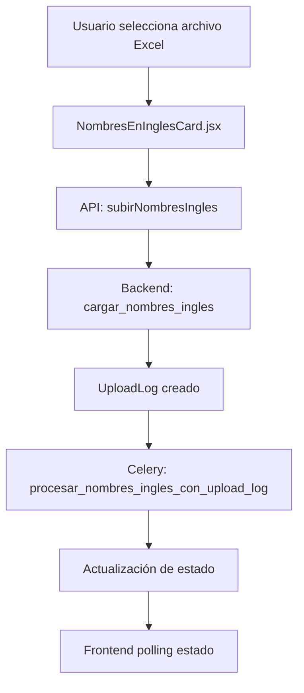

# 📄 Documentación: NombresEnInglesCard

## 🎯 Objetivo
Explica el funcionamiento de la tarjeta **Nombres en Inglés** utilizando la misma arquitectura basada en UploadLog que la tarjeta de Tipo de Documento.

---

## 📐 Arquitectura General


---

## 🎨 Frontend: NombresEnInglesCard.jsx
Ubicación: `src/components/TarjetasCierreContabilidad/NombresEnInglesCard.jsx`

La tarjeta permite subir el archivo de traducciones, monitorea el proceso con UploadLog y ofrece un modal CRUD para editar las traducciones.

Estados principales:
```javascript
const [estado, setEstado] = useState("pendiente");
const [subiendo, setSubiendo] = useState(false);
const [uploadLogId, setUploadLogId] = useState(null);
const [uploadEstado, setUploadEstado] = useState(null);
const [uploadProgreso, setUploadProgreso] = useState("");
```

Flujo simplificado:
1. `handleSeleccionArchivo` envía el archivo con `subirNombresIngles` y recibe `upload_log_id`.
2. Un `useEffect` realiza polling a `/upload-log/{id}/estado/` hasta que el proceso termina.
3. Al completarse se recargan los nombres y se muestra una notificación de éxito.
4. `handleEliminarTodos` borra los registros y marca los UploadLogs como eliminados.

---

## 🌐 APIs del Frontend
Ubicación: `src/api/contabilidad.js`

- **subirNombresIngles(formData)** → `POST /contabilidad/nombres-ingles/subir-archivo/`
- **obtenerEstadoNombresIngles(clienteId)** → `GET /contabilidad/nombres-ingles/{clienteId}/estado/`
- **obtenerNombresInglesCliente(clienteId)** → `GET /contabilidad/nombres-ingles/{clienteId}/list/`
- **eliminarTodosNombresIngles(clienteId)** → `POST /contabilidad/nombres-ingles/{clienteId}/eliminar-todos/`
- **obtenerEstadoUploadLog(uploadLogId)** → monitoreo en tiempo real.

---

## ⚙️ Backend
### Vista `cargar_nombres_ingles`
Ubicación: `backend/contabilidad/views.py`
- Verifica que no existan nombres previos.
- Valida el nombre del archivo con `UploadLog.validar_nombre_archivo`.
- Crea un `UploadLog` de tipo `nombres_ingles` y guarda el archivo temporal.
- Lanza la tarea Celery `procesar_nombres_ingles_con_upload_log`.
- Retorna `upload_log_id` para que el frontend monitoree el progreso.

### Tarea Celery `procesar_nombres_ingles_con_upload_log`
Ubicación: `backend/contabilidad/tasks.py`
- Lee el Excel, actualiza las cuentas y registra estadísticas.
- Actualiza el estado del `UploadLog` a `completado` o `error`.

---

## 📝 Comparación con TipoDocumentoCard
- Ambos usan `UploadLog` para rastrear el proceso de importación.
- Se realiza polling al mismo endpoint `/upload-log/{id}/estado/`.
- La estructura de estados y notificaciones en el frontend es idéntica.
- Los endpoints de subida y eliminación siguen el mismo esquema REST.

