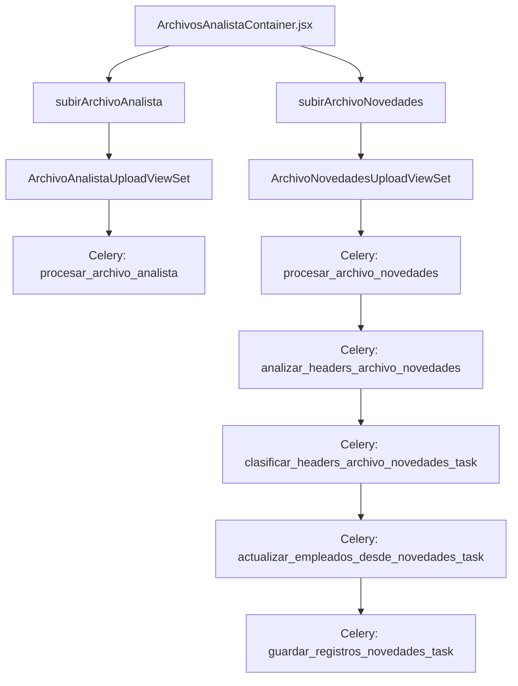

# 📑 Documentación: Tarjeta Archivos del Analista

## 🎯 Objetivo
Describe el comportamiento de las tarjetas que gestionan los archivos proporcionados por el analista: **Finiquitos**, **Incidencias/Ausentismos**, **Ingresos** y **Novedades**.

## 📐 Arquitectura General


## 🎨 Frontend
El contenedor `ArchivosAnalistaContainer.jsx` mantiene el estado de cada archivo y realiza polling cuando alguno está en proceso. Cada subtarjeta (`FiniquitosCard`, `IncidenciasCard`, `IngresosCard`, `NovedadesCard`) extiende `ArchivoAnalistaBase`.

Para el caso de Novedades se ofrece un modal para mapear headers y un botón de **Procesar Final** cuando están clasificados.

```jsx
const handleMapearHeaders = async () => {
  const headers = await obtenerHeadersNovedades(archivo.id);
  setHeadersNovedades(headers);
  setModalMapeoAbierto(true);
};
```
【F:src/components/TarjetasCierreNomina/ArchivosAnalista/NovedadesCard.jsx†L31-L39】

```jsx
const handleProcesarFinal = async () => {
  await procesarFinalNovedades(archivo.id);
  if (onActualizarEstado) {
    await onActualizarEstado();
  }
};
```
【F:src/components/TarjetasCierreNomina/ArchivosAnalista/NovedadesCard.jsx†L80-L90】

## 🌐 API del Frontend
Funciones relevantes en `src/api/nomina.js`:
- `subirArchivoAnalista(cierreId, tipo, formData)`
- `reprocesarArchivoAnalista(id)`
- `subirArchivoNovedades(cierreId, formData)`
- `obtenerHeadersNovedades(id)` / `mapearHeadersNovedades(id, mapeos)`
- `procesarFinalNovedades(id)`

## ⚙️ Backend
### Archivos del analista
`ArchivoAnalistaUploadViewSet` maneja la subida y reprocesamiento.
```python
@action(detail=False, methods=['post'], url_path='subir/(?P<cierre_id>[^/.]+)/(?P<tipo_archivo>[^/.]+)')
def subir(self, request, cierre_id=None, tipo_archivo=None):
    ...
    archivo_analista = ArchivoAnalistaUpload.objects.create(...)
    procesar_archivo_analista.delay(archivo_analista.id)
```
【F:backend/nomina/views.py†L518-L558】

### Novedades
`ArchivoNovedadesUploadViewSet` permite subir y clasificar los headers.
```python
@action(detail=False, methods=['post'], url_path='subir/(?P<cierre_id>[^/.]+)')
def subir(self, request, cierre_id=None):
    archivo_novedades, created = ArchivoNovedadesUpload.objects.get_or_create(...)
    procesar_archivo_novedades.delay(archivo_novedades.id)
```
【F:backend/nomina/views.py†L666-L686】

### Tareas Celery
Procesamiento de un archivo del analista:
```python
@shared_task
def procesar_archivo_analista(archivo_id):
    archivo = ArchivoAnalistaUpload.objects.get(id=archivo_id)
    archivo.estado = 'en_proceso'
    resultados = procesar_archivo_analista_util(archivo)
    archivo.estado = 'procesado' if not resultados.get('errores') else 'con_error'
    archivo.save()
```
【F:backend/nomina/tasks.py†L191-L218】

Proceso de un archivo de novedades:
```python
@shared_task
def procesar_archivo_novedades(archivo_id):
    workflow = chain(
        analizar_headers_archivo_novedades.s(archivo_id),
        clasificar_headers_archivo_novedades_task.s()
    )
    workflow.apply_async()
```
【F:backend/nomina/tasks.py†L224-L241】

Cuando todos los headers se clasifican se encadena el procesamiento final:
```python
workflow_final = chain(
    actualizar_empleados_desde_novedades_task.s({"archivo_id": archivo_id}),
    guardar_registros_novedades_task.s(),
)
```
【F:backend/nomina/tasks.py†L316-L319】

## 🗄️ Modelos Involucrados
- `ArchivoAnalistaUpload` y `ArchivoNovedadesUpload` registran cada archivo.
- `EmpleadoCierreNovedades` y `RegistroConceptoEmpleadoNovedades` se crean en el procesamiento de novedades.

## ✅ Resultado
Cada tarjeta refleja el estado del archivo (pendiente, en proceso, procesado o con error) y permite reprocesar o mapear headers según corresponda.
