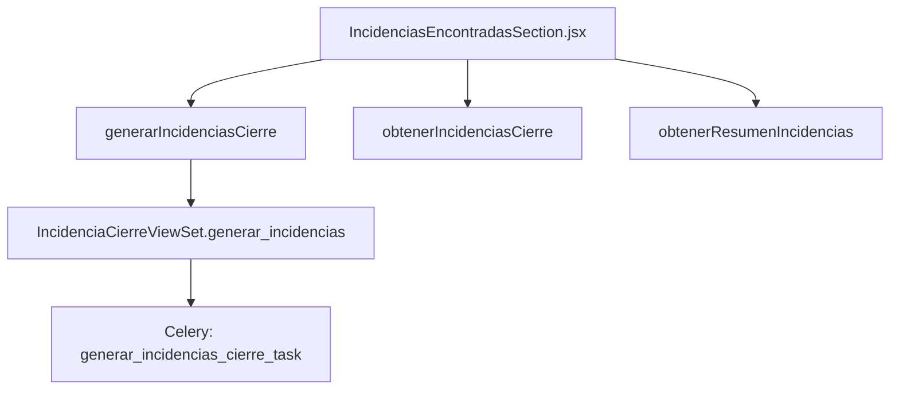

# 📑 Documentación: Tarjeta Sistema de Incidencias

## 🎯 Objetivo
Detalla el funcionamiento de la tarjeta **Incidencias Encontradas** que permite generar, visualizar y resolver discrepancias entre archivos de un cierre.

## 📐 Arquitectura General


## 🎨 Frontend
El componente `IncidenciasEncontradasSection.jsx` muestra botones para generar incidencias, vista previa y una tabla con filtros.

## Generar incidencias
```jsx
const manejarGenerarIncidencias = async () => {
  await generarIncidenciasCierre(cierre.id);
  setTimeout(() => {
    cargarEstadoIncidencias();
    cargarDatos();
  }, 2000);
};
```
【F:src/components/TarjetasCierreNomina/IncidenciasEncontradasSection.jsx†L73-L90】

## 🌐 API del Frontend
- `generarIncidenciasCierre(cierreId)`
- `obtenerIncidenciasCierre(cierreId, filtros)`
- `obtenerResumenIncidencias(cierreId)`
- `cambiarEstadoIncidencia(id, estado)`
- `crearResolucionIncidencia(id, data)`

## ⚙️ Backend
### ViewSet
`IncidenciaCierreViewSet` posee el endpoint `generar_incidencias` que lanza la tarea.
```python
@action(detail=False, methods=['post'], url_path='generar/(?P<cierre_id>[^/.]+)')
def generar_incidencias(self, request, cierre_id=None):
    cierre = CierreNomina.objects.get(id=cierre_id)
    task = generar_incidencias_cierre_task.delay(cierre_id)
    return Response({"message": "Generación de incidencias iniciada", "task_id": task.id})
```
【F:backend/nomina/views.py†L921-L940】

### Tarea Celery
Genera todas las incidencias del cierre y verifica que los archivos previos estén procesados.
```python
@shared_task
def generar_incidencias_cierre_task(cierre_id):
    cierre = CierreNomina.objects.get(id=cierre_id)
    if not _verificar_archivos_listos_para_incidencias(cierre):
        raise ValueError("No todos los archivos están procesados para generar incidencias")
    resultado = generar_todas_incidencias(cierre)
```
【F:backend/nomina/tasks.py†L393-L409】

La función `_verificar_archivos_listos_para_incidencias` comprueba que el libro y los movimientos estén procesados antes de crear incidencias.

## 🗄️ Modelo Involucrado
`IncidenciaCierre` almacena cada discrepancia y su estado colaborativo (`pendiente`, `resuelta_analista`, etc.).

## ✅ Resultado
Tras la generación, la tarjeta muestra el resumen de incidencias y permite filtrarlas, asignarlas y resolverlas mediante el sistema colaborativo de resoluciones.
