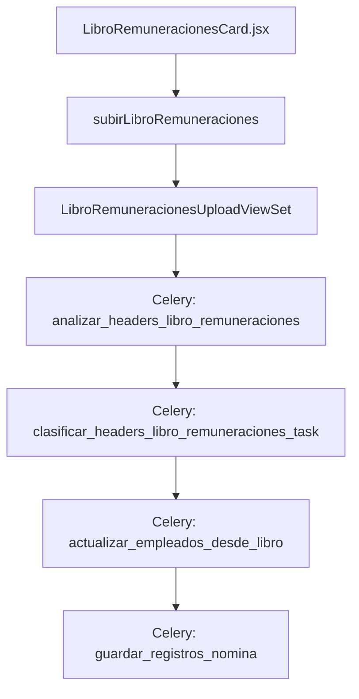

# 📑 Documentación: Tarjeta Libro de Remuneraciones

## 🎯 Objetivo
Describe el flujo completo de la tarjeta **Libro de Remuneraciones** desde el frontend hasta el backend y las tareas Celery involucradas.

## 📐 Arquitectura General


## 🎨 Frontend
Archivo principal: `src/components/TarjetasCierreNomina/LibroRemuneracionesCard.jsx`.
La tarjeta permite subir el archivo, iniciar el procesamiento y mostrar el estado. Cuando el estado es `procesando` inicia un polling cada 40 s para consultar el backend.

```jsx
// fragmento principal
useEffect(() => {
  if (estado === "procesando" && !pollingRef.current && onActualizarEstado) {
    pollingRef.current = setInterval(async () => {
      await onActualizarEstado();
    }, 40000);
  }
}, [estado, onActualizarEstado]);
```
【F:src/components/TarjetasCierreNomina/LibroRemuneracionesCard.jsx†L39-L55】

El usuario puede ejecutar `handleProcesar` para lanzar el proceso final.

```jsx
const handleProcesar = async () => {
  setProcesandoLocal(true);
  await onProcesar();
};
```
【F:src/components/TarjetasCierreNomina/LibroRemuneracionesCard.jsx†L98-L108】

## 🌐 API del Frontend
Las funciones relevantes están en `src/api/nomina.js`:
- `subirLibroRemuneraciones(cierreId, archivo)`
- `obtenerEstadoLibroRemuneraciones(cierreId)`
- `procesarLibroRemuneraciones(libroId)`

## ⚙️ Backend
### ViewSet
`LibroRemuneracionesUploadViewSet` coordina la carga y procesamiento:
```python
class LibroRemuneracionesUploadViewSet(viewsets.ModelViewSet):
    def perform_create(self, serializer):
        instance = serializer.save()
        chain(
            analizar_headers_libro_remuneraciones.s(instance.id),
            clasificar_headers_libro_remuneraciones_task.s(),
        )()
```
【F:backend/nomina/views.py†L185-L197】

La acción `procesar` dispara la cadena final:
```python
@action(detail=True, methods=['post'])
def procesar(self, request, pk=None):
    libro = self.get_object()
    libro.estado = 'procesando'
    libro.save(update_fields=['estado'])
    result = chain(
        actualizar_empleados_desde_libro.s(libro.id),
        guardar_registros_nomina.s(),
    )()
```
【F:backend/nomina/views.py†L206-L222】

### Tareas Celery
Las tareas se encuentran en `backend/nomina/tasks.py`.
```python
@shared_task
def analizar_headers_libro_remuneraciones(libro_id):
    libro = LibroRemuneracionesUpload.objects.get(id=libro_id)
    libro.estado = "analizando_hdrs"
```
【F:backend/nomina/tasks.py†L29-L38】

```python
@shared_task
def clasificar_headers_libro_remuneraciones_task(result):
    libro_id = result["libro_id"]
    libro = LibroRemuneracionesUpload.objects.get(id=libro_id)
    libro.estado = "clasif_en_proceso"
```
【F:backend/nomina/tasks.py†L52-L63】

```python
@shared_task
def actualizar_empleados_desde_libro(result):
    libro_id = result.get("libro_id") if isinstance(result, dict) else result
    libro = LibroRemuneracionesUpload.objects.get(id=libro_id)
    count = actualizar_empleados_desde_libro_util(libro)
```
【F:backend/nomina/tasks.py†L109-L116】

```python
@shared_task
def guardar_registros_nomina(result):
    libro_id = result.get("libro_id") if isinstance(result, dict) else result
    libro = LibroRemuneracionesUpload.objects.get(id=libro_id)
    count = guardar_registros_nomina_util(libro)
    libro.estado = "procesado"
    libro.save()
```
【F:backend/nomina/tasks.py†L123-L139】

## 🗄️ Modelos Involucrados
- `LibroRemuneracionesUpload` almacena el archivo y su estado.
- `EmpleadoCierre` y `RegistroConceptoEmpleado` se crean en las tareas de procesamiento.

## ✅ Resultado
Una vez completadas las tareas, el estado cambia a `procesado` y la tarjeta permite visualizar las clasificaciones.
