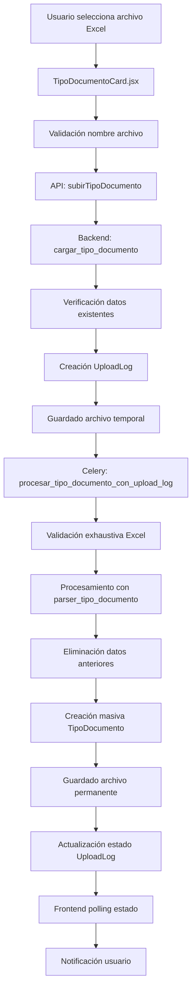
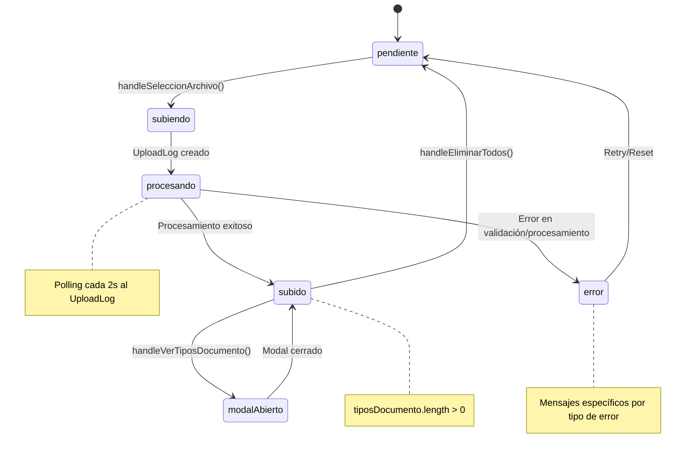

# 📄 Documentación: TipoDocumentoCard

## 🎯 Objetivo
Esta documentación explica el funcionamiento completo de la tarjeta de **Tipo de Documento** desde el frontend hasta el backend, incluyendo los modelos, APIs, validaciones y flujo de datos. El objetivo es servir como referencia para implementar tarjetas similares en el futuro y mantener el código actualizado.

---

## 📐 Arquitectura General



---

## 🎨 Frontend: TipoDocumentoCard.jsx

### 📍 Ubicación
`/src/components/TarjetasCierreContabilidad/TipoDocumentoCard.jsx`

### 🎯 Propósito
Permite al usuario subir archivos Excel con tipos de documento contables y gestionar los tipos existentes mediante un modal CRUD. Monitorea el proceso de subida y procesamiento en tiempo real.

### 📊 Estados Principales

```javascript
// Estados de archivo y procesamiento
const [estado, setEstado] = useState("pendiente");        // Estado general del componente
const [archivoNombre, setArchivoNombre] = useState("");   // Nombre del archivo seleccionado
const [subiendo, setSubiendo] = useState(false);          // Indica si está en proceso de subida
const [error, setError] = useState("");                   // Mensaje de error actual
const [tiposDocumento, setTiposDocumento] = useState([]); // Lista de tipos cargados
const [eliminando, setEliminando] = useState(false);      // Estado de eliminación masiva
const [errorEliminando, setErrorEliminando] = useState("");

// Estados de UploadLog (monitoreo en tiempo real)
const [uploadLogId, setUploadLogId] = useState(null);     // ID del UploadLog para seguimiento
const [uploadEstado, setUploadEstado] = useState(null);   // Estado detallado del UploadLog
const [uploadProgreso, setUploadProgreso] = useState(""); // Mensaje de progreso visible

// Estados de UI y modal
const [modalAbierto, setModalAbierto] = useState(false);
const [notificacion, setNotificacion] = useState({ 
  visible: false, 
  tipo: "", 
  mensaje: "" 
});
```

### 🔄 Flujo de Estados



### 🎛️ Funciones Principales

#### 1. **fetchEstado()** - Cargar estado inicial
```javascript
useEffect(() => {
  const fetchEstado = async () => {
    try {
      const data = await obtenerEstadoTipoDocumento(clienteId);
      const estadoActual = typeof data === "string" ? data : data.estado;
      setEstado(estadoActual);
      
      // Si hay datos, cargar también los tipos de documento para el conteo
      if (estadoActual === "subido") {
        try {
          const tipos = await obtenerTiposDocumentoCliente(clienteId);
          setTiposDocumento(tipos);
        } catch (err) {
          console.error("Error cargando tipos de documento:", err);
        }
      }
      
      if (onCompletado) onCompletado(estadoActual === "subido");
    } catch (err) {
      setEstado("pendiente");
      if (onCompletado) onCompletado(false);
    }
  };
  if (clienteId && !disabled) fetchEstado();
}, [clienteId, disabled, onCompletado]);
```

#### 2. **handleSeleccionArchivo()** - Subir archivo
```javascript
const handleSeleccionArchivo = async (e) => {
  const archivo = e.target.files[0];
  if (!archivo) return;
  
  // Configurar estados iniciales
  setArchivoNombre(archivo.name);
  setSubiendo(true);
  setError("");
  setUploadProgreso("Subiendo archivo...");
  setUploadLogId(null);
  setUploadEstado(null);
  
  try {
    // Crear FormData con cliente y archivo
    const formData = new FormData();
    formData.append("cliente_id", clienteId);
    formData.append("archivo", archivo);
    
    const response = await subirTipoDocumento(formData);
    
    // Sistema moderno: UploadLog con monitoreo en tiempo real
    if (response.upload_log_id) {
      setUploadLogId(response.upload_log_id);
      setUploadProgreso("Archivo recibido, iniciando procesamiento...");
      mostrarNotificacion("info", "📤 Archivo subido correctamente. Procesando...");
      // El monitoreo automático inicia en useEffect
    } else {
      // Sistema legacy: polling directo al estado
      await new Promise(r => setTimeout(r, 1500));
      let nuevoEstado = "";
      for (let i = 0; i < 10; i++) {
        await new Promise((r) => setTimeout(r, 1200));
        const data = await obtenerEstadoTipoDocumento(clienteId);
        nuevoEstado = typeof data === "string" ? data : data.estado;
        if (nuevoEstado === "subido") break;
      }
      // Procesar resultado legacy...
    }
    
  } catch (err) {
    console.error("Error al subir archivo:", err);
    setSubiendo(false);
    setUploadProgreso("");
    
    // Manejo específico de errores por código HTTP
    if (err.response?.status === 409) {
      // Conflicto: datos existentes
      const errorData = err.response.data;
      setError(`Ya existen ${errorData.tipos_existentes || 'algunos'} tipos de documento. Debe eliminar todos los registros antes de subir un nuevo archivo.`);
      mostrarNotificacion("warning", 
        `⚠️ Archivo rechazado: Ya existen ${errorData.tipos_existentes || 'algunos'} tipos de documento. Use "Eliminar todos" primero.`
      );
    } else if (err.response?.status === 400) {
      // Error de validación (formato nombre, contenido, etc.)
      const errorData = err.response.data;
      if (errorData.formato_esperado && errorData.archivo_recibido) {
        // Error específico de formato de nombre
        setError(`Formato de nombre incorrecto. Esperado: ${errorData.formato_esperado}, Recibido: ${errorData.archivo_recibido}`);
        mostrarNotificacion("warning", 
          `❌ Nombre de archivo incorrecto\n\n` +
          `📋 Formato requerido: ${errorData.formato_esperado}\n` +
          `📁 Archivo enviado: ${errorData.archivo_recibido}\n\n` +
          `💡 Asegúrese de que el archivo siga exactamente el formato indicado.`
        );
      } else {
        // Otros errores de validación
        setError(errorData.error || "Error de validación en el archivo");
        mostrarNotificacion("error", errorData.mensaje || errorData.error || "❌ Error de validación");
      }
    } else {
      // Error genérico o de red
      const errorMsg = err.response?.data?.error || "Error al subir el archivo";
      setError(errorMsg);
      mostrarNotificacion("error", `❌ ${errorMsg}`);
    }
    
    if (onCompletado) onCompletado(false);
  }
};
```

#### 3. **Monitoreo en Tiempo Real con UploadLog**
```javascript
useEffect(() => {
  if (!uploadLogId || !subiendo) return;

  const monitorearUpload = async () => {
    try {
      const logData = await obtenerEstadoUploadLog(uploadLogId);
      setUploadEstado(logData);
      
      // Actualizar progreso según estado del UploadLog
      if (logData.estado === 'procesando') {
        setUploadProgreso("Procesando archivo...");
        
        // Mostrar notificación amarilla solo la primera vez
        if (uploadEstado?.estado !== 'procesando') {
          mostrarNotificacion("warning", "📊 Procesando archivo... Por favor espere.");
        }
        
      } else if (logData.estado === 'completado') {
        // Procesamiento exitoso
        setUploadProgreso("¡Procesamiento completado!");
        setSubiendo(false);
        setEstado("subido");
        if (onCompletado) onCompletado(true);
        
        // Recargar tipos de documento desde el servidor
        try {
          const tipos = await obtenerTiposDocumentoCliente(clienteId);
          setTiposDocumento(tipos);
        } catch (err) {
          console.error("Error recargando tipos:", err);
        }
        
        // Notificación de éxito con estadísticas
        const tiposCreados = logData.resumen?.tipos_documento_creados || 0;
        mostrarNotificacion("success", 
          `✅ Archivo procesado exitosamente. ${tiposCreados} tipos de documento creados.`
        );
        
      } else if (logData.estado === 'error') {
        // Error en procesamiento
        setUploadProgreso("Error en el procesamiento");
        setSubiendo(false);
        setError(logData.errores || "Error desconocido en el procesamiento");
        if (onCompletado) onCompletado(false);
        mostrarNotificacion("error", `❌ Error: ${logData.errores || "Error desconocido"}`);
      }
      
    } catch (err) {
      console.error("Error monitoreando upload:", err);
      setUploadProgreso("Error monitoreando el proceso");
    }
  };

  // Polling cada 2 segundos para actualizaciones frecuentes
  const intervalo = setInterval(monitorearUpload, 2000);
  
  // Limpieza del intervalo al desmontar
  return () => clearInterval(intervalo);
  
}, [uploadLogId, subiendo, clienteId, onCompletado, uploadEstado?.estado]);
```

#### 4. **handleVerTiposDocumento()** - Ver y gestionar tipos
```javascript
const handleVerTiposDocumento = async () => {
  try {
    // Registrar vista en actividad del sistema (analytics)
    await registrarVistaTiposDocumento(clienteId);
    
    // Cargar datos actualizados desde el servidor
    const datos = await obtenerTiposDocumentoCliente(clienteId);
    setTiposDocumento(datos);
    setModalAbierto(true);
  } catch (err) {
    console.error("Error al abrir modal o registrar vista:", err);
    // Abrir modal aunque falle el registro
    setTiposDocumento([]);
    setModalAbierto(true);
  }
};
```

#### 5. **handleEliminarTodos()** - Eliminación masiva con estadísticas
```javascript
const handleEliminarTodos = async () => {
  setEliminando(true);
  setErrorEliminando("");
  
  try {
    const result = await eliminarTodosTiposDocumento(clienteId);
    
    // Resetear todos los estados relacionados
    setEstado("pendiente");
    setTiposDocumento([]);
    setArchivoNombre("");
    setUploadLogId(null);
    setUploadEstado(null);
    setUploadProgreso("");
    if (onCompletado) onCompletado(false);
    
    // Mostrar estadísticas detalladas de la eliminación
    const mensaje = `Eliminados: ${result.registros_eliminados || 0} registros, ${result.upload_logs_eliminados || 0} logs, ${result.archivos_eliminados || 0} archivos`;
    mostrarNotificacion("success", `🗑️ ${mensaje}`);
    
  } catch (err) {
    const errorMsg = err.response?.data?.error || "Error eliminando los tipos de documento";
    setErrorEliminando(errorMsg);
    mostrarNotificacion("error", `❌ ${errorMsg}`);
  } finally {
    setEliminando(false);
  }
};
```

### 🎨 UI Condicional Inteligente y Progreso Visual

```jsx
{/* Información del formato requerido */}
<div className="text-xs text-gray-400 bg-gray-900/50 border border-gray-600 rounded p-2 mb-2">
  <div className="font-medium text-gray-300 mb-1">📋 Formato de archivo requerido:</div>
  <div className="font-mono text-yellow-300">
    {cliente?.rut ? 
      `${cliente.rut.replace(/\./g, '').replace('-', '')}_TipoDocumento.xlsx` : 
      'RUT_TipoDocumento.xlsx'
    }
  </div>
</div>

{/* Indicador de progreso detallado durante procesamiento */}
{subiendo && uploadEstado && (
  <div className="text-xs bg-blue-900/20 border border-blue-500/30 rounded p-2 mt-2">
    <div className="flex items-center justify-between mb-1">
      <span className="font-medium text-blue-200">Procesando:</span>
      <span className="text-blue-300">{uploadEstado.estado}</span>
    </div>
    {uploadEstado.registros_procesados > 0 && (
      <div className="text-blue-300">
        Registros: {uploadEstado.registros_exitosos || 0} exitosos, {uploadEstado.registros_fallidos || 0} fallidos
      </div>
    )}
    {uploadEstado.tiempo_procesamiento_segundos && (
      <div className="text-blue-300">
        Tiempo: {uploadEstado.tiempo_procesamiento_segundos}s
      </div>
    )}
  </div>
)}

{/* Manejo inteligente de errores con tips contextuales */}
{error && (
  <div className="text-xs text-red-400 mt-1 p-2 bg-red-900/20 rounded border border-red-500/30">
    <p className="font-medium">⚠️ {error}</p>
    {error.includes("Ya existen") && (
      <p className="mt-1 text-gray-300">
        💡 Tip: Use el botón "Eliminar todos" para limpiar los datos existentes y luego suba el nuevo archivo.
      </p>
    )}
  </div>
)}

{/* Estado dinámico del archivo con múltiples fallbacks */}
<span className="text-xs text-gray-400 italic mt-2">
  {estado === "subido"
    ? <span className="text-green-400">
        {`✔ Archivo cargado correctamente${tiposDocumento.length > 0 ? ` (${tiposDocumento.length} tipos de documento)` : ""}`}
      </span>
    : subiendo || uploadProgreso
    ? <span className="text-blue-400">🔄 {uploadProgreso || "Procesando archivo..."}</span>
    : error
    ? <span className="text-red-400">❌ Error: {error}</span>
    : tiposDocumento.length > 0
    ? <span className="text-yellow-400">📋 Archivo cargado con {tiposDocumento.length} tipos de documento</span>
    : "Aún no se ha subido el archivo."}
</span>
```

---

## 🌐 APIs del Frontend

### 📍 Ubicación
`/src/api/contabilidad.js`

### 🔗 Endpoints Utilizados

#### 1. **obtenerEstadoTipoDocumento**
```javascript
export const obtenerEstadoTipoDocumento = async (clienteId) => {
  const res = await api.get(`/contabilidad/tipo-documento/${clienteId}/estado/`);
  return typeof res.data === "string" ? res.data : res.data.estado;
};
```

#### 2. **subirTipoDocumento**
```javascript
export const subirTipoDocumento = async (formData) => {
  const res = await api.post("/contabilidad/tipo-documento/subir-archivo/", formData);
  return res.data;
};
```

#### 3. **obtenerTiposDocumentoCliente**
```javascript
export const obtenerTiposDocumentoCliente = async (clienteId) => {
  const res = await api.get(`/contabilidad/tipo-documento/${clienteId}/list/`);
  return res.data;
};
```

#### 4. **eliminarTodosTiposDocumento**
```javascript
export const eliminarTodosTiposDocumento = async (clienteId) => {
  const res = await api.post(`/contabilidad/tipo-documento/${clienteId}/eliminar-todos/`);
  return res.data;
};
```

#### 5. **obtenerEstadoUploadLog**
```javascript
export const obtenerEstadoUploadLog = async (uploadLogId) => {
  const res = await api.get(`/contabilidad/upload-log/${uploadLogId}/estado/`);
  return res.data;
};
```

#### 6. **registrarVistaTiposDocumento**
```javascript
export const registrarVistaTiposDocumento = async (clienteId) => {
  const res = await api.post(`/contabilidad/tipo-documento/${clienteId}/registrar-vista/`);
  return res.data;
};
```

---

## ⚙️ Backend: Views y Endpoints

### 📍 Ubicación
`/backend/contabilidad/views.py`

### 🎯 Endpoints Principales

#### 1. **cargar_tipo_documento** - Endpoint principal de subida
```python
@api_view(["POST"])
@parser_classes([MultiPartParser])
@permission_classes([IsAuthenticated])
def cargar_tipo_documento(request):
    """
    Endpoint principal para subir archivos de tipos de documento.
    Implementa el sistema UploadLog para tracking completo.
    """
    cliente_id = request.data.get("cliente_id")
    archivo = request.FILES.get("archivo")

    if not cliente_id or not archivo:
        return Response({"error": "cliente_id y archivo son requeridos"}, status=400)

    try:
        cliente = Cliente.objects.get(id=cliente_id)
    except Cliente.DoesNotExist:
        return Response({"error": "Cliente no encontrado"}, status=404)

    # 1. VERIFICACIÓN CRÍTICA: Datos existentes (Conflicto 409)
    tipos_existentes = TipoDocumento.objects.filter(cliente=cliente).count()
    if tipos_existentes > 0:
        # Buscar cierre activo para registrar actividad
        cierre_para_actividad = CierreContabilidad.objects.filter(
            cliente=cliente,
            estado__in=['pendiente', 'procesando', 'clasificacion', 'incidencias', 'en_revision']
        ).order_by('-fecha_creacion').first()
        
        # Registrar intento rechazado
        registrar_actividad_tarjeta(
            cliente_id=cliente_id,
            periodo=cierre_para_actividad.periodo if cierre_para_actividad else date.today().strftime("%Y-%m"),
            tarjeta="tipo_documento",
            accion="upload_excel",
            descripcion=f"Upload rechazado: ya existen {tipos_existentes} tipos de documento",
            usuario=request.user,
            detalles={
                "nombre_archivo": archivo.name,
                "tipos_existentes": tipos_existentes,
                "razon_rechazo": "datos_existentes"
            },
            resultado="error",
            ip_address=request.META.get("REMOTE_ADDR")
        )

        return Response({
            "error": "Ya existen tipos de documento para este cliente",
            "mensaje": "Debe eliminar todos los registros existentes antes de subir un nuevo archivo",
            "tipos_existentes": tipos_existentes,
            "accion_requerida": "Usar 'Eliminar todos' primero",
        }, status=409)

    # 2. VALIDACIÓN ESTRICTA DE NOMBRE DE ARCHIVO
    es_valido, mensaje = UploadLog.validar_nombre_archivo(
        archivo.name, "TipoDocumento", cliente.rut
    )
    if not es_valido:
        if isinstance(mensaje, dict):
            # Error detallado con sugerencias
            return Response({
                "error": mensaje["error"],
                "archivo_recibido": mensaje.get("archivo_recibido", archivo.name),
                "formato_esperado": mensaje.get("formato_esperado", ""),
                "sugerencia": mensaje.get("sugerencia", ""),
                "tipos_validos": mensaje.get("tipos_validos", []),
            }, status=400)
        else:
            # Mensaje simple - generar formato esperado
            rut_limpio = cliente.rut.replace(".", "").replace("-", "") if cliente.rut else str(cliente.id)
            return Response({
                "error": "Nombre de archivo inválido",
                "mensaje": mensaje,
                "formato_esperado": f"{rut_limpio}_TipoDocumento.xlsx",
                "archivo_recibido": archivo.name,
            }, status=400)

    # 3. CREACIÓN DE UPLOADLOG CON ASOCIACIÓN A CIERRE
    # Buscar cierre activo automáticamente (o usar cierre_id del frontend)
    cierre_relacionado = None
    cierre_id = request.data.get("cierre_id")
    
    if cierre_id:
        try:
            cierre_relacionado = CierreContabilidad.objects.get(id=cierre_id, cliente=cliente)
        except CierreContabilidad.DoesNotExist:
            pass
    
    if not cierre_relacionado:
        cierre_relacionado = CierreContabilidad.objects.filter(
            cliente=cliente,
            estado__in=['pendiente', 'procesando', 'clasificacion', 'incidencias', 'en_revision']
        ).order_by('-fecha_creacion').first()

    upload_log = UploadLog.objects.create(
        tipo_upload="tipo_documento",
        cliente=cliente,
        cierre=cierre_relacionado,
        usuario=request.user,
        nombre_archivo_original=archivo.name,
        tamaño_archivo=archivo.size,
        estado="subido",
        ip_usuario=get_client_ip(request),
    )

    # 4. GUARDADO SEGURO DE ARCHIVO TEMPORAL
    # Limpiar archivos anteriores del mismo cliente
    archivos_temp_anteriores = glob.glob(
        os.path.join(default_storage.location, "temp", f"tipo_doc_cliente_{cliente_id}*")
    )
    for archivo_anterior in archivos_temp_anteriores:
        try:
            os.remove(archivo_anterior)
        except OSError:
            pass

    # Guardar con nombre único basado en UploadLog
    nombre_archivo = f"temp/tipo_doc_cliente_{cliente_id}_{upload_log.id}.xlsx"
    ruta_guardada = default_storage.save(nombre_archivo, archivo)
    
    upload_log.ruta_archivo = ruta_guardada
    upload_log.save(update_fields=["ruta_archivo"])

    # 5. REGISTRAR ACTIVIDAD DE SUBIDA EXITOSA
    registrar_actividad_tarjeta(
        cliente_id=cliente_id,
        periodo=cierre_relacionado.periodo if cierre_relacionado else date.today().strftime("%Y-%m"),
        tarjeta="tipo_documento",
        accion="upload_excel",
        descripcion=f"Subido archivo: {archivo.name} (UploadLog ID: {upload_log.id})",
        usuario=request.user,
        detalles={
            "nombre_archivo": archivo.name,
            "tamaño_bytes": archivo.size,
            "tipo_contenido": archivo.content_type,
            "upload_log_id": upload_log.id,
            "ruta_archivo": ruta_guardada,
            "cierre_id": cierre_relacionado.id if cierre_relacionado else None,
        },
        resultado="exito",
        ip_address=get_client_ip(request),
    )

    # 6. PROCESAR CON CELERY ASYNC
    procesar_tipo_documento_con_upload_log.delay(upload_log.id)

    return Response({
        "mensaje": "Archivo recibido y tarea enviada",
        "upload_log_id": upload_log.id,
        "estado": upload_log.estado,
    })
```

#### 2. **obtener_estado_tipo_documento** - Obtener estado
```python
@api_view(["GET"])
@permission_classes([IsAuthenticated])
def obtener_estado_tipo_documento(request, cliente_id):
    """
    Obtiene el estado actual del tipo de documento para un cliente
    """
    try:
        cliente = Cliente.objects.get(id=cliente_id)
        archivo_td = TipoDocumentoArchivo.objects.filter(cliente=cliente).first()
        
        if archivo_td:
            return Response("subido")
        else:
            return Response("pendiente")
            
    except Cliente.DoesNotExist:
        return Response({"error": "Cliente no encontrado"}, status=404)
    except Exception as e:
        logger.exception("Error obteniendo estado tipo documento")
        return Response({"error": "Error interno del servidor"}, status=500)
```

#### 3. **listar_tipos_documento_cliente** - Listar tipos
```python
@api_view(["GET"])
@permission_classes([IsAuthenticated])
def listar_tipos_documento_cliente(request, cliente_id):
    """
    Lista todos los tipos de documento de un cliente específico
    """
    try:
        cliente = Cliente.objects.get(id=cliente_id)
        tipos = TipoDocumento.objects.filter(cliente=cliente).order_by("codigo")
        
        data = []
        for tipo in tipos:
            data.append({
                "id": tipo.id,
                "codigo": tipo.codigo,
                "descripcion": tipo.descripcion,
            })
        
        return Response(data)
        
    except Cliente.DoesNotExist:
        return Response({"error": "Cliente no encontrado"}, status=404)
    except Exception as e:
        logger.exception("Error listando tipos de documento")
        return Response({"error": "Error interno del servidor"}, status=500)
```

#### 3. **eliminar_todos_tipos_documento** - Eliminación masiva con estadísticas
```python
@api_view(["POST"])
@permission_classes([IsAuthenticated])
def eliminar_todos_tipos_documento(request, cliente_id):
    """
    Elimina todos los tipos de documento de un cliente con estadísticas detalladas
    """
    try:
        cliente = Cliente.objects.get(id=cliente_id)
        
        # Contar elementos antes de eliminar
        tipos_count = TipoDocumento.objects.filter(cliente=cliente).count()
        upload_logs_count = UploadLog.objects.filter(
            cliente=cliente, 
            tipo_upload="tipo_documento"
        ).count()
        
        # Eliminar todos los tipos de documento
        TipoDocumento.objects.filter(cliente=cliente).delete()
        
        # Manejar archivo asociado
        archivos_eliminados = 0
        try:
            archivo_td = TipoDocumentoArchivo.objects.get(cliente=cliente)
            if archivo_td.archivo:
                archivo_td.archivo.delete()
                archivos_eliminados = 1
            archivo_td.delete()
        except TipoDocumentoArchivo.DoesNotExist:
            pass
        
        # Actualizar UploadLogs relacionados (marcar como eliminados)
        upload_logs_actualizados = UploadLog.objects.filter(
            cliente=cliente,
            tipo_upload="tipo_documento",
            estado="completado"
        ).update(estado="datos_eliminados")
        
        # Buscar cierre activo para actividad
        cierre_para_actividad = CierreContabilidad.objects.filter(
            cliente=cliente,
            estado__in=['pendiente', 'procesando', 'clasificacion', 'incidencias', 'en_revision']
        ).order_by('-fecha_creacion').first()
        
        # Registrar actividad detallada
        registrar_actividad_tarjeta(
            cliente_id=cliente_id,
            periodo=cierre_para_actividad.periodo if cierre_para_actividad else date.today().strftime("%Y-%m"),
            tarjeta="tipo_documento",
            accion="delete_all",
            descripcion=f"Eliminación masiva: {tipos_count} tipos, {archivos_eliminados} archivos, {upload_logs_actualizados} logs actualizados",
            usuario=request.user,
            detalles={
                "registros_eliminados": tipos_count,
                "archivos_eliminados": archivos_eliminados,
                "upload_logs_actualizados": upload_logs_actualizados,
                "cierre_id": cierre_para_actividad.id if cierre_para_actividad else None,
            },
            resultado="exito",
            ip_address=request.META.get("REMOTE_ADDR"),
        )
        
        return Response({
            "mensaje": f"Eliminación completada exitosamente",
            "registros_eliminados": tipos_count,
            "archivos_eliminados": archivos_eliminados,
            "upload_logs_eliminados": upload_logs_actualizados,
        })
        
    except Cliente.DoesNotExist:
        return Response({"error": "Cliente no encontrado"}, status=404)
    except Exception as e:
        logger.exception("Error eliminando tipos de documento")
        return Response({"error": "Error interno del servidor"}, status=500)
```

---

## 🔄 Backend: Celery Tasks

### 📍 Ubicación
`/backend/contabilidad/tasks.py`

### 🎯 Tareas Principales

#### 1. **procesar_tipo_documento_con_upload_log** - Tarea principal de procesamiento
```python
@shared_task
def procesar_tipo_documento_con_upload_log(upload_log_id):
    """
    Tarea Celery que procesa archivo de tipos de documento usando el sistema UploadLog unificado.
    Maneja validaciones, procesamiento atómico y registro de actividades.
    """
    logger.info(f"🚀 Iniciando procesamiento de tipo documento para upload_log_id: {upload_log_id}")

    try:
        upload_log = UploadLog.objects.get(id=upload_log_id)
    except UploadLog.DoesNotExist:
        logger.error(f"❌ UploadLog con id {upload_log_id} no encontrado")
        return f"Error: UploadLog {upload_log_id} no encontrado"

    # Marcar como procesando
    upload_log.estado = "procesando"
    upload_log.save(update_fields=["estado"])
    inicio_procesamiento = timezone.now()

    try:
        # 1. VALIDAR NOMBRE DE ARCHIVO (doble verificación)
        es_valido, resultado_validacion = UploadLog.validar_nombre_archivo(
            upload_log.nombre_archivo_original, "TipoDocumento", upload_log.cliente.rut
        )

        if not es_valido:
            upload_log.estado = "error"
            upload_log.errores = f"Nombre de archivo inválido: {resultado_validacion}"
            upload_log.tiempo_procesamiento = timezone.now() - inicio_procesamiento
            upload_log.save()
            
            # Registrar error con contexto del upload_log
            registrar_actividad_tarjeta(
                cliente_id=upload_log.cliente.id,
                periodo=upload_log.cierre.periodo if upload_log.cierre else date.today().strftime("%Y-%m"),
                tarjeta="tipo_documento",
                accion="process_excel",
                descripcion=f"Error validación nombre archivo: {resultado_validacion}",
                usuario=upload_log.usuario,
                detalles={"upload_log_id": upload_log.id, "validacion_error": resultado_validacion},
                resultado="error",
                ip_address=upload_log.ip_usuario,
            )
            return f"Error: {resultado_validacion}"

        # 2. VERIFICAR QUE NO EXISTAN DATOS PREVIOS (condición de carrera)
        tipos_existentes = TipoDocumento.objects.filter(cliente=upload_log.cliente).count()
        if tipos_existentes > 0:
            upload_log.estado = "error"
            upload_log.errores = f"Ya existen {tipos_existentes} tipos de documento para este cliente"
            upload_log.tiempo_procesamiento = timezone.now() - inicio_procesamiento
            upload_log.resumen = {
                "tipos_existentes": tipos_existentes,
                "accion_requerida": "Eliminar tipos existentes antes de procesar",
            }
            upload_log.save()
            
            registrar_actividad_tarjeta(
                cliente_id=upload_log.cliente.id,
                periodo=upload_log.cierre.periodo if upload_log.cierre else date.today().strftime("%Y-%m"),
                tarjeta="tipo_documento",
                accion="process_excel",
                descripcion=f"Error: Cliente ya tiene {tipos_existentes} tipos de documento",
                usuario=upload_log.usuario,
                detalles={"upload_log_id": upload_log.id, "tipos_existentes": tipos_existentes},
                resultado="error",
                ip_address=upload_log.ip_usuario,
            )
            return f"Error: Cliente ya tiene tipos de documento existentes"

        # 3. VERIFICAR ARCHIVO TEMPORAL
        ruta_relativa = f"temp/tipo_doc_cliente_{upload_log.cliente.id}_{upload_log.id}.xlsx"
        ruta_completa = default_storage.path(ruta_relativa)

        if not os.path.exists(ruta_completa):
            upload_log.estado = "error"
            upload_log.errores = f"Archivo temporal no encontrado en: {ruta_relativa}"
            upload_log.tiempo_procesamiento = timezone.now() - inicio_procesamiento
            upload_log.save()
            
            registrar_actividad_tarjeta(
                cliente_id=upload_log.cliente.id,
                periodo=upload_log.cierre.periodo if upload_log.cierre else date.today().strftime("%Y-%m"),
                tarjeta="tipo_documento",
                accion="process_excel",
                descripción="Archivo temporal no encontrado",
                usuario=upload_log.usuario,
                detalles={"upload_log_id": upload_log.id, "ruta_esperada": ruta_relativa},
                resultado="error",
                ip_address=upload_log.ip_usuario,
            )
            return "Error: Archivo temporal no encontrado"

        # 4. CALCULAR HASH DEL ARCHIVO PARA INTEGRIDAD
        with open(ruta_completa, "rb") as f:
            archivo_hash = hashlib.sha256(f.read()).hexdigest()

        upload_log.hash_archivo = archivo_hash
        upload_log.save(update_fields=["hash_archivo"])

        # 5. VALIDAR ESTRUCTURA DEL EXCEL CON `validar_archivo_tipo_documento_excel`
        validacion = validar_archivo_tipo_documento_excel(ruta_completa)
        if not validacion["es_valido"]:
            error_msg = "; ".join(validacion["errores"])
            upload_log.estado = "error"
            upload_log.errores = error_msg
            upload_log.resumen = {"validacion": validacion, "archivo_hash": archivo_hash}
            upload_log.tiempo_procesamiento = timezone.now() - inicio_procesamiento
            upload_log.save()
            return f"Error: {error_msg}"

        # 6. PROCESAR CON PARSER EXISTENTE (ATÓMICO)
        logger.info(f"📊 Procesando archivo con parser: {ruta_completa}")
        ok, msg = parsear_tipo_documento_excel(upload_log.cliente.id, ruta_relativa)

        if not ok:
            upload_log.estado = "error"
            upload_log.errores = f"Error en procesamiento: {msg}"
            upload_log.tiempo_procesamiento = timezone.now() - inicio_procesamiento
            upload_log.save()
            
            registrar_actividad_tarjeta(
                cliente_id=upload_log.cliente.id,
                periodo=upload_log.cierre.periodo if upload_log.cierre else date.today().strftime("%Y-%m"),
                tarjeta="tipo_documento",
                accion="process_excel",
                descripcion=f"Error en procesamiento: {msg}",
                usuario=upload_log.usuario,
                detalles={"upload_log_id": upload_log.id, "parser_error": msg},
                resultado="error",
                ip_address=upload_log.ip_usuario,
            )
            return f"Error: {msg}"

        # 6. CONTAR RESULTADOS Y ACTUALIZAR ARCHIVO PERMANENTE
        tipos_creados = TipoDocumento.objects.filter(cliente=upload_log.cliente).count()

        # El parser ya maneja la creación del TipoDocumentoArchivo
        archivo_actual, created = TipoDocumentoArchivo.objects.get_or_create(
            cliente=upload_log.cliente,
            defaults={"upload_log": upload_log, "fecha_subida": timezone.now()},
        )

        if not created:
            archivo_actual.upload_log = upload_log
            archivo_actual.fecha_subida = timezone.now()
            archivo_actual.save()

        # 7. MARCAR COMO COMPLETADO CON RESUMEN DETALLADO
        upload_log.estado = "completado"
        upload_log.tiempo_procesamiento = timezone.now() - inicio_procesamiento
        upload_log.resumen = {
            "tipos_documento_creados": tipos_creados,
            "archivo_hash": archivo_hash,
            "procesamiento_exitoso": True,
            "mensaje_parser": msg,
            "tiempo_segundos": upload_log.tiempo_procesamiento.total_seconds(),
        }
        upload_log.save()

        # 8. LIMPIAR ARCHIVO TEMPORAL
        try:
            if os.path.exists(ruta_completa):
                os.remove(ruta_completa)
                logger.info("🗑️ Archivo temporal eliminado")
        except OSError as e:
            logger.warning(f"⚠️ No se pudo eliminar archivo temporal: {str(e)}")

        # 9. REGISTRAR ACTIVIDAD EXITOSA CON ESTADÍSTICAS
        registrar_actividad_tarjeta(
            cliente_id=upload_log.cliente.id,
            periodo=upload_log.cierre.periodo if upload_log.cierre else date.today().strftime("%Y-%m"),
            tarjeta="tipo_documento",
            accion="process_excel",
            descripcion=f"Procesado archivo de tipo documento: {tipos_creados} tipos creados en {upload_log.tiempo_procesamiento.total_seconds():.2f}s",
            usuario=upload_log.usuario,
            detalles={
                "upload_log_id": upload_log.id,
                "tipos_creados": tipos_creados,
                "archivo_hash": archivo_hash,
                "tiempo_segundos": upload_log.tiempo_procesamiento.total_seconds(),
                "archivo_original": upload_log.nombre_archivo_original,
            },
            resultado="exito",
            ip_address=upload_log.ip_usuario,
        )

        logger.info(f"✅ Procesamiento completado exitosamente: {tipos_creados} tipos de documento creados")
        return f"Completado: {tipos_creados} tipos de documento procesados"

    except Exception as e:
        # Error inesperado - logging detallado
        error_msg = f"Error inesperado: {str(e)}"
        upload_log.estado = "error"
        upload_log.errores = error_msg
        upload_log.tiempo_procesamiento = timezone.now() - inicio_procesamiento
        upload_log.save()
        
        logger.exception(f"💥 Error inesperado en procesamiento: {str(e)}")
        
        registrar_actividad_tarjeta(
            cliente_id=upload_log.cliente.id,
            periodo=upload_log.cierre.periodo if upload_log.cierre else date.today().strftime("%Y-%m"),
            tarjeta="tipo_documento",
            accion="process_excel",
            descripcion=f"Error inesperado en procesamiento: {str(e)}",
            usuario=upload_log.usuario,
            detalles={
                "upload_log_id": upload_log.id, 
                "error": str(e),
                "traceback": traceback.format_exc()
            },
            resultado="error",
            ip_address=upload_log.ip_usuario,
        )
        
        return error_msg
```

#### 2. **parsear_tipo_documento_excel** - Parser optimizado
```python
def parsear_tipo_documento_excel(cliente_id, ruta_relativa):
    """
    Parser optimizado para tipos de documento con validaciones y guardado atómico.
    Utiliza pandas para lectura eficiente y bulk_create para inserción masiva.
    """
    path = default_storage.path(ruta_relativa)

    try:
        # Leer Excel con validaciones básicas
        df = pd.read_excel(path, engine="openpyxl")
        df.columns = df.columns.str.lower()  # Normalizar nombres de columnas
        df = df.dropna(subset=["codigo"])    # Eliminar filas sin código
        
        # Validar estructura mínima
        if len(df) == 0:
            raise ValueError("El archivo no contiene datos válidos")
        if len(df.columns) < 2:
            raise ValueError("El archivo debe tener al menos 2 columnas: código y descripción")
            
    except Exception as e:
        logger.error(f"❌ Error leyendo archivo Excel: {e}")
        default_storage.delete(ruta_relativa)
        return False, f"Error leyendo archivo: {e}"

    try:
        cliente = Cliente.objects.get(id=cliente_id)
    except Cliente.DoesNotExist:
        default_storage.delete(ruta_relativa)
        return False, "Cliente no existe"

    # OPERACIÓN ATÓMICA: Eliminar anteriores y crear nuevos
    with transaction.atomic():
        # Eliminar tipos de documento anteriores
        TipoDocumento.objects.filter(cliente=cliente).delete()

        # Preparar objetos para bulk_create (inserción masiva eficiente)
        objetos = []
        for _, row in df.iterrows():
            codigo = str(row["codigo"]).strip()
            descripcion = str(row["descripcion"]).strip() if not pd.isna(row["descripcion"]) else ""
            
            if codigo and descripcion:  # Solo crear si ambos campos tienen datos
                objetos.append(TipoDocumento(
                    cliente=cliente, 
                    codigo=codigo, 
                    descripcion=descripcion
                ))

        # Inserción masiva optimizada
        TipoDocumento.objects.bulk_create(objetos)

    # GUARDADO PERMANENTE DEL ARCHIVO
    try:
        # Eliminar archivo anterior si existe
        try:
            archivo_anterior = TipoDocumentoArchivo.objects.get(cliente=cliente)
            if archivo_anterior.archivo:
                archivo_anterior.archivo.delete()
            archivo_anterior.delete()
        except TipoDocumentoArchivo.DoesNotExist:
            pass
        
        # Guardar nuevo archivo permanente
        with open(path, 'rb') as temp_file:
            contenido = temp_file.read()
            nombre_permanente = f"tipo_documento/cliente_{cliente_id}_{pd.Timestamp.now().strftime('%Y%m%d_%H%M%S')}.xlsx"
            
            archivo_permanente = TipoDocumentoArchivo.objects.create(
                cliente=cliente,
                archivo=ContentFile(contenido, name=nombre_permanente)
            )
            
        logger.info(f"📁 Archivo guardado permanentemente: {nombre_permanente}")
        
    except Exception as e:
        logger.warning(f"⚠️ No se pudo guardar archivo permanente: {str(e)}")
        # Continuar aunque falle el guardado del archivo

    # Limpiar archivo temporal
    try:
        default_storage.delete(ruta_relativa)
    except Exception as e:
        logger.warning(f"⚠️ No se pudo eliminar archivo temporal: {str(e)}")

    logger.info(f"✅ Procesados {len(objetos)} tipos para cliente {cliente.nombre}")
    return True, f"{len(objetos)} tipos creados exitosamente"
```

---

## 🗄️ Modelos de Base de Datos

### 📍 Ubicación
`/backend/contabilidad/models.py`

### 🎯 Modelos Interactuados

#### 1. **UploadLog** - Sistema unificado de tracking
```python
class UploadLog(models.Model):
    """
    Modelo unificado para tracking de uploads de todas las tarjetas del sistema.
    Proporciona auditoría completa, monitoreo en tiempo real y trazabilidad.
    """
    TIPO_CHOICES = [
        ("tipo_documento", "Tipo de Documento"),
        ("clasificacion", "Clasificación Bulk"),
        ("nombres_ingles", "Nombres en Inglés"),
        ("libro_mayor", "Libro Mayor"),
        # Extensible para nuevas tarjetas
    ]

    ESTADO_CHOICES = [
        ("subido", "Archivo subido"),           # Archivo recibido, esperando procesamiento
        ("procesando", "Procesando"),           # Celery task ejecutándose
        ("completado", "Procesado correctamente"), # Proceso exitoso
        ("error", "Con errores"),               # Falló validación o procesamiento
        ("datos_eliminados", "Datos procesados eliminados"), # Usuario eliminó los datos
    ]

    # === IDENTIFICACIÓN Y RELACIONES ===
    tipo_upload = models.CharField(max_length=20, choices=TIPO_CHOICES)
    cliente = models.ForeignKey(Cliente, on_delete=models.CASCADE)
    cierre = models.ForeignKey(
        "CierreContabilidad", 
        on_delete=models.CASCADE, 
        null=True, 
        blank=True,
        help_text="Cierre de contabilidad al que pertenece este upload"
    )

    # === TRACKING DE USUARIO ===
    usuario = models.ForeignKey(Usuario, on_delete=models.SET_NULL, null=True)
    fecha_subida = models.DateTimeField(auto_now_add=True)
    ip_usuario = models.GenericIPAddressField(null=True, blank=True)

    # === INFORMACIÓN DEL ARCHIVO ===
    nombre_archivo_original = models.CharField(max_length=255)
    ruta_archivo = models.CharField(
        max_length=500, 
        blank=True, 
        help_text="Ruta relativa del archivo en storage"
    )
    tamaño_archivo = models.BigIntegerField(help_text="Tamaño en bytes")
    hash_archivo = models.CharField(
        max_length=64, 
        blank=True, 
        help_text="SHA-256 del archivo para verificar integridad"
    )

    # === ESTADO Y RESULTADOS ===
    estado = models.CharField(max_length=20, choices=ESTADO_CHOICES, default="subido")
    errores = models.TextField(blank=True, help_text="Mensajes de error detallados")
    resumen = models.JSONField(
        null=True, 
        blank=True,
        help_text="Estadísticas y resultados del procesamiento"
    )

    # === MÉTRICAS DE RENDIMIENTO ===
    tiempo_procesamiento = models.DurationField(
        null=True, 
        blank=True,
        help_text="Tiempo total de procesamiento"
    )

    class Meta:
        verbose_name = "Log de Upload"
        verbose_name_plural = "Logs de Uploads"
        ordering = ["-fecha_subida"]
        indexes = [
            models.Index(fields=["cliente", "tipo_upload"]),
            models.Index(fields=["estado", "fecha_subida"]),
            models.Index(fields=["tipo_upload", "estado"]),
            models.Index(fields=["cierre", "tipo_upload"]),  # Para consultas por cierre
        ]

    def __str__(self):
        return f"{self.get_tipo_upload_display()} - {self.cliente.nombre} - {self.fecha_subida.strftime('%Y-%m-%d %H:%M')}"

    @staticmethod
    def validar_nombre_archivo(nombre_archivo_original, tipo_upload, cliente_rut):
        """
        Validación estricta de formato de nombre de archivo por tipo.
        
        Formatos soportados:
        - TipoDocumento: {rut_limpio}_TipoDocumento.xlsx
        - Clasificacion: {rut_limpio}_Clasificacion.xlsx  
        - NombresIngles: {rut_limpio}_NombresIngles.xlsx
        - LibroMayor: {rut_limpio}_LibroMayor_MMAAAA.xlsx
        
        Returns:
            tuple: (es_valido: bool, mensaje: str|dict)
        """
        import re
        
        # Limpiar RUT
        rut_limpio = cliente_rut.replace(".", "").replace("-", "") if cliente_rut else ""
        
        # Remover extensión para validación
        nombre_sin_ext = re.sub(r"\.(xlsx|xls)$", "", nombre_archivo_original, flags=re.IGNORECASE)
        
        # Validación especial para LibroMayor (requiere período MMAAAA)
        if tipo_upload == "LibroMayor":
            patron_libro = rf"^{rut_limpio}_(LibroMayor|Mayor)_(\d{{6}})$"
            match = re.match(patron_libro, nombre_sin_ext)
            
            if match:
                periodo = match.group(2)
                mes = int(periodo[:2])
                año = int(periodo[2:])
                
                if 1 <= mes <= 12 and año >= 2020:
                    return True, f"Nombre válido (período: {mes:02d}/{año})"
                else:
                    return False, {
                        "error": "Período inválido en nombre de archivo",
                        "periodo_recibido": periodo,
                        "formato_periodo": "MMAAAA (ej: 042025 para abril 2025)",
                        "ejemplo": f"{rut_limpio}_LibroMayor_042025.xlsx",
                    }
            
            return False, {
                "error": "LibroMayor requiere período en el nombre",
                "formato_requerido": f"{rut_limpio}_LibroMayor_MMAAAA.xlsx",
                "ejemplo": f"{rut_limpio}_LibroMayor_042025.xlsx",
                "nota": "MMAAAA = mes y año (ej: 042025 para abril 2025)",
            }
        
        # Validación para otros tipos (sin período)
        tipos_validos = {
            "TipoDocumento": ["TipoDocumento", "TiposDocumento"],
            "Clasificacion": ["Clasificacion", "Clasificaciones"],
            "NombresIngles": ["NombresIngles", "NombreIngles"],
        }
        
        tipos_permitidos = tipos_validos.get(tipo_upload, [tipo_upload])
        
        for tipo in tipos_permitidos:
            patron_esperado = f"{rut_limpio}_{tipo}"
            if nombre_sin_ext == patron_esperado:
                return True, "Nombre de archivo válido"
        
        # Error con sugerencia
        tipo_sugerido = tipos_permitidos[0]
        return False, {
            "error": "Nombre de archivo no corresponde al formato requerido",
            "archivo_recibido": nombre_archivo_original,
            "formato_esperado": f"{rut_limpio}_{tipo_sugerido}.xlsx",
            "tipos_validos": tipos_permitidos,
            "sugerencia": f"Renombre el archivo a: {rut_limpio}_{tipo_sugerido}.xlsx",
        }

    def get_estado_display_icon(self):
        """Iconos para mostrar en UI"""
        icons = {
            "subido": "📤",
            "procesando": "⚙️",
            "completado": "✅",
            "error": "❌",
            "datos_eliminados": "🗑️",
        }
        return icons.get(self.estado, "❓")
    
    def get_tiempo_procesamiento_formatted(self):
        """Formato legible del tiempo de procesamiento"""
        if not self.tiempo_procesamiento:
            return "N/A"
        
        seconds = self.tiempo_procesamiento.total_seconds()
        if seconds < 60:
            return f"{seconds:.1f}s"
        elif seconds < 3600:
            return f"{seconds/60:.1f}m"
        else:
            return f"{seconds/3600:.1f}h"
```

#### 2. **TipoDocumento** - Modelo principal de datos
```python
class TipoDocumento(models.Model):
    """
    Modelo que almacena los tipos de documento contables de cada cliente.
    Cada cliente puede tener múltiples tipos únicos identificados por código.
    """
    id = models.BigAutoField(primary_key=True)
    cliente = models.ForeignKey(Cliente, on_delete=models.CASCADE, db_index=True)
    codigo = models.CharField(
        max_length=10, 
        help_text="Código único del tipo de documento por cliente"
    )
    descripcion = models.CharField(
        max_length=255,
        help_text="Descripción detallada del tipo de documento"
    )

    class Meta:
        unique_together = ("cliente", "codigo")  # Garantiza unicidad por cliente
        verbose_name = "Tipo de Documento"
        verbose_name_plural = "Tipos de Documento"
        ordering = ["cliente", "codigo"]
        indexes = [
            models.Index(fields=["cliente", "codigo"]),  # Búsquedas frecuentes
            models.Index(fields=["codigo"]),             # Búsquedas por código
        ]

    def __str__(self):
        return f"{self.codigo} - {self.descripcion}"
    
    def clean(self):
        """Validaciones personalizadas"""
        if self.codigo:
            self.codigo = self.codigo.strip().upper()  # Normalizar código
        if self.descripcion:
            self.descripcion = self.descripcion.strip()  # Limpiar espacios
            
        # Validar duplicados manualmente si es necesario
        if self.pk is None:  # Solo para creación
            if TipoDocumento.objects.filter(
                cliente=self.cliente, 
                codigo=self.codigo
            ).exists():
                raise ValidationError(f"Ya existe un tipo de documento con código '{self.codigo}' para este cliente")
    
    @classmethod
    def bulk_create_safe(cls, tipos_list, cliente):
        """
        Creación masiva con validación de duplicados.
        Útil para importaciones grandes.
        """
        # Filtrar duplicados
        codigos_existentes = set(
            cls.objects.filter(cliente=cliente)
            .values_list('codigo', flat=True)
        )
        
        tipos_nuevos = [
            tipo for tipo in tipos_list 
            if tipo.codigo not in codigos_existentes
        ]
        
        return cls.objects.bulk_create(tipos_nuevos)
```

#### 3. **TipoDocumentoArchivo** - Almacenamiento de archivo procesado
```python
class TipoDocumentoArchivo(models.Model):
    """
    Almacena el archivo Excel original procesado para cada cliente.
    Mantiene relación con el UploadLog que lo generó para trazabilidad completa.
    """
    cliente = models.OneToOneField(
        Cliente, 
        on_delete=models.CASCADE,
        help_text="Relación uno-a-uno: cada cliente tiene máximo un archivo actual"
    )
    archivo = models.FileField(
        upload_to="tipo_documento/",
        help_text="Archivo Excel procesado guardado permanentemente"
    )
    fecha_subida = models.DateTimeField(auto_now_add=True)
    upload_log = models.ForeignKey(
        "UploadLog",
        on_delete=models.SET_NULL,
        null=True,
        blank=True,
        help_text="Referencia al log del upload que generó este archivo"
    )

    class Meta:
        verbose_name = "Archivo de Tipo de Documento"
        verbose_name_plural = "Archivos de Tipos de Documento"
        ordering = ["-fecha_subida"]

    def __str__(self):
        return f"Archivo Tipo Documento - {self.cliente.nombre}"
    
    def get_tamaño_archivo(self):
        """Obtiene el tamaño del archivo en formato legible"""
        if not self.archivo:
            return "N/A"
        
        size = self.archivo.size
        for unit in ['B', 'KB', 'MB', 'GB']:
            if size < 1024:
                return f"{size:.1f} {unit}"
            size /= 1024
        return f"{size:.1f} TB"
    
    def get_upload_info(self):
        """Información del upload que generó este archivo"""
        if not self.upload_log:
            return "Información no disponible"
        
        return {
            "usuario": self.upload_log.usuario.nombre if self.upload_log.usuario else "Sistema",
            "fecha": self.upload_log.fecha_subida,
            "estado": self.upload_log.estado,
            "tiempo_procesamiento": self.upload_log.get_tiempo_procesamiento_formatted(),
        }
    
    def delete(self, *args, **kwargs):
        """Override para eliminar archivo físico al eliminar registro"""
        if self.archivo:
            try:
                self.archivo.delete()
            except Exception as e:
                logger.warning(f"No se pudo eliminar archivo físico: {e}")
        super().delete(*args, **kwargs)
```

---

## 📋 Formato de Archivo Excel y Validaciones

### 🎯 Estructura Requerida
```excel
| codigo | descripcion              |
|--------|--------------------------|
| 01     | Factura                  |
| 02     | Boleta                   |
| 03     | Nota de Crédito          |
| 04     | Nota de Débito           |
| 05     | Guía de Despacho         |
| 06     | Orden de Compra          |
| 07     | Recibo                   |
```

### 📏 Especificaciones Técnicas

#### **Archivo**
- **Formato**: `.xlsx` (Excel 2007+)
- **Encoding**: UTF-8
- **Tamaño máximo**: 10MB
- **Hojas**: Solo se procesa la primera hoja

#### **Nomenclatura del Archivo**
```
{RUT_SIN_PUNTOS_NI_GUION}_TipoDocumento.xlsx

Ejemplos válidos:
- 12345678_TipoDocumento.xlsx
- 987654321_TipoDocumento.xlsx

Ejemplos inválidos:
- 12.345.678-9_TipoDocumento.xlsx  ❌ (contiene puntos y guión)
- TipoDocumento_12345678.xlsx      ❌ (orden incorrecto)
- 12345678_TiposDocumento.xlsx     ❌ (plural no permitido)
- 12345678_tipodocumento.xlsx      ❌ (minúsculas)
```

#### **Estructura de Columnas**
| Columna | Nombre | Tipo | Longitud | Requerido | Descripción |
|---------|--------|------|----------|-----------|-------------|
| A | `codigo` | Texto | 1-10 chars | ✅ | Código único del tipo |
| B | `descripcion` | Texto | 1-255 chars | ✅ | Descripción del tipo |

### ✅ Validaciones Aplicadas

#### **1. Validaciones de Archivo**
```python
✅ Archivo existe y no está vacío (> 0 bytes)
✅ Formato Excel válido (.xlsx)
✅ Al menos 2 columnas presentes
✅ Al menos 1 fila de datos (excluyendo headers)
✅ Nombre de archivo coincide con RUT del cliente
```

#### **2. Validaciones de Datos**
```python
# Códigos
✅ No vacíos/nulos
✅ Máximo 10 caracteres
✅ Únicos por cliente (sin duplicados)
✅ Caracteres permitidos: alfanuméricos y símbolos básicos

# Descripciones  
✅ No vacías/nulas
✅ Máximo 255 caracteres
✅ Texto descriptivo válido

# Integridad
✅ Al menos 1 registro válido después de validaciones
✅ No duplicados en el mismo archivo
```

#### **3. Validaciones de Negocio**
```python
✅ Cliente no debe tener tipos de documento existentes
✅ Archivo debe pertenecer al RUT del cliente correcto
✅ Usuario debe tener permisos para subir archivos
✅ No debe existir otro procesamiento en curso
```

### 🚫 Reglas de Negocio Críticas

#### **Prevención de Conflictos**
```python
# Error 409 - Conflict
if TipoDocumento.objects.filter(cliente=cliente).exists():
    return Response({
        "error": "Ya existen tipos de documento para este cliente",
        "tipos_existentes": count,
        "accion_requerida": "Usar 'Eliminar todos' primero"
    }, status=409)
```

#### **Procesamiento Atómico**
```python
# Todo-o-nada: si falla cualquier validación, no se guardan datos
with transaction.atomic():
    # 1. Eliminar tipos anteriores
    TipoDocumento.objects.filter(cliente=cliente).delete()
    
    # 2. Crear nuevos tipos
    TipoDocumento.objects.bulk_create(nuevos_tipos)
    
    # 3. Guardar archivo permanente
    TipoDocumentoArchivo.objects.create(...)
```

#### **Unicidad Garantizada**
```python
# Constraint a nivel de base de datos
class Meta:
    unique_together = ("cliente", "codigo")
    
# Validación adicional en aplicación
def clean(self):
    if TipoDocumento.objects.filter(
        cliente=self.cliente, 
        codigo=self.codigo
    ).exists():
        raise ValidationError("Código duplicado")
```

### 🔍 Ejemplos de Errores Comunes

#### **Error de Nombre de Archivo**
```json
{
    "error": "Nombre de archivo no corresponde al formato requerido",
    "archivo_recibido": "tipos_documento.xlsx",
    "formato_esperado": "12345678_TipoDocumento.xlsx",
    "sugerencia": "Renombre el archivo según el RUT del cliente"
}
```

#### **Error de Datos Existentes**
```json
{
    "error": "Ya existen tipos de documento para este cliente",
    "tipos_existentes": 15,
    "accion_requerida": "Usar 'Eliminar todos' primero",
    "mensaje": "Debe eliminar todos los registros existentes antes de subir un nuevo archivo"
}
```

#### **Error de Validación de Contenido**
```json
{
    "error": "Archivo inválido",
    "errores": [
        "Códigos duplicados (3): Fila 5: '01', Fila 8: '01', Fila 12: '01'",
        "Códigos demasiado largos: Fila 15: 'CODIGO_MUY_LARGO'"
    ],
    "advertencias": [
        "Se encontraron 2 filas con códigos vacíos (serán omitidas)"
    ]
}
```

### 📊 Estadísticas de Procesamiento

Durante el procesamiento se recopilan las siguientes métricas:

```json
{
    "resumen": {
        "tipos_documento_creados": 25,
        "archivo_hash": "sha256:a1b2c3...",
        "procesamiento_exitoso": true,
        "tiempo_segundos": 1.45,
        "total_filas": 27,
        "filas_vacias": 2,
        "validacion": {
            "errores": [],
            "advertencias": ["2 filas omitidas por códigos vacíos"],
            "estadisticas": {
                "tipos_validos": 25,
                "codigos_duplicados": 0,
                "descripciones_vacias": 2
            }
        }
    }
}
```

---

## 🎨 Componentes Adicionales

### 1. **ModalTipoDocumentoCRUD** - Modal de gestión
- Ver tipos de documento existentes
- Crear nuevos tipos manualmente
- Editar tipos existentes
- Eliminar tipos individuales
- Eliminar todos los tipos

### 2. **EstadoBadge** - Indicador visual de estado
- "Pendiente": Gris
- "Subido": Verde
- "Procesando": Azul
- "Error": Rojo

---

## 🎨 Patrones de Diseño y Arquitectura

### 1. **Patrón UploadLog** - Sistema Unificado de Tracking
```python
# Centraliza el seguimiento de todos los uploads del sistema
upload_log = UploadLog.objects.create(
    tipo_upload="tipo_documento",      # Identificador del tipo
    cliente=cliente,                   # Relación con cliente
    cierre=cierre_activo,             # Asociación con cierre contable
    usuario=request.user,              # Auditoría de usuario
    nombre_archivo_original=archivo.name,
    estado="subido",                   # Estado inicial
    ip_usuario=get_client_ip(request), # Tracking de IP
)

# Ventajas:
# ✅ Auditoría completa de todos los uploads
# ✅ Monitoreo en tiempo real del progreso
# ✅ Trazabilidad completa (quién, cuándo, qué)
# ✅ Métricas de rendimiento automáticas
# ✅ Rollback y recovery en caso de errores
```

### 2. **Patrón Estado Defensivo** - Frontend Resiliente
```javascript
// Múltiples fallbacks para garantizar UX consistente
const mostrarEstado = () => {
  if (estado === "subido") {
    return `✔ Archivo cargado (${tiposDocumento.length} tipos)`;
  } else if (subiendo || uploadProgreso) {
    return `🔄 ${uploadProgreso || "Procesando..."}`;
  } else if (error) {
    return `❌ Error: ${error}`;
  } else if (tiposDocumento.length > 0) {
    return `📋 Archivo cargado con ${tiposDocumento.length} tipos de documento`;
  } else {
    return "Aún no se ha subido el archivo.";
  }
};

// Ventajas:
// ✅ UX consistente sin "estados vacíos"
// ✅ Información contextual siempre visible
// ✅ Degradación elegante en caso de errores
// ✅ Feedback inmediato al usuario
```

### 3. **Patrón Validación en Capas** - Seguridad Profunda
```python
# Capa 1: Frontend (UX inmediato)
if (!archivo.name.endsWith('.xlsx')) {
  mostrarError("Solo archivos .xlsx son permitidos");
  return;
}

# Capa 2: Vista Django (Entrada HTTP)
es_valido, mensaje = UploadLog.validar_nombre_archivo(
    archivo.name, "TipoDocumento", cliente.rut
)
if not es_valido:
    return Response({"error": mensaje}, status=400)

# Capa 3: Celery Task (Procesamiento)
if TipoDocumento.objects.filter(cliente=cliente).exists():
    upload_log.estado = "error"
    upload_log.errores = "Cliente ya tiene datos"
    return "Error: Datos existentes"

# Capa 4: Base de Datos (Integridad)
class Meta:
    unique_together = ("cliente", "codigo")
    
# Ventajas:
# ✅ Validación temprana = mejor UX
# ✅ Múltiples puntos de verificación
# ✅ Prevención de condiciones de carrera
# ✅ Integridad garantizada a nivel de DB
```

### 4. **Patrón Procesamiento Atómico** - Consistencia de Datos
```python
with transaction.atomic():
    # Operación todo-o-nada
    TipoDocumento.objects.filter(cliente=cliente).delete()
    
    # 2. Crear nuevos tipos
    TipoDocumento.objects.bulk_create(nuevos_tipos)
    
    # 3. Guardar archivo permanente
    TipoDocumentoArchivo.objects.create(...)

# Ventajas:
# ✅ Consistencia de datos garantizada
# ✅ No hay estados intermedios corruptos
# ✅ Rollback automático en errores
# ✅ Rendimiento optimizado con bulk operations
```

### 5. **Patrón Monitoreo Tiempo Real** - Polling Inteligente
```javascript
useEffect(() => {
  if (!uploadLogId || !subiendo) return;
  const intervalo = setInterval(monitorear, 2000);
  return () => clearInterval(intervalo);
}, [uploadLogId, subiendo]);

// Ventajas:
# ✅ Feedback en tiempo real sin WebSockets
# ✅ Manejo de estados asíncronos complejos
# ✅ Recuperación automática de errores de red
# ✅ UX moderna sin bloqueos
```

### 6. **Patrón Manejo de Errores Contextual** - UX Informativa
```javascript
// Error 409 - Datos existentes
if (err.response?.status === 409) {
  const { tipos_existentes } = err.response.data;
  setError(`Ya existen ${tipos_existentes} tipos de documento`);
  mostrarNotificacion("warning", 
    `⚠️ Archivo rechazado: Ya existen ${tipos_existentes} tipos. Use "Eliminar todos" primero.`
  );
}

// Error 400 - Formato de nombre
if (err.response?.status === 400 && err.response.data?.formato_esperado) {
  const { formato_esperado, archivo_recibido } = err.response.data;
  mostrarNotificacion("warning", 
    `❌ Nombre incorrecto\n📋 Esperado: ${formato_esperado}\n📁 Recibido: ${archivo_recibido}`
  );
}

// Ventajas:
# ✅ Mensajes de error específicos y accionables
# ✅ Guía clara para resolución de problemas
# ✅ Diferenciación visual por tipo de error
# ✅ Contexto suficiente para debugging
```

---

## 🚀 Guía de Implementación para Tarjetas Similares

### **Template de Implementación**

#### **1. Frontend: {Nombre}Card.jsx**
```javascript
// Estados estándar
const [estado, setEstado] = useState("pendiente");
const [subiendo, setSubiendo] = useState(false);
const [uploadLogId, setUploadLogId] = useState(null);
const [uploadProgreso, setUploadProgreso] = useState("");

// Monitoreo en tiempo real (patrón estándar)
useEffect(() => {
  if (!uploadLogId || !subiendo) return;
  const intervalo = setInterval(monitorearUpload, 2000);
  return () => clearInterval(intervalo);
}, [uploadLogId, subiendo]);

// Manejo de errores por código HTTP
const manejarError = (err) => {
  if (err.response?.status === 409) {
    // Datos existentes
  } else if (err.response?.status === 400) {
    // Validación
  }
  // ... otros códigos
};
```

#### **2. Backend: views.py**
```python
@api_view(["POST"])
@parser_classes([MultiPartParser])
@permission_classes([IsAuthenticated])
def cargar_{tipo}_archivo(request):
    # 1. Validar entrada
    cliente_id = request.data.get("cliente_id")
    archivo = request.FILES.get("archivo")
    
    # 2. Verificar datos existentes (409)
    if {Modelo}.objects.filter(cliente=cliente).exists():
        return Response({"error": "Datos existentes"}, status=409)
    
    # 3. Validar nombre archivo
    es_valido, mensaje = UploadLog.validar_nombre_archivo(
        archivo.name, "TipoDocumento", cliente.rut
    )
    
    # 4. Crear UploadLog
    upload_log = UploadLog.objects.create(
        tipo_upload="tipo_documento",
        cliente=cliente,
        cierre=cierre_relacionado,
        usuario=request.user,
        nombre_archivo_original=archivo.name,
        tamaño_archivo=archivo.size,
        estado="subido",
        ip_usuario=get_client_ip(request),
    )

    # 5. Guardar archivo temporal
    # ...

    # 6. PROCESAR CON CELERY ASYNC
    procesar_tipo_documento_con_upload_log.delay(upload_log.id)

    return Response({
        "mensaje": "Archivo recibido y tarea enviada",
        "upload_log_id": upload_log.id,
        "estado": upload_log.estado,
    })
```

#### **3. Celery: tasks.py**
```python
@shared_task
def procesar_{tipo}_con_upload_log(upload_log_id):
    upload_log = UploadLog.objects.get(id=upload_log_id)
    upload_log.estado = "procesando"
    upload_log.save(update_fields=["estado"])
    
    try:
        # 1. Validaciones
        # 2. Procesamiento atómico
        with transaction.atomic():
            # Limpiar datos anteriores
            # Crear nuevos datos
        # 3. Marcar como completado
        upload_log.estado = "completado"
        
    except Exception as e:
        upload_log.estado = "error"
        upload_log.errores = str(e)
        
    upload_log.save()
```

### **Checklist de Implementación**

#### **Frontend** ✅
- [ ] Estados estándar definidos
- [ ] Monitoreo en tiempo real con polling 2s
- [ ] Manejo de errores por código HTTP específico
- [ ] UI condicional con múltiples fallbacks
- [ ] Notificaciones contextuales informativas
- [ ] Modal CRUD si aplica
- [ ] Validación de formato de archivo en cliente

#### **Backend** ✅
- [ ] Validación de datos existentes (409 Conflict)
- [ ] Validación estricta de nombre de archivo
- [ ] Creación de UploadLog antes de procesar
- [ ] Procesamiento atómico con transaction
- [ ] Registro de actividades detallado
- [ ] Endpoints CRUD completos
- [ ] Manejo de archivos temporales y permanentes

#### **Validaciones** ✅
- [ ] Validación en múltiples capas
- [ ] Constraints de BD para integridad
- [ ] Validación de formato específico
- [ ] Prevención de condiciones de carrera
- [ ] Atomicidad garantizada

#### **Monitoreo** ✅
- [ ] UploadLog con estados claros
- [ ] Métricas de tiempo de procesamiento
- [ ] Hash de archivo para integridad
- [ ] Logging detallado para debugging
- [ ] Actividades registradas para auditoría

### **Elementos Únicos del TipoDocumento**

#### **Características Específicas**
- ✅ **Validación RUT en nombre**: Formato estricto `{RUT}_TipoDocumento.xlsx`
- ✅ **Prevención de duplicados**: Error 409 si existen datos
- ✅ **CRUD completo**: Modal para gestión individual y masiva
- ✅ **Asociación a cierre**: UploadLog vinculado a cierre contable activo
- ✅ **Bulk operations**: Creación masiva optimizada con `bulk_create`
- ✅ **Archivo permanente**: Guardado del Excel procesado
- ✅ **Eliminación con estadísticas**: Reporte detallado de elementos eliminados

#### **Extensiones Futuras**
- [ ] Validación de contenido por industria del cliente
- [ ] Importación incremental (agregar sin eliminar existentes)
- [ ] Plantillas predefinidas por tipo de empresa
- [ ] Integración con sistemas contables externos
- [ ] Versionado de archivos procesados
- [ ] Exportación en múltiples formatos

---

## 🔧 Debugging y Troubleshooting

### **Logs y Monitoreo**

#### **Frontend Console Logs**
```javascript
// Debug estados del componente
console.log("🔍 Estado actual:", estado);
console.log("📊 Tipos cargados:", tiposDocumento.length);
console.log("📝 Upload Log ID:", uploadLogId);
console.log("⏳ Progreso:", uploadProgreso);
console.log("❌ Error:", error);

// Debug UploadLog response
console.log("📋 Upload Estado:", uploadEstado);
console.log("⚙️ Procesamiento:", uploadEstado?.registros_procesados);
```

#### **Backend Logging**
```python
# En views.py
logger.info(f"🚀 Iniciando upload para cliente {cliente_id}")
logger.warning(f"⚠️ Cliente {cliente_id} ya tiene {tipos_existentes} tipos")
logger.error(f"❌ Error validación: {mensaje}")

# En tasks.py
logger.info(f"📊 Procesando upload_log_id: {upload_log_id}")
logger.exception(f"💥 Error inesperado: {str(e)}")
logger.info(f"✅ Completado: {tipos_creados} tipos creados")
```

### **Problemas Comunes y Soluciones**

#### **1. Archivo no se procesa (queda en "subiendo")**
```bash
# Verificar que Celery esté corriendo
celery -A sgm_backend worker --loglevel=info

# Verificar cola de tareas
python manage.py shell
>>> from djcelery.models import TaskMeta
>>> TaskMeta.objects.filter(status='PENDING').count()

# Solución: Reiniciar Celery worker
```

#### **2. Error 409 - "Ya existen datos"**
```python
# Verificar datos existentes
>>> from contabilidad.models import TipoDocumento
>>> TipoDocumento.objects.filter(cliente_id=123).count()
15  # ← Hay datos existentes

# Solución: Usar "Eliminar todos" o endpoint de eliminación
```

#### **3. Error 400 - "Nombre de archivo inválido"**
```python
# Verificar formato esperado
>>> from contabilidad.models import UploadLog
>>> es_valido, msg = UploadLog.validar_nombre_archivo(
...     "archivo.xlsx", "TipoDocumento", "12.345.678-9"
... )
>>> print(f"Válido: {es_valido}, Mensaje: {msg}")

# Solución: Renombrar archivo según formato requerido
```

#### **4. Frontend no actualiza estado**
```javascript
// Verificar polling
useEffect(() => {
  console.log("🔄 Polling activo:", uploadLogId, subiendo);
  // Debe mostrar IDs válidos cuando esté activo
}, [uploadLogId, subiendo]);

// Verificar API response
const logData = await obtenerEstadoUploadLog(uploadLogId);
console.log("📡 API Response:", logData);
```

#### **5. Archivo temporal no encontrado**
```bash
# Verificar archivos temporales
ls -la media/temp/tipo_doc_cliente_*

# Limpiar archivos huérfanos
find media/temp -name "tipo_doc_cliente_*" -mtime +1 -delete
```

### **Herramientas de Debug**

#### **Django Admin**
```python
# Ver UploadLogs recientes
/admin/contabilidad/uploadlog/

# Filtros útiles:
- Por cliente
- Por estado (error, procesando, completado)
- Por fecha (último día/semana)
```

#### **Base de Datos**
```sql
-- Ver uploads fallidos recientes
SELECT id, cliente_id, estado, errores, fecha_subida 
FROM contabilidad_uploadlog 
WHERE tipo_upload = 'tipo_documento' 
  AND estado = 'error' 
  AND fecha_subida > NOW() - INTERVAL 1 DAY;

-- Ver tipos de documento por cliente
SELECT cliente_id, COUNT(*) as total_tipos
FROM contabilidad_tipodocumento 
GROUP BY cliente_id 
ORDER BY total_tipos DESC;
```

#### **Celery Monitoring**
```bash
# Ver tareas activas
celery -A sgm_backend inspect active

# Ver tareas programadas
celery -A sgm_backend inspect scheduled

# Ver estadísticas
celery -A sgm_backend inspect stats
```

### **Performance y Optimización**

#### **Métricas Importantes**
```python
# Tiempo de procesamiento típico
upload_log.tiempo_procesamiento  # Debe ser < 30s para archivos normales

# Tamaño de archivo recomendado
archivo.size < 10 * 1024 * 1024  # < 10MB

# Cantidad de tipos recomendada
tipos_count < 1000  # Para rendimiento óptimo
```

#### **Optimizaciones Aplicadas**
```python
# Bulk create para inserción masiva
TipoDocumento.objects.bulk_create(objetos)  # vs create() individual

# Índices de base de datos
class Meta:
    indexes = [
        models.Index(fields=["cliente", "codigo"]),
        models.Index(fields=["cliente"]),
    ]

# Transacciones atómicas
with transaction.atomic():
    # Operaciones agrupadas
```

#### **Monitoreo en Producción**

##### **Métricas a Monitorear**
- ✅ Tiempo promedio de procesamiento
- ✅ Tasa de errores por tipo (409, 400, 500)
- ✅ Archivos en cola de procesamiento
- ✅ Espacio en disco usado por archivos temporales
- ✅ Tiempo de respuesta de APIs

##### **Alertas Recomendadas**
- 🚨 Upload con tiempo > 60 segundos
- 🚨 Más de 10 archivos en cola
- 🚨 Tasa de errores > 5%
- 🚨 Archivos temporales > 100MB total

---

**📝 Nota**: Esta documentación debe actualizarse cuando se modifiquen funcionalidades. Fecha última actualización: Junio 2025.
