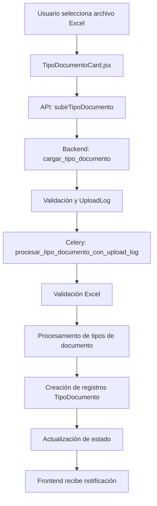
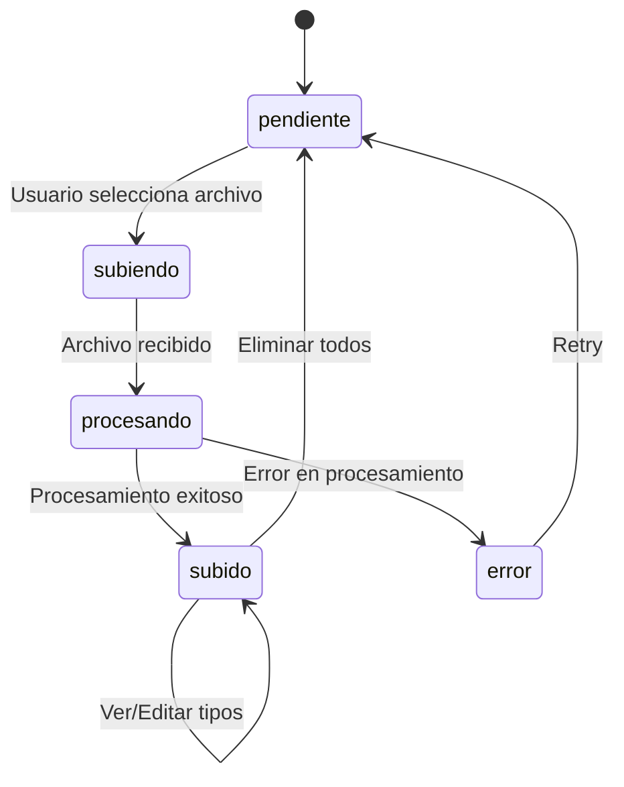

# 📄 Documentación: TipoDocumentoCard

## 🎯 Objetivo
Esta documentación explica el funcionamiento completo de la tarjeta de **Tipo de Documento** desde el frontend hasta el backend, incluyendo los modelos, APIs, validaciones y flujo de datos. El objetivo es servir como referencia para implementar tarjetas similares en el futuro.

---

## 📐 Arquitectura General



---

## 🎨 Frontend: TipoDocumentoCard.jsx

### 📍 Ubicación
`/src/components/TarjetasCierreContabilidad/TipoDocumentoCard.jsx`

### 🎯 Propósito
Permite al usuario subir archivos Excel con tipos de documento contables y gestionar los tipos existentes mediante un modal CRUD. Monitorea el proceso de subida y procesamiento en tiempo real.

### 📊 Estados Principales

```javascript
// Estados de archivo y procesamiento
const [estado, setEstado] = useState("pendiente");
const [archivoNombre, setArchivoNombre] = useState("");
const [subiendo, setSubiendo] = useState(false);
const [error, setError] = useState("");
const [tiposDocumento, setTiposDocumento] = useState([]);
const [eliminando, setEliminando] = useState(false);
const [errorEliminando, setErrorEliminando] = useState("");

// Estados de UploadLog (monitoreo en tiempo real)
const [uploadLogId, setUploadLogId] = useState(null);
const [uploadEstado, setUploadEstado] = useState(null);
const [uploadProgreso, setUploadProgreso] = useState("");

// Estados de UI
const [modalAbierto, setModalAbierto] = useState(false);
const [notificacion, setNotificacion] = useState({ visible: false, tipo: "", mensaje: "" });
```

### 🔄 Flujo de Estados



### 🎛️ Funciones Principales

#### 1. **fetchEstado()** - Cargar estado inicial
```javascript
useEffect(() => {
  const fetchEstado = async () => {
    try {
      const data = await obtenerEstadoTipoDocumento(clienteId);
      const estadoActual = typeof data === "string" ? data : data.estado;
      setEstado(estadoActual);
      
      // Si hay datos, cargar también los tipos de documento para el conteo
      if (estadoActual === "subido") {
        try {
          const tipos = await obtenerTiposDocumentoCliente(clienteId);
          setTiposDocumento(tipos);
        } catch (err) {
          console.error("Error cargando tipos de documento:", err);
        }
      }
      
      if (onCompletado) onCompletado(estadoActual === "subido");
    } catch (err) {
      setEstado("pendiente");
      if (onCompletado) onCompletado(false);
    }
  };
  if (clienteId && !disabled) fetchEstado();
}, [clienteId, disabled, onCompletado]);
```

#### 2. **handleSeleccionArchivo()** - Subir archivo
```javascript
const handleSeleccionArchivo = async (e) => {
  const archivo = e.target.files[0];
  if (!archivo) return;
  
  setArchivoNombre(archivo.name);
  setSubiendo(true);
  setError("");
  setUploadProgreso("Subiendo archivo...");
  setUploadLogId(null);
  setUploadEstado(null);
  
  try {
    const formData = new FormData();
    formData.append("cliente_id", clienteId);
    formData.append("archivo", archivo);
    
    const response = await subirTipoDocumento(formData);
    
    // Obtener el ID del UploadLog para monitoreo
    if (response.upload_log_id) {
      setUploadLogId(response.upload_log_id);
      setUploadProgreso("Archivo recibido, iniciando procesamiento...");
      mostrarNotificacion("info", "📤 Archivo subido correctamente. Procesando...");
    } else {
      // Caso legacy sin UploadLog
      setEstado("subido");
      setSubiendo(false);
      mostrarNotificacion("success", "✅ Archivo procesado exitosamente.");
      if (onCompletado) onCompletado(true);
      
      // Recargar tipos de documento
      try {
        const tipos = await obtenerTiposDocumentoCliente(clienteId);
        setTiposDocumento(tipos);
      } catch (err) {
        console.error("Error recargando tipos:", err);
      }
    }
  } catch (e) {
    // Manejo de errores específicos por código de estado
    if (e.response?.status === 409) {
      const errorData = e.response.data;
      setError(`Ya existen ${errorData.tipos_existentes || 0} tipos de documento para este cliente.`);
      mostrarNotificacion("warning", 
        "⚠️ Ya existen tipos de documento para este cliente. " +
        "Para subir un nuevo archivo, primero debe eliminar los datos existentes."
      );
    } else if (e.response?.status === 400 && e.response.data?.formato_esperado) {
      const errData = e.response.data;
      setError(`Formato de nombre incorrecto. Esperado: ${errData.formato_esperado}, Recibido: ${errData.archivo_recibido}`);
      mostrarNotificacion("warning",
        `❌ Nombre de archivo incorrecto\n\n` +
        `📋 Formato requerido: ${errData.formato_esperado}\n` +
        `📁 Archivo enviado: ${errData.archivo_recibido}`
      );
    } else {
      const errorMsg = e.response?.data?.error || "Error al subir el archivo";
      setError(errorMsg);
      mostrarNotificacion("error", `❌ ${errorMsg}`);
    }
    setSubiendo(false);
    setUploadProgreso("");
    if (onCompletado) onCompletado(false);
  }
};
```

#### 3. **Monitoreo en Tiempo Real**
```javascript
useEffect(() => {
  if (!uploadLogId || !subiendo) return;

  const monitorearUpload = async () => {
    try {
      const logData = await obtenerEstadoUploadLog(uploadLogId);
      setUploadEstado(logData);
      
      // Actualizar el progreso visible
      if (logData.estado === 'procesando') {
        setUploadProgreso("Procesando archivo...");
        
        // Mostrar notificación amarilla solo la primera vez que entra en procesando
        if (uploadEstado?.estado !== 'procesando') {
          mostrarNotificacion("warning", "📊 Procesando archivo... Por favor espere.");
        }
        
      } else if (logData.estado === 'completado') {
        setUploadProgreso("¡Procesamiento completado!");
        setSubiendo(false);
        setEstado("subido");
        if (onCompletado) onCompletado(true);
        
        // Recargar tipos de documento
        try {
          const tipos = await obtenerTiposDocumentoCliente(clienteId);
          setTiposDocumento(tipos);
        } catch (err) {
          console.error("Error recargando tipos:", err);
        }
        
        mostrarNotificacion("success", 
          `✅ Archivo procesado exitosamente. ${logData.resumen?.tipos_documento_creados || 0} tipos de documento creados.`
        );
        
      } else if (logData.estado === 'error') {
        setUploadProgreso("Error en el procesamiento");
        setSubiendo(false);
        setError(logData.errores || "Error desconocido en el procesamiento");
        if (onCompletado) onCompletado(false);
        mostrarNotificacion("error", `❌ Error: ${logData.errores || "Error desconocido"}`);
      }
      
    } catch (err) {
      console.error("Error monitoreando upload:", err);
      setUploadProgreso("Error monitoreando el proceso");
    }
  };

  // Iniciar monitoreo cada 2 segundos
  const intervalo = setInterval(monitorearUpload, 2000);
  return () => clearInterval(intervalo);
}, [uploadLogId, subiendo, clienteId, onCompletado]);
```

#### 4. **handleVerTiposDocumento()** - Ver y gestionar tipos
```javascript
const handleVerTiposDocumento = async () => {
  try {
    const tipos = await obtenerTiposDocumentoCliente(clienteId);
    setTiposDocumento(tipos);
    await registrarVistaTiposDocumento(clienteId);
    setModalAbierto(true);
  } catch (error) {
    console.error("Error al obtener tipos de documento:", error);
    mostrarNotificacion("error", "Error al cargar tipos de documento");
  }
};
```

#### 5. **handleEliminarTodos()** - Eliminar todos los tipos
```javascript
const handleEliminarTodos = async () => {
  if (!window.confirm("¿Está seguro de que desea eliminar todos los tipos de documento? Esta acción no se puede deshacer.")) {
    return;
  }
  
  setEliminando(true);
  setErrorEliminando("");
  
  try {
    await eliminarTodosTiposDocumento(clienteId);
    setTiposDocumento([]);
    setEstado("pendiente");
    setModalAbierto(false);
    if (onCompletado) onCompletado(false);
    mostrarNotificacion("success", "✅ Todos los tipos de documento han sido eliminados correctamente.");
  } catch (error) {
    console.error("Error eliminando tipos de documento:", error);
    const errorMsg = error.response?.data?.error || "Error al eliminar tipos de documento";
    setErrorEliminando(errorMsg);
    mostrarNotificacion("error", `❌ ${errorMsg}`);
  } finally {
    setEliminando(false);
  }
};
```

### 🎨 UI Condicional Inteligente

```jsx
<span className="text-xs text-gray-400 italic mt-2">
  {estado === "subido"
    ? <span className="text-green-400">
        {`✔ Archivo cargado correctamente${tiposDocumento.length > 0 ? ` (${tiposDocumento.length} tipos de documento)` : ""}`}
      </span>
    : subiendo || uploadProgreso
    ? <span className="text-blue-400">🔄 {uploadProgreso || "Procesando archivo..."}</span>
    : error
    ? <span className="text-red-400">❌ Error: {error}</span>
    : tiposDocumento.length > 0
    ? <span className="text-yellow-400">📋 Archivo cargado con {tiposDocumento.length} tipos de documento</span>
    : "Aún no se ha subido el archivo."}
</span>
```

---

## 🌐 APIs del Frontend

### 📍 Ubicación
`/src/api/contabilidad.js`

### 🔗 Endpoints Utilizados

#### 1. **obtenerEstadoTipoDocumento**
```javascript
export const obtenerEstadoTipoDocumento = async (clienteId) => {
  const res = await api.get(`/contabilidad/tipo-documento/${clienteId}/estado/`);
  return typeof res.data === "string" ? res.data : res.data.estado;
};
```

#### 2. **subirTipoDocumento**
```javascript
export const subirTipoDocumento = async (formData) => {
  const res = await api.post("/contabilidad/tipo-documento/subir-archivo/", formData);
  return res.data;
};
```

#### 3. **obtenerTiposDocumentoCliente**
```javascript
export const obtenerTiposDocumentoCliente = async (clienteId) => {
  const res = await api.get(`/contabilidad/tipo-documento/${clienteId}/list/`);
  return res.data;
};
```

#### 4. **eliminarTodosTiposDocumento**
```javascript
export const eliminarTodosTiposDocumento = async (clienteId) => {
  const res = await api.post(`/contabilidad/tipo-documento/${clienteId}/eliminar-todos/`);
  return res.data;
};
```

#### 5. **obtenerEstadoUploadLog**
```javascript
export const obtenerEstadoUploadLog = async (uploadLogId) => {
  const res = await api.get(`/contabilidad/upload-log/${uploadLogId}/estado/`);
  return res.data;
};
```

#### 6. **registrarVistaTiposDocumento**
```javascript
export const registrarVistaTiposDocumento = async (clienteId) => {
  const res = await api.post(`/contabilidad/tipo-documento/${clienteId}/registrar-vista/`);
  return res.data;
};
```

---

## ⚙️ Backend: Views y Endpoints

### 📍 Ubicación
`/backend/contabilidad/views.py`

### 🎯 Endpoints Principales

#### 1. **cargar_tipo_documento** - Subir archivo
```python
@api_view(["POST"])
@parser_classes([MultiPartParser])
@permission_classes([IsAuthenticated])
def cargar_tipo_documento(request):
    """
    Endpoint para subir archivos de tipos de documento usando el sistema UploadLog
    """
    cliente_id = request.data.get("cliente_id")
    archivo = request.FILES.get("archivo")

    if not cliente_id or not archivo:
        return Response({"error": "cliente_id y archivo son requeridos"}, status=400)

    try:
        cliente = Cliente.objects.get(id=cliente_id)
    except Cliente.DoesNotExist:
        return Response({"error": "Cliente no encontrado"}, status=404)

    # Verificar si ya existen datos para este cliente
    tipos_existentes = TipoDocumento.objects.filter(cliente=cliente).count()
    if tipos_existentes > 0:
        return Response({
            "error": "Ya existen tipos de documento para este cliente",
            "mensaje": "Debe eliminar todos los registros existentes antes de subir un nuevo archivo",
            "tipos_existentes": tipos_existentes,
            "accion_requerida": "Usar 'Eliminar todos' primero",
        }, status=409)

    # Validar nombre del archivo
    es_valido, mensaje = UploadLog.validar_nombre_archivo(
        archivo.name, "TipoDocumento", cliente.rut
    )
    if not es_valido:
        return Response({
            "error": "Formato de nombre de archivo incorrecto",
            "formato_esperado": mensaje.split("Esperado: ")[1].split(",")[0] if "Esperado: " in mensaje else "RUT_CLIENTE_TipoDocumento_YYYYMMDD.xlsx",
            "archivo_recibido": archivo.name,
            "detalle": mensaje
        }, status=400)

    # Crear UploadLog
    upload_log = UploadLog.objects.create(
        tipo_upload="tipo_documento",
        cliente=cliente,
        usuario=request.user.usuario,
        nombre_archivo_original=archivo.name,
        tamaño_archivo=archivo.size,
        estado="subido",
        ip_usuario=request.META.get("REMOTE_ADDR"),
    )

    # Guardar archivo temporal
    ruta_relativa = f"temp/tipo_documento_cliente_{cliente_id}_{upload_log.id}.xlsx"
    ruta_archivo = default_storage.save(ruta_relativa, archivo)
    upload_log.ruta_archivo = ruta_relativa
    upload_log.save(update_fields=["ruta_archivo"])

    # Procesar con Celery
    procesar_tipo_documento_con_upload_log.delay(upload_log.id)

    return Response({
        "mensaje": "Archivo subido correctamente",
        "upload_log_id": upload_log.id,
    })
```

#### 2. **obtener_estado_tipo_documento** - Obtener estado
```python
@api_view(["GET"])
@permission_classes([IsAuthenticated])
def obtener_estado_tipo_documento(request, cliente_id):
    """
    Obtiene el estado actual del tipo de documento para un cliente
    """
    try:
        cliente = Cliente.objects.get(id=cliente_id)
        archivo_td = TipoDocumentoArchivo.objects.filter(cliente=cliente).first()
        
        if archivo_td:
            return Response("subido")
        else:
            return Response("pendiente")
            
    except Cliente.DoesNotExist:
        return Response({"error": "Cliente no encontrado"}, status=404)
    except Exception as e:
        logger.exception("Error obteniendo estado tipo documento")
        return Response({"error": "Error interno del servidor"}, status=500)
```

#### 3. **listar_tipos_documento_cliente** - Listar tipos
```python
@api_view(["GET"])
@permission_classes([IsAuthenticated])
def listar_tipos_documento_cliente(request, cliente_id):
    """
    Lista todos los tipos de documento de un cliente específico
    """
    try:
        cliente = Cliente.objects.get(id=cliente_id)
        tipos = TipoDocumento.objects.filter(cliente=cliente).order_by("codigo")
        
        data = []
        for tipo in tipos:
            data.append({
                "id": tipo.id,
                "codigo": tipo.codigo,
                "descripcion": tipo.descripcion,
            })
        
        return Response(data)
        
    except Cliente.DoesNotExist:
        return Response({"error": "Cliente no encontrado"}, status=404)
    except Exception as e:
        logger.exception("Error listando tipos de documento")
        return Response({"error": "Error interno del servidor"}, status=500)
```

#### 4. **eliminar_todos_tipos_documento** - Eliminar todos
```python
@api_view(["POST"])
@permission_classes([IsAuthenticated])
def eliminar_todos_tipos_documento(request, cliente_id):
    """
    Elimina todos los tipos de documento de un cliente
    """
    try:
        cliente = Cliente.objects.get(id=cliente_id)
        
        # Contar registros antes de eliminar
        count = TipoDocumento.objects.filter(cliente=cliente).count()
        
        # Eliminar todos los tipos de documento
        TipoDocumento.objects.filter(cliente=cliente).delete()
        
        # Eliminar archivo asociado si existe
        try:
            archivo_td = TipoDocumentoArchivo.objects.get(cliente=cliente)
            if archivo_td.archivo:
                archivo_td.archivo.delete()
            archivo_td.delete()
        except TipoDocumentoArchivo.DoesNotExist:
            pass
        
        # Registrar actividad
        registrar_actividad_tarjeta(
            cliente_id=cliente_id,
            periodo=date.today().strftime("%Y-%m"),
            tarjeta="tipo_documento",
            accion="delete_all",
            descripcion=f"Eliminados todos los tipos de documento: {count} registros",
            usuario=request.user,
            detalles={"registros_eliminados": count},
            resultado="exito",
            ip_address=request.META.get("REMOTE_ADDR"),
        )
        
        return Response({
            "mensaje": f"Se eliminaron {count} tipos de documento correctamente",
            "registros_eliminados": count
        })
        
    except Cliente.DoesNotExist:
        return Response({"error": "Cliente no encontrado"}, status=404)
    except Exception as e:
        logger.exception("Error eliminando tipos de documento")
        return Response({"error": "Error interno del servidor"}, status=500)
```

---

## 🔄 Backend: Celery Tasks

### 📍 Ubicación
`/backend/contabilidad/tasks.py`

### 🎯 Tareas Principales

#### 1. **procesar_tipo_documento_con_upload_log**
```python
@shared_task
def procesar_tipo_documento_con_upload_log(upload_log_id):
    """Procesa archivo de tipos de documento utilizando el sistema UploadLog"""
    
    try:
        upload_log = UploadLog.objects.get(id=upload_log_id)
    except UploadLog.DoesNotExist:
        return f"Error: UploadLog {upload_log_id} no encontrado"

    upload_log.estado = "procesando"
    upload_log.save(update_fields=["estado"])
    inicio = timezone.now()

    try:
        # 1. Obtener ruta del archivo
        ruta_relativa = upload_log.ruta_archivo
        ruta_completa = default_storage.path(ruta_relativa)

        if not os.path.exists(ruta_completa):
            upload_log.estado = "error"
            upload_log.errores = f"Archivo temporal no encontrado: {ruta_relativa}"
            upload_log.tiempo_procesamiento = timezone.now() - inicio
            upload_log.save()
            return "Error: Archivo temporal no encontrado"

        # 2. Validar archivo Excel
        validacion = validar_archivo_tipo_documento_excel(ruta_completa, upload_log.cliente.id)
        
        if not validacion['es_valido']:
            error_msg = "Archivo inválido: " + "; ".join(validacion['errores'])
            upload_log.estado = "error"
            upload_log.errores = error_msg
            upload_log.tiempo_procesamiento = timezone.now() - inicio
            upload_log.resumen = {
                'validacion': validacion,
                'archivo_hash': upload_log.hash_archivo
            }
            upload_log.save()
            return f"Error: {error_msg}"

        # 3. Procesar archivo Excel
        df = pd.read_excel(ruta_completa)
        
        if len(df.columns) < 2:
            raise ValueError("El archivo debe tener al menos 2 columnas: código y descripción")

        columna_codigo = df.columns[0]
        columna_descripcion = df.columns[1]

        # 4. Limpiar datos anteriores del cliente
        TipoDocumento.objects.filter(cliente=upload_log.cliente).delete()

        # 5. Procesar fila por fila
        tipos_creados = 0
        errores = []
        filas_vacias = 0

        for index, row in df.iterrows():
            codigo = str(row[columna_codigo]).strip() if not pd.isna(row[columna_codigo]) else ""
            descripcion = str(row[columna_descripcion]).strip() if not pd.isna(row[columna_descripcion]) else ""
            
            # Saltar filas vacías
            if not codigo or not descripcion:
                filas_vacias += 1
                continue
            
            try:
                TipoDocumento.objects.create(
                    cliente=upload_log.cliente,
                    codigo=codigo,
                    descripcion=descripcion
                )
                tipos_creados += 1
            except Exception as e:
                errores.append(f"Fila {index + 2}: {str(e)}")

        # 6. Crear o actualizar TipoDocumentoArchivo
        with open(ruta_completa, "rb") as f:
            contenido = f.read()
            
        nombre_final = f"tipo_documento_cliente_{upload_log.cliente.id}_{timezone.now().strftime('%Y%m%d_%H%M%S')}.xlsx"
        
        archivo_td, created = TipoDocumentoArchivo.objects.get_or_create(
            cliente=upload_log.cliente,
            defaults={
                "upload_log": upload_log,
                "archivo": ContentFile(contenido, name=nombre_final),
            },
        )
        
        if not created:
            # Actualizar archivo existente
            if archivo_td.archivo:
                archivo_td.archivo.delete()
            archivo_td.archivo.save(nombre_final, ContentFile(contenido))
            archivo_td.upload_log = upload_log
            archivo_td.fecha_subida = timezone.now()
            archivo_td.save()

        # 7. Actualizar estado y estadísticas
        resumen = {
            "total_filas": len(df),
            "filas_vacias": filas_vacias,
            "tipos_documento_creados": tipos_creados,
            "errores_count": len(errores),
            "errores": errores[:10],
            "validacion": {
                "errores": validacion['errores'],
                "advertencias": validacion['advertencias'],
                "estadisticas": validacion['estadisticas']
            }
        }

        upload_log.estado = "completado"
        upload_log.tiempo_procesamiento = timezone.now() - inicio
        upload_log.resumen = resumen
        upload_log.save()

        # 8. Limpiar archivo temporal
        try:
            os.remove(ruta_completa)
        except OSError:
            pass

        # 9. Registrar actividad
        registrar_actividad_tarjeta(
            cliente_id=upload_log.cliente.id,
            periodo=date.today().strftime("%Y-%m"),
            tarjeta="tipo_documento",
            accion="process_excel",
            descripcion=f"Procesado archivo de tipos de documento: {tipos_creados} tipos creados",
            usuario=None,
            detalles={
                "upload_log_id": upload_log.id,
                "tipos_creados": tipos_creados,
                "errores": len(errores)
            },
            resultado="exito",
            ip_address=None,
        )

        return f"Completado: {tipos_creados} tipos de documento creados"

    except Exception as e:
        upload_log.estado = "error"
        upload_log.errores = str(e)
        upload_log.tiempo_procesamiento = timezone.now() - inicio
        upload_log.save()
        
        # Registrar error
        registrar_actividad_tarjeta(
            cliente_id=upload_log.cliente.id,
            periodo=date.today().strftime("%Y-%m"),
            tarjeta="tipo_documento",
            accion="process_excel",
            descripcion=f"Error al procesar archivo de tipos de documento: {str(e)}",
            usuario=None,
            detalles={"upload_log_id": upload_log.id},
            resultado="error",
            ip_address=None,
        )
        
        return f"Error: {str(e)}"
```

#### 2. **validar_archivo_tipo_documento_excel**
```python
def validar_archivo_tipo_documento_excel(ruta_archivo, cliente_id):
    """
    Valida exhaustivamente un archivo Excel de tipos de documento antes de procesarlo.
    
    Formato esperado:
    - Fila 1: Headers (Columna A: código, Columna B: descripción)
    - Filas siguientes: Datos de tipos de documento
    """
    errores = []
    advertencias = []
    estadisticas = {}
    
    try:
        # 1. Validaciones básicas del archivo
        if not os.path.exists(ruta_archivo):
            errores.append("El archivo no existe en la ruta especificada")
            return {'es_valido': False, 'errores': errores, 'advertencias': advertencias, 'estadisticas': estadisticas}
        
        if os.path.getsize(ruta_archivo) == 0:
            errores.append("El archivo está vacío (0 bytes)")
            return {'es_valido': False, 'errores': errores, 'advertencias': advertencias, 'estadisticas': estadisticas}
        
        # 2. Leer y validar estructura del Excel
        try:
            df = pd.read_excel(ruta_archivo)
        except Exception as e:
            errores.append(f"Error leyendo el archivo Excel: {str(e)}")
            return {'es_valido': False, 'errores': errores, 'advertencias': advertencias, 'estadisticas': estadisticas}
        
        if len(df) == 0:
            errores.append("El archivo no contiene filas de datos")
            return {'es_valido': False, 'errores': errores, 'advertencias': advertencias, 'estadisticas': estadisticas}
        
        if len(df.columns) < 2:
            errores.append("El archivo debe tener al menos 2 columnas: código y descripción")
            return {'es_valido': False, 'errores': errores, 'advertencias': advertencias, 'estadisticas': estadisticas}
        
        # 3. Validar datos
        columna_codigo = df.columns[0]
        columna_descripcion = df.columns[1]
        
        codigos_vacios = 0
        descripciones_vacias = 0
        codigos_duplicados = []
        codigos_muy_largos = []
        descripciones_muy_largas = []
        
        codigos_vistos = set()
        tipos_validos = 0
        
        for index, row in df.iterrows():
            fila_excel = index + 2
            codigo = row[columna_codigo]
            descripcion = row[columna_descripcion]
            
            # Validar código
            if pd.isna(codigo) or str(codigo).strip() == '':
                codigos_vacios += 1
                continue
            
            codigo_str = str(codigo).strip()
            
            # Verificar longitud del código
            if len(codigo_str) > 10:  # Límite del modelo TipoDocumento
                codigos_muy_largos.append(f"Fila {fila_excel}: '{codigo_str[:15]}...'")
                continue
            
            # Verificar duplicados
            if codigo_str in codigos_vistos:
                codigos_duplicados.append(f"Fila {fila_excel}: '{codigo_str}'")
                continue
            else:
                codigos_vistos.add(codigo_str)
            
            # Validar descripción
            if pd.isna(descripcion) or str(descripcion).strip() == '':
                descripciones_vacias += 1
                continue
            
            descripcion_str = str(descripcion).strip()
            
            # Verificar longitud de descripción
            if len(descripcion_str) > 255:  # Límite del modelo TipoDocumento
                descripciones_muy_largas.append(f"Fila {fila_excel}: '{descripcion_str[:50]}...'")
                continue
            
            tipos_validos += 1
        
        # 4. Generar errores y advertencias
        if codigos_duplicados:
            errores.append(f"Códigos duplicados ({len(codigos_duplicados)}): {', '.join(codigos_duplicados[:3])}")
            if len(codigos_duplicados) > 3:
                errores.append(f"... y {len(codigos_duplicados) - 3} más")
        
        if codigos_muy_largos:
            errores.append(f"Códigos demasiado largos (máximo 10 caracteres): {', '.join(codigos_muy_largos[:3])}")
        
        if descripciones_muy_largas:
            errores.append(f"Descripciones demasiado largas (máximo 255 caracteres): {', '.join(descripciones_muy_largas[:3])}")
        
        if codigos_vacios > 0:
            advertencias.append(f"Se encontraron {codigos_vacios} filas con códigos vacíos (serán omitidas)")
        
        if descripciones_vacias > 0:
            advertencias.append(f"Se encontraron {descripciones_vacias} filas con descripciones vacías (serán omitidas)")
        
        # 5. Estadísticas
        estadisticas = {
            'total_filas': len(df),
            'tipos_validos': tipos_validos,
            'codigos_vacios': codigos_vacios,
            'descripciones_vacias': descripciones_vacias,
            'codigos_duplicados': len(codigos_duplicados),
            'codigos_muy_largos': len(codigos_muy_largos),
            'descripciones_muy_largas': len(descripciones_muy_largas)
        }
        
        # 6. Determinar si es válido
        es_valido = len(errores) == 0 and tipos_validos > 0
        
        return {
            'es_valido': es_valido,
            'errores': errores,
            'advertencias': advertencias,
            'estadisticas': estadisticas
        }
        
    except Exception as e:
        errores.append(f"Error inesperado validando archivo: {str(e)}")
        return {'es_valido': False, 'errores': errores, 'advertencias': advertencias, 'estadisticas': estadisticas}
```

---

## 🗄️ Modelos de Base de Datos

### 📍 Ubicación
`/backend/contabilidad/models.py`

### 🎯 Modelos Interactuados

#### 1. **UploadLog** - Control de uploads
```python
class UploadLog(models.Model):
    TIPO_CHOICES = [
        ("tipo_documento", "Tipo de Documento"),
        ("clasificacion", "Clasificación Bulk"),
        ("nombres_ingles", "Nombres en Inglés"),
        ("libro_mayor", "Libro Mayor"),
    ]

    ESTADO_CHOICES = [
        ("subido", "Archivo subido"),
        ("procesando", "Procesando"),
        ("completado", "Procesado correctamente"),
        ("error", "Con errores"),
        ("datos_eliminados", "Datos procesados eliminados"),
    ]

    tipo_upload = models.CharField(max_length=20, choices=TIPO_CHOICES)
    cliente = models.ForeignKey(Cliente, on_delete=models.CASCADE)
    usuario = models.ForeignKey(Usuario, on_delete=models.SET_NULL, null=True)
    fecha_subida = models.DateTimeField(auto_now_add=True)
    nombre_archivo_original = models.CharField(max_length=255)
    ruta_archivo = models.CharField(max_length=500, blank=True)
    tamaño_archivo = models.BigIntegerField()
    hash_archivo = models.CharField(max_length=64, blank=True)
    estado = models.CharField(max_length=20, choices=ESTADO_CHOICES, default="subido")
    errores = models.TextField(blank=True)
    resumen = models.JSONField(null=True, blank=True)
    tiempo_procesamiento = models.DurationField(null=True, blank=True)
    ip_usuario = models.GenericIPAddressField(null=True, blank=True)
```

#### 2. **TipoDocumento** - Tipos de documento procesados
```python
class TipoDocumento(models.Model):
    id = models.BigAutoField(primary_key=True)
    cliente = models.ForeignKey(Cliente, on_delete=models.CASCADE)
    codigo = models.CharField(max_length=10)
    descripcion = models.CharField(max_length=255)

    class Meta:
        unique_together = ("cliente", "codigo")

    def __str__(self):
        return f"{self.codigo} - {self.descripcion}"
```

#### 3. **TipoDocumentoArchivo** - Archivo procesado guardado
```python
class TipoDocumentoArchivo(models.Model):
    cliente = models.OneToOneField(Cliente, on_delete=models.CASCADE)
    archivo = models.FileField(upload_to="tipo_documento/")
    fecha_subida = models.DateTimeField(auto_now_add=True)
    upload_log = models.ForeignKey(
        "UploadLog",
        on_delete=models.SET_NULL,
        null=True,
        blank=True,
        help_text="Referencia al log del upload que generó este archivo",
    )

    def __str__(self):
        return f"Archivo Tipo Documento - {self.cliente.nombre}"
```

---

## 📋 Formato de Archivo Excel Esperado

### 🎯 Estructura
```excel
| Código | Descripción              |
|--------|--------------------------|
| 01     | Factura                  |
| 02     | Boleta                   |
| 03     | Nota de Crédito          |
| 04     | Nota de Débito           |
| 05     | Guía de Despacho         |
```

### ✅ Validaciones Aplicadas
1. **Archivo**: No vacío, formato Excel válido, mínimo 2 columnas
2. **Códigos**: No vacíos, máximo 10 caracteres, no duplicados
3. **Descripciones**: No vacías, máximo 255 caracteres
4. **Datos**: Al menos un tipo de documento válido
5. **Nombre de archivo**: Formato específico según RUT del cliente

### 🚫 Reglas de Negocio
1. **Conflicto de datos**: No se permite subir si ya existen tipos para el cliente
2. **Limpieza automática**: Al procesar nuevo archivo se eliminan tipos anteriores
3. **Atomicidad**: Si falla el procesamiento, no se guardan datos parciales

---

## 🎨 Componentes Adicionales

### 1. **ModalTipoDocumentoCRUD** - Modal de gestión
- Ver tipos de documento existentes
- Crear nuevos tipos manualmente
- Editar tipos existentes
- Eliminar tipos individuales
- Eliminar todos los tipos

### 2. **EstadoBadge** - Indicador visual de estado
- "Pendiente": Gris
- "Subido": Verde
- "Procesando": Azul
- "Error": Rojo

---

## 🎨 Patrones de Diseño Implementados

### 1. **Prevención de Conflictos**
```python
# Verificar si ya existen datos antes de procesar
tipos_existentes = TipoDocumento.objects.filter(cliente=cliente).count()
if tipos_existentes > 0:
    return Response({"error": "Ya existen tipos de documento..."}, status=409)
```

### 2. **Estado Defensivo en Frontend**
```javascript
// Múltiples fallbacks para mostrar estado correcto
{estado === "subido"
  ? <span className="text-green-400">✔ Archivo cargado correctamente</span>
  : subiendo || uploadProgreso
  ? <span className="text-blue-400">🔄 {uploadProgreso}</span>
  : tiposDocumento.length > 0
  ? <span className="text-yellow-400">📋 Archivo cargado con {tiposDocumento.length} tipos</span>
  : "Aún no se ha subido el archivo."}
```

### 3. **Monitoreo en Tiempo Real**
```javascript
// Polling cada 2 segundos para updates más frecuentes
const intervalo = setInterval(monitorearUpload, 2000);
```

### 4. **Validación de Nombre de Archivo**
```python
# Formato específico requerido
es_valido, mensaje = UploadLog.validar_nombre_archivo(
    archivo.name, "TipoDocumento", cliente.rut
)
```

---

## 🚀 Implementación de Tarjetas Similares

Para implementar una tarjeta similar para **tipos de documento**, seguir este patrón:

### 1. **Frontend**
- ✅ Estados para archivo, tipos de documento, procesamiento y UI
- ✅ Validación de conflictos antes de subir
- ✅ Monitoreo en tiempo real cada 2 segundos
- ✅ Modal CRUD para gestión de datos
- ✅ Eliminación masiva con confirmación
- ✅ UI condicional con múltiples fallbacks

### 2. **Backend**
- ✅ Validación de datos existentes (409 Conflict)
- ✅ Validación de formato de nombre de archivo
- ✅ Creación de UploadLog antes de procesar
- ✅ Procesamiento atómico (elimina anteriores)
- ✅ Validación exhaustiva del Excel
- ✅ Endpoints CRUD completos

### 3. **Validaciones Específicas**
- ✅ Códigos únicos por cliente
- ✅ Longitudes de campo apropiadas
- ✅ Datos requeridos no vacíos
- ✅ Formato de archivo específico

### 4. **Características Únicas**
- ✅ **Prevención de duplicados**: Rechaza uploads si existen datos
- ✅ **Gestión completa**: CRUD individual y masivo
- ✅ **Validación estricta**: Formato de nombre de archivo
- ✅ **Atomicidad**: Reemplaza todos los datos o ninguno

---

## 🔍 Debugging y Logs

### Frontend
```javascript
console.log("Estado actual:", estado);
console.log("Tipos cargados:", tiposDocumento.length);
console.log("Upload Log ID:", uploadLogId);
console.log("Progress:", uploadProgreso);
```

### Backend
```python
logger.info(f"Iniciando procesamiento tipo documento para upload_log_id: {upload_log_id}")
logger.error(f"Validación falló: {validacion['errores']}")
logger.warning(f"Tipos existentes: {tipos_existentes}")
```

---

## 📊 Métricas y Estadísticas

El sistema recolecta automáticamente:
- ✅ Tiempo de procesamiento
- ✅ Cantidad de tipos creados
- ✅ Errores encontrados por tipo
- ✅ Filas omitidas (vacías o inválidas)
- ✅ Estadísticas de validación detalladas
- ✅ Tracking de eliminaciones masivas

---

**📝 Nota**: Esta documentación debe actualizarse cuando se modifique la funcionalidad de la tarjeta.
