# 🏗️ Flujo Redefinido: Subida y Procesamiento de Archivos

## Resumen Ejecutivo

Este documento redefine completamente la arquitectura de subida y procesamiento de archivos del sistema de cierre de nómina, integrando:
- **Libro como FK Master**: EmpleadoCierre como referencia base
- **Resubida robusta**: Limpieza y reinicio completo
- **Logs de actividad**: Tracking exhaustivo de acciones
- **Mapeos persistentes**: Clasificaciones y headers
- **Almacenamiento versionado**: Manejo de archivos Excel

---

## 🌊 Flujo General Rediseñado

### Arquitectura de Estados

```mermaid
graph TD
    A[no_subido] --> B[subido]
    B --> C[analizando]
    C --> D{¿Requiere mapeo?}
    D -->|Sí| E[mapeo_pendiente]
    D -->|No| F[procesando]
    E --> G{¿Usuario completa mapeo?}
    G -->|Sí| F
    G -->|Cancela| H[mapeo_cancelado]
    F --> I{¿Procesamiento exitoso?}
    I -->|Sí| J[procesado]
    I -->|No| K[con_error]
    
    J --> L[Resubir?]
    K --> L
    L --> M[Limpiar datos y archivo]
    M --> A
    
    style J fill:#4caf50
    style K fill:#f44336
    style E fill:#ff9800
```



### Principios Arquitecturales

1. **Orden Obligatorio**: Libro → Movimientos → Analista → Novedades
2. **FK Master**: Todos referencian a EmpleadoCierre
3. **Atomicidad**: Transacciones completas o rollback total
4. **Idempotencia**: Resubir puede repetirse sin efectos secundarios
5. **Auditabilidad**: Todo cambio queda registrado

---

## 📋 Detalle por Tarjeta

### 1. 📘 Libro de Remuneraciones (MASTER)

#### Modelos Involucrados
```python
# Upload y tracking
LibroRemuneracionesUpload
UploadLog

# Mapeos y clasificaciones
ConceptoRemuneracion

# Datos derivados (FK MASTER)
EmpleadoCierre ← FUENTE DE VERDAD
RegistroConceptoEmpleado
```

#### Flujo Detallado

**Fase 1: Subida**
```python
# POST /api/nomina/libro-remuneraciones/{cierre_id}/upload/
def upload_libro(request, cierre_id):
    # 1. Crear UploadLog
    upload_log = UploadLog.objects.create(
        cierre_id=cierre_id,
        tipo_archivo='libro_remuneraciones',
        nombre_archivo=archivo.name,
        tamaño_archivo=archivo.size,
        estado='iniciado'
    )
    
    # 2. Guardar archivo versionado
    archivo_path = save_versioned_file(archivo, 'libro_remuneraciones', cierre_id)
    
    # 3. Crear/actualizar LibroRemuneracionesUpload
    libro_upload = LibroRemuneracionesUpload.objects.update_or_create(
        cierre_id=cierre_id,
        defaults={
            'archivo': archivo_path,
            'estado': 'subido',
            'upload_log': upload_log
        }
    )
    
    # 4. Trigger análisis asíncrono
    analizar_libro_task.delay(libro_upload.id, upload_log.id)
```

**Fase 2: Análisis**
```python
def analizar_libro_task(libro_upload_id, upload_log_id):
    # 1. Actualizar estados
    update_states(libro_upload_id, upload_log_id, 'analizando')
    
    # 2. Leer Excel y extraer headers
    df = pd.read_excel(libro_upload.archivo)
    headers = extract_headers(df)
    
    # 3. Auto-clasificar headers conocidos
    headers_clasificados = auto_classify_headers(headers, cierre.cliente)
    headers_sin_clasificar = get_unclassified_headers(headers, headers_clasificados)
    
    # 4. Guardar análisis
    libro_upload.header_json = {
        'headers_clasificados': headers_clasificados,
        'headers_sin_clasificar': headers_sin_clasificar,
        'total_registros': len(df)
    }
    
    # 5. Determinar próximo estado
    if headers_sin_clasificar:
        libro_upload.estado = 'mapeo_pendiente'
    else:
        libro_upload.estado = 'listo_procesar'
        # Auto-trigger procesamiento
        procesar_libro_task.delay(libro_upload_id, upload_log_id)
```

**Fase 3: Mapeo (si necesario)**
```python
# POST /api/nomina/libro-remuneraciones/{id}/mapear-headers/
def mapear_headers(request, libro_id):
    mapeos = request.data.get('mapeos', {})
    
    # 1. Guardar mapeos permanentes
    for header, clasificacion in mapeos.items():
        ConceptoRemuneracion.objects.update_or_create(
            cliente=cierre.cliente,
            nombre_concepto=header,
            defaults={
                'clasificacion': clasificacion,
                'usuario_clasifica': request.user
            }
        )
    
    # 2. Actualizar estado y trigger procesamiento
    libro_upload.estado = 'listo_procesar'
    procesar_libro_task.delay(libro_id, upload_log_id)
```

**Fase 4: Procesamiento**
```python
def procesar_libro_task(libro_upload_id, upload_log_id):
    with transaction.atomic():
        # 1. Limpiar datos anteriores (si resubida)
        EmpleadoCierre.objects.filter(cierre=cierre).delete()  # CASCADE limpia RegistroConcepto
        
        # 2. Procesar empleados (CREAR MASTER FK)
        for index, row in df.iterrows():
            empleado = EmpleadoCierre.objects.create(
                cierre=cierre,
                rut=normalize_rut(row['RUT']),
                nombre=row['NOMBRE'],
                apellido_paterno=row['APELLIDO_PAT'],
                apellido_materno=row.get('APELLIDO_MAT', ''),
                rut_empresa=row.get('RUT_EMPRESA', ''),
                dias_trabajados=row.get('DIAS_TRABAJADOS', 0)
            )
            
            # 3. Procesar conceptos por empleado
            for header, valor in row.items():
                if header in headers_clasificados:
                    RegistroConceptoEmpleado.objects.create(
                        empleado=empleado,
                        concepto=get_concepto(header, cierre.cliente),
                        nombre_concepto_original=header,
                        monto=valor
                    )
        
        # 4. Finalizar exitosamente
        update_states(libro_upload_id, upload_log_id, 'procesado')
```

#### Datos en BD Post-Procesamiento
```python
LibroRemuneracionesUpload:
  - archivo: "uploads/libro_2025_01_v1.xlsx"
  - estado: "procesado"
  - header_json: {"headers_clasificados": [...], ...}
  
EmpleadoCierre: [1247 registros] ← MASTER FK
  - FK: cierre_id
  - rut, nombre, apellidos, dias_trabajados
  
RegistroConceptoEmpleado: [15,673 registros]
  - FK: empleado_id (→ EmpleadoCierre)
  - FK: concepto_id (→ ConceptoRemuneracion)
  - nombre_concepto_original, monto
  
ConceptoRemuneracion: [47 conceptos únicos]
  - FK: cliente_id
  - nombre_concepto, clasificacion, usuario_clasifica
  
UploadLog: [1 registro]
  - tipo_archivo: 'libro_remuneraciones'
  - estado: 'completado'
  - logs: [{"timestamp": "...", "accion": "archivo_subido"}, ...]
```

#### Lógica de Resubida
```python
# DELETE /api/nomina/libro-remuneraciones/{id}/resubir/
def resubir_libro(request, libro_id):
    with transaction.atomic():
        # 1. Eliminar datos derivados
        EmpleadoCierre.objects.filter(cierre=cierre).delete()  # CASCADE total
        
        # 2. Eliminar archivo físico anterior
        delete_physical_file(libro_upload.archivo)
        
        # 3. Resetear upload
        libro_upload.delete()  # Permite nueva subida
        
        # 4. Log de resubida
        UploadLog.objects.create(
            cierre=cierre,
            tipo_archivo='libro_remuneraciones',
            estado='resubida_iniciada',
            usuario=request.user
        )
```

---

### 2. 🚚 Movimientos del Mes

#### Modelos Involucrados
```python
# Upload y tracking
MovimientosMesUpload
UploadLog

# Datos derivados (CON FK MASTER)
MovimientoAltaBaja
  ↳ empleado FK → EmpleadoCierre ← OBLIGATORIO
MovimientoAusentismo
  ↳ empleado FK → EmpleadoCierre ← OBLIGATORIO
MovimientoVacaciones
  ↳ empleado FK → EmpleadoCierre ← OBLIGATORIO
MovimientoVariacionSueldo
  ↳ empleado FK → EmpleadoCierre ← OBLIGATORIO
MovimientoVariacionContrato
  ↳ empleado FK → EmpleadoCierre ← OBLIGATORIO
```

#### Flujo con FK Master
```python
def procesar_movimientos_task(movimientos_upload_id, upload_log_id):
    with transaction.atomic():
        # 1. Limpiar movimientos anteriores
        clear_all_movimientos(cierre)
        
        # 2. Procesar cada hoja del Excel
        for sheet_name, df in excel_sheets.items():
            if sheet_name == 'Altas_Bajas':
                procesar_altas_bajas_con_fk(df, cierre)
            elif sheet_name == 'Ausentismos':
                procesar_ausentismos_con_fk(df, cierre)
            # ... etc

def procesar_altas_bajas_con_fk(df, cierre):
    movimientos_sin_empleado = []
    
    for index, row in df.iterrows():
        rut_normalizado = normalize_rut(row['RUT'])
        
        # BUSCAR FK MASTER OBLIGATORIO
        try:
            empleado = EmpleadoCierre.objects.get(cierre=cierre, rut=rut_normalizado)
        except EmpleadoCierre.DoesNotExist:
            # CASO EDGE: Auto-crear empleado o registrar para discrepancia
            empleado = auto_crear_empleado_si_valido(row, cierre)
            if not empleado:
                movimientos_sin_empleado.append(row)
                continue
        
        MovimientoAltaBaja.objects.create(
            cierre=cierre,
            empleado=empleado,  # ← FK MASTER SIEMPRE ASIGNADO
            nombres_apellidos=row['NOMBRE'],
            rut=rut_normalizado,
            # ... resto campos
        )
    
    # Registrar empleados sin FK para discrepancias
    if movimientos_sin_empleado:
        registrar_empleados_faltantes(movimientos_sin_empleado, cierre)
```

#### Auto-creación de Empleados (Casos Edge)
```python
def auto_crear_empleado_si_valido(row, cierre):
    """
    Crea EmpleadoCierre para casos edge válidos:
    - Ingresos: Empleado nuevo que aún no está en nómina
    - Retiros: Empleado que ya salió pero tiene movimiento pendiente
    """
    tipo_movimiento = row.get('ALTA_O_BAJA', '')
    
    if tipo_movimiento in ['ALTA', 'BAJA']:  # Casos válidos
        return EmpleadoCierre.objects.create(
            cierre=cierre,
            rut=normalize_rut(row['RUT']),
            nombre=parse_nombre(row['NOMBRE']),
            apellido_paterno=parse_apellido_pat(row['NOMBRE']),
            apellido_materno=parse_apellido_mat(row['NOMBRE']),
            rut_empresa=row.get('EMPRESA', ''),
            dias_trabajados=row.get('DIAS_TRABAJADOS', 0),
            # Flag especial para indicar auto-creación
            observaciones='Auto-creado desde MovimientosMes'
        )
    
    return None  # No es caso válido, generará discrepancia
```

---

### 3. 📊 Archivos del Analista

#### Modelos Involucrados (CON FK MASTER)
```python
# Upload y tracking
ArchivoAnalistaUpload
UploadLog

# Datos derivados (CON FK MASTER NUEVO)
AnalistaFiniquito
  ↳ empleado FK → EmpleadoCierre ← NUEVO
AnalistaIncidencia  
  ↳ empleado FK → EmpleadoCierre ← NUEVO
AnalistaIngreso
  ↳ empleado FK → EmpleadoCierre ← NUEVO
```

#### Migración de Modelos
```python
# ANTES (solo RUT string)
class AnalistaFiniquito(models.Model):
    cierre = models.ForeignKey(CierreNomina, on_delete=models.CASCADE)
    rut = models.CharField(max_length=12)  # Solo string
    nombres_apellidos = models.CharField(max_length=200)
    # ... resto campos

# DESPUÉS (con FK Master)
class AnalistaFiniquito(models.Model):
    cierre = models.ForeignKey(CierreNomina, on_delete=models.CASCADE)
    empleado = models.ForeignKey(EmpleadoCierre, on_delete=models.CASCADE, null=True, blank=True)  # ← NUEVO
    rut = models.CharField(max_length=12)  # Mantener backup
    nombres_apellidos = models.CharField(max_length=200)  # Mantener backup
    # ... resto campos
    
    @property
    def empleado_nombre_efectivo(self):
        """Prioridad: FK empleado > nombres_apellidos backup"""
        if self.empleado:
            return f"{self.empleado.nombre} {self.empleado.apellido_paterno}"
        return self.nombres_apellidos
```

#### Procesamiento con FK Master
```python
def procesar_archivo_analista_task(archivo_upload_id, upload_log_id):
    with transaction.atomic():
        # 1. Limpiar datos anteriores
        clear_analista_data(cierre, archivo_upload.tipo_archivo)
        
        # 2. Procesar según tipo
        if archivo_upload.tipo_archivo == 'finiquitos':
            procesar_finiquitos_con_fk(df, cierre)
        elif archivo_upload.tipo_archivo == 'incidencias':
            procesar_incidencias_con_fk(df, cierre)
        # ... etc

def procesar_finiquitos_con_fk(df, cierre):
    empleados_no_encontrados = []
    
    for index, row in df.iterrows():
        rut_normalizado = normalize_rut(row['RUT'])
        
        # BUSCAR FK MASTER
        try:
            empleado = EmpleadoCierre.objects.get(cierre=cierre, rut=rut_normalizado)
        except EmpleadoCierre.DoesNotExist:
            empleado = None
            empleados_no_encontrados.append(row)
        
        AnalistaFiniquito.objects.create(
            cierre=cierre,
            empleado=empleado,  # ← FK Master (puede ser None)
            rut=rut_normalizado,  # Backup para debugging
            nombres_apellidos=row['NOMBRES'],  # Backup
            # ... resto campos
        )
    
    # Log empleados no encontrados para discrepancias
    if empleados_no_encontrados:
        log_empleados_faltantes(empleados_no_encontrados, 'finiquitos', cierre)
```

---

### 4. 📝 Novedades

#### Modelos Involucrados (CON FK MASTER)
```python
# Upload y tracking
ArchivoNovedadesUpload
UploadLog

# Mapeos específicos novedades
ConceptoRemuneracionNovedades
  ↳ concepto_libro FK → ConceptoRemuneracion

# Datos derivados (CON FK MASTER NUEVO)
EmpleadoCierreNovedades
  ↳ empleado_base FK → EmpleadoCierre ← NUEVO
RegistroConceptoEmpleadoNovedades
  ↳ empleado FK → EmpleadoCierreNovedades
  ↳ concepto_novedades FK → ConceptoRemuneracionNovedades
```

#### Migración EmpleadoCierreNovedades
```python
# ANTES (modelo separado)
class EmpleadoCierreNovedades(models.Model):
    cierre = models.ForeignKey(CierreNomina, on_delete=models.CASCADE)
    rut = models.CharField(max_length=12)
    nombre = models.CharField(max_length=120)
    apellido_paterno = models.CharField(max_length=120)
    # ... resto campos duplicados

# DESPUÉS (con FK Master)
class EmpleadoCierreNovedades(models.Model):
    cierre = models.ForeignKey(CierreNomina, on_delete=models.CASCADE)
    empleado_base = models.ForeignKey(EmpleadoCierre, on_delete=models.CASCADE, null=True, blank=True)  # ← NUEVO
    rut = models.CharField(max_length=12)  # Mantener backup
    nombre = models.CharField(max_length=120)  # Mantener backup
    # ... resto campos
    
    @property
    def datos_empleado_efectivos(self):
        """Prioridad: FK empleado_base > campos backup"""
        if self.empleado_base:
            return {
                'nombre': self.empleado_base.nombre,
                'apellido_paterno': self.empleado_base.apellido_paterno,
                'apellido_materno': self.empleado_base.apellido_materno
            }
        return {
            'nombre': self.nombre,
            'apellido_paterno': self.apellido_paterno,
            'apellido_materno': getattr(self, 'apellido_materno', '')
        }
```

---

## 📊 Logs de Actividad y Tracking

### Modelo UploadLog Expandido
```python
class UploadLog(models.Model):
    # Identificación
    cierre = models.ForeignKey(CierreNomina, on_delete=models.CASCADE)
    tipo_archivo = models.CharField(max_length=50, choices=[
        ('libro_remuneraciones', 'Libro de Remuneraciones'),
        ('movimientos_mes', 'Movimientos del Mes'),
        ('archivo_analista_finiquitos', 'Finiquitos'),
        ('archivo_analista_incidencias', 'Incidencias'),
        ('archivo_analista_ingresos', 'Ingresos'),
        ('archivo_novedades', 'Novedades'),
    ])
    
    # Archivo
    nombre_archivo = models.CharField(max_length=255)
    tamaño_archivo = models.BigIntegerField()
    archivo_path = models.CharField(max_length=500)
    version = models.IntegerField(default=1)  # Para resubidas
    
    # Estado y timing
    estado = models.CharField(max_length=30, choices=[
        ('iniciado', 'Iniciado'),
        ('analizando', 'Analizando'),
        ('mapeo_pendiente', 'Mapeo Pendiente'),
        ('procesando', 'Procesando'),
        ('completado', 'Completado'),
        ('error', 'Con Error'),
        ('resubida_iniciada', 'Resubida Iniciada'),
    ])
    
    fecha_inicio = models.DateTimeField(auto_now_add=True)
    fecha_completado = models.DateTimeField(null=True, blank=True)
    
    # Usuario y tracking
    usuario = models.ForeignKey(User, on_delete=models.CASCADE)
    ip_address = models.GenericIPAddressField()
    
    # Métricas
    registros_procesados = models.IntegerField(default=0)
    registros_error = models.IntegerField(default=0)
    tiempo_procesamiento = models.DurationField(null=True, blank=True)
    
    # Logs detallados
    logs = models.JSONField(default=list)  # Array de logs timestamped
    error_detalles = models.TextField(blank=True)
    
    # Metadata
    metadata = models.JSONField(default=dict)  # Headers, configuración, etc.
    
    def add_log(self, accion, detalles=None, nivel='info'):
        """Agregar log timestamped"""
        self.logs.append({
            'timestamp': timezone.now().isoformat(),
            'accion': accion,
            'detalles': detalles or {},
            'nivel': nivel
        })
        self.save(update_fields=['logs'])
```

### Sistema de Activity Logging
```python
class ActivityLog(models.Model):
    """Logs de acciones de usuario en tiempo real"""
    
    # Identificación
    cierre = models.ForeignKey(CierreNomina, on_delete=models.CASCADE)
    usuario = models.ForeignKey(User, on_delete=models.CASCADE)
    
    # Acción
    tipo_accion = models.CharField(max_length=50, choices=[
        ('file_select', 'Selección de Archivo'),
        ('file_upload', 'Subida de Archivo'),
        ('mapping_open', 'Apertura Modal Mapeo'),
        ('mapping_save', 'Guardado de Mapeo'),
        ('process_trigger', 'Inicio Procesamiento'),
        ('status_check', 'Consulta Estado'),
        ('file_delete', 'Eliminación Archivo'),
        ('reupload_trigger', 'Resubida Archivo'),
    ])
    
    componente = models.CharField(max_length=50)  # 'libro_card', 'movimientos_card', etc.
    
    # Detalles
    detalles = models.JSONField(default=dict)
    timestamp = models.DateTimeField(auto_now_add=True)
    
    # Context
    session_id = models.CharField(max_length=100)
    ip_address = models.GenericIPAddressField()
    user_agent = models.TextField(blank=True)
```

---

## 💾 Almacenamiento de Archivos

### Estructura de Directorios
```
uploads/
├── nomina/
│   ├── {cliente_id}/
│   │   ├── {cierre_id}/
│   │   │   ├── libro_remuneraciones/
│   │   │   │   ├── v1_2025-07-19_libro.xlsx
│   │   │   │   ├── v2_2025-07-19_libro.xlsx  (resubida)
│   │   │   │   └── current -> v2_2025-07-19_libro.xlsx
│   │   │   ├── movimientos_mes/
│   │   │   │   ├── v1_2025-07-19_movimientos.xlsx
│   │   │   │   └── current -> v1_2025-07-19_movimientos.xlsx
│   │   │   ├── archivos_analista/
│   │   │   │   ├── v1_2025-07-19_finiquitos.xlsx
│   │   │   │   ├── v1_2025-07-19_incidencias.xlsx
│   │   │   │   └── v1_2025-07-19_ingresos.xlsx
│   │   │   └── novedades/
│   │   │       ├── v1_2025-07-19_novedades.xlsx
│   │   │       └── current -> v1_2025-07-19_novedades.xlsx
```

### Funciones de Almacenamiento
```python
def save_versioned_file(archivo, tipo, cierre_id):
    """Guarda archivo con versionado automático"""
    cliente_id = get_cierre(cierre_id).cliente_id
    
    # Determinar siguiente versión
    base_path = f"uploads/nomina/{cliente_id}/{cierre_id}/{tipo}/"
    version = get_next_version(base_path)
    
    # Generar nombre versionado
    timestamp = timezone.now().strftime("%Y-%m-%d_%H%M%S")
    nombre_base = archivo.name.split('.')[0]
    extension = archivo.name.split('.')[-1]
    
    filename = f"v{version}_{timestamp}_{nombre_base}.{extension}"
    file_path = os.path.join(base_path, filename)
    
    # Guardar archivo
    os.makedirs(base_path, exist_ok=True)
    with open(file_path, 'wb+') as destination:
        for chunk in archivo.chunks():
            destination.write(chunk)
    
    # Actualizar symlink 'current'
    current_link = os.path.join(base_path, 'current')
    if os.path.islink(current_link):
        os.unlink(current_link)
    os.symlink(filename, current_link)
    
    return file_path

def delete_versioned_files(tipo, cierre_id, keep_current=False):
    """Limpia archivos versionados"""
    cliente_id = get_cierre(cierre_id).cliente_id
    base_path = f"uploads/nomina/{cliente_id}/{cierre_id}/{tipo}/"
    
    if os.path.exists(base_path):
        for filename in os.listdir(base_path):
            if keep_current and filename == 'current':
                continue
            file_path = os.path.join(base_path, filename)
            os.remove(file_path)
        
        if not keep_current:
            os.rmdir(base_path)
```

---

## 🔄 Manejo de Resubidas

### Lógica Unificada de Resubida
```python
class ResubidaManager:
    """Manager centralizado para todas las resubidas"""
    
    @classmethod
    def resubir_archivo(cls, tipo_archivo, cierre_id, usuario):
        """Método unificado para cualquier tipo de archivo"""
        
        with transaction.atomic():
            # 1. Logging inicio resubida
            resubida_log = UploadLog.objects.create(
                cierre_id=cierre_id,
                tipo_archivo=tipo_archivo,
                estado='resubida_iniciada',
                usuario=usuario,
                nombre_archivo=f'RESUBIDA_{tipo_archivo}',
                version=cls._get_next_version(tipo_archivo, cierre_id)
            )
            
            # 2. Limpiar datos según tipo
            cls._limpiar_datos_derivados(tipo_archivo, cierre_id)
            
            # 3. Eliminar uploads anteriores
            cls._limpiar_uploads_anteriores(tipo_archivo, cierre_id)
            
            # 4. Limpiar archivos físicos
            cls._limpiar_archivos_fisicos(tipo_archivo, cierre_id)
            
            # 5. Log completado
            resubida_log.estado = 'resubida_completada'
            resubida_log.fecha_completado = timezone.now()
            resubida_log.save()
            
            return resubida_log
    
    @classmethod
    def _limpiar_datos_derivados(cls, tipo_archivo, cierre_id):
        """Limpia datos derivados según tipo de archivo"""
        cierre = CierreNomina.objects.get(id=cierre_id)
        
        if tipo_archivo == 'libro_remuneraciones':
            # ⚠️ CRÍTICO: Esto afecta TODAS las FK
            EmpleadoCierre.objects.filter(cierre=cierre).delete()  # CASCADE total
            
        elif tipo_archivo == 'movimientos_mes':
            MovimientoAltaBaja.objects.filter(cierre=cierre).delete()
            MovimientoAusentismo.objects.filter(cierre=cierre).delete()
            MovimientoVacaciones.objects.filter(cierre=cierre).delete()
            MovimientoVariacionSueldo.objects.filter(cierre=cierre).delete()
            MovimientoVariacionContrato.objects.filter(cierre=cierre).delete()
            
        elif tipo_archivo.startswith('archivo_analista'):
            if 'finiquitos' in tipo_archivo:
                AnalistaFiniquito.objects.filter(cierre=cierre).delete()
            elif 'incidencias' in tipo_archivo:
                AnalistaIncidencia.objects.filter(cierre=cierre).delete()
            elif 'ingresos' in tipo_archivo:
                AnalistaIngreso.objects.filter(cierre=cierre).delete()
                
        elif tipo_archivo == 'archivo_novedades':
            # Limpiar empleados novedades (CASCADE limpia registros)
            EmpleadoCierreNovedades.objects.filter(cierre=cierre).delete()
```

### Validación de Dependencias
```python
class DependencyValidator:
    """Valida dependencias antes de resubidas"""
    
    @classmethod
    def puede_resubir(cls, tipo_archivo, cierre_id):
        """Verifica si se puede resubir sin romper FK"""
        
        if tipo_archivo == 'libro_remuneraciones':
            # ⚠️ CRÍTICO: Revisar todas las FK dependientes
            dependencias = cls._check_libro_dependencies(cierre_id)
            if dependencias:
                return False, f"No se puede resubir Libro: tiene dependencias en {dependencias}"
        
        return True, "Resubida permitida"
    
    @classmethod
    def _check_libro_dependencies(cls, cierre_id):
        """Revisa FK que dependen de EmpleadoCierre"""
        cierre = CierreNomina.objects.get(id=cierre_id)
        dependencias = []
        
        if MovimientoAltaBaja.objects.filter(cierre=cierre, empleado__isnull=False).exists():
            dependencias.append("MovimientosMes")
        
        if AnalistaFiniquito.objects.filter(cierre=cierre, empleado__isnull=False).exists():
            dependencias.append("Archivos Analista")
        
        if EmpleadoCierreNovedades.objects.filter(cierre=cierre, empleado_base__isnull=False).exists():
            dependencias.append("Novedades")
        
        return dependencias
```

---

## 🔍 Validaciones y Casos Edge

### Validaciones por Fase

#### Fase Subida
```python
def validate_upload(archivo, tipo_archivo):
    """Validaciones antes de aceptar archivo"""
    validaciones = []
    
    # 1. Tamaño
    if archivo.size > 50 * 1024 * 1024:  # 50MB
        validaciones.append("Archivo muy grande (máx 50MB)")
    
    # 2. Formato
    if not archivo.name.endswith(('.xlsx', '.xls')):
        validaciones.append("Formato inválido (solo Excel)")
    
    # 3. Contenido básico
    try:
        df = pd.read_excel(archivo, nrows=1)
        if df.empty:
            validaciones.append("Archivo vacío")
    except Exception as e:
        validaciones.append(f"No se puede leer Excel: {e}")
    
    # 4. Headers mínimos por tipo
    headers_requeridos = get_required_headers(tipo_archivo)
    if headers_requeridos:
        df_headers = pd.read_excel(archivo, nrows=0).columns.tolist()
        faltantes = set(headers_requeridos) - set(df_headers)
        if faltantes:
            validaciones.append(f"Headers faltantes: {faltantes}")
    
    return validaciones
```

#### Fase Procesamiento
```python
def validate_data_integrity(df, tipo_archivo, cierre):
    """Validaciones de integridad de datos"""
    errores = []
    
    # 1. RUTs válidos
    ruts_invalidos = []
    for index, row in df.iterrows():
        rut = str(row.get('RUT', ''))
        if not validate_rut(rut):
            ruts_invalidos.append(f"Fila {index+1}: RUT '{rut}' inválido")
    
    if ruts_invalidos:
        errores.extend(ruts_invalidos[:10])  # Primeros 10 errores
        if len(ruts_invalidos) > 10:
            errores.append(f"... y {len(ruts_invalidos) - 10} RUTs inválidos más")
    
    # 2. Validaciones específicas por tipo
    if tipo_archivo == 'libro_remuneraciones':
        errores.extend(validate_libro_specifics(df))
    elif tipo_archivo == 'movimientos_mes':
        errores.extend(validate_movimientos_specifics(df))
    
    return errores

def validate_fk_master_consistency(cierre):
    """Valida consistencia de FK Master post-procesamiento"""
    inconsistencias = []
    
    # 1. MovimientosMes sin FK empleado
    movimientos_huerfanos = MovimientoAltaBaja.objects.filter(
        cierre=cierre, 
        empleado__isnull=True
    ).count()
    
    if movimientos_huerfanos > 0:
        inconsistencias.append(f"{movimientos_huerfanos} movimientos sin FK empleado")
    
    # 2. Analista sin FK empleado
    analista_huerfanos = AnalistaFiniquito.objects.filter(
        cierre=cierre,
        empleado__isnull=True
    ).count()
    
    if analista_huerfanos > 0:
        inconsistencias.append(f"{analista_huerfanos} registros analista sin FK empleado")
    
    return inconsistencias
```

---

## 📈 Métricas y Monitoring

### Dashboard de Salud del Sistema
```python
def get_upload_health_metrics(cierre_id):
    """Métricas de salud de uploads para dashboard"""
    cierre = CierreNomina.objects.get(id=cierre_id)
    
    return {
        'archivos_subidos': {
            'libro_remuneraciones': libro_status(cierre),
            'movimientos_mes': movimientos_status(cierre),
            'archivos_analista': analista_status(cierre),
            'novedades': novedades_status(cierre)
        },
        'integridad_fk': {
            'empleados_master': EmpleadoCierre.objects.filter(cierre=cierre).count(),
            'movimientos_con_fk': MovimientoAltaBaja.objects.filter(cierre=cierre, empleado__isnull=False).count(),
            'movimientos_sin_fk': MovimientoAltaBaja.objects.filter(cierre=cierre, empleado__isnull=True).count(),
            'analista_con_fk': AnalistaFiniquito.objects.filter(cierre=cierre, empleado__isnull=False).count(),
            'analista_sin_fk': AnalistaFiniquito.objects.filter(cierre=cierre, empleado__isnull=True).count(),
        },
        'logs_recientes': UploadLog.objects.filter(cierre=cierre).order_by('-fecha_inicio')[:10],
        'tiempo_procesamiento': get_avg_processing_times(cierre),
        'errores_frecuentes': get_common_errors(cierre)
    }
```

---

## 🚀 Plan de Implementación

### Fase 1: Migración FK (2-3 días)
1. **Migración BD**: Agregar campos FK a modelos
2. **Actualizar lógica procesamiento**: Auto-asignación FK
3. **Testing**: Validar con archivos reales

### Fase 2: Logs y Tracking (1-2 días)
1. **UploadLog expandido**: Métricas y versionado
2. **ActivityLog**: Tracking acciones usuario
3. **Frontend updates**: Mostrar logs en UI

### Fase 3: Almacenamiento Versionado (1 día)
1. **File management**: Sistema de versiones
2. **Cleanup utilities**: Limpieza archivos antiguos
3. **Backup strategy**: Retention policy

### Fase 4: Validaciones Robustas (2 días)
1. **Dependency validator**: Prevenir resubidas problemáticas
2. **Data integrity**: Validaciones exhaustivas
3. **Error handling**: Mejor UX en errores

### Fase 5: Dashboard y Monitoring (1 día)
1. **Health metrics**: Dashboard administrador
2. **Performance monitoring**: Tiempos procesamiento
3. **Alertas automáticas**: Errores críticos

---

**Total estimado: 7-9 días de desarrollo**

Este flujo redefinido proporciona una arquitectura robusta, auditable y escalable que maneja todos los aspectos críticos: FK Master, resubidas, logs, almacenamiento y validaciones.

---
*Documento creado: 19 de julio de 2025*
*Estado: Especificación completa para implementación*
*Integra: FK Master + Resubidas + Logs + Almacenamiento + Validaciones*
