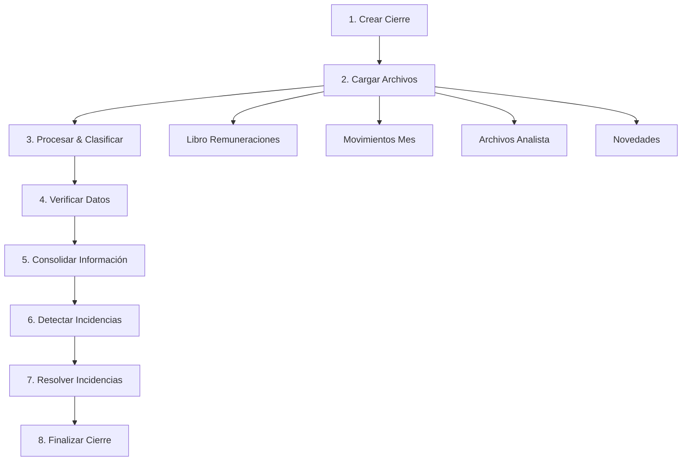

# 🔄 Guía de Modelos de Nómina por Flujo del Sistema

## Índice
1. [Flujo Principal del Sistema](#flujo-principal-del-sistema)
2. [Fase 1: Creación del Cierre](#fase-1-creación-del-cierre)
3. [Fase 2: Carga de Archivos](#fase-2-carga-de-archivos)
4. [Fase 3: Procesamiento y Clasificación](#fase-3-procesamiento-y-clasificación)
5. [Fase 4: Verificación de Datos](#fase-4-verificación-de-datos)
6. [Fase 5: Consolidación](#fase-5-consolidación)
7. [Fase 6: Detección de Incidencias](#fase-6-detección-de-incidencias)
8. [Fase 7: Resolución Colaborativa](#fase-7-resolución-colaborativa)
9. [Fase 8: Finalización](#fase-8-finalización)
10. [Modelos de Apoyo](#modelos-de-apoyo)

---

## Flujo Principal del Sistema



---

## Fase 1: Creación del Cierre

### 🏢 **CierreNomina** - El Corazón del Sistema

```python
class CierreNomina(models.Model):
    cliente = models.ForeignKey(Cliente, on_delete=models.CASCADE)
    periodo = models.CharField(max_length=7)  # "2025-06"
    
    # ESTADO PRINCIPAL - Controla todo el flujo
    estado = models.CharField(max_length=40, choices=[
        ('pendiente', 'Pendiente'),                          # 📍 Estado inicial
        ('cargando_archivos', 'Cargando Archivos'),          # 📤 Subiendo archivos
        ('archivos_completos', 'Archivos Completos'),        # ✅ Todos los archivos listos
        ('verificacion_datos', 'Verificación de Datos'),     # 🔍 Comparando información
        ('con_discrepancias', 'Con Discrepancias'),          # ⚠️ Encontró diferencias
        ('verificado_sin_discrepancias', 'Verificado Sin Discrepancias'), # ✅ Sin problemas
        ('datos_consolidados', 'Datos Consolidados'),        # 📊 Información unificada
        ('con_incidencias', 'Con Incidencias'),              # 🚨 Requiere atención
        ('incidencias_resueltas', 'Incidencias Resueltas'),  # ✅ Problemas solucionados
        ('validacion_final', 'Validación Final'),            # 🔎 Revisión final
        ('finalizado', 'Finalizado'),                        # 🎯 Proceso completo
    ])
    
    # ESTADOS ESPECÍFICOS - Para seguimiento detallado
    estado_incidencias = models.CharField(...)  # Sigue el proceso de incidencias
    estado_consolidacion = models.CharField(...) # Sigue el proceso de consolidación
    
    # USUARIOS INVOLUCRADOS
    usuario_analista = models.ForeignKey(User, ...)      # Quien procesa
    supervisor_asignado = models.ForeignKey(User, ...)   # Quien supervisa
```

**🎯 Propósito**: Controla y rastrea todo el proceso mensual de nómina para un cliente específico.

**🔄 Flujo de Estados**:
1. **pendiente** → Se crea el cierre mensual
2. **cargando_archivos** → Se están subiendo archivos
3. **archivos_completos** → Todos los archivos necesarios están procesados
4. **verificacion_datos** → Se comparan datos entre archivos
5. **con_discrepancias** / **verificado_sin_discrepancias** → Resultado de verificación
6. **datos_consolidados** → Información unificada en tablas finales
7. **con_incidencias** → Se detectaron anomalías que requieren resolución
8. **incidencias_resueltas** → Problemas resueltos por analista/supervisor
9. **finalizado** → Proceso completado

---

## Fase 2: Carga de Archivos

En esta fase se suben 4 tipos de archivos Excel que alimentan el sistema:

### 📖 **LibroRemuneracionesUpload** - Archivo Principal

```python
class LibroRemuneracionesUpload(models.Model):
    cierre = models.ForeignKey(CierreNomina, ...)
    archivo = models.FileField(...)
    
    # ESTADOS DEL PROCESAMIENTO
    estado = models.CharField(choices=[
        ('pendiente', 'Pendiente'),                    # 📥 Archivo subido, esperando
        ('analizando_hdrs', 'Analizando Headers'),     # 🔍 Leyendo columnas del Excel
        ('hdrs_analizados', 'Headers Analizados'),     # ✅ Columnas identificadas
        ('clasif_en_proceso', 'Clasificación en Proceso'), # 🏷️ Clasificando conceptos
        ('clasif_pendiente', 'Clasificación Pendiente'),   # ⏳ Esperando clasificación manual
        ('clasificado', 'Clasificado'),               # ✅ Conceptos clasificados
        ('procesado', 'Procesado'),                   # 🎯 Datos guardados en BD
    ])
    
    header_json = models.JSONField(default=list)  # Guarda las columnas detectadas
```

**🎯 Propósito**: Contiene la información principal de sueldos, descuentos y datos de empleados.

**📊 Datos que genera**: Alimenta `EmpleadoCierre` y `RegistroConceptoEmpleado`

### 🔄 **MovimientosMesUpload** - Cambios del Período

```python
class MovimientosMesUpload(models.Model):
    cierre = models.ForeignKey(CierreNomina, ...)
    archivo = models.FileField(...)
    estado = models.CharField(choices=[
        ('pendiente', 'Pendiente'),
        ('en_proceso', 'En Proceso'),
        ('procesado', 'Procesado'),
        ('con_error', 'Con Error'),
    ])
```

**🎯 Propósito**: Registra altas, bajas, ausencias, vacaciones y cambios salariales.

**📊 Datos que genera**: Alimenta todos los modelos `Movimiento*`

### 📄 **ArchivoAnalistaUpload** - Información Complementaria

```python
class ArchivoAnalistaUpload(models.Model):
    cierre = models.ForeignKey(CierreNomina, ...)
    tipo_archivo = models.CharField(choices=[
        ('ingresos', 'Ingresos'),       # Nuevos empleados
        ('finiquitos', 'Finiquitos'),   # Empleados que salen
        ('incidencias', 'Incidencias')  # Ausencias especiales
    ])
```

**🎯 Propósito**: Información adicional que maneja el analista para complementar los datos oficiales.

### 📝 **ArchivoNovedadesUpload** - Archivo Opcional

```python
class ArchivoNovedadesUpload(models.Model):
    cierre = models.ForeignKey(CierreNomina, ...)
    archivo = models.FileField(...)
    # Similar a LibroRemuneraciones pero es opcional
```

**🎯 Propósito**: Archivo adicional con información complementaria de remuneraciones.

---

## Fase 3: Procesamiento y Clasificación

### 👤 **EmpleadoCierre** - Los Trabajadores

```python
class EmpleadoCierre(models.Model):
    cierre = models.ForeignKey(CierreNomina, ...)
    rut = models.CharField(max_length=12)
    nombre = models.CharField(max_length=120)
    apellido_paterno = models.CharField(max_length=120)
    apellido_materno = models.CharField(max_length=120, blank=True)
    rut_empresa = models.CharField(max_length=20)
    dias_trabajados = models.IntegerField(null=True, blank=True)
```

**🎯 Propósito**: Un registro por cada empleado que aparece en el cierre mensual.

**🔄 Flujo**: Se crea automáticamente al procesar el Libro de Remuneraciones.

### 💰 **ConceptoRemuneracion** - Catálogo de Conceptos

```python
class ConceptoRemuneracion(models.Model):
    cliente = models.ForeignKey(Cliente, ...)
    nombre_concepto = models.CharField(max_length=120)  # "Sueldo Base", "Horas Extras", etc.
    
    # CLASIFICACIÓN - Muy importante para cálculos
    clasificacion = models.CharField(choices=[
        ('haberes_imponibles', 'Haberes Imponibles'),        # 💰 Suma al sueldo, paga impuestos
        ('haberes_no_imponibles', 'Haberes No Imponibles'),  # 💰 Suma al sueldo, sin impuestos
        ('horas_extras', 'Horas Extras'),                    # ⏰ Horas adicionales
        ('descuentos_legales', 'Descuentos Legales'),        # 📉 AFP, Isapre, impuestos
        ('otros_descuentos', 'Otros Descuentos'),            # 📉 Préstamos, multas
        ('aportes_patronales', 'Aportes Patronales'),        # 🏢 Lo que paga la empresa
        ('informacion_adicional', 'Información Adicional'),  # 📋 Solo informativo
        ('impuestos', 'Impuestos'),                          # 🏛️ Impuesto único, etc.
    ])
    
    vigente = models.BooleanField(default=True)
```

**🎯 Propósito**: Define cómo se comporta cada concepto (suma, resta, informa) en los cálculos finales.

**🔄 Flujo**: Se va creando y clasificando conforme aparecen conceptos nuevos en los archivos.

### 📊 **RegistroConceptoEmpleado** - Los Valores Individuales

```python
class RegistroConceptoEmpleado(models.Model):
    empleado = models.ForeignKey(EmpleadoCierre, ...)
    concepto = models.ForeignKey(ConceptoRemuneracion, ...)
    nombre_concepto_original = models.CharField(max_length=200)  # Como aparece en Excel
    monto = models.CharField(max_length=255)  # "150000", "25.5", "N/A"
    
    @property
    def monto_numerico(self):
        """Convierte el monto a número para cálculos"""
        try:
            return float(self.monto) if self.monto else 0
        except (ValueError, TypeError):
            return 0
```

**🎯 Propósito**: Cada celda del Excel se convierte en un registro. Es la base de todos los cálculos.

**🔄 Flujo**: Se crea masivamente al procesar el Libro de Remuneraciones.

---

## Fase 4: Modelos de Movimientos (Procesamiento Paralelo)

Mientras se procesa el Libro de Remuneraciones, también se procesan los movimientos:

### 🔼🔽 **MovimientoAltaBaja** - Ingresos y Salidas

```python
class MovimientoAltaBaja(models.Model):
    cierre = models.ForeignKey(CierreNomina, ...)
    empleado = models.ForeignKey(EmpleadoCierre, ...)  # Se conecta automáticamente
    
    # DATOS DEL EMPLEADO (duplicados para histórico)
    nombres_apellidos = models.CharField(max_length=200)
    rut = models.CharField(max_length=12)
    empresa_nombre = models.CharField(max_length=120)
    cargo = models.CharField(max_length=120)
    centro_de_costo = models.CharField(max_length=120)
    sucursal = models.CharField(max_length=120)
    
    # DATOS ESPECÍFICOS DEL MOVIMIENTO
    fecha_ingreso = models.DateField()
    fecha_retiro = models.DateField(null=True, blank=True)  # Solo si es BAJA
    alta_o_baja = models.CharField(max_length=20)  # "ALTA" o "BAJA"
    sueldo_base = models.DecimalField(max_digits=12, decimal_places=2)
    motivo = models.CharField(max_length=200, blank=True)
```

**🎯 Propósito**: Registra quién entra y quién sale de la empresa en el período.

### 🏥 **MovimientoAusentismo** - Ausencias

```python
class MovimientoAusentismo(models.Model):
    # ... campos básicos de empleado ...
    
    fecha_inicio_ausencia = models.DateField()
    fecha_fin_ausencia = models.DateField()
    dias = models.IntegerField()
    tipo = models.CharField(max_length=80)  # "Licencia médica", "Permiso", etc.
    motivo = models.CharField(max_length=200, blank=True)
```

**🎯 Propósito**: Registra períodos donde el empleado no trabajó.

### 🏖️ **MovimientoVacaciones** - Descansos

```python
class MovimientoVacaciones(models.Model):
    # ... campos básicos ...
    
    fecha_inicio = models.DateField()
    fecha_fin_vacaciones = models.DateField()
    fecha_retorno = models.DateField()
    cantidad_dias = models.IntegerField()
```

### 💵 **MovimientoVariacionSueldo** - Cambios Salariales

```python
class MovimientoVariacionSueldo(models.Model):
    # ... campos básicos ...
    
    sueldo_base_anterior = models.DecimalField(max_digits=12, decimal_places=2)
    sueldo_base_actual = models.DecimalField(max_digits=12, decimal_places=2)
    porcentaje_reajuste = models.DecimalField(max_digits=5, decimal_places=2)
    variacion_pesos = models.DecimalField(max_digits=12, decimal_places=2)
```

**🎯 Propósito**: Registra cuándo y cuánto cambió el sueldo de un empleado.

---

## Fase 5: Verificación de Datos

### 🔍 **DiscrepanciaCierre** - Diferencias Encontradas

```python
class DiscrepanciaCierre(models.Model):
    cierre = models.ForeignKey(CierreNomina, ...)
    
    # TIPOS DE DISCREPANCIAS
    tipo_discrepancia = models.CharField(choices=[
        # Libro vs Novedades
        ('empleado_solo_libro', 'Empleado solo en Libro'),
        ('empleado_solo_novedades', 'Empleado solo en Novedades'),
        ('diff_concepto_monto', 'Diferencia en Monto por Concepto'),
        
        # MovimientosMes vs Analista
        ('ingreso_no_reportado', 'Ingreso no reportado por Analista'),
        ('finiquito_no_reportado', 'Finiquito no reportado por Analista'),
        ('ausencia_no_reportada', 'Ausencia no reportada por Analista'),
    ])
    
    # EMPLEADO AFECTADO
    rut_empleado = models.CharField(max_length=20)
    
    # VALORES ENCONTRADOS (para comparación)
    valor_libro = models.CharField(max_length=500, ...)      # Lo que dice el libro
    valor_novedades = models.CharField(max_length=500, ...)  # Lo que dicen las novedades
    valor_movimientos = models.CharField(max_length=500, ...) # Lo que dicen movimientos
    valor_analista = models.CharField(max_length=500, ...)   # Lo que dice el analista
    
    descripcion = models.TextField()  # Explicación legible
```

**🎯 Propósito**: Sistema automático que compara información entre archivos y detecta inconsistencias.

**🔄 Flujo**: 
- Compara empleados entre Libro y Novedades
- Compara movimientos entre MovimientosMes y archivos del Analista
- Genera reportes automáticos de diferencias

---

## Fase 6: Consolidación

### 📋 **NominaConsolidada** - La Nómina Final

```python
class NominaConsolidada(models.Model):
    cierre = models.ForeignKey(CierreNomina, ...)
    
    # INFORMACIÓN DEL EMPLEADO
    rut_empleado = models.CharField(max_length=20)
    nombre_empleado = models.CharField(max_length=200)
    cargo = models.CharField(max_length=200, ...)
    
    # ESTADO EN EL PERÍODO
    estado_empleado = models.CharField(choices=[
        ('activo', 'Empleado Activo'),                    # 🟢 Trabajó normal
        ('nueva_incorporacion', 'Nueva Incorporación'),   # 🆕 Entró este mes
        ('finiquito', 'Finiquito'),                      # 🔴 Salió este mes
        ('ausente_total', 'Ausente Periodo Completo'),   # 🟡 No trabajó nada
        ('ausente_parcial', 'Ausente Parcial'),          # 🟠 Trabajó algunos días
    ])
    
    # TOTALES FINALES (lo que importa al cliente)
    total_haberes = models.DecimalField(max_digits=15, decimal_places=2, default=0)
    total_descuentos = models.DecimalField(max_digits=15, decimal_places=2, default=0)
    liquido_pagar = models.DecimalField(max_digits=15, decimal_places=2, default=0)  # 🎯 Lo más importante
    
    # INFORMACIÓN LABORAL
    dias_trabajados = models.IntegerField(...)
    dias_ausencia = models.IntegerField(default=0)
    
    # METADATOS
    fuente_datos = models.JSONField(default=dict)  # De dónde salió cada dato
```

**🎯 Propósito**: **UN REGISTRO POR EMPLEADO** con toda su información final consolidada. Es la tabla más importante para reportes.

### 📊 **HeaderValorEmpleado** - Detalle Granular

```python
class HeaderValorEmpleado(models.Model):
    nomina_consolidada = models.ForeignKey(NominaConsolidada, ...)
    
    # EL HEADER DEL EXCEL
    nombre_header = models.CharField(max_length=200)  # "Sueldo Base", "AFP", etc.
    
    # CLASIFICACIÓN
    concepto_remuneracion = models.ForeignKey(ConceptoRemuneracion, ...)
    
    # VALOR ORIGINAL Y PROCESADO
    valor_original = models.CharField(max_length=500)     # "$ 850.000"
    valor_numerico = models.DecimalField(...)             # 850000.00
    es_numerico = models.BooleanField(default=False)      # True/False
    
    # METADATOS DEL EXCEL
    columna_excel = models.CharField(max_length=10, ...)  # "D", "AE"
    fila_excel = models.IntegerField(...)                 # 15, 23
```

**🎯 Propósito**: **Mapeo 1:1 de cada celda del Excel**. Si en el Excel había 50 columnas para un empleado, aquí hay 50 registros.

### 💰 **ConceptoConsolidado** - Resumen por Concepto

```python
class ConceptoConsolidado(models.Model):
    nomina_consolidada = models.ForeignKey(NominaConsolidada, ...)
    
    # INFORMACIÓN DEL CONCEPTO
    nombre_concepto = models.CharField(max_length=200)
    tipo_concepto = models.CharField(choices=[
        ('haber_imponible', 'Haber Imponible'),
        ('haber_no_imponible', 'Haber No Imponible'),
        ('descuento_legal', 'Descuento Legal'),
        ('otro_descuento', 'Otro Descuento'),
        ('aporte_patronal', 'Aporte Patronal'),
        ('informativo', 'Solo Informativo'),
    ])
    
    # VALORES CONSOLIDADOS
    monto_total = models.DecimalField(max_digits=15, decimal_places=2, default=0)
    cantidad = models.DecimalField(...)  # Si son horas, días, etc.
    
    # ORIGEN DEL DATO
    fuente_archivo = models.CharField(...)  # "libro", "novedades", "movimientos"
```

**🎯 Propósito**: Agrupa conceptos similares por empleado. Si un empleado tiene "Horas Extras" en varias partes, aquí se suma todo.

---

## Fase 7: Detección de Incidencias

### ⚠️ **IncidenciaCierre** - Anomalías Detectadas

```python
class IncidenciaCierre(models.Model):
    cierre = models.ForeignKey(CierreNomina, ...)
    
    # TIPO DE INCIDENCIA
    tipo_incidencia = models.CharField(choices=[
        ('variacion_concepto', 'Variación de Concepto (>30%)'),      # 📈📉 Cambio grande
        ('concepto_nuevo', 'Concepto Nuevo'),                        # 🆕 Apareció algo nuevo
        ('concepto_perdido', 'Concepto Perdido'),                   # 🔴 Desapareció algo
        ('empleado_deberia_ingresar', 'Empleado que Debería Ingresar'), # 👤➕ Falta alguien
        ('empleado_no_deberia_estar', 'Empleado que No Debería Estar'), # 👤➖ Sobra alguien
        ('ausentismo_continuo', 'Ausentismo Continuo'),             # 🏥 Sigue ausente
    ])
    
    # EMPLEADO AFECTADO
    rut_empleado = models.CharField(max_length=20)
    
    # COMPARACIÓN DE VALORES
    valor_libro = models.CharField(...)      # Valor actual
    valor_novedades = models.CharField(...)  # Valor anterior o comparativo
    
    # INFORMACIÓN ADICIONAL
    descripcion = models.TextField()          # Explicación legible
    concepto_afectado = models.CharField(...) # Qué concepto cambió
    
    # GESTIÓN DE LA INCIDENCIA
    estado = models.CharField(choices=[
        ('pendiente', 'Pendiente de Resolución'),           # 🟡 Recién detectada
        ('resuelta_analista', 'Resuelta por Analista'),     # 🔵 Analista la justificó
        ('aprobada_supervisor', 'Aprobada por Supervisor'), # 🟢 Supervisor aprobó
        ('rechazada_supervisor', 'Rechazada por Supervisor'), # 🔴 Supervisor rechazó
    ])
    
    prioridad = models.CharField(choices=[
        ('baja', 'Baja'), ('media', 'Media'), ('alta', 'Alta'), ('critica', 'Crítica')
    ])
    
    # IMPACTO MONETARIO (se calcula automáticamente)
    impacto_monetario = models.DecimalField(...)
    
    # ASIGNACIÓN
    asignado_a = models.ForeignKey(User, ...)  # A quién le toca resolverla
```

**🎯 Propósito**: Detecta automáticamente situaciones que requieren atención humana al comparar el período actual con el anterior.

**🔄 Flujo de Detección**:
1. Compara nómina consolidada actual vs anterior
2. Encuentra variaciones >30% en conceptos
3. Detecta empleados que aparecen/desaparecen inesperadamente
4. Identifica ausencias que deberían continuar
5. Calcula impacto monetario automáticamente

---

## Fase 8: Resolución Colaborativa

### 💬 **ResolucionIncidencia** - Conversación Analista-Supervisor

```python
class ResolucionIncidencia(models.Model):
    incidencia = models.ForeignKey(IncidenciaCierre, ...)
    usuario = models.ForeignKey(User, ...)
    
    # EL FLUJO DE CONVERSACIÓN
    tipo_resolucion = models.CharField(choices=[
        ('justificacion', 'Justificación del Analista'),  # 🔵 Analista explica por qué está bien
        ('consulta', 'Consulta del Supervisor'),          # ❓ Supervisor pregunta algo
        ('rechazo', 'Rechazo del Supervisor'),            # ❌ Supervisor no acepta
        ('aprobacion', 'Aprobación del Supervisor'),      # ✅ Supervisor acepta
    ])
    
    # CONTENIDO
    comentario = models.TextField()                        # El mensaje
    adjunto = models.FileField(...)                       # Archivo opcional
    fecha_resolucion = models.DateTimeField(auto_now_add=True)
```

**🎯 Propósito**: Sistema de chat/conversación entre analista y supervisor para resolver cada incidencia.

**🔄 Flujo de Conversación**:
1. **Analista** crea `justificacion`: "Este aumento es por ascenso"
2. **Supervisor** puede crear `consulta`: "¿Tienes el documento del ascenso?"
3. **Analista** responde con nueva `justificacion`: "Adjunto la resolución"
4. **Supervisor** crea `aprobacion`: "Perfecto, aprobado" → **INCIDENCIA CERRADA**

O alternativo:
3. **Supervisor** crea `rechazo`: "Falta documentación"
4. **Analista** debe crear nueva `justificacion` con más información

---

## Modelos de Apoyo

### 📝 **Modelos de Logging**

```python
# UploadLogNomina - Rastrea cada archivo subido
class UploadLogNomina(models.Model):
    tipo_upload = models.CharField(...)     # libro, movimientos, novedades, analista
    cliente = models.ForeignKey(Cliente, ...)
    usuario = models.ForeignKey(User, ...)
    nombre_archivo_original = models.CharField(...)
    estado = models.CharField(...)          # subido, procesando, completado, error
    errores = models.TextField(...)
    tiempo_procesamiento = models.DurationField(...)

# TarjetaActivityLogNomina - Rastrea cada acción del usuario
class TarjetaActivityLogNomina(models.Model):
    cierre = models.ForeignKey(CierreNomina, ...)
    tarjeta = models.CharField(...)         # libro_remuneraciones, movimientos_mes, etc.
    accion = models.CharField(...)          # upload_excel, classification_complete, etc.
    usuario = models.ForeignKey(User, ...)
    descripcion = models.TextField()       # "Usuario subió archivo Excel"
    resultado = models.CharField(...)       # exito, error, warning
```

### 📋 **Modelos del Analista**

```python
# AnalistaFiniquito, AnalistaIncidencia, AnalistaIngreso
# Guardan la información que sube el analista en archivos complementarios
class AnalistaFiniquito(models.Model):
    cierre = models.ForeignKey(CierreNomina, ...)
    rut = models.CharField(max_length=12)
    nombre = models.CharField(max_length=200)
    fecha_retiro = models.DateField()
    motivo = models.CharField(max_length=200)
```

---

## 🎯 Resumen del Flujo Completo

### **Flujo Típico de un Mes:**

1. **Se crea el CierreNomina** (estado: `pendiente`)

2. **Se suben archivos Excel:**
   - Libro de Remuneraciones → crea `EmpleadoCierre` + `RegistroConceptoEmpleado`
   - Movimientos del Mes → crea `MovimientoAltaBaja`, `MovimientoAusentismo`, etc.
   - Archivos del Analista → crea `AnalistaFiniquito`, `AnalistaIncidencia`, etc.
   - Novedades (opcional) → crea registros en tablas específicas

3. **Se procesan y clasifican conceptos:**
   - Sistema lee headers del Excel
   - Clasifica conceptos en `ConceptoRemuneracion`
   - Asocia valores en `RegistroConceptoEmpleado`

4. **Se verifican datos:**
   - Sistema compara información entre archivos
   - Crea `DiscrepanciaCierre` por cada diferencia encontrada

5. **Se consolida información:**
   - Sistema crea `NominaConsolidada` (1 por empleado)
   - Crea `HeaderValorEmpleado` (1 por celda del Excel)
   - Crea `ConceptoConsolidado` (agrupa conceptos similares)

6. **Se detectan incidencias:**
   - Sistema compara período actual vs anterior
   - Crea `IncidenciaCierre` por cada anomalía
   - Calcula impacto monetario automáticamente

7. **Se resuelven incidencias:**
   - Analista crea `ResolucionIncidencia` (justificaciones)
   - Supervisor responde con aprobaciones/rechazos
   - Se mantiene historial completo de conversación

8. **Se finaliza el cierre:**
   - Todas las incidencias están resueltas
   - Estado cambia a `finalizado`
   - Información queda lista para reportes

### **Consultas Típicas del Sistema:**

```python
# ¿Cuántos empleados tiene este cierre?
empleados = EmpleadoCierre.objects.filter(cierre_id=123).count()

# ¿Cuál es el líquido total a pagar?
total = NominaConsolidada.objects.filter(cierre_id=123).aggregate(
    total=models.Sum('liquido_pagar')
)['total']

# ¿Qué incidencias están pendientes?
incidencias = IncidenciaCierre.objects.filter(
    cierre_id=123, 
    estado='pendiente'
)

# ¿Qué conceptos tiene un empleado específico?
conceptos = HeaderValorEmpleado.objects.filter(
    nomina_consolidada__cierre_id=123,
    nomina_consolidada__rut_empleado='12345678-9'
)
```

Esta estructura te permite rastrear completamente el proceso desde que se sube un archivo Excel hasta que se genera el reporte final, manteniendo trazabilidad completa y permitiendo colaboración entre analistas y supervisores para resolver cualquier anomalía detectada.
