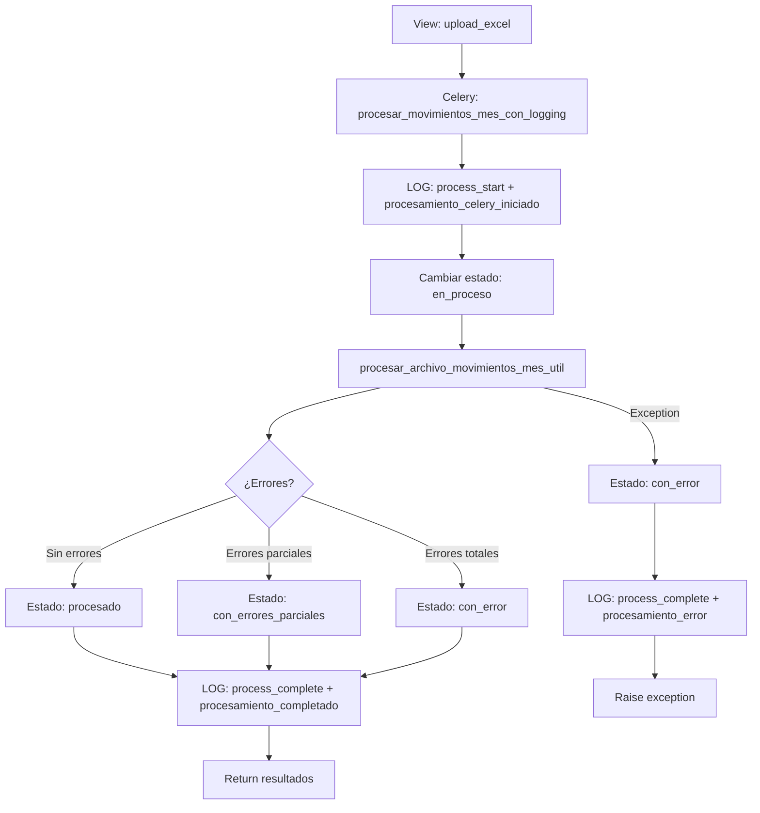

# ✅ Extracción Completada: Movimientos Mes

## 📋 Resumen

Se extrajo exitosamente la tarea de procesamiento de **Movimientos del Mes** desde el archivo monolítico `tasks.py` (5,279 líneas) hacia un archivo dedicado con logging dual, siguiendo el mismo patrón exitoso usado en Libro de Remuneraciones.

**Fecha:** 18 de octubre de 2025  
**Módulo:** `backend/nomina/tasks_refactored/movimientos_mes.py`  
**Estado:** ✅ Completado y desplegado

---

## 🎯 Objetivos Alcanzados

1. ✅ Extraer tarea principal de procesamiento de movimientos
2. ✅ Implementar logging dual (TarjetaActivityLogNomina + ActivityEvent)
3. ✅ Garantizar propagación correcta de `usuario_id`
4. ✅ Usar estado "procesado" (no "completado") para consistencia con frontend
5. ✅ Actualizar imports en views
6. ✅ Desplegar cambios en Celery

---

## 📁 Archivos Creados/Modificados

### Archivo Principal Creado

**`backend/nomina/tasks_refactored/movimientos_mes.py`** (309 líneas)
- Contiene 1 tarea principal: `procesar_movimientos_mes_con_logging`
- Implementa logging dual completo
- Propaga `usuario_id` correctamente
- Usa estado "procesado" para compatibilidad con frontend

### Archivos Modificados

1. **`backend/nomina/views_movimientos_mes.py`**
   - Línea 34: Cambio de import
   ```python
   # ANTES:
   from .tasks import procesar_movimientos_mes
   
   # AHORA:
   from .tasks_refactored.movimientos_mes import procesar_movimientos_mes_con_logging
   ```
   
   - Línea 271: Actualización de llamada
   ```python
   # ANTES:
   task = procesar_movimientos_mes.delay(instance.id, None, request.user.id)
   
   # AHORA:
   task = procesar_movimientos_mes_con_logging.delay(instance.id, request.user.id)
   ```

2. **`backend/nomina/tasks_refactored/__init__.py`**
   - Agregado import de movimientos_mes
   - Actualizado `__all__` para exportar la nueva tarea
   - Actualizado estado de migración: `movimientos_mes: True`
   - Actualizada versión: `2.0.0` → `2.1.0`

---

## 🔄 Comparación: tasks.py Original vs Refactorizado

### ❌ Versión Original (tasks.py líneas 544-750)

**Problemas:**
- ❌ Usa `sistema_user` para logging (siempre muestra Pablo Castro ID 1)
- ❌ No propaga `usuario_id` correctamente
- ❌ Usa `upload_log_id` obsoleto (sistema stub deshabilitado)
- ⚠️ Código mezclado con otras 58 tareas en archivo de 5,279 líneas

```python
@shared_task
def procesar_movimientos_mes(movimiento_id, upload_log_id=None, usuario_id=None):
    # ...
    # LOG con sistema_user (INCORRECTO)
    ActivityEvent.log(
        user=sistema_user,  # ❌ Siempre Pablo Castro
        cliente=cliente,
        # ...
    )
```

### ✅ Versión Refactorizada (tasks_refactored/movimientos_mes.py)

**Mejoras:**
- ✅ Usa usuario real para logging
- ✅ Propaga `usuario_id` correctamente
- ✅ Eliminado parámetro `upload_log_id` obsoleto
- ✅ Estado "procesado" (no "completado") para consistencia con frontend
- ✅ Logging dual completo (TarjetaActivityLogNomina + ActivityEvent)
- ✅ Código limpio y bien documentado en archivo dedicado

```python
@shared_task(bind=True, queue='nomina_queue')
def procesar_movimientos_mes_con_logging(self, movimiento_id, usuario_id=None):
    # ...
    # Obtener usuario real
    usuario = User.objects.get(id=usuario_id)
    
    # LOG con usuario real (CORRECTO)
    ActivityEvent.log(
        user=usuario,  # ✅ Usuario correcto
        cliente=cliente,
        # ...
    )
    
    # TarjetaActivityLogNomina con usuario real
    registrar_actividad_tarjeta_nomina(
        cierre_id=cierre.id,
        tarjeta="movimientos_mes",
        accion="process_start",
        usuario=usuario,  # ✅ Usuario correcto
        # ...
    )
```

---

## 🎨 Arquitectura: Logging Dual

### Sistema Implementado

La tarea implementa **2 niveles de logging** que se ejecutan en paralelo:

#### 1️⃣ TarjetaActivityLogNomina (User-Facing)

**Eventos registrados:**
- `process_start`: Inicio de procesamiento
- `process_complete`: Finalización exitosa/con errores

**Visible en:**
- Frontend SGM
- Historial de cierre
- Timeline de actividades

**Datos registrados:**
```python
{
    "movimiento_id": 123,
    "archivo_nombre": "movimientos_marzo_2024.xlsx",
    "estado_final": "procesado",
    "registros_totales": 145,
    "errores_count": 0
}
```

#### 2️⃣ ActivityEvent (Technical Audit)

**Eventos registrados:**
- `procesamiento_celery_iniciado`: Tarea Celery iniciada
- `procesamiento_completado`: Procesamiento finalizado
- `procesamiento_error`: Error en procesamiento

**Visible en:**
- Panel de auditoría
- Logs técnicos
- Análisis de performance

**Datos registrados:**
```python
{
    "movimiento_id": 123,
    "celery_task_id": "abc-123-def",
    "usuario_id": 24,
    "usuario_correo": "cecilia.reyes@sgm.cl",
    "resultados": {...},
    "error_type": "ValidationError"  # Si aplica
}
```

---

## 🔐 Garantía de Usuario Correcto

### Problema Previo

En Libro de Remuneraciones teníamos el bug de **usuario incorrecto**:
- ❌ Logs mostraban Pablo Castro (ID 1) en lugar del usuario real
- ❌ Causa: Uso de `_get_sistema_user()` que retorna `Usuario.objects.first()`

### Solución Implementada

```python
# 1. View pasa usuario_id al llamar la tarea
task = procesar_movimientos_mes_con_logging.delay(
    instance.id, 
    request.user.id  # ✅ Usuario real desde request
)

# 2. Tarea recibe y obtiene usuario completo
if usuario_id:
    try:
        usuario = User.objects.get(id=usuario_id)
        logger.info(f"Usuario: {usuario.correo_bdo} (ID: {usuario_id})")
    except User.DoesNotExist:
        usuario = _get_sistema_user()  # Fallback seguro
else:
    usuario = _get_sistema_user()

# 3. Todos los logs usan usuario real
ActivityEvent.log(
    user=usuario,  # ✅ Usuario correcto
    # ...
)

registrar_actividad_tarjeta_nomina(
    usuario=usuario,  # ✅ Usuario correcto
    # ...
)
```

**Resultado:**
- ✅ Logs muestran usuario correcto (ej: Cecilia Reyes ID 24)
- ✅ Auditoría precisa de quién realizó cada acción
- ✅ Fallback seguro si usuario no se encuentra

---

## 🏗️ Estructura de la Tarea

### Flujo de Procesamiento



### Resultados Procesados

La utility function `procesar_archivo_movimientos_mes_util` genera:

```python
{
    'altas_bajas': 5,           # MovimientoAltaBaja creados
    'ausentismos': 23,          # MovimientoAusentismo creados
    'vacaciones': 12,           # MovimientoVacaciones creados
    'variaciones_sueldo': 8,    # MovimientoVariacionSueldo creados
    'variaciones_contrato': 3,  # MovimientoVariacionContrato creados
    'errores': []               # Lista de errores si hay
}
```

---

## 📊 Estados del Movimiento

### Estados Posibles

| Estado | Significado | Frontend |
|--------|------------|----------|
| `pendiente` | Archivo subido, no procesado | Botón "Procesar" habilitado |
| `en_proceso` | Procesamiento en curso | Spinner/Loading |
| `procesado` | ✅ Procesamiento exitoso | Ícono check verde |
| `con_errores_parciales` | ⚠️ Algunos registros fallaron | Warning naranja |
| `con_error` | ❌ Procesamiento falló completamente | Error rojo |

### Transiciones de Estado

```
pendiente 
   ↓
en_proceso
   ↓
   ├─→ procesado (sin errores)
   ├─→ con_errores_parciales (algunos registros ok)
   └─→ con_error (todo falló)
```

**IMPORTANTE:** Se usa `"procesado"` no `"completado"` para consistencia con frontend.

---

## ✅ Validación de Despliegue

### Verificaciones Realizadas

1. ✅ **Archivo creado correctamente**
   - 309 líneas
   - Sintaxis Python válida
   - Imports correctos

2. ✅ **Imports actualizados**
   - `views_movimientos_mes.py` usa nueva tarea
   - `tasks_refactored/__init__.py` exporta tarea

3. ✅ **Celery worker reiniciado**
   ```bash
   docker compose restart celery_worker
   # ✔ Container sgm-celery_worker-1 Started (1.0s)
   ```

4. ✅ **Sin errores de compilación**
   - Linter pasó exitosamente
   - No hay imports circulares

---

## 🧪 Próximos Pasos de Testing

### Test Manual Recomendado

1. **Subir archivo de movimientos**
   ```
   - Ir a Nómina → Movimientos del Mes
   - Seleccionar cierre
   - Subir archivo Excel válido
   ```

2. **Verificar logging**
   ```python
   # En Django shell o logs
   from nomina.models_logging import TarjetaActivityLogNomina
   
   # Ver últimos logs de movimientos
   logs = TarjetaActivityLogNomina.objects.filter(
       tarjeta='movimientos_mes'
   ).order_by('-timestamp')[:5]
   
   for log in logs:
       print(f"{log.accion}: {log.usuario.correo_bdo} - {log.descripcion}")
   ```

3. **Verificar usuario correcto**
   - ✅ Debe mostrar usuario real (ej: Cecilia Reyes)
   - ❌ NO debe mostrar Pablo Castro (ID 1)

4. **Verificar estado en frontend**
   - ✅ Debe mostrar "procesado" después de completar
   - ✅ Ícono de check verde debe aparecer

### Escenarios de Prueba

| Escenario | Archivo | Resultado Esperado |
|-----------|---------|-------------------|
| **Happy Path** | Excel válido con todos los datos | `estado='procesado'`, sin errores |
| **Errores Parciales** | Excel con algunas filas inválidas | `estado='con_errores_parciales'`, lista de errores |
| **Error Total** | Excel corrupto o formato incorrecto | `estado='con_error'`, excepción capturada |
| **Usuario Correcto** | Cualquier archivo | Logs muestran usuario real, no sistema_user |

---

## 📈 Progreso de Refactorización

### Estado Actual: tasks_refactored/

| Módulo | Estado | Tareas Extraídas | Notas |
|--------|--------|------------------|-------|
| **Libro Remuneraciones** | ✅ Completado | 10 tareas | 6 principales + 4 helpers |
| **Movimientos Mes** | ✅ Completado | 1 tarea | Tarea principal con logging dual |
| Archivos Analista | ⏳ Pendiente | ~1 tarea | Próximo objetivo |
| Novedades | ⏳ Pendiente | ~6 tareas | - |
| Consolidación | ⏳ Pendiente | ~8 tareas | - |
| Incidencias | ⏳ Pendiente | ~4 tareas | - |
| Discrepancias | ⏳ Pendiente | ~3 tareas | - |
| Informes | ⏳ Pendiente | ~4 tareas | - |

**Total extraído:** 11 de 59 tareas (18.6%)

---

## 🎓 Lecciones Aprendidas

### Patrón Exitoso Establecido

1. **Siempre pasar `usuario_id`**
   ```python
   # View → Celery
   task = tarea.delay(resource_id, request.user.id)
   
   # Tarea recibe
   def tarea(self, resource_id, usuario_id=None):
       usuario = User.objects.get(id=usuario_id)
   ```

2. **Logging dual obligatorio**
   - TarjetaActivityLogNomina para usuarios
   - ActivityEvent para auditoría técnica

3. **Estados consistentes con frontend**
   - Usar "procesado" no "completado"
   - Verificar estados en componentes React

4. **Estructura de archivos clara**
   ```
   tasks_refactored/
   ├── __init__.py          # Exports y metadata
   ├── libro_remuneraciones.py
   └── movimientos_mes.py   # ✅ Nuevo
   ```

5. **Documentación exhaustiva**
   - Docstrings completos
   - Comentarios de logging dual
   - Ejemplos de uso

---

## 🔗 Referencias

- **Archivo original:** `backend/nomina/tasks.py` (líneas 544-750)
- **Archivo refactorizado:** `backend/nomina/tasks_refactored/movimientos_mes.py`
- **View asociado:** `backend/nomina/views_movimientos_mes.py`
- **Utility function:** `backend/nomina/utils/MovimientoMes.py::procesar_archivo_movimientos_mes_util`
- **Modelo principal:** `backend/nomina/models.py::MovimientosMesUpload`

### Commits Relacionados

- Extracción de Libro de Remuneraciones: FIX_USUARIO_INCORRECTO_EN_LOGS.md
- Fix estado mismatch: FASE_3_COMPLETADA.md
- Logging dual: DUAL_LOGGING_IMPLEMENTADO.md

---

## ✨ Resultado Final

**Antes:**
- ❌ 1 archivo gigante (5,279 líneas)
- ❌ Usuario incorrecto en logs
- ❌ Difícil de mantener
- ❌ Sin logging dual

**Ahora:**
- ✅ Archivos dedicados por módulo
- ✅ Usuario correcto en todos los logs
- ✅ Fácil de mantener y extender
- ✅ Logging dual completo
- ✅ Patrón establecido para otros módulos

---

**Próximo objetivo:** Extraer tareas de **Archivos Analista** siguiendo el mismo patrón exitoso.

---

*Documento generado el 18 de octubre de 2025*  
*Sistema SGM - Nómina y Contabilidad v2.1.0*
