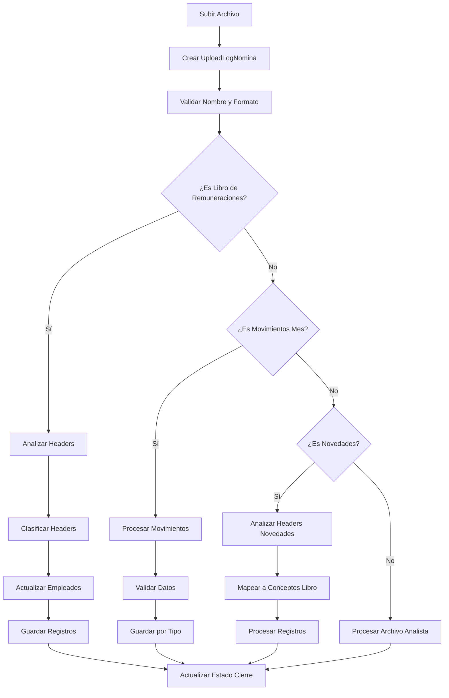
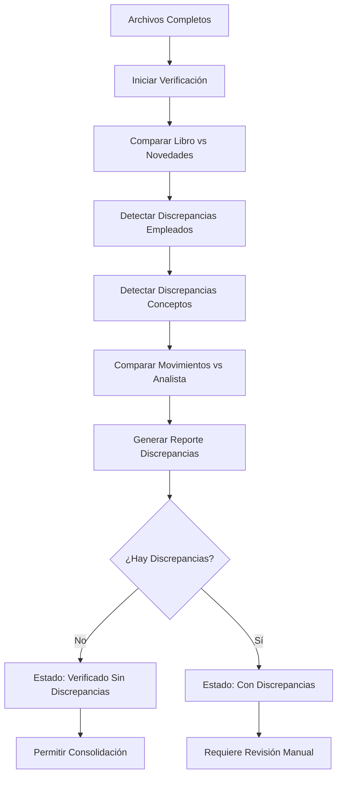
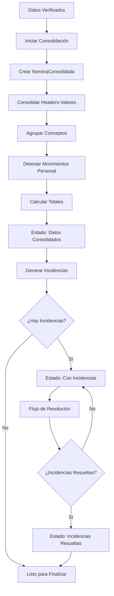
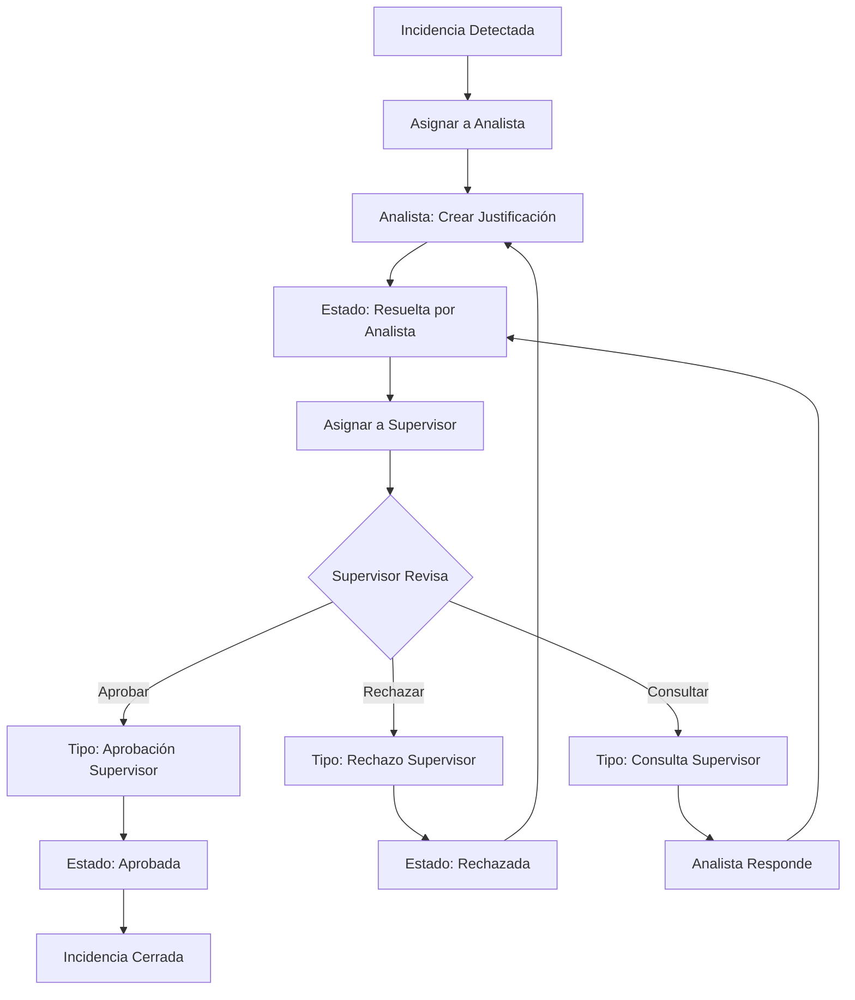
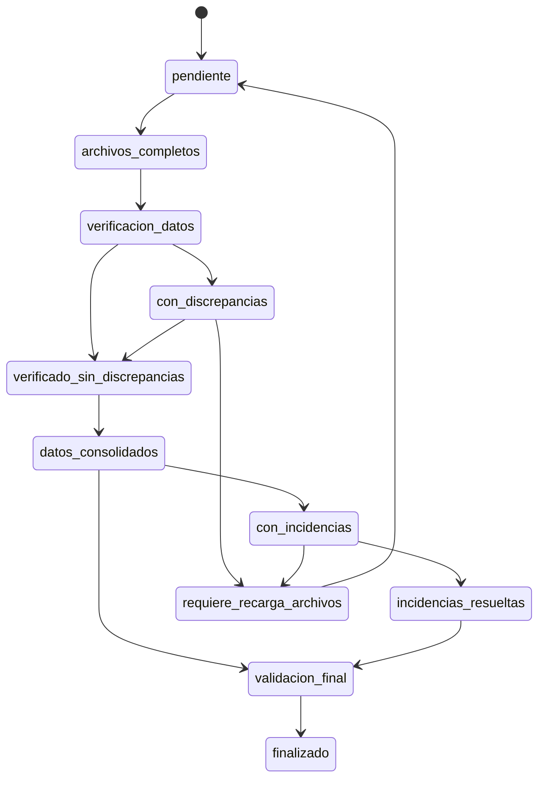
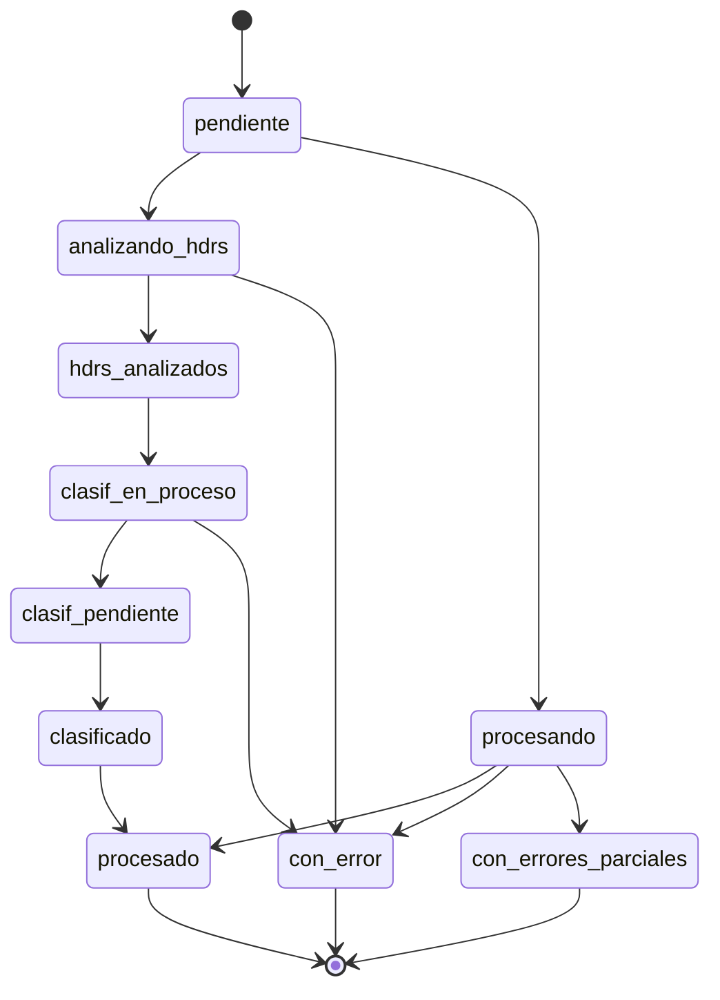
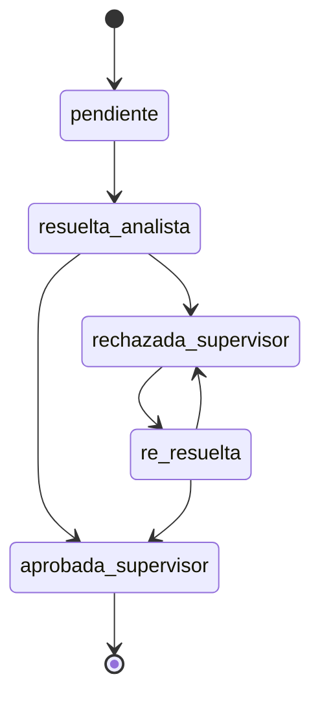
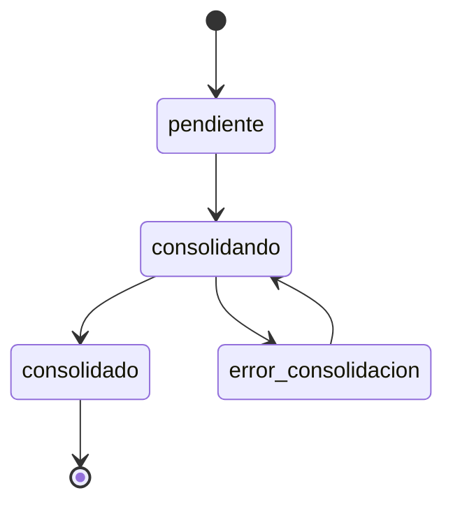

# 📋 Entidades del Sistema de Nómina - Informe Detallado

## Índice
1. [Introducción al Sistema](#introducción-al-sistema)
2. [Entidades Principales](#entidades-principales)
3. [Módulo de Archivos de Entrada](#módulo-de-archivos-de-entrada)
4. [Módulo de Movimientos de Personal](#módulo-de-movimientos-de-personal)
5. [Módulo de Incidencias Colaborativas](#módulo-de-incidencias-colaborativas)
6. [Módulo de Verificación de Datos](#módulo-de-verificación-de-datos)
7. [Módulo de Análisis de Datos](#módulo-de-análisis-de-datos)
8. [Módulo de Consolidación](#módulo-de-consolidación)
9. [Módulo de Logging y Auditoría](#módulo-de-logging-y-auditoría)
10. [Flujos de Trabajo Principales](#flujos-de-trabajo-principales)
11. [Diagrama de Relaciones](#diagrama-de-relaciones)
12. [Estados y Transiciones](#estados-y-transiciones)

---

## Introducción al Sistema

El Sistema de Nómina está diseñado para procesar, validar y consolidar información mensual de remuneraciones de múltiples clientes. Su arquitectura modular permite gestionar el ciclo completo desde la carga de archivos hasta la generación de reportes consolidados.

### Características Principales:
- **Procesamiento Multi-archivo**: Libro de Remuneraciones, Movimientos del Mes, Novedades y Archivos del Analista
- **Sistema de Incidencias Colaborativo**: Permite resolución entre analistas y supervisores
- **Verificación de Datos**: Detección automática de discrepancias
- **Consolidación Inteligente**: Unificació  de datos de múltiples fuentes
- **Auditoría Completa**: Logging detallado de todas las actividades

---

## Entidades Principales

### 🏢 CierreNomina
**Propósito**: Entidad central que representa el proceso mensual de cierre de nómina para un cliente específico.

```python
class CierreNomina(models.Model):
    cliente = models.ForeignKey(Cliente, on_delete=models.CASCADE)
    periodo = models.CharField(max_length=7)  # "2025-06"
    fecha_creacion = models.DateTimeField(auto_now_add=True)
    estado = models.CharField(max_length=40, choices=[...])
    usuario_analista = models.ForeignKey(User, ...)
    
    # Estados específicos
    estado_incidencias = models.CharField(...)
    estado_consolidacion = models.CharField(...)
    
    # Campos de seguimiento
    total_incidencias = models.PositiveIntegerField(default=0)
    fecha_ultima_revision = models.DateTimeField(...)
    supervisor_asignado = models.ForeignKey(User, ...)
```

**Estados del Cierre:**
- `pendiente` → `archivos_completos`
- `verificacion_datos` → `con_discrepancias` / `verificado_sin_discrepancias`
- `datos_consolidados` → `con_incidencias` → `incidencias_resueltas`
- `validacion_final` → `finalizado`

**Relaciones:**
- 1:N con todas las entidades de archivos y datos
- 1:1 con análisis de datos
- 1:N con incidencias y discrepancias

---

### 👤 EmpleadoCierre
**Propósito**: Representa un empleado específico en el contexto de un cierre mensual.

```python
class EmpleadoCierre(models.Model):
    cierre = models.ForeignKey(CierreNomina, ...)
    rut = models.CharField(max_length=12)
    nombre = models.CharField(max_length=120)
    apellido_paterno = models.CharField(max_length=120)
    apellido_materno = models.CharField(max_length=120, blank=True)
    rut_empresa = models.CharField(max_length=20)
    dias_trabajados = models.IntegerField(null=True, blank=True)
```

**Características:**
- Única combinación cierre-RUT por restricción de base de datos
- Base para todos los registros de conceptos y movimientos
- Integración con sistema de nómina consolidada

---

### 💰 ConceptoRemuneracion
**Propósito**: Catálogo maestro de conceptos de remuneración clasificados por cliente.

```python
class ConceptoRemuneracion(models.Model):
    cliente = models.ForeignKey(Cliente, ...)
    nombre_concepto = models.CharField(max_length=120)
    clasificacion = models.CharField(max_length=30, choices=CLASIFICACION_CHOICES)
    hashtags = models.JSONField(default=list, blank=True)
    usuario_clasifica = models.ForeignKey(User, ...)
    vigente = models.BooleanField(default=True)
```

**Clasificaciones Disponibles:**
- `haberes_imponibles`: Haberes Imponibles
- `haberes_no_imponibles`: Haberes No Imponibles  
- `horas_extras`: Horas Extras
- `descuentos_legales`: Descuentos Legales
- `otros_descuentos`: Otros Descuentos
- `aportes_patronales`: Aportes Patronales
- `informacion_adicional`: Información Adicional (No Monto)
- `impuestos`: Impuestos

---

### 📊 RegistroConceptoEmpleado
**Propósito**: Registro individual del valor de un concepto para un empleado específico.

```python
class RegistroConceptoEmpleado(models.Model):
    empleado = models.ForeignKey(EmpleadoCierre, ...)
    concepto = models.ForeignKey(ConceptoRemuneracion, ...)
    nombre_concepto_original = models.CharField(max_length=200)
    monto = models.CharField(max_length=255, blank=True, null=True)
    fecha_registro = models.DateTimeField(auto_now_add=True)
```

**Propiedades Calculadas:**
- `monto_numerico`: Conversión segura a float
- `es_numerico`: Validación de tipo numérico

---

## Módulo de Archivos de Entrada

### 📖 LibroRemuneracionesUpload
**Propósito**: Gestiona la carga y procesamiento del archivo Excel principal de remuneraciones.

```python
class LibroRemuneracionesUpload(models.Model):
    cierre = models.ForeignKey(CierreNomina, ...)
    archivo = models.FileField(upload_to=libro_remuneraciones_upload_to)
    fecha_subida = models.DateTimeField(auto_now_add=True)
    estado = models.CharField(max_length=60, choices=[...])
    header_json = models.JSONField(default=list)
    upload_log = models.ForeignKey('UploadLogNomina', ...)
```

**Estados de Procesamiento:**
- `pendiente` → `analizando_hdrs` → `hdrs_analizados`
- `clasif_en_proceso` → `clasif_pendiente` → `clasificado`
- `con_error` (estado terminal de error)

---

### 🔄 MovimientosMesUpload
**Propósito**: Gestiona el archivo de movimientos del mes (altas, bajas, ausentismos, etc.).

```python
class MovimientosMesUpload(models.Model):
    cierre = models.ForeignKey(CierreNomina, ...)
    archivo = models.FileField(upload_to=movimientos_mes_upload_to)
    fecha_subida = models.DateTimeField(auto_now_add=True)
    estado = models.CharField(max_length=30, choices=[...])
    resultados_procesamiento = models.JSONField(default=dict, blank=True)
    upload_log = models.ForeignKey('UploadLogNomina', ...)
```

---

### 📄 ArchivoAnalistaUpload
**Propósito**: Gestiona archivos complementarios subidos por el analista.

```python
class ArchivoAnalistaUpload(models.Model):
    cierre = models.ForeignKey(CierreNomina, ...)
    tipo_archivo = models.CharField(max_length=20, choices=[
        ('ingresos', 'Ingresos'),
        ('finiquitos', 'Finiquitos'),
        ('incidencias', 'Incidencias')
    ])
    archivo = models.FileField(upload_to=analista_upload_to)
    analista = models.ForeignKey(User, ...)
    estado = models.CharField(max_length=20, choices=[...])
```

---

### 📝 ArchivoNovedadesUpload
**Propósito**: Gestiona archivos de novedades con mapeo específico de conceptos.

```python
class ArchivoNovedadesUpload(models.Model):
    cierre = models.ForeignKey(CierreNomina, ...)
    archivo = models.FileField(upload_to=novedades_upload_to)
    analista = models.ForeignKey(User, ...)
    estado = models.CharField(max_length=60, choices=[...])
    header_json = models.JSONField(default=list)
```

**Características Especiales:**
- Requiere mapeo de headers a conceptos del libro de remuneraciones
- Procesamiento en dos fases: análisis de headers y clasificación
- Integración con `ConceptoRemuneracionNovedades`

---

## Módulo de Movimientos de Personal

### 🔼🔽 MovimientoAltaBaja
**Propósito**: Registra altas y bajas de empleados en el período.

```python
class MovimientoAltaBaja(models.Model):
    cierre = models.ForeignKey(CierreNomina, ...)
    empleado = models.ForeignKey(EmpleadoCierre, ...)
    nombres_apellidos = models.CharField(max_length=200)
    rut = models.CharField(max_length=12)
    fecha_ingreso = models.DateField()
    fecha_retiro = models.DateField(null=True, blank=True)
    alta_o_baja = models.CharField(max_length=20)  # "ALTA" o "BAJA"
    sueldo_base = models.DecimalField(max_digits=12, decimal_places=2)
    motivo = models.CharField(max_length=200, blank=True)
```

---

### 🏥 MovimientoAusentismo
**Propósito**: Registra períodos de ausencia de empleados.

```python
class MovimientoAusentismo(models.Model):
    cierre = models.ForeignKey(CierreNomina, ...)
    empleado = models.ForeignKey(EmpleadoCierre, ...)
    fecha_inicio_ausencia = models.DateField()
    fecha_fin_ausencia = models.DateField()
    dias = models.IntegerField()
    tipo = models.CharField(max_length=80)
    motivo = models.CharField(max_length=200, blank=True)
    observaciones = models.TextField(blank=True)
```

---

### 🏖️ MovimientoVacaciones
**Propósito**: Registra períodos de vacaciones.

```python
class MovimientoVacaciones(models.Model):
    cierre = models.ForeignKey(CierreNomina, ...)
    empleado = models.ForeignKey(EmpleadoCierre, ...)
    fecha_inicio = models.DateField()
    fecha_fin_vacaciones = models.DateField()
    fecha_retorno = models.DateField()
    cantidad_dias = models.IntegerField()
```

---

### 💵 MovimientoVariacionSueldo
**Propósito**: Registra cambios en el sueldo base de empleados.

```python
class MovimientoVariacionSueldo(models.Model):
    cierre = models.ForeignKey(CierreNomina, ...)
    empleado = models.ForeignKey(EmpleadoCierre, ...)
    sueldo_base_anterior = models.DecimalField(max_digits=12, decimal_places=2)
    sueldo_base_actual = models.DecimalField(max_digits=12, decimal_places=2)
    porcentaje_reajuste = models.DecimalField(max_digits=5, decimal_places=2)
    variacion_pesos = models.DecimalField(max_digits=12, decimal_places=2)
```

---

### 📄 MovimientoVariacionContrato
**Propósito**: Registra cambios en el tipo de contrato.

```python
class MovimientoVariacionContrato(models.Model):
    cierre = models.ForeignKey(CierreNomina, ...)
    empleado = models.ForeignKey(EmpleadoCierre, ...)
    tipo_contrato_anterior = models.CharField(max_length=80)
    tipo_contrato_actual = models.CharField(max_length=80)
```

---

## Módulo de Incidencias Colaborativas

### ⚠️ IncidenciaCierre
**Propósito**: Registra incidencias detectadas durante la comparación de archivos.

```python
class IncidenciaCierre(models.Model):
    cierre = models.ForeignKey(CierreNomina, ...)
    tipo_incidencia = models.CharField(max_length=50, choices=TipoIncidencia.choices)
    
    # Empleado afectado
    empleado_libro = models.ForeignKey(EmpleadoCierre, ...)
    empleado_novedades = models.ForeignKey('EmpleadoCierreNovedades', ...)
    rut_empleado = models.CharField(max_length=20)
    
    # Detalles de la incidencia
    descripcion = models.TextField()
    valor_libro = models.CharField(max_length=500, ...)
    valor_novedades = models.CharField(max_length=500, ...)
    valor_movimientos = models.CharField(max_length=500, ...)
    valor_analista = models.CharField(max_length=500, ...)
    
    # Sistema colaborativo
    estado = models.CharField(max_length=20, choices=EstadoIncidencia.choices)
    prioridad = models.CharField(max_length=10, choices=[...])
    impacto_monetario = models.DecimalField(max_digits=15, decimal_places=2, ...)
    asignado_a = models.ForeignKey(User, ...)
```

**Tipos de Incidencias:**
- `variacion_concepto`: Variación de Concepto (>30%)
- `concepto_nuevo`: Concepto Nuevo  
- `concepto_perdido`: Concepto Perdido
- `empleado_deberia_ingresar`: Empleado que Debería Ingresar
- `empleado_no_deberia_estar`: Empleado que No Debería Estar
- `ausentismo_continuo`: Ausentismo Continuo

**Estados de Incidencias:**
- `pendiente` → `resuelta_analista` → `aprobada_supervisor`
- `pendiente` → `resuelta_analista` → `rechazada_supervisor` → `re_resuelta`

---

### 💬 ResolucionIncidencia
**Propósito**: Historial de resoluciones de incidencias (conversación simplificada).

```python
class ResolucionIncidencia(models.Model):
    incidencia = models.ForeignKey(IncidenciaCierre, ...)
    usuario = models.ForeignKey(User, ...)
    
    # Estado único y claro
    tipo_resolucion = models.CharField(max_length=30, choices=[
        ('justificacion', 'Justificación del Analista'),
        ('consulta', 'Consulta del Supervisor'), 
        ('rechazo', 'Rechazo del Supervisor'),
        ('aprobacion', 'Aprobación del Supervisor'),
    ])
    
    # Contenido esencial
    comentario = models.TextField()
    adjunto = models.FileField(upload_to=resolucion_upload_to, ...)
    fecha_resolucion = models.DateTimeField(auto_now_add=True)
```

**Flujo de Resolución:**
1. **Analista** crea `justificacion`
2. **Supervisor** puede crear `consulta` (pregunta) o tomar decisión
3. Si supervisor crea `rechazo`, analista puede responder con nueva `justificacion`
4. Si supervisor crea `aprobacion`, la incidencia se cierra

---

## Módulo de Verificación de Datos

### 🔍 DiscrepanciaCierre
**Propósito**: Sistema puramente informativo que registra diferencias encontradas entre archivos.

```python
class DiscrepanciaCierre(models.Model):
    cierre = models.ForeignKey(CierreNomina, ...)
    tipo_discrepancia = models.CharField(max_length=50, choices=TipoDiscrepancia.choices)
    
    # Empleado afectado
    empleado_libro = models.ForeignKey(EmpleadoCierre, ...)
    empleado_novedades = models.ForeignKey('EmpleadoCierreNovedades', ...)
    rut_empleado = models.CharField(max_length=20)
    
    # Detalles de la discrepancia
    descripcion = models.TextField()
    valor_libro = models.CharField(max_length=500, ...)
    valor_novedades = models.CharField(max_length=500, ...)
    valor_movimientos = models.CharField(max_length=500, ...)
    valor_analista = models.CharField(max_length=500, ...)
    
    concepto_afectado = models.CharField(max_length=200, ...)
    fecha_detectada = models.DateTimeField(auto_now_add=True)
```

**Tipos de Discrepancias:**

**Grupo 1: Libro vs Novedades**
- `empleado_solo_libro`: Empleado solo en Libro
- `empleado_solo_novedades`: Empleado solo en Novedades
- `diff_datos_personales`: Diferencia en Datos Personales
- `diff_sueldo_base`: Diferencia en Sueldo Base
- `diff_concepto_monto`: Diferencia en Monto por Concepto
- `concepto_solo_libro`: Concepto solo en Libro
- `concepto_solo_novedades`: Concepto solo en Novedades

**Grupo 2: MovimientosMes vs Analista**
- `ingreso_no_reportado`: Ingreso no reportado por Analista
- `finiquito_no_reportado`: Finiquito no reportado por Analista
- `ausencia_no_reportada`: Ausencia no reportada por Analista
- `diff_fechas_ausencia`: Diferencia en Fechas de Ausencia
- `diff_dias_ausencia`: Diferencia en Días de Ausencia
- `diff_tipo_ausencia`: Diferencia en Tipo de Ausencia

---

## Módulo de Análisis de Datos

### 📈 AnalisisDatosCierre
**Propósito**: Análisis estadístico de datos del cierre actual vs mes anterior.

```python
class AnalisisDatosCierre(models.Model):
    cierre = models.OneToOneField(CierreNomina, ...)
    
    # Datos del cierre actual
    cantidad_empleados_actual = models.IntegerField(default=0)
    cantidad_ingresos_actual = models.IntegerField(default=0)
    cantidad_finiquitos_actual = models.IntegerField(default=0)
    cantidad_ausentismos_actual = models.IntegerField(default=0)
    
    # Datos del mes anterior (para comparación)
    cantidad_empleados_anterior = models.IntegerField(default=0)
    cantidad_ingresos_anterior = models.IntegerField(default=0)
    cantidad_finiquitos_anterior = models.IntegerField(default=0)
    cantidad_ausentismos_anterior = models.IntegerField(default=0)
    
    # Ausentismos por tipo (JSON con conteos)
    ausentismos_por_tipo_actual = models.JSONField(default=dict)
    ausentismos_por_tipo_anterior = models.JSONField(default=dict)
    
    # Configuración de tolerancia usada
    tolerancia_variacion_salarial = models.DecimalField(max_digits=5, decimal_places=2, default=30.00)
    
    estado = models.CharField(max_length=20, choices=[...])
    fecha_analisis = models.DateTimeField(auto_now_add=True)
    analista = models.ForeignKey(User, ...)
```

**Métodos de Análisis:**
- `calcular_variaciones()`: Variaciones porcentuales entre períodos
- `_calcular_variacion_porcentual()`: Cálculo específico de variación

---

### 📊 IncidenciaVariacionSalarial
**Propósito**: Incidencias específicas de variaciones salariales significativas.

```python
class IncidenciaVariacionSalarial(models.Model):
    analisis = models.ForeignKey(AnalisisDatosCierre, ...)
    cierre = models.ForeignKey(CierreNomina, ...)
    
    # Datos del empleado
    rut_empleado = models.CharField(max_length=12)
    nombre_empleado = models.CharField(max_length=200)
    
    # Datos salariales
    sueldo_base_actual = models.DecimalField(max_digits=15, decimal_places=2)
    sueldo_base_anterior = models.DecimalField(max_digits=15, decimal_places=2)
    porcentaje_variacion = models.DecimalField(max_digits=5, decimal_places=2)
    
    tipo_variacion = models.CharField(max_length=20, choices=[
        ('aumento', 'Aumento'),
        ('disminucion', 'Disminución'),
    ])
    
    estado = models.CharField(max_length=20, choices=[...])
    analista_asignado = models.ForeignKey(User, ...)
    supervisor_revisor = models.ForeignKey(User, ...)
```

**Métodos de Gestión:**
- `puede_justificar(usuario)`: Verificación de permisos para justificar
- `puede_resolver(usuario)`: Verificación de permisos para resolver
- `marcar_como_justificada()`: Flujo de justificación
- `aprobar()` / `rechazar()`: Flujo de resolución

---

## Módulo de Consolidación

### 📋 NominaConsolidada
**Propósito**: Un registro por empleado por cierre con toda su información consolidada.

```python
class NominaConsolidada(models.Model):
    cierre = models.ForeignKey(CierreNomina, ...)
    
    # Información del empleado
    rut_empleado = models.CharField(max_length=20, db_index=True)
    nombre_empleado = models.CharField(max_length=200)
    cargo = models.CharField(max_length=200, ...)
    centro_costo = models.CharField(max_length=200, ...)
    
    # Estado del empleado en este periodo
    estado_empleado = models.CharField(max_length=20, choices=[
        ('activo', 'Empleado Activo'),
        ('nueva_incorporacion', 'Nueva Incorporación'),
        ('finiquito', 'Finiquito'),
        ('ausente_total', 'Ausente Periodo Completo'),
        ('ausente_parcial', 'Ausente Parcial'),
    ])
    
    # Totales consolidados finales
    total_haberes = models.DecimalField(max_digits=15, decimal_places=2, default=0)
    total_descuentos = models.DecimalField(max_digits=15, decimal_places=2, default=0)
    liquido_pagar = models.DecimalField(max_digits=15, decimal_places=2, default=0)
    
    # Días trabajados/ausencias
    dias_trabajados = models.IntegerField(...)
    dias_ausencia = models.IntegerField(default=0)
    
    # Metadatos de consolidación
    fecha_consolidacion = models.DateTimeField(auto_now_add=True)
    fuente_datos = models.JSONField(default=dict, ...)
```

**Responde a la pregunta**: "Dame todos los empleados activos de este cierre con sus totales"

---

### 📊 HeaderValorEmpleado
**Propósito**: Mapeo directo 1:1 de cada celda del libro de remuneraciones.

```python
class HeaderValorEmpleado(models.Model):
    nomina_consolidada = models.ForeignKey(NominaConsolidada, ...)
    
    # Header del libro
    nombre_header = models.CharField(max_length=200, db_index=True)
    
    # Clasificación del header (si existe)
    concepto_remuneracion = models.ForeignKey(ConceptoRemuneracion, ...)
    
    # Valor original del Excel
    valor_original = models.CharField(max_length=500, ...)
    valor_numerico = models.DecimalField(max_digits=15, decimal_places=4, ...)
    es_numerico = models.BooleanField(default=False)
    
    # Metadatos de origen
    columna_excel = models.CharField(max_length=10, ...)  # 'D', 'AE'
    fila_excel = models.IntegerField(...)
    fuente_archivo = models.CharField(max_length=50, default='libro_remuneraciones')
```

**Propósito**: Base fundamental para reportes y análisis posteriores. Un registro por cada intersección Empleado x Header del Excel.

---

### 💰 ConceptoConsolidado
**Propósito**: Resumen de cada concepto con estadísticas consolidadas.

```python
class ConceptoConsolidado(models.Model):
    nomina_consolidada = models.ForeignKey(NominaConsolidada, ...)
    
    # Información del concepto
    codigo_concepto = models.CharField(max_length=20, ...)
    nombre_concepto = models.CharField(max_length=200)
    
    tipo_concepto = models.CharField(max_length=20, choices=[
        ('haber_imponible', 'Haber Imponible'),
        ('haber_no_imponible', 'Haber No Imponible'),
        ('descuento_legal', 'Descuento Legal'),
        ('otro_descuento', 'Otro Descuento'),
        ('aporte_patronal', 'Aporte Patronal'),
        ('informativo', 'Solo Informativo'),
    ])
    
    # Valor del concepto para este empleado
    monto_total = models.DecimalField(max_digits=15, decimal_places=2, default=0)
    cantidad = models.DecimalField(max_digits=10, decimal_places=4, default=1, ...)
    es_numerico = models.BooleanField(default=True, ...)
    
    # Fuente del dato
    fuente_archivo = models.CharField(max_length=50, default='consolidacion', ...)
```

**Responde a la pregunta**: "¿Cuántos empleados tienen este concepto y cuál es el total?"

---

### 🔄 MovimientoPersonal
**Propósito**: Cambios de personal entre periodos (incorporaciones, finiquitos, ausencias).

```python
class MovimientoPersonal(models.Model):
    nomina_consolidada = models.ForeignKey(NominaConsolidada, ...)
    
    tipo_movimiento = models.CharField(max_length=20, choices=[
        ('ingreso', 'Nueva Incorporación'),
        ('finiquito', 'Finiquito'),
        ('ausentismo', 'Ausencia Periodo'),
        ('reincorporacion', 'Reincorporación después de Ausencia'),
        ('cambio_datos', 'Cambio de Datos Personales'),
    ])
    
    # Detalles del movimiento
    motivo = models.CharField(max_length=300, ...)
    dias_ausencia = models.IntegerField(...)
    fecha_movimiento = models.DateField(...)
    observaciones = models.TextField(...)
    
    # Metadatos
    fecha_deteccion = models.DateTimeField(auto_now_add=True)
    detectado_por_sistema = models.CharField(max_length=100, default='consolidacion_automatica')
```

**Responde a la pregunta**: "¿Quién entró, salió o faltó este mes?"

---

## Módulo de Logging y Auditoría

### 📝 UploadLogNomina
**Propósito**: Modelo unificado para tracking de uploads de todas las tarjetas de nómina.

```python
class UploadLogNomina(models.Model):
    # Identificación
    tipo_upload = models.CharField(max_length=30, choices=TIPO_CHOICES)
    cliente = models.ForeignKey(Cliente, ...)
    cierre = models.ForeignKey("CierreNomina", ...)

    # Usuario y tracking
    usuario = models.ForeignKey(settings.AUTH_USER_MODEL, ...)
    fecha_subida = models.DateTimeField(auto_now_add=True)

    # Archivo y procesamiento
    nombre_archivo_original = models.CharField(max_length=255)
    ruta_archivo = models.CharField(max_length=500, ...)
    tamaño_archivo = models.BigIntegerField(...)
    hash_archivo = models.CharField(max_length=64, ...)

    # Estados y resultados
    estado = models.CharField(max_length=30, choices=ESTADO_CHOICES, ...)
    errores = models.TextField(blank=True)
    resumen = models.JSONField(...)

    # Metadatos adicionales
    tiempo_procesamiento = models.DurationField(...)
    ip_usuario = models.GenericIPAddressField(...)
    
    # Campos específicos para nómina
    registros_procesados = models.PositiveIntegerField(default=0)
    registros_exitosos = models.PositiveIntegerField(default=0)
    registros_fallidos = models.PositiveIntegerField(default=0)
    headers_detectados = models.JSONField(default=list, ...)
    
    # Sistema de iteraciones para reprocesamiento
    iteracion = models.PositiveIntegerField(default=1, ...)
    es_iteracion_principal = models.BooleanField(default=True, ...)
```

**Tipos de Upload:**
- `libro_remuneraciones`: Libro de Remuneraciones
- `movimientos_mes`: Movimientos del Mes
- `novedades`: Novedades
- `movimientos_ingresos`: Movimientos - Ingresos
- `movimientos_finiquitos`: Movimientos - Finiquitos
- `movimientos_incidencias`: Movimientos - Incidencias
- `archivos_analista`: Archivos del Analista

**Estados de Upload:**
- `subido` → `procesando` → `analizando_hdrs` → `hdrs_analizados`
- `clasif_en_proceso` → `clasif_pendiente` → `clasificado`
- `completado` / `procesado` / `error` / `con_errores_parciales`

---

### 📋 TarjetaActivityLogNomina
**Propósito**: Registro de actividades realizadas en las tarjetas del cierre de nómina.

```python
class TarjetaActivityLogNomina(models.Model):
    # Asociación al cierre
    cierre = models.ForeignKey("CierreNomina", ...)

    # Identificación de la tarjeta
    tarjeta = models.CharField(max_length=25, choices=[
        ("libro_remuneraciones", "Tarjeta: Libro de Remuneraciones"),
        ("movimientos_mes", "Tarjeta: Movimientos del Mes"),
        ("novedades", "Tarjeta: Novedades"),
        ("archivos_analista", "Tarjeta: Archivos del Analista"),
        ("incidencias", "Tarjeta: Incidencias"),
        ("revision", "Tarjeta: Revisión"),
    ])

    # Acción realizada
    accion = models.CharField(max_length=25, choices=[
        ("upload_excel", "Subida de Excel"),
        ("manual_create", "Creación Manual"),
        ("manual_edit", "Edición Manual"),
        ("process_start", "Inicio de Procesamiento"),
        ("process_complete", "Procesamiento Completado"),
        ("header_analysis", "Análisis de Headers"),
        ("classification_start", "Inicio de Clasificación"),
        ("classification_complete", "Clasificación Completada"),
        # ... más acciones
    ])

    # Metadatos
    usuario = models.ForeignKey(settings.AUTH_USER_MODEL, ...)
    descripcion = models.TextField()  # Descripción legible
    detalles = models.JSONField(...)  # Datos específicos
    resultado = models.CharField(max_length=10, choices=[
        ("exito", "Exitoso"), 
        ("error", "Error"), 
        ("warning", "Advertencia")
    ])

    # Timestamps
    timestamp = models.DateTimeField(auto_now_add=True)
    ip_address = models.GenericIPAddressField(...)

    # Referencias a uploads
    upload_log = models.ForeignKey(UploadLogNomina, ...)
```

---

## Flujos de Trabajo Principales

### 🔄 Flujo de Procesamiento de Archivos



### 🔍 Flujo de Verificación de Datos



### 📊 Flujo de Consolidación



### 💬 Flujo de Resolución de Incidencias



---

## Diagrama de Relaciones

```
                    🏢 CierreNomina (1)
                           |
        ┌─────────────────┼─────────────────┐
        |                 |                 |
    📖 Libro          🔄 Movimientos    📄 Archivos
  Remuneraciones        del Mes         Analista
        |                 |                 |
        |                 |                 |
    👤 EmpleadoCierre ←──┼─────────────────┤
        |                 |                 |
        |                 ↓                 ↓
    📊 Registro      📋 Movimiento     📋 Analista
   Concepto         (Alta/Baja/       (Finiquito/
   Empleado         Ausentismo/       Ingreso/
        |           Vacaciones)       Incidencia)
        |                 |                 |
        ↓                 |                 |
    💰 Concepto          |                 |
   Remuneracion          |                 |
        |                |                 |
        └────────────────┼─────────────────┘
                         |
                         ↓
            🔍 Sistema de Verificación
                    (Discrepancias)
                         |
                         ↓
            📈 Sistema de Análisis
                         |
                         ↓
            📋 Sistema de Consolidación
            (NominaConsolidada + Headers + Conceptos)
                         |
                         ↓
            ⚠️ Sistema de Incidencias
            (IncidenciaCierre + Resoluciones)
                         |
                         ↓
            📝 Sistema de Logging
            (UploadLogNomina + ActivityLog)
```

### Relaciones Detalladas por Entidad

#### CierreNomina (Entidad Central)
- **1:N** → LibroRemuneracionesUpload
- **1:N** → MovimientosMesUpload  
- **1:N** → ArchivoAnalistaUpload
- **1:N** → ArchivoNovedadesUpload
- **1:N** → EmpleadoCierre
- **1:N** → IncidenciaCierre
- **1:N** → DiscrepanciaCierre
- **1:1** → AnalisisDatosCierre
- **1:N** → NominaConsolidada
- **1:N** → UploadLogNomina
- **1:N** → TarjetaActivityLogNomina

#### EmpleadoCierre
- **1:N** → RegistroConceptoEmpleado
- **1:N** → MovimientoAltaBaja
- **1:N** → MovimientoAusentismo
- **1:N** → MovimientoVacaciones
- **1:N** → MovimientoVariacionSueldo
- **1:N** → MovimientoVariacionContrato
- **1:N** → AnalistaFiniquito
- **1:N** → AnalistaIncidencia
- **1:N** → AnalistaIngreso

#### NominaConsolidada
- **1:N** → HeaderValorEmpleado
- **1:N** → ConceptoConsolidado
- **1:N** → MovimientoPersonal

#### IncidenciaCierre
- **1:N** → ResolucionIncidencia

---

## Estados y Transiciones

### Estados del CierreNomina



### Estados de Procesamiento de Archivos



### Estados de Incidencias



### Estados de Consolidación



---

## Resumen Ejecutivo

### Métricas del Sistema
- **Total de Entidades**: 32 modelos principales
- **Módulos Funcionales**: 7 módulos especializados
- **Estados de Workflow**: 15+ estados diferentes
- **Tipos de Archivos Soportados**: 7 tipos específicos
- **Sistemas de Validación**: 3 niveles (discrepancias, incidencias, análisis)

### Características Principales

#### ✅ Fortalezas del Diseño
1. **Modularidad**: Separación clara de responsabilidades
2. **Trazabilidad**: Sistema completo de logging y auditoría
3. **Flexibilidad**: Soporte para múltiples tipos de archivos
4. **Escalabilidad**: Diseño preparado para múltiples clientes
5. **Robustez**: Manejo de errores y estados de recuperación
6. **Colaboración**: Sistema de incidencias con flujo analista-supervisor

#### 🔧 Aspectos de Mejora Identificados
1. **Complejidad de Estados**: Gran cantidad de estados puede requerir documentación adicional
2. **Redundancia de Datos**: Algunos campos se repiten entre entidades
3. **Dependencias**: Fuerte acoplamiento entre algunos módulos

### Recomendaciones de Uso

#### Para Desarrolladores
1. **Siempre usar las task de Celery** para procesamiento de archivos
2. **Implementar validaciones en múltiples niveles** (frontend, backend, base de datos)
3. **Mantener consistencia en los estados** entre diferentes entidades
4. **Usar el sistema de logging** para debugging y auditoría

#### Para Analistas de Negocio
1. **Entender los flujos de estado** para optimizar procesos
2. **Utilizar el sistema de incidencias** para colaboración efectiva
3. **Aprovechar la consolidación** para reportes unificados
4. **Monitorear discrepancias** para mejora continua de datos

#### Para Administradores
1. **Configurar correctamente los permisos** de usuario por rol
2. **Implementar respaldos** de los datos consolidados
3. **Monitorear performance** en procesos de consolidación
4. **Establecer políticas** de retención de logs

---

## Conclusión

El Sistema de Nómina presenta una arquitectura robusta y bien estructurada que permite el procesamiento completo del ciclo de vida de la información de remuneraciones. Su diseño modular facilita el mantenimiento y la extensión, mientras que los sistemas de validación y auditoría garantizan la integridad de los datos procesados.

La implementación de flujos colaborativos y sistemas de consolidación inteligente posiciona al sistema como una solución integral para la gestión de nóminas empresariales a gran escala.

---

*Documento generado automáticamente el {{ fecha_actual }}*  
*Versión del sistema: 2025.01*  
*Autor: Sistema de Documentación Automática*
