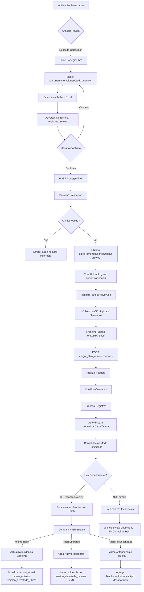

# 🔄 Flujo REAL de Corrección de Libro para Incidencias

## 📋 Estado Actual del Sistema (Actualizado)

### ⚠️ IMPORTANTE: Sistema Legacy vs Sistema Actual

**❌ Sistema Legacy (NO SE USA)**:
- `solicitar_recarga_archivos()` en múltiples ubicaciones → **OBSOLETO**
- `aprobar_recarga_archivos()` → **NO USADO EN PRODUCCIÓN**
- Estados `recarga_solicitud_pendiente`, `requiere_recarga_archivos` → **LEGACY**

**✅ Sistema Actual en Producción**:
- Botón "Corregir Libro" en tarjeta de Incidencias
- Endpoint `/nomina/cierres/{cierre_id}/corregir-libro/`
- Flujo directo: Validar → Eliminar previos → Subir nuevo → Procesar

### Ubicaciones de Código (Sistema Actual)

#### 1. **Frontend - Botón "Corregir Libro"**:
- `src/components/TarjetasCierreNomina/IncidenciasEncontradasSection.jsx` línea 596
- `src/components/TarjetasCierreNomina/CorreccionLibro/LibroRemuneracionesCardCorreccion.jsx`

#### 2. **API Call**:
- `src/api/nomina.js` línea 1230: `corregirLibroRemuneraciones(cierreId, archivo)`

#### 3. **Backend - Validación y Eliminación**:
- `backend/nomina/views_correcciones.py` línea 21: `corregir_libro_view()`
  - Valida archivo (extensión, tamaño, patrón de nombre)
  - Elimina uploads anteriores de libro
  - Crea UploadLog con acción "correccion_eliminacion_previos"
  - NO modifica datos consolidados (solo metadatos de uploads)

#### 4. **Reconciliación de Incidencias** (Sistema de Hash):
- `backend/nomina/utils/reconciliacion.py` línea 50: `reconciliar_cierre_suma_total()`
  - Hash estable por concepto/tipo (no incluye montos)
  - Upsert: actualiza existente o crea nueva
  - Marca como resueltas las que ya no superan umbral

#### 5. **Generación Simplificada** (Implementación Actual):
- `backend/nomina/utils/DetectarIncidenciasConsolidadas.py` línea 228: `procesar_incidencias_suma_total_simple()`
  - ✅ Genera hash antes de bulk_create (FIXED)
  - ❌ NO hace reconciliación (crea siempre nuevas)

---

## 🎯 Flujo Completo (Sistema Actual en Producción)



---

## 📝 Detalles de Implementación Actual

### 1. Endpoint de Corrección (`corregir_libro_view`)

**Ubicación**: `backend/nomina/views_correcciones.py` línea 21

**Flujo**:
```python
def corregir_libro_view(request, cierre_id):
    # 1. Obtener archivo
    archivo = request.FILES.get('archivo')
    
    # 2. Validaciones
    - Validar extensión (.xlsx)
    - Validar tamaño (< límite configurado)
    - Validar patrón nombre: "{periodo}_libro_remuneraciones_{rut}.xlsx"
      Ejemplo: "202509_libro_remuneraciones_123456789.xlsx"
    
    # 3. Eliminar uploads previos
    libros_previos = LibroRemuneracionesUpload.objects.filter(cierre=cierre)
    for libro in libros_previos:
        libro.archivo.delete(save=False)  # Eliminar archivo físico
        libro.delete()  # Eliminar registro
    
    # 4. Crear UploadLog
    upload_log = crear_upload_log(
        tipo="libro_remuneraciones",
        accion="correccion_eliminacion_previos",
        resumen={
            "libros_previos_eliminados": count,
            "archivo_correccion_nombre": archivo.name
        }
    )
    
    # 5. Registrar actividad
    registrar_actividad_tarjeta_nomina(
        tarjeta="libro_remuneraciones",
        accion="correccion_eliminar_previos"
    )
    
    return {"message": "Validado", "eliminados": count}
```

**Características**:
- ✅ NO incrementa `version_datos` (se hace al regenerar incidencias)
- ✅ NO modifica datos consolidados
- ✅ Solo elimina metadatos de uploads anteriores
- ✅ Valida patrón de nombre de archivo
- ❌ NO valida hash de archivo (no detecta si es idéntico)

### 2. Componente Frontend (`LibroRemuneracionesCardCorreccion`)

**Ubicación**: `src/components/TarjetasCierreNomina/CorreccionLibro/LibroRemuneracionesCardCorreccion.jsx`

**Flujo**:
```javascript
const handleSeleccionArchivo = (archivo) => {
    setSelectedFile(archivo);
    setShowConfirmDelete(true);  // Muestra advertencia
};

const handleConfirmarCorreccion = async () => {
    // 1. Validar y eliminar previos
    await corregirLibroRemuneraciones(cierreId, selectedFile);
    
    // 2. Subir nuevo archivo
    await onSubirArchivo(selectedFile);
    
    // 3. Procesar (headers + clasificación)
    await onProcesar();
    
    // 4. Auto-consolidar cuando estado = "procesado"
    await consolidarDatosTalana(cierreId, { modo: 'optimizado' });
};
```

**Estados del Archivo**:
- `no_subido` → archivo no existe
- `analizando_hdrs` → analizando columnas
- `clasif_pendiente` → esperando clasificación
- `clasificado` → listo para procesar
- `procesando` → procesando registros
- `procesado` → ✅ completo (dispara auto-consolidación)

### 3. Sistema de Hash (Implementación Actual)

**Hash de Incidencias** ✅:
```python
def generar_hash_deteccion(self):
    contenido = f"{self.cierre.id}|{self.concepto_afectado}|{self.tipo_incidencia}|{monto_actual}|{monto_anterior}"
    return hashlib.sha256(contenido).hexdigest()[:32]
```

**Hash Estable (Reconciliación)** ✅:
```python
def _hash_incidencia_suma_total(nombre_concepto, tipo_concepto):
    """Hash que NO incluye montos, para identificar misma incidencia entre versiones"""
    base = f"suma_total|{tipo_concepto.lower()}|{nombre_concepto.lower()}"
    return hashlib.sha1(base.encode()).hexdigest()
```

**Hash de Archivo** ❌ (NO IMPLEMENTADO):
- NO se calcula hash del archivo libro remuneraciones
- NO se compara con versiones anteriores
- NO se detecta si el archivo es idéntico

---

## ⚠️ Problemas Actuales

### 1. **Código Legacy Sin Usar** (4 funciones obsoletas):
```python
# backend/nomina/views.py
def solicitar_recarga_archivos()  # Línea 863 - NO USADO
def solicitar_recarga_archivos_analista()  # Línea 948 - NO USADO
def aprobar_recarga_archivos()  # Línea 989 - NO USADO

# backend/nomina/views_incidencias.py
def solicitar_recarga_archivos()  # Línea 744 - NO USADO

# backend/nomina/views.py (ViewSet CierreNominaIncidencias)
def solicitar_recarga_archivos()  # Línea 3106 - NO USADO
```

**Impacto**: Código muerto que confunde, aumenta complejidad y dificulta mantenimiento.

### 2. **Dos Sistemas de Generación de Incidencias Compitiendo**:

#### A) Sistema Simplificado (DetectarIncidenciasConsolidadas.py):
```python
def procesar_incidencias_suma_total_simple():
    # ✅ Genera hash correctamente (ya arreglado)
    # ❌ NO reconcilia con existentes
    # ❌ Puede crear duplicados al recargar
    # ❌ Usa bulk_create con ignore_conflicts
    
    for inc in incidencias_creadas:
        inc.hash_deteccion = inc.generar_hash_deteccion()
    IncidenciaCierre.objects.bulk_create(incidencias_creadas, ignore_conflicts=True)
```

**Problema**: El `ignore_conflicts` silencia errores pero NO actualiza existentes.

#### B) Sistema de Reconciliación (reconciliacion.py):
```python
def reconciliar_cierre_suma_total():
    # ✅ Upsert inteligente basado en hash estable
    # ✅ Actualiza existentes o crea nuevas
    # ✅ Marca desaparecidas como resueltas
    # ✅ Maneja versiones correctamente
    
    hash_estable = _hash_incidencia_suma_total(nombre, tipo)
    existente = existentes_por_hash.get(hash_estable)
    if existente:
        # Actualizar campos cambiados
        existente.datos_adicionales = datos_nuevos
        existente.version_detectada_ultima = vN
        existente.save(update_fields=['datos_adicionales', 'version_detectada_ultima'])
    else:
        # Crear nueva
        IncidenciaCierre.objects.create(...)
```

**Problema**: Dependiendo de qué tarea Celery se ejecute, el comportamiento es diferente.

### 3. **Hash de Archivo NO Implementado**:
- ✅ Existe `hash_deteccion` en incidencias
- ✅ Existe `hash_archivo` en UploadLogNomina
- ❌ NO se calcula hash al corregir libro
- ❌ NO se compara con versión anterior
- ❌ Sistema puede reprocesar archivo idéntico innecesariamente

**Ejemplo del problema**:
```python
# Usuario sube mismo archivo por error
# Sistema:
1. Elimina uploads previos
2. Sube archivo idéntico
3. Procesa todo de nuevo (costoso)
4. Genera mismas incidencias
5. ❌ NO detecta que nada cambió
```

### 4. **Versioning NO Sincronizado**:
- `CierreNomina.version_datos` → NO se incrementa en corrección
- `IncidenciaCierre.version_detectada_primera` → Se establece correctamente
- `IncidenciaCierre.version_detectada_ultima` → Se establece correctamente
- ❌ Pero `version_datos` NO cambia, entonces versiones siempre son 1

**Problema**: El sistema de versiones no funciona porque `version_datos` nunca aumenta.

---

## ✅ Propuesta de Refactorización

### Fase 1: Limpieza de Código Legacy

**Acción**: Eliminar código obsoleto no usado

```python
# backend/nomina/views.py
# ❌ ELIMINAR:
- solicitar_recarga_archivos() línea 863
- solicitar_recarga_archivos_analista() línea 948  
- aprobar_recarga_archivos() línea 989

# backend/nomina/views_incidencias.py
# ❌ ELIMINAR:
- solicitar_recarga_archivos() línea 744

# backend/nomina/views.py (ViewSet CierreNominaIncidencias)
# ❌ ELIMINAR:
- solicitar_recarga_archivos() línea 3106
```

**Beneficio**: Reduce confusión, mejora claridad del código.

### Fase 2: Unificar Sistema de Incidencias

**Opción A - Usar SOLO reconciliacion.py** (RECOMENDADO):

```python
# backend/nomina/utils/DetectarIncidenciasConsolidadas.py

def procesar_incidencias_suma_total_simple(cierre_actual, cierre_anterior):
    """
    DEPRECADO: Usar reconciliar_cierre_suma_total() en su lugar
    """
    from .reconciliacion import reconciliar_cierre_suma_total
    return reconciliar_cierre_suma_total(cierre_actual.id)
```

**Opción B - Mejorar sistema simplificado**:

```python
def procesar_incidencias_suma_total_simple(cierre_actual, cierre_anterior):
    # ... lógica existente ...
    
    # NUEVO: Buscar incidencias existentes por hash
    existentes_por_hash = {}
    for inc in IncidenciaCierre.objects.filter(cierre=cierre_actual, tipo_comparacion='suma_total'):
        if inc.hash_deteccion:
            existentes_por_hash[inc.hash_deteccion] = inc
    
    # NUEVO: Upsert en lugar de bulk_create
    crear = []
    actualizar = []
    
    for inc_nueva in incidencias_creadas:
        inc_nueva.hash_deteccion = inc_nueva.generar_hash_deteccion()
        
        existente = existentes_por_hash.get(inc_nueva.hash_deteccion)
        if existente:
            # Actualizar existente
            existente.datos_adicionales = inc_nueva.datos_adicionales
            existente.impacto_monetario = inc_nueva.impacto_monetario
            existente.version_detectada_ultima = cierre_version
            actualizar.append(existente)
        else:
            # Crear nueva
            crear.append(inc_nueva)
    
    # Guardar cambios
    if actualizar:
        IncidenciaCierre.objects.bulk_update(
            actualizar,
            fields=['datos_adicionales', 'impacto_monetario', 'version_detectada_ultima']
        )
    if crear:
        IncidenciaCierre.objects.bulk_create(crear)
```

**Recomendación**: Opción A (usar reconciliacion.py) porque:
- ✅ Ya está probado y funcionando
- ✅ Maneja desapariciones correctamente
- ✅ Usa hash estable (sin montos)
- ✅ Menos código que mantener

### Fase 3: Implementar Validación de Hash de Archivo

```python
# backend/nomina/views_correcciones.py

@api_view(['POST'])
def corregir_libro_view(request, cierre_id: int):
    archivo = request.FILES.get('archivo')
    cierre = CierreNomina.objects.get(id=cierre_id)
    
    # ... validaciones existentes ...
    
    # NUEVO: Calcular hash del archivo
    hash_nuevo = hashlib.md5()
    for chunk in archivo.chunks():
        hash_nuevo.update(chunk)
    hash_nuevo_hex = hash_nuevo.hexdigest()
    archivo.seek(0)  # Reset para procesamiento posterior
    
    # NUEVO: Comparar con último upload
    ultimo_upload = UploadLogNomina.objects.filter(
        cierre=cierre,
        tipo_upload='libro_remuneraciones',
        estado='completado'
    ).order_by('-fecha_subida').first()
    
    if ultimo_upload and ultimo_upload.hash_archivo == hash_nuevo_hex:
        return Response({
            "error": "El archivo es idéntico al anterior. No hay cambios para procesar.",
            "hash_anterior": ultimo_upload.hash_archivo,
            "hash_nuevo": hash_nuevo_hex,
            "fecha_anterior": ultimo_upload.fecha_subida
        }, status=400)
    
    # Continuar con flujo normal...
```

### Fase 4: Implementar Sistema de Versiones Correcto

```python
# backend/nomina/views_correcciones.py

def corregir_libro_view(request, cierre_id: int):
    # ... código existente ...
    
    with transaction.atomic():
        cierre = CierreNomina.objects.select_for_update().get(id=cierre_id)
        
        # NUEVO: Incrementar versión al corregir
        cierre.version_datos = (cierre.version_datos or 1) + 1
        cierre.save(update_fields=['version_datos'])
        
        # Eliminar uploads previos...
        # Crear UploadLog con versión actualizada
        upload_log.resumen = {
            "accion": "correccion",
            "version_datos": cierre.version_datos,  # Nueva versión
            "hash_archivo": hash_nuevo_hex
        }
```

**Beneficio**: Ahora `version_detectada_primera` y `version_detectada_ultima` tienen valores significativos.

### Fase 5: Integrar TODO en el Flujo de Corrección

```python
# backend/nomina/views_correcciones.py

@api_view(['POST'])
def corregir_libro_view(request, cierre_id: int):
    """
    Flujo completo de corrección:
    1. Validar archivo (extensión, tamaño, patrón)
    2. Calcular hash y comparar con anterior
    3. Si es diferente: incrementar version_datos
    4. Eliminar uploads previos
    5. Retornar OK para que frontend proceda
    """
    # Implementación completa arriba
```

**Resultado Final**:
```
Usuario → Corregir Libro → Validación + Hash → 
  Si diferente → Incrementa version_datos → Elimina previos → 
  Frontend → Sube archivo → Procesa → Consolida → 
  reconciliar_cierre_suma_total() → Upsert incidencias con hash estable
```

---

## 🤔 Decisiones Necesarias

### 1. **¿Qué sistema de incidencias usar?**

**Opción A - reconciliar_cierre_suma_total()** ✅ RECOMENDADO:
- Pros:
  * Ya probado y funcionando
  * Upsert inteligente (actualiza/crea/marca resueltas)
  * Hash estable sin montos
  * Maneja desapariciones
  * Menos código que mantener
- Contras:
  * Depende de que `version_datos` se incremente correctamente

**Opción B - procesar_incidencias_suma_total_simple()** mejorado:
- Pros:
  * Control total del código
  * Más simple de entender
- Contras:
  * Requiere agregar lógica de upsert
  * Duplicación de funcionalidad con reconciliacion.py
  * Más código que mantener

**Recomendación**: Opción A - migrar TODO a usar `reconciliar_cierre_suma_total()`.

### 2. **¿Validar hash de archivo?**

**SÍ - Implementar validación** ✅ RECOMENDADO:
- Previene procesamiento innecesario
- Detecta errores del usuario (subió mismo archivo)
- Simple de implementar (solo calcular MD5 y comparar)
- Ahorra recursos de servidor

**NO - Dejar como está**:
- Usuario podría subir mismo archivo por error
- Sistema procesaría todo de nuevo sin cambios
- Desperdicio de CPU y tiempo

**Recomendación**: SÍ - validar hash en `corregir_libro_view()`.

### 3. **¿Incrementar version_datos al corregir?**

**SÍ - Incrementar en corregir_libro_view()** ✅ RECOMENDADO:
- Hace que el sistema de versiones funcione correctamente
- `version_detectada_primera` y `version_detectada_ultima` tienen sentido
- Permite rastrear evolución de incidencias a través de correcciones
- Consistente con el diseño original del sistema

**NO - Incrementar solo al consolidar**:
- Sistema de versiones no funciona (siempre v1)
- No hay trazabilidad de correcciones

**Recomendación**: SÍ - incrementar `version_datos` en `corregir_libro_view()`.

### 4. **¿Eliminar código legacy?**

**SÍ - Eliminar** ✅ RECOMENDADO:
- Reduce complejidad
- Evita confusión
- Mejora mantenibilidad
- Las funciones NO se usan en producción

**NO - Mantener por compatibilidad**:
- "Por si acaso" (pero nadie las llama)
- Aumenta deuda técnica

**Recomendación**: SÍ - eliminar todas las funciones `solicitar_recarga_archivos()` legacy.

---

## 🎯 Plan de Acción Recomendado

### Paso 1: Actualizar corregir_libro_view() ✅ PRIORIDAD ALTA
```python
# Agregar en views_correcciones.py:
1. Calcular hash del archivo
2. Comparar con último upload
3. Si diferente: incrementar version_datos
4. Eliminar uploads previos
5. Retornar con hash_archivo en respuesta
```

**Beneficio Inmediato**: 
- Sistema de versiones funciona
- Previene resubidas innecesarias

### Paso 2: Migrar a reconciliar_cierre_suma_total() ✅ PRIORIDAD ALTA
```python
# En tasks_refactored/incidencias.py:
from nomina.utils.reconciliacion import reconciliar_cierre_suma_total

def generar_incidencias_con_logging(...):
    # Cambiar de:
    resultado = generar_incidencias_consolidados_v2(cierre_id, ...)
    # A:
    resultado = reconciliar_cierre_suma_total(cierre_id)
```

**Beneficio Inmediato**:
- Upsert correcto (no duplicados)
- Maneja desapariciones
- Versiones de incidencias correctas

### Paso 3: Eliminar código legacy ✅ PRIORIDAD MEDIA
```python
# Eliminar de views.py y views_incidencias.py:
- solicitar_recarga_archivos() (4 ubicaciones)
- aprobar_recarga_archivos() (1 ubicación)
```

**Beneficio**: Código más limpio, menos confusión.

### Paso 4: Actualizar documentación ✅ PRIORIDAD BAJA
- Actualizar `docs/reconciliacion_incidencias.md`
- Crear diagrama de flujo final simplificado
- Ejemplos de uso de "Corregir Libro"

**Beneficio**: Equipo entiende el flujo correcto.

---

## 📊 Comparación de Sistemas

| Aspecto | Sistema Actual | Sistema Propuesto |
|---------|---------------|-------------------|
| **Validación Archivo** | ❌ NO valida hash | ✅ Valida hash MD5 |
| **Versioning** | ❌ Siempre v1 | ✅ Incrementa correctamente |
| **Upsert Incidencias** | ❌ ignore_conflicts | ✅ Upsert inteligente |
| **Duplicados** | ⚠️ Posibles | ✅ Imposibles |
| **Desapariciones** | ❌ No maneja | ✅ Marca como resuelta |
| **Código Legacy** | ❌ 5 funciones sin usar | ✅ Eliminadas |
| **Complejidad** | 🔴 Alta (2 sistemas) | 🟢 Baja (1 sistema) |
| **Mantenibilidad** | 🔴 Difícil | 🟢 Fácil |

---

## 🚀 Implementación Rápida (MVP)

Si quieres implementar RÁPIDO con máximo beneficio:

### Cambio #1: Incrementar version_datos (5 minutos)
```python
# En views_correcciones.py línea ~120
with transaction.atomic():
    cierre = CierreNomina.objects.select_for_update().get(id=cierre_id)
    cierre.version_datos = (cierre.version_datos or 1) + 1  # AGREGAR ESTA LÍNEA
    cierre.save(update_fields=['version_datos'])
```

### Cambio #2: Usar reconciliacion (5 minutos)
```python
# En tasks_refactored/incidencias.py línea ~260
# Cambiar de:
resultado = generar_incidencias_consolidados_v2(cierre_id, usuario_id)
# A:
from nomina.utils.reconciliacion import reconciliar_cierre_suma_total
resultado = reconciliar_cierre_suma_total(cierre_id)
```

**Resultado**: Sistema funcional con upsert correcto en 10 minutos.

---

## 📝 Notas Finales

1. **No tocar consolidación**: El flujo de consolidación funciona bien, solo mejoramos la generación de incidencias.

2. **Frontend no cambia**: El botón "Corregir Libro" sigue igual, solo mejoramos el backend.

3. **Backward compatible**: Los cambios no rompen funcionalidad existente.

4. **Testing**: Después de implementar, probar:
   - Corregir libro con archivo diferente → debe crear/actualizar incidencias
   - Corregir libro con mismo archivo → debe rechazar (después de implementar hash)
   - Verificar que `version_datos` incrementa correctamente
