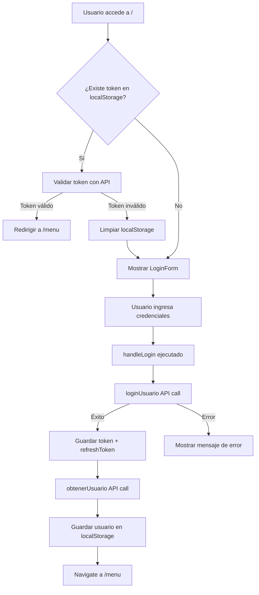

# 📋 Estado Actual del Módulo Login

**Fecha:** 11 de noviembre de 2025  
**Módulo:** Autenticación y Login  
**Objetivo:** Documentar la arquitectura actual antes de la refactorización

---

## 🎯 Descripción General

El módulo de Login es el **punto de entrada** al sistema SGM. Maneja la autenticación de usuarios mediante JWT tokens, validación de sesiones existentes, y redirección al menú principal según el rol del usuario.

---

## 📂 Estructura Actual del Frontend

### **Archivos Principales**

```
src/
├── pages/
│   └── Login.jsx                    # Página principal de login
├── components/
│   ├── LoginForm.jsx                # Formulario de login con validaciones
│   ├── Header_login.jsx             # Header específico de la página de login
│   └── PrivateRoute.jsx             # Protección de rutas privadas
├── api/
│   ├── auth.js                      # Cliente API de autenticación
│   └── config.js                    # Configuración Axios + interceptors
└── App.jsx                          # Definición de rutas (Router principal)
```

---

## 🔍 Análisis Detallado por Archivo

### **1. `/src/pages/Login.jsx`**

**Responsabilidad:** Orquestación del flujo de login, validación de sesión existente y redirección.

**Dependencias:**
- `LoginForm` (componente)
- `Header_login` (componente)
- `loginUsuario()` y `obtenerUsuario()` desde `/api/auth.js`
- `useNavigate` de React Router

**Estado Local:**
- `isLoading`: Indicador de proceso de login en curso
- `error`: Mensaje de error de autenticación
- `isCheckingSession`: Validando si existe sesión activa

**Flujo de Ejecución:**



**Funciones Clave:**

```javascript
// Validación automática de sesión existente
useEffect(() => {
  const validarSesion = async () => {
    const token = localStorage.getItem("token");
    if (!token) return;
    
    try {
      const usuario = await obtenerUsuario();
      navigate("/menu");
    } catch (error) {
      localStorage.removeItem("token");
    }
  };
  validarSesion();
}, [navigate]);

// Proceso de login
const handleLogin = async (correo, password, recordar) => {
  const result = await loginUsuario(correo, password);
  localStorage.setItem("token", result.access);
  
  if (result.refresh) {
    localStorage.setItem("refreshToken", result.refresh);
  }
  
  const usuario = await obtenerUsuario();
  localStorage.setItem("usuario", JSON.stringify(usuario));
  
  navigate("/menu");
};
```

**Manejo de Errores:**
- HTTP 401: Credenciales incorrectas
- HTTP 403: Acceso denegado
- HTTP 500+: Error del servidor
- Sin conexión: Error de red

**UI/UX:**
- Loading spinner durante validación de sesión
- Background animado con gradientes y blobs
- Footer con copyright y enlaces
- Diseño responsive

---

### **2. `/src/components/LoginForm.jsx`**

**Responsabilidad:** Captura de credenciales con validaciones en tiempo real.

**Props:**
- `onLogin(correo, password, recordar)`: Callback para ejecutar login
- `isLoading`: Estado de carga (deshabilita el formulario)
- `error`: Mensaje de error global

**Estado Local:**
- `correo`: Email del usuario
- `password`: Contraseña
- `showPassword`: Toggle de visibilidad de contraseña
- `recordar`: Checkbox "recordar sesión"
- `errors`: Errores de validación por campo
- `touched`: Campos que han sido tocados por el usuario

**Validaciones:**

```javascript
// Email
const validateEmail = (email) => {
  if (!email) return "El correo es requerido";
  if (!regex.test(email)) return "Formato de correo inválido";
  if (!email.endsWith("@bdo.cl")) return "Debe usar un correo @bdo.cl";
  return "";
};

// Contraseña
const validatePassword = (pass) => {
  if (!pass) return "La contraseña es requerida";
  if (pass.length < 6) return "Mínimo 6 caracteres";
  return "";
};
```

**Características:**
- Validación en tiempo real después de `onBlur`
- Indicadores visuales de error (íconos + bordes rojos)
- Soporte para tecla Enter
- Animaciones con Framer Motion
- Iconos de React Icons (FiMail, FiLock, FiEye, FiAlertCircle)

**Estructura del Formulario:**
1. Campo de email con validación @bdo.cl
2. Campo de contraseña con toggle de visibilidad
3. Checkbox "Recordar sesión"
4. Botón de submit con estado de carga
5. Mensaje de error global (si existe)

---

### **3. `/src/components/Header_login.jsx`**

**Responsabilidad:** Header visual para la página de login.

**Características:**
- Logo de BDO con animación de entrada
- Título del sistema
- Indicador de ambiente (desarrollo/producción)
- Enlaces a sitio web y soporte (solo desktop)
- Diseño responsive con diferentes elementos según viewport
- Animaciones con Framer Motion

**Elementos Visuales:**
- Logo BDO (importado desde `assets/BDO_LOGO.png`)
- Badge de "Desarrollo" con indicador pulsante
- Links externos con hover effects
- Sticky positioning con backdrop blur

---

### **4. `/src/components/PrivateRoute.jsx`

**Responsabilidad:** Protección de rutas que requieren autenticación.

**Lógica:**
```javascript
const token = localStorage.getItem("token");
return token ? children : <Navigate to="/" />;
```

**Uso en App.jsx:**
```jsx
<Route path="/menu" element={
  <PrivateRoute>
    <Layout />
  </PrivateRoute>
}>
```

---

### **5. `/src/api/auth.js`**

**Responsabilidad:** Cliente API para autenticación.

**Funciones Exportadas:**

```javascript
// Login de usuario - retorna tokens JWT
export const loginUsuario = async (correo, password) => {
  const response = await api.post("/token/", {
    correo_bdo: correo,
    password,
  });
  return response.data; // { access, refresh }
};

// Obtener datos del usuario autenticado
export const obtenerUsuario = async () => {
  const response = await api.get("/usuarios/me/");
  return response.data; // { id, nombre, tipo_usuario, ... }
};
```

**Endpoints Consumidos:**
- `POST /api/token/` → Obtener JWT tokens
- `GET /api/usuarios/me/` → Datos del usuario autenticado

---

### **6. `/src/api/config.js`**

**Responsabilidad:** Configuración de Axios con interceptors.

**Configuración Base:**
```javascript
const api = axios.create({
  baseURL: "http://172.17.11.18:8000/api",
});
```

**Request Interceptor:**
- Inyecta token JWT en header `Authorization: Bearer <token>`
- Logs de debugging para endpoints de caché e incidencias

**Response Interceptor:**
- Logs de respuestas de caché
- Manejo global de errores (puede redirigir a login si 401)

---

### **7. `/src/App.jsx`**

**Responsabilidad:** Definición de rutas principales del sistema.

**Rutas Relacionadas con Login:**
```jsx
<Routes>
  {/* Ruta pública */}
  <Route path="/" element={<Login />} />
  
  {/* Rutas protegidas */}
  <Route path="/menu" element={
    <PrivateRoute>
      <Layout />
    </PrivateRoute>
  }>
    {/* Rutas anidadas aquí */}
  </Route>
</Routes>
```

---

## 🔌 Backend - API de Autenticación

### **Endpoints**

| Método | URL | Descripción | Respuesta |
|--------|-----|-------------|-----------|
| POST | `/api/token/` | Login - Obtener JWT tokens | `{ access, refresh }` |
| POST | `/api/token/refresh/` | Renovar access token | `{ access }` |
| GET | `/api/usuarios/me/` | Datos del usuario autenticado | `{ id, nombre, correo_bdo, tipo_usuario, ... }` |

### **Archivos Backend**

```
backend/
├── api/
│   ├── views.py                     # CustomTokenObtainPairView
│   ├── serializers.py               # CustomTokenObtainPairSerializer
│   └── models.py                    # Usuario model
└── sgm_backend/
    ├── settings.py                  # Config JWT (SIMPLE_JWT)
    └── urls.py                      # Rutas de autenticación
```

### **CustomTokenObtainPairView** (`api/views.py`)

```python
class CustomTokenObtainPairView(TokenObtainPairView):
    serializer_class = CustomTokenObtainPairSerializer
```

### **CustomTokenObtainPairSerializer** (`api/serializers.py`)

```python
class CustomTokenObtainPairSerializer(TokenObtainPairSerializer):
    username_field = Usuario.USERNAME_FIELD
    
    def validate(self, attrs):
        data = super().validate(attrs)
        
        # Actualizar last_login automáticamente
        from django.utils import timezone
        self.user.last_login = timezone.now()
        self.user.save(update_fields=['last_login'])
        
        return data
```

**Características:**
- Usa el campo personalizado `correo_bdo` como USERNAME_FIELD
- Actualiza `last_login` en cada autenticación exitosa
- Retorna `access` y `refresh` tokens JWT

### **Configuración JWT** (`sgm_backend/settings.py`)

```python
SIMPLE_JWT = {
    'ACCESS_TOKEN_LIFETIME': timedelta(days=7),
    'REFRESH_TOKEN_LIFETIME': timedelta(days=30),
    # ... otras configuraciones
}
```

---

## 🔐 Modelo de Usuario

**Campo de Autenticación:** `correo_bdo` (email corporativo @bdo.cl)

**Roles de Usuario:**
- `gerente`: Acceso completo al sistema
- `supervisor`: Supervisa analistas y sus clientes
- `analista`: Gestiona clientes asignados
- `usuario`: Acceso básico

**Campos Relevantes:**
- `id`: Primary key
- `nombre`, `apellido`: Nombre completo
- `correo_bdo`: Email corporativo (USERNAME_FIELD)
- `password`: Hash de contraseña
- `tipo_usuario`: Rol del usuario
- `is_active`: Usuario activo
- `last_login`: Última autenticación
- `areas`: Relación ManyToMany con Area
- `supervisor`: ForeignKey a Usuario (para analistas)

---

## 💾 Almacenamiento Local (localStorage)

### **Datos Persistidos:**

```javascript
// Después de login exitoso:
localStorage.setItem("token", access_token);        // JWT access token
localStorage.setItem("refreshToken", refresh_token); // JWT refresh token
localStorage.setItem("usuario", JSON.stringify({    // Datos del usuario
  id: 1,
  nombre: "Juan",
  apellido: "Pérez",
  correo_bdo: "juan.perez@bdo.cl",
  tipo_usuario: "analista",
  areas: [...],
  supervisor: {...}
}));
localStorage.setItem("recordarSesion", "true");     // Opcional
```

### **Limpieza en Logout:**
```javascript
localStorage.removeItem("token");
localStorage.removeItem("refreshToken");
localStorage.removeItem("usuario");
```

---

## 🎨 Librerías UI Utilizadas

| Librería | Uso en Login |
|----------|--------------|
| **Framer Motion** | Animaciones de entrada/salida |
| **React Icons** | Iconos (FiMail, FiLock, FiEye, FiAlertCircle) |
| **Tailwind CSS** | Estilos y responsive design |
| **React Router** | Navegación y protección de rutas |

---

## 🔄 Flujo Completo de Autenticación

### **Escenario 1: Login Exitoso**

```
1. Usuario accede a "/"
2. Login.jsx verifica si existe token en localStorage
3. No existe → Renderiza LoginForm
4. Usuario ingresa email y password
5. LoginForm valida formato de datos
6. Validación OK → Ejecuta onLogin(correo, password, recordar)
7. Login.jsx llama loginUsuario(correo, password)
8. API POST /api/token/ → Backend valida credenciales
9. Backend retorna { access, refresh }
10. Frontend guarda tokens en localStorage
11. Frontend llama obtenerUsuario()
12. API GET /api/usuarios/me/ → Backend retorna datos del usuario
13. Frontend guarda usuario en localStorage
14. navigate("/menu") → Redirección al menú principal
```

### **Escenario 2: Sesión Existente**

```
1. Usuario accede a "/"
2. Login.jsx verifica si existe token en localStorage
3. Existe token → Llama obtenerUsuario()
4. API GET /api/usuarios/me/ con Bearer token
5. Token válido → Backend retorna datos del usuario
6. navigate("/menu") → Redirección automática
```

### **Escenario 3: Error de Autenticación**

```
1-7. (igual que escenario exitoso)
8. API POST /api/token/ → Backend rechaza credenciales (401)
9. Frontend captura error
10. Analiza código de error:
    - 401: "Correo o contraseña incorrectos"
    - 403: "Acceso denegado"
    - 500+: "Error del servidor"
    - Network: "No se pudo conectar"
11. setError(mensaje) → LoginForm muestra error
12. Usuario permanece en página de login
```

---

## ⚠️ Problemas Identificados (a resolver en refactorización)

### **Organización de Archivos**
- ❌ Componentes del login dispersos en carpeta genérica `/components`
- ❌ No hay documentación dentro de la estructura de código
- ❌ Dificultad para ubicar todos los elementos relacionados

### **Separación de Responsabilidades**
- ❌ `config.js` tiene interceptors con logs mezclados (caché, incidencias)
- ❌ No hay separación clara entre lógica de UI y lógica de negocio

### **Reutilización**
- ❌ `Header_login.jsx` es específico para login (no se reutiliza)
- ❌ Validaciones de email @bdo.cl están hardcoded en LoginForm

### **Testing**
- ❌ No hay estructura para tests unitarios del módulo
- ❌ Difícil testear componentes de forma aislada

### **Mantenibilidad**
- ❌ Cambios en el flujo de login requieren modificar múltiples carpetas
- ❌ No hay documentación del funcionamiento interno

---

## 📊 Métricas Actuales

- **Archivos involucrados:** 7
- **Líneas de código (Frontend):** ~650
- **Componentes React:** 3 (Login, LoginForm, Header_login)
- **APIs consumidas:** 2 endpoints
- **Dependencias externas:** 4 librerías (Framer Motion, React Icons, React Router, Axios)

---

## 🎯 Siguiente Paso

Crear la **propuesta de refactorización** con:
- Estructura modular por página/característica
- Colocalización de componentes, APIs y documentación
- Patrón reproducible para otros módulos
- Documentación integrada en el código
