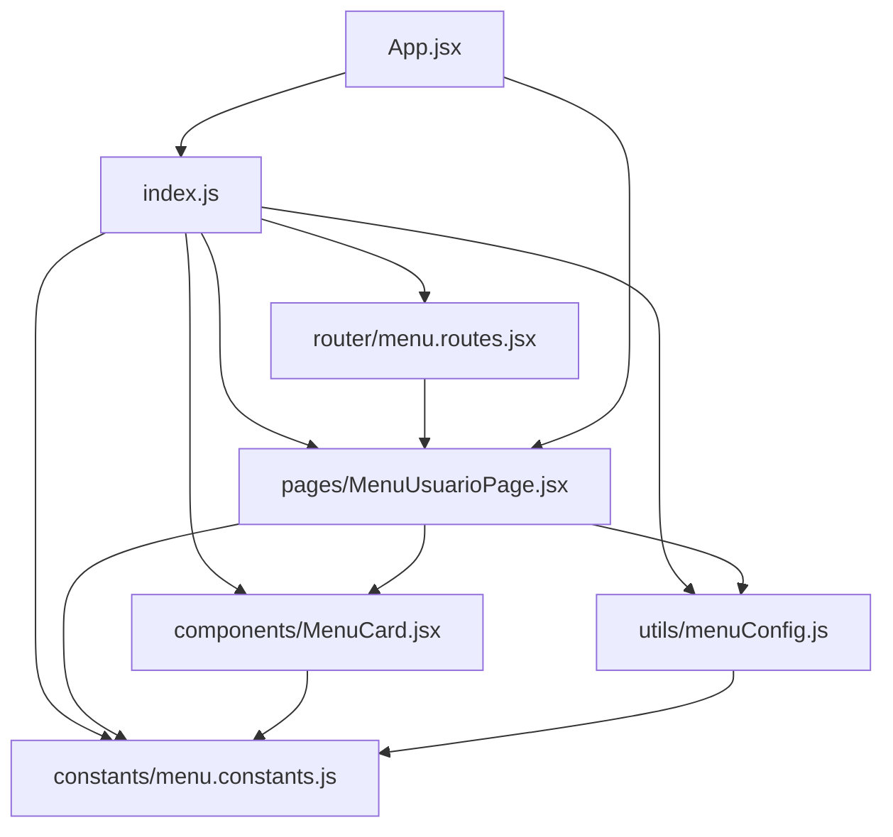
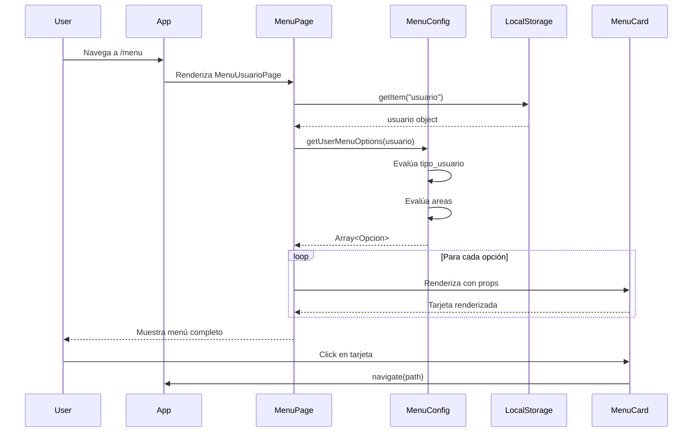

# 🌳 Árbol de Estructura - Módulo Menu

**Fecha:** 14 de noviembre de 2025  
**Versión:** 1.0.0

---

## 📂 Estructura Completa

```
src/modules/menu/
│
├── 📄 README.md                          # Documentación completa del módulo
│   ├── Descripción general
│   ├── Funcionalidades principales
│   ├── Componentes incluidos
│   ├── Utilidades y constantes
│   ├── Flujo de uso
│   ├── Ejemplos de código
│   ├── Troubleshooting
│   └── Futuras mejoras
│
├── 📦 index.js                          # Exportaciones públicas del módulo
│   ├── export { MenuUsuarioPage }
│   ├── export { MenuCard }
│   ├── export { getUserMenuOptions, hasArea }
│   ├── export { CARD_OPACITY, USER_TYPES, ... }
│   └── export default MenuUsuarioPage
│
├── 📁 pages/
│   └── 🖥️ MenuUsuarioPage.jsx          # Página principal del menú
│       ├── Obtiene usuario de localStorage
│       ├── Construye opciones dinámicas con getUserMenuOptions()
│       ├── Renderiza grid responsivo de MenuCard
│       ├── Aplica animaciones escalonadas
│       └── Estilos CSS inline
│
├── 📁 components/
│   └── 🎴 MenuCard.jsx                  # Tarjeta de opción de menú
│       ├── Props: label, descripcion, icon, color, path
│       ├── Navegación con useNavigate()
│       ├── Efectos hover con opacity y scale
│       ├── Usa CARD_OPACITY de constantes
│       └── Renderiza icono + texto + descripción
│
├── 📁 utils/
│   └── ⚙️ menuConfig.js                 # Configuración de opciones
│       ├── OPCIONES_ANALISTA []
│       ├── OPCIONES_SUPERVISOR []
│       ├── OPCIONES_GERENTE_BASE []
│       ├── OPCIONES_GERENTE_CONTABILIDAD []
│       ├── OPCIONES_GERENTE_NOMINA []
│       ├── OPCIONES_GERENTE_FINALES []
│       ├── OPCIONES_ADMIN_SISTEMA []
│       ├── OPCION_COBRANZA_NO_GERENTE []
│       ├── getUserMenuOptions(usuario) → Array<Opcion>
│       ├── hasArea(usuario, areaNombre) → boolean
│       └── export { MENU_CONFIG }
│
├── 📁 constants/
│   └── 📊 menu.constants.js             # Constantes del módulo
│       ├── CARD_OPACITY = 0.9
│       ├── ANIMATION_DELAY_STEP = 100
│       ├── GRID_BREAKPOINTS = { sm, lg }
│       ├── ANIMATION_DURATIONS = { fadeIn, slideUp, hover }
│       ├── USER_TYPES = { ANALISTA, SUPERVISOR, GERENTE }
│       └── BUSINESS_AREAS = { CONTABILIDAD, NOMINA }
│
└── 📁 router/
    └── 🛣️ menu.routes.jsx               # Configuración de rutas
        └── export { menuRoutes }
```

---

## 🔍 Descripción Detallada de Archivos

### **📄 README.md**
- **Líneas:** ~400
- **Propósito:** Documentación completa y autocontenida del módulo
- **Secciones:**
  - Descripción general
  - Funcionalidades principales (menú dinámico por rol y área)
  - Componentes incluidos (páginas, componentes, utilidades)
  - Constantes del módulo
  - Rutas configuradas
  - Flujo de uso (diagrama Mermaid)
  - Ejemplos de código
  - Personalización (opacidad, colores, animaciones)
  - Troubleshooting
  - Consideraciones de seguridad
  - Futuras mejoras

---

### **📦 index.js**
- **Líneas:** ~40
- **Propósito:** Punto de entrada único del módulo con exportaciones públicas
- **Exports:**
  ```javascript
  // Páginas
  export { MenuUsuarioPage }
  
  // Componentes
  export { MenuCard }
  
  // Utilidades
  export { getUserMenuOptions, hasArea, MENU_CONFIG }
  
  // Constantes
  export { 
    CARD_OPACITY,
    ANIMATION_DELAY_STEP,
    USER_TYPES,
    BUSINESS_AREAS
  }
  
  // Router
  export { menuRoutes }
  
  // Default
  export default MenuUsuarioPage
  ```

---

### **🖥️ pages/MenuUsuarioPage.jsx**
- **Líneas:** ~80
- **Propósito:** Página principal que orquesta la visualización del menú
- **Responsabilidades:**
  - Obtener usuario del localStorage
  - Llamar a `getUserMenuOptions(usuario)` para construir opciones
  - Renderizar grid responsivo con MenuCard
  - Aplicar animaciones escalonadas con `ANIMATION_DELAY_STEP`
  - Incluir estilos CSS para animaciones
- **Dependencias:**
  - `MenuCard` (componente)
  - `getUserMenuOptions` (util)
  - `ANIMATION_DELAY_STEP`, `GRID_BREAKPOINTS` (constants)
- **Props:** Ninguna (usa contexto local)

---

### **🎴 components/MenuCard.jsx**
- **Líneas:** ~50
- **Propósito:** Tarjeta individual reutilizable de opción de menú
- **Props:**
  ```typescript
  {
    label: string,          // "Clientes"
    descripcion: string,    // "Ver tus clientes asignados"
    icon: LucideIcon,       // FolderKanban
    color: string,          // "#4F46E5"
    path: string            // "/menu/clientes"
  }
  ```
- **Funcionalidad:**
  - Click → `navigate(path)`
  - Hover → opacity: 1.0
  - Mouse leave → opacity: CARD_OPACITY
  - Transiciones suaves (transform, shadow, opacity)
- **Dependencias:**
  - `react-router-dom` (useNavigate)
  - `CARD_OPACITY` (constant)

---

### **⚙️ utils/menuConfig.js**
- **Líneas:** ~200
- **Propósito:** Lógica centralizada de construcción de opciones de menú
- **Constantes de Opciones:**
  - `OPCIONES_ANALISTA`: 2 opciones (Clientes, Herramientas)
  - `OPCIONES_SUPERVISOR`: 3 opciones (Mis Analistas, Clientes, Validaciones)
  - `OPCIONES_GERENTE_BASE`: 1 opción (Clientes)
  - `OPCIONES_GERENTE_CONTABILIDAD`: 3 opciones (Cobranza, Logs, Proyectos BDO)
  - `OPCIONES_GERENTE_NOMINA`: 3 opciones (Logs Nómina, Estados, Cache Redis)
  - `OPCIONES_GERENTE_FINALES`: 1 opción (Herramientas)
  - `OPCIONES_ADMIN_SISTEMA`: 1 opción (Admin Sistema)
  - `OPCION_COBRANZA_NO_GERENTE`: 1 opción (Gestión Cobranza)

- **Funciones:**
  ```javascript
  getUserMenuOptions(usuario)
  // Construye array de opciones según:
  // - tipo_usuario (analista, supervisor, gerente)
  // - areas (Contabilidad, Nomina)
  // Retorna: Array<Opcion>
  
  hasArea(usuario, areaNombre)
  // Verifica si usuario tiene área específica
  // Retorna: boolean
  ```

- **Dependencias:**
  - `lucide-react` (iconos: FolderKanban, Wrench, etc.)
  - `USER_TYPES`, `BUSINESS_AREAS` (constants)

---

### **📊 constants/menu.constants.js**
- **Líneas:** ~60
- **Propósito:** Valores de configuración centralizados
- **Constantes:**
  ```javascript
  CARD_OPACITY = 0.9              // Opacidad base de tarjetas
  ANIMATION_DELAY_STEP = 100      // Delay entre animaciones (ms)
  GRID_BREAKPOINTS = {            // Clases Tailwind de grid
    sm: 'sm:grid-cols-2',
    lg: 'lg:grid-cols-3'
  }
  ANIMATION_DURATIONS = {         // Duraciones de animaciones (s)
    fadeIn: 0.8,
    slideUp: 0.6,
    hover: 0.2
  }
  USER_TYPES = {                  // Tipos de usuario
    ANALISTA: 'analista',
    SUPERVISOR: 'supervisor',
    GERENTE: 'gerente'
  }
  BUSINESS_AREAS = {              // Áreas de negocio
    CONTABILIDAD: 'Contabilidad',
    NOMINA: 'Nomina'
  }
  ```

---

### **🛣️ router/menu.routes.jsx**
- **Líneas:** ~20
- **Propósito:** Configuración de rutas del módulo (expansión futura)
- **Exports:**
  ```javascript
  export const menuRoutes = {
    main: MenuUsuarioPage,
    // Futuras expansiones:
    // settings: MenuSettingsPage,
    // favorites: MenuFavoritesPage,
  };
  ```

---

## 🔗 Relaciones entre Archivos



**Explicación:**
- `App.jsx` importa desde `index.js` (punto de entrada)
- `MenuUsuarioPage` usa `MenuCard`, `menuConfig` y `constants`
- `MenuCard` usa `constants`
- `menuConfig` usa `constants`
- Todo se exporta a través de `index.js`

---

## 📊 Flujo de Datos



---

## 🎯 Casos de Uso

### **Caso 1: Usuario Analista**

```
Usuario: { tipo_usuario: "analista", areas: [] }
↓
getUserMenuOptions(usuario)
↓
Retorna: [
  { label: "Clientes", path: "/menu/clientes", ... },
  { label: "Herramientas", path: "/menu/tools", ... }
]
↓
Renderiza 2 MenuCard
```

### **Caso 2: Gerente de Contabilidad**

```
Usuario: { 
  tipo_usuario: "gerente", 
  areas: [{ nombre: "Contabilidad" }] 
}
↓
getUserMenuOptions(usuario)
↓
Retorna: [
  OPCIONES_GERENTE_BASE (1),
  OPCIONES_GERENTE_CONTABILIDAD (3),
  OPCIONES_GERENTE_FINALES (1),
  OPCIONES_ADMIN_SISTEMA (1)
] = 6 opciones
↓
Renderiza 6 MenuCard
```

### **Caso 3: Gerente de Ambas Áreas**

```
Usuario: { 
  tipo_usuario: "gerente", 
  areas: [
    { nombre: "Contabilidad" },
    { nombre: "Nomina" }
  ] 
}
↓
getUserMenuOptions(usuario)
↓
Retorna: [
  OPCIONES_GERENTE_BASE (1),
  OPCIONES_GERENTE_CONTABILIDAD (3),
  OPCIONES_GERENTE_NOMINA (3),
  OPCIONES_GERENTE_FINALES (1),
  OPCIONES_ADMIN_SISTEMA (1)
] = 9 opciones
↓
Renderiza 9 MenuCard
```

---

## 🧩 Extensibilidad

### **Agregar Nueva Opción**

1. **Ubicación:** `utils/menuConfig.js`
2. **Acción:** Agregar a constante apropiada
3. **Importar icono:** `import { NuevoIcono } from "lucide-react"`

```javascript
const OPCIONES_ANALISTA = [
  // ... opciones existentes
  { 
    label: "Nueva Función", 
    descripcion: "Descripción", 
    icon: NuevoIcono, 
    color: "#COLOR", 
    path: "/menu/nueva-ruta" 
  }
];
```

### **Agregar Nuevo Rol**

1. **Ubicación:** `constants/menu.constants.js`
2. **Agregar a USER_TYPES:**

```javascript
export const USER_TYPES = {
  ANALISTA: 'analista',
  SUPERVISOR: 'supervisor',
  GERENTE: 'gerente',
  AUDITOR: 'auditor'  // Nuevo rol
};
```

3. **Ubicación:** `utils/menuConfig.js`
4. **Crear constante de opciones:**

```javascript
const OPCIONES_AUDITOR = [
  { label: "Auditorías", ... },
  { label: "Reportes", ... }
];
```

5. **Agregar lógica en getUserMenuOptions:**

```javascript
if (usuario.tipo_usuario === USER_TYPES.AUDITOR) {
  opciones.push(...OPCIONES_AUDITOR);
}
```

---

## 📏 Métricas

| Métrica | Valor |
|---------|-------|
| **Total de archivos** | 7 |
| **Total de líneas** | ~600 |
| **Documentación (líneas)** | ~900 |
| **Componentes React** | 2 |
| **Utilidades** | 1 archivo, 2 funciones principales |
| **Constantes** | 6 grupos |
| **Opciones de menú configuradas** | 14 únicas |

---

## ✅ Checklist de Completitud

- [x] README.md completo
- [x] index.js con exportaciones
- [x] MenuUsuarioPage.jsx funcional
- [x] MenuCard.jsx reutilizable
- [x] menuConfig.js con lógica extraída
- [x] menu.constants.js con constantes
- [x] menu.routes.jsx para expansión
- [x] JSDoc en funciones principales
- [x] Ejemplos de uso en README
- [x] Documentación de refactorización
- [x] Guía rápida de implementación
- [ ] Tests unitarios (pendiente)
- [ ] Actualización de App.jsx (manual)

---

## 🚀 Próximos Pasos

1. Actualizar `App.jsx` para usar el nuevo módulo
2. Probar con todos los roles de usuario
3. Escribir tests para `getUserMenuOptions()`
4. Validar navegación en todas las opciones
5. Eliminar archivos antiguos una vez validado

---

**Última actualización:** 14 de noviembre de 2025
