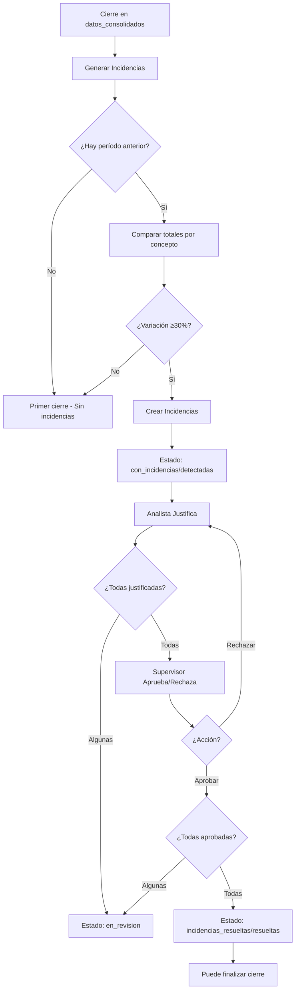

# 📋 Sistema de Incidencias - Flujo Actual (Noviembre 2025)

**Última actualización:** 4 de noviembre de 2025  
**Estado:** ✅ DOCUMENTACIÓN OFICIAL - Código en producción

---

## 🎯 Objetivo del Sistema

El sistema de incidencias detecta automáticamente **variaciones significativas (≥30%)** en conceptos de nómina entre períodos mensuales, permitiendo que analistas justifiquen y supervisores aprueben estas diferencias antes de finalizar el cierre.

---

## 📊 Estados del Cierre de Nómina

### Estados Principales (`estado`)

```
pendiente
  ↓
cargando_archivos
  ↓
archivos_completos
  ↓
datos_consolidados  ← Punto de partida para incidencias
  ↓
con_incidencias  ← Se generan incidencias
  ↓
incidencias_resueltas  ← Todas aprobadas
  ↓
finalizado
```

### Estados de Incidencias (`estado_incidencias`)

| Estado | Descripción | Cuándo se aplica |
|--------|-------------|------------------|
| `pendiente` | Sin procesar | Estado inicial |
| `detectadas` | Incidencias encontradas | Después de generar incidencias |
| `en_revision` | Algunas justificadas | Al menos 1 incidencia justificada, pero no todas aprobadas |
| `resueltas` | Todas aprobadas | Todas las incidencias en estado `aprobada_supervisor` |

### Contador (`total_incidencias`)

- **Valor:** Número de incidencias **pendientes de aprobar**
- **0:** Todas resueltas o sin incidencias
- **>0:** Incidencias pendientes

---

## 🔄 Flujo Completo del Sistema



---

## 📁 Arquitectura de Archivos

### **Backend - Archivos Principales**

```
backend/nomina/
├── models.py                                    # Modelos principales
│   ├── CierreNomina                            # Estado del cierre
│   ├── IncidenciaCierre                        # Incidencias detectadas
│   └── ResolucionIncidencia                    # Historial de resoluciones
│
├── utils/
│   ├── reconciliacion.py                       # ⭐ CORE - Lógica principal
│   │   ├── reconciliar_cierre_suma_total()    # Genera/actualiza incidencias
│   │   └── verificar_y_actualizar_estado_cierre()  # Actualiza estado automático
│   │
│   └── DetectarIncidenciasConsolidadas.py     # ⚠️ LEGACY - Solo 1 función activa
│       └── generar_incidencias_consolidados_v2()   # Wrapper obsoleto
│
├── views_incidencias.py                        # ⭐ ENDPOINTS PRINCIPALES
│   ├── IncidenciaCierreViewSet                # CRUD de incidencias
│   │   ├── justificar()                       # Analista justifica
│   │   ├── aprobar()                          # Supervisor aprueba
│   │   ├── rechazar()                         # Supervisor rechaza
│   │   └── aprobar_todas_pendientes()         # Aprobación masiva
│   │
│   └── ResolucionIncidenciaViewSet            # ⭐ MÁS USADO POR FRONTEND
│       ├── create()                           # POST /api/nomina/resoluciones-incidencias/
│       └── perform_create()                   # Lógica de creación + actualización estado
│
├── views.py                                    # Endpoints legacy
│   └── IncidenciaCierreViewSet.generar_incidencias()  # POST /api/nomina/incidencias-v2/{id}/generar/
│
├── tasks_refactored/
│   └── incidencias.py                         # Tarea Celery
│       └── generar_incidencias_con_logging()  # Llama a reconciliacion.py
│
└── serializers.py
    ├── IncidenciaCierreSerializer
    ├── ResolucionIncidenciaSerializer
    └── CrearResolucionSerializer
```

### **Frontend - Archivos Principales**

```
src/
├── api/
│   └── nomina.js                              # Cliente API
│       ├── generarIncidenciasCierre()        # POST /incidencias-v2/{id}/generar/
│       └── (resoluciones via axios directo)
│
├── components/TarjetasCierreNomina/
│   ├── IncidenciasEncontradasSection.jsx     # ⭐ UI Principal Incidencias
│   │   ├── Botón "Generar Incidencias"
│   │   ├── Lista de incidencias
│   │   └── Acciones: Justificar/Aprobar/Rechazar
│   │
│   └── DetalleIncidenciaModal.jsx            # Modal de conversación
│       ├── Historial de resoluciones
│       ├── Formulario de justificación
│       └── Botones de aprobación/rechazo
│
└── pages/
    └── CierreNominaDetalle.jsx               # Página principal del cierre
```

---

## 🔧 Funciones Principales

### 1. **Generación de Incidencias** 🎯

#### **Endpoint Frontend → Backend**

```javascript
// src/api/nomina.js
export const generarIncidenciasCierre = async (cierreId) => {
  const response = await api.post(`/nomina/incidencias-v2/${cierreId}/generar/`);
  return response.data;
}
```

#### **Endpoint Backend**

```python
# backend/nomina/views.py - Línea 2145
@action(detail=False, methods=['post'], url_path='generar/(?P<cierre_id>[^/.]+)')
def generar_incidencias(self, request, cierre_id=None):
    """
    🔍 ENDPOINT: Generar incidencias comparando datos consolidados
    """
    # Validaciones de estado
    estados_validos = ['datos_consolidados', 'con_incidencias', 'incidencias_resueltas']
    
    # Lanzar tarea Celery
    from .tasks_refactored.incidencias import generar_incidencias_con_logging
    task = generar_incidencias_con_logging.delay(cierre_id)
    
    return Response({
        "task_id": task.id,
        "cierre_id": cierre_id,
        "modo_procesamiento": "dual_v2"
    }, status=202)
```

#### **Tarea Celery**

```python
# backend/nomina/tasks_refactored/incidencias.py - Línea 233
@shared_task(bind=True)
def generar_incidencias_con_logging(self, cierre_id, usuario_id=0):
    """
    🔍 WRAPPER TASK: Genera incidencias con logging dual
    """
    from nomina.utils.reconciliacion import reconciliar_cierre_suma_total
    
    # Llamar a la función principal de reconciliación
    resultado_generacion = reconciliar_cierre_suma_total(
        cierre_id=cierre_id,
        umbral_pct=30.0
    )
    
    return {
        'success': True,
        'incidencias_generadas': resultado_generacion.get('creadas', 0),
        'estado_final': cierre.estado
    }
```

#### **Función CORE de Generación**

```python
# backend/nomina/utils/reconciliacion.py - Línea 53
def reconciliar_cierre_suma_total(cierre_id: int, umbral_pct: float = 30.0) -> dict:
    """
    ⭐ FUNCIÓN PRINCIPAL - Genera/actualiza incidencias
    
    Lógica:
    1. Obtiene cierre actual y cierre anterior finalizado
    2. Agrupa conceptos por (nombre_concepto, tipo_concepto)
    3. Calcula suma total de cada concepto en ambos períodos
    4. Detecta variaciones >= 30%
    5. UPSERT: Crea nuevas o actualiza existentes (por hash)
    6. Marca como resueltas las que ya no superan umbral
    7. ✅ Actualiza estado del cierre
    
    Returns:
        {
            'creadas': int,
            'actualizadas': int,
            'marcadas_resueltas': int,
            'version': int
        }
    """
    with transaction.atomic():
        cierre = CierreNomina.objects.select_for_update().get(id=cierre_id)
        
        # 1. Obtener cierre anterior
        cierre_anterior = obtener_cierre_anterior_finalizado(cierre)
        
        # 2. Calcular totales por concepto
        mapa_actual = totales_por_concepto(cierre)
        mapa_anterior = totales_por_concepto(cierre_anterior)
        
        # 3. Comparar y crear/actualizar incidencias
        for (nombre, tipo) in conceptos_unicos:
            variacion = calcular_variacion_pct(suma_actual, suma_anterior)
            
            if abs(variacion) >= umbral_pct:
                # Crear o actualizar incidencia
                IncidenciaCierre.objects.create(...)
        
        # 4. Marcar resueltas las que ya no superan umbral
        for incidencia_existente in incidencias_viejas:
            if no_supera_umbral:
                incidencia.estado = 'resuelta_analista'
        
        # ✅ 5. Actualizar estado del cierre
        total_vigentes = creadas + actualizadas
        if total_vigentes > 0:
            cierre.estado = 'con_incidencias'
            cierre.estado_incidencias = 'detectadas'
            cierre.total_incidencias = total_vigentes
        else:
            cierre.estado = 'incidencias_resueltas'
            cierre.estado_incidencias = 'resueltas'
            cierre.total_incidencias = 0
        cierre.save()
        
        return {'creadas': creadas, 'actualizadas': actualizadas, ...}
```

---

### 2. **Justificación de Incidencias** 📝

#### **Endpoint Frontend → Backend**

```javascript
// Frontend usa POST /api/nomina/resoluciones-incidencias/
const response = await axios.post('/api/nomina/resoluciones-incidencias/', {
  incidencia: incidenciaId,
  tipo_resolucion: 'justificacion',
  comentario: justificacionTexto
});
```

#### **Endpoint Backend**

```python
# backend/nomina/views_incidencias.py - Línea 110
class ResolucionIncidenciaViewSet(viewsets.ModelViewSet):
    """⭐ VIEWSET MÁS USADO - Maneja todas las resoluciones"""
    
    def perform_create(self, serializer):
        """
        Crear resolución y actualizar estado de incidencia
        
        Flujo:
        1. Crear resolución en BD
        2. Actualizar estado de la incidencia según tipo_resolucion
        3. ✅ Actualizar estado del cierre automáticamente
        """
        resolucion = serializer.save(usuario=self.request.user)
        incidencia = resolucion.incidencia
        tipo = resolucion.tipo_resolucion
        
        # Actualizar incidencia según tipo
        if tipo == 'justificacion':
            incidencia.estado = 'resuelta_analista'
            incidencia.resuelto_por = self.request.user
            incidencia.comentario_resolucion = resolucion.comentario
            
        elif tipo == 'aprobacion':
            incidencia.estado = 'aprobada_supervisor'
            incidencia.supervisor_revisor = self.request.user
            
        elif tipo == 'rechazo':
            incidencia.estado = 'rechazada_supervisor'
            incidencia.asignado_a = None  # Liberar para re-trabajo
        
        incidencia.save()
        
        # ✅ ACTUALIZAR ESTADO DEL CIERRE automáticamente
        if tipo in ['justificacion', 'aprobacion', 'rechazo']:
            from nomina.utils.reconciliacion import verificar_y_actualizar_estado_cierre
            verificar_y_actualizar_estado_cierre(incidencia.cierre.id)
```

---

### 3. **Aprobación de Incidencias** ✅

#### **Métodos Disponibles**

**A) Via ResolucionIncidenciaViewSet (MÁS USADO)**
```python
# POST /api/nomina/resoluciones-incidencias/
{
  "incidencia": 123,
  "tipo_resolucion": "aprobacion",
  "comentario": "Aprobado - Variación justificada"
}
```

**B) Via IncidenciaCierreViewSet.aprobar()**
```python
# POST /api/nomina/incidencias/{id}/aprobar/
# backend/nomina/views_incidencias.py - Línea 475
@action(detail=True, methods=['post'])
def aprobar(self, request, pk=None):
    """Aprobar una incidencia como supervisor"""
    # ... crear resolución ...
    incidencia.estado = 'aprobada_supervisor'
    incidencia.save()
    
    # ✅ Actualizar estado del cierre
    from nomina.utils.reconciliacion import verificar_y_actualizar_estado_cierre
    verificar_y_actualizar_estado_cierre(incidencia.cierre.id)
```

**C) Aprobación Masiva**
```python
# POST /api/nomina/incidencias/aprobar-todas-pendientes/{cierre_id}/
# backend/nomina/views_incidencias.py - Línea 798
@action(detail=False, methods=['post'])
def aprobar_todas_pendientes(self, request, cierre_id=None):
    """Aprobar TODAS las incidencias resuelta_analista de un cierre"""
    for incidencia in incidencias_pendientes:
        incidencia.estado = 'aprobada_supervisor'
        incidencia.save()
    
    # ✅ Actualizar estado del cierre UNA VEZ al final
    from nomina.utils.reconciliacion import verificar_y_actualizar_estado_cierre
    verificar_y_actualizar_estado_cierre(cierre.id)
```

---

### 4. **Actualización Automática del Estado del Cierre** 🔄

#### **Función Centralizada**

```python
# backend/nomina/utils/reconciliacion.py - Línea 53
def verificar_y_actualizar_estado_cierre(cierre_id: int) -> dict:
    """
    ⭐ FUNCIÓN CENTRALIZADA - Actualiza estado según incidencias
    
    Lógica:
    - Total = 0 incidencias → 'incidencias_resueltas' / 'resueltas'
    - Todas aprobadas → 'incidencias_resueltas' / 'resueltas'
    - Algunas justificadas → 'con_incidencias' / 'en_revision'
    - Ninguna justificada → 'con_incidencias' / 'detectadas'
    
    Se llama automáticamente desde:
    - ResolucionIncidenciaViewSet.perform_create()
    - IncidenciaCierreViewSet.justificar()
    - IncidenciaCierreViewSet.aprobar()
    - IncidenciaCierreViewSet.aprobar_todas_pendientes()
    - reconciliar_cierre_suma_total()
    """
    cierre = CierreNomina.objects.get(id=cierre_id)
    
    total_incidencias = cierre.incidencias.count()
    incidencias_aprobadas = cierre.incidencias.filter(
        estado='aprobada_supervisor'
    ).count()
    incidencias_resueltas = cierre.incidencias.filter(
        estado__in=['resuelta_analista', 'aprobada_supervisor']
    ).count()
    
    # CASO 1: Sin incidencias
    if total_incidencias == 0:
        cierre.estado = 'incidencias_resueltas'
        cierre.estado_incidencias = 'resueltas'
        cierre.total_incidencias = 0
    
    # CASO 2: Todas aprobadas
    elif incidencias_aprobadas == total_incidencias:
        cierre.estado = 'incidencias_resueltas'
        cierre.estado_incidencias = 'resueltas'
        cierre.total_incidencias = 0
    
    # CASO 3: Hay pendientes
    else:
        cierre.estado = 'con_incidencias'
        if incidencias_resueltas > 0:
            cierre.estado_incidencias = 'en_revision'
        else:
            cierre.estado_incidencias = 'detectadas'
        cierre.total_incidencias = total_incidencias - incidencias_aprobadas
    
    cierre.save(update_fields=['estado', 'estado_incidencias', 'total_incidencias'])
    
    return {
        'success': True,
        'estado_nuevo': cierre.estado,
        'cambio_realizado': True/False
    }
```

---

## 📊 Estados de una Incidencia

```
pendiente
  ↓ (Analista justifica)
resuelta_analista
  ↓ (Supervisor rechaza)    ↓ (Supervisor aprueba)
rechazada_supervisor     aprobada_supervisor
  ↓ (Analista re-justifica)
resuelta_analista
  ↓ (Supervisor aprueba)
aprobada_supervisor ✅
```

### Campos Importantes del Modelo `IncidenciaCierre`

```python
class IncidenciaCierre(models.Model):
    # Relación
    cierre = ForeignKey(CierreNomina)
    
    # Identificación
    tipo_incidencia = CharField()  # 'variacion_suma_total'
    tipo_comparacion = CharField()  # 'suma_total'
    concepto_afectado = CharField()  # 'SUELDO BASE'
    clasificacion_concepto = CharField()  # 'haber_imponible'
    
    # Estado
    estado = CharField(choices=[
        ('pendiente', 'Pendiente'),
        ('resuelta_analista', 'Resuelta por Analista'),
        ('rechazada_supervisor', 'Rechazada por Supervisor'),
        ('aprobada_supervisor', 'Aprobada por Supervisor'),
    ])
    prioridad = CharField()  # 'critica', 'alta', 'media', 'baja'
    
    # Datos
    descripcion = TextField()  # "Variación 45.2% en suma total de SUELDO BASE"
    impacto_monetario = DecimalField()  # Valor absoluto de la diferencia
    datos_adicionales = JSONField()  # Detalles de montos y variación
    
    # Trazabilidad
    hash_deteccion = CharField()  # Hash estable para upsert
    version_detectada_primera = IntegerField()
    version_detectada_ultima = IntegerField()
    
    # Asignación
    asignado_a = ForeignKey(User)
    resuelto_por = ForeignKey(User)  # Analista que justificó
    supervisor_revisor = ForeignKey(User)  # Supervisor que aprobó/rechazó
    
    # Comentarios
    comentario_resolucion = TextField()  # Justificación del analista
    comentario_supervisor = TextField()  # Comentario del supervisor
    
    # Fechas
    fecha_deteccion = DateTimeField()
    fecha_primera_resolucion = DateTimeField()
    fecha_resolucion = DateTimeField()  # Última justificación
    fecha_resolucion_final = DateTimeField()  # Aprobación/Rechazo
    fecha_ultima_accion = DateTimeField()
```

---

## 🔀 Modelo de Datos Completo

```
CierreNomina
├── id: 35
├── estado: 'con_incidencias'
├── estado_incidencias: 'en_revision'
├── total_incidencias: 3
├── cliente_id: 20
├── periodo: '2025-10'
└── version_datos: 1
    │
    ├─── IncidenciaCierre (5 registros)
    │    ├── id: 15740
    │    │   ├── estado: 'aprobada_supervisor'
    │    │   ├── concepto_afectado: 'COLACION'
    │    │   ├── hash_deteccion: 'abc123...'
    │    │   └── resoluciones ↓
    │    │       ├── Resolucion #1 (justificacion)
    │    │       └── Resolucion #2 (aprobacion)
    │    │
    │    ├── id: 15741
    │    │   ├── estado: 'resuelta_analista'
    │    │   ├── concepto_afectado: 'MOVILIZACION'
    │    │   └── resoluciones ↓
    │    │       └── Resolucion #1 (justificacion)
    │    │
    │    └── ... (3 más)
    │
    └─── NominaConsolidada (empleados)
         └─── ConceptoConsolidado (conceptos por empleado)
```

---

## 🚀 Flujo de Ejecución Paso a Paso

### **Paso 1: Usuario presiona "Generar Incidencias"**

```javascript
// Frontend
const manejarGenerarIncidencias = async () => {
  const resultado = await generarIncidenciasCierre(cierre.id);
  // resultado.task_id = "uuid-1234..."
};
```

### **Paso 2: Backend lanza tarea Celery**

```python
# views.py
task = generar_incidencias_con_logging.delay(cierre_id)
return Response({"task_id": task.id}, status=202)
```

### **Paso 3: Worker Celery ejecuta**

```python
# tasks_refactored/incidencias.py
from nomina.utils.reconciliacion import reconciliar_cierre_suma_total
resultado = reconciliar_cierre_suma_total(cierre_id, umbral_pct=30.0)
```

### **Paso 4: Generación/Actualización de incidencias**

```python
# utils/reconciliacion.py
def reconciliar_cierre_suma_total(cierre_id, umbral_pct=30.0):
    # 1. Obtener cierres
    cierre_actual = CierreNomina.objects.get(id=cierre_id)
    cierre_anterior = obtener_cierre_anterior_finalizado()
    
    # 2. Calcular totales
    mapa_actual = {('SUELDO BASE', 'haber_imponible'): 5000000}
    mapa_anterior = {('SUELDO BASE', 'haber_imponible'): 3500000}
    
    # 3. Calcular variación
    variacion = (5000000 - 3500000) / 3500000 * 100  # = 42.86%
    
    # 4. Crear/actualizar incidencia si >= 30%
    if abs(variacion) >= 30:
        IncidenciaCierre.objects.create(
            cierre=cierre_actual,
            tipo_incidencia='variacion_suma_total',
            concepto_afectado='SUELDO BASE',
            descripcion=f'Variación {variacion:.1f}% en suma total',
            impacto_monetario=1500000,
            estado='pendiente',
            hash_deteccion='hash_sueldo_base_haber'
        )
    
    # 5. Actualizar estado del cierre
    cierre.estado = 'con_incidencias'
    cierre.estado_incidencias = 'detectadas'
    cierre.total_incidencias = 5
    cierre.save()
```

### **Paso 5: Analista justifica incidencia**

```javascript
// Frontend
await axios.post('/api/nomina/resoluciones-incidencias/', {
  incidencia: 15740,
  tipo_resolucion: 'justificacion',
  comentario: 'Ingresaron 3 empleados nuevos este mes con sueldo alto'
});
```

```python
# Backend: ResolucionIncidenciaViewSet.perform_create()
def perform_create(self, serializer):
    resolucion = serializer.save(usuario=request.user)
    
    # Actualizar incidencia
    incidencia.estado = 'resuelta_analista'
    incidencia.resuelto_por = request.user
    incidencia.comentario_resolucion = resolucion.comentario
    incidencia.save()
    
    # ✅ Actualizar estado del cierre
    verificar_y_actualizar_estado_cierre(incidencia.cierre.id)
    
    # Resultado:
    # cierre.estado = 'con_incidencias'
    # cierre.estado_incidencias = 'en_revision'  # ← Cambió
    # cierre.total_incidencias = 5
```

### **Paso 6: Supervisor aprueba incidencia**

```javascript
// Frontend
await axios.post('/api/nomina/resoluciones-incidencias/', {
  incidencia: 15740,
  tipo_resolucion: 'aprobacion',
  comentario: 'Aprobado - Justificación correcta'
});
```

```python
# Backend: ResolucionIncidenciaViewSet.perform_create()
def perform_create(self, serializer):
    resolucion = serializer.save(usuario=request.user)
    
    # Actualizar incidencia
    incidencia.estado = 'aprobada_supervisor'
    incidencia.supervisor_revisor = request.user
    incidencia.save()
    
    # ✅ Actualizar estado del cierre
    verificar_y_actualizar_estado_cierre(incidencia.cierre.id)
    
    # Resultado (si es la última):
    # cierre.estado = 'incidencias_resueltas'  # ← Cambió
    # cierre.estado_incidencias = 'resueltas'   # ← Cambió
    # cierre.total_incidencias = 0              # ← Cambió
```

---

## ⚠️ Código OBSOLETO - NO USAR

### Archivos/Funciones Deprecados

```
❌ backend/nomina/utils/DetectarIncidenciasConsolidadas.py
   ├── procesar_incidencias_suma_total_simple()  # OBSOLETO
   ├── procesar_chunk_comparacion_individual()   # OBSOLETO
   └── generar_incidencias_consolidados_v2()     # Wrapper - Solo llama a reconciliacion.py

❌ backend/nomina/views.py
   └── IncidenciaCierreViewSet.generar_incidencias_simple()  # OBSOLETO

❌ backend/nomina/tasks.py (si existe)
   └── generar_incidencias_totales_simple()  # OBSOLETO
```

### ¿Por qué están obsoletos?

1. **Código duplicado** - Hacían lo mismo que `reconciliacion.py`
2. **Sin actualización de estado** - No actualizaban `estado_incidencias`
3. **No usaban hash estable** - Creaban duplicados en re-generaciones
4. **No marcaban resueltas** - No limpiaban incidencias que ya no aplican

---

## 🔍 Cómo Verificar el Estado del Sistema

### Query SQL para Estado del Cierre

```sql
SELECT 
  id,
  periodo,
  estado,
  estado_incidencias,
  total_incidencias,
  cliente_id
FROM nomina_cierrenomina
WHERE id = 35;
```

### Query SQL para Incidencias

```sql
SELECT 
  id,
  tipo_incidencia,
  concepto_afectado,
  estado,
  prioridad,
  impacto_monetario,
  descripcion
FROM nomina_incidenciacierre
WHERE cierre_id = 35
ORDER BY estado, concepto_afectado;
```

### Script Python para Verificación

```python
from nomina.models import CierreNomina, IncidenciaCierre
from django.db.models import Count

cierre = CierreNomina.objects.get(id=35)

print(f"Cierre {cierre.id}:")
print(f"  Estado: {cierre.estado}")
print(f"  Estado incidencias: {cierre.estado_incidencias}")
print(f"  Total incidencias: {cierre.total_incidencias}")

print("\nIncidencias por estado:")
estados = cierre.incidencias.values('estado').annotate(count=Count('id'))
for estado in estados:
    print(f"  {estado['estado']}: {estado['count']}")
```

---

## 🎨 Endpoints Disponibles

### Generación

```
POST /api/nomina/incidencias-v2/{cierre_id}/generar/
→ Genera incidencias comparando con período anterior
→ Retorna: {"task_id": "...", "cierre_id": 35}
```

### Listado

```
GET /api/nomina/incidencias/?cierre={cierre_id}
→ Lista todas las incidencias del cierre
→ Filtros: estado, prioridad, tipo_incidencia

GET /api/nomina/incidencias/resumen/{cierre_id}/
→ Resumen agregado de incidencias
→ Retorna: {total, por_estado, por_prioridad}
```

### Resoluciones (⭐ MÁS USADO)

```
POST /api/nomina/resoluciones-incidencias/
Body: {
  "incidencia": 123,
  "tipo_resolucion": "justificacion|aprobacion|rechazo|consulta",
  "comentario": "..."
}
→ Crea resolución y actualiza estado automáticamente

GET /api/nomina/resoluciones-incidencias/historial/{incidencia_id}/
→ Historial completo de resoluciones de una incidencia
```

### Acciones Individuales (Alternativa)

```
POST /api/nomina/incidencias/{id}/justificar/
Body: {"justificacion": "..."}

POST /api/nomina/incidencias/{id}/aprobar/
Body: {"comentario": "..."}

POST /api/nomina/incidencias/{id}/rechazar/
Body: {"comentario": "..."}
```

### Acciones Masivas

```
POST /api/nomina/incidencias/aprobar-todas-pendientes/{cierre_id}/
Body: {"comentario": "Aprobación masiva"}
→ Aprueba TODAS las incidencias en estado resuelta_analista
```

---

## 🧪 Testing Manual

### 1. Generar Incidencias

```bash
# Generar incidencias para cierre 35
curl -X POST http://localhost:8000/api/nomina/incidencias-v2/35/generar/ \
  -H "Authorization: Bearer TOKEN" \
  -H "Content-Type: application/json"

# Verificar estado
curl http://localhost:8000/api/nomina/cierres/35/ \
  -H "Authorization: Bearer TOKEN"
```

### 2. Justificar Incidencia

```bash
curl -X POST http://localhost:8000/api/nomina/resoluciones-incidencias/ \
  -H "Authorization: Bearer TOKEN" \
  -H "Content-Type: application/json" \
  -d '{
    "incidencia": 15740,
    "tipo_resolucion": "justificacion",
    "comentario": "Ingresaron 3 empleados nuevos"
  }'
```

### 3. Aprobar Incidencia

```bash
curl -X POST http://localhost:8000/api/nomina/resoluciones-incidencias/ \
  -H "Authorization: Bearer TOKEN" \
  -H "Content-Type: application/json" \
  -d '{
    "incidencia": 15740,
    "tipo_resolucion": "aprobacion",
    "comentario": "Aprobado"
  }'
```

### 4. Verificar Estado del Cierre

```bash
# Debe estar en 'incidencias_resueltas' / 'resueltas' si todas aprobadas
curl http://localhost:8000/api/nomina/cierres/35/estado-incidencias/ \
  -H "Authorization: Bearer TOKEN"
```

---

## 🐛 Troubleshooting

### Problema: Estado no se actualiza después de aprobar

**Causa:** El código se ejecutó antes del reinicio de Django

**Solución:**
```bash
# Reiniciar Django
docker compose restart django

# Ejecutar manualmente la función
docker exec sgm-django-1 python manage.py shell -c "
from nomina.utils.reconciliacion import verificar_y_actualizar_estado_cierre
verificar_y_actualizar_estado_cierre(35)
"
```

### Problema: Incidencias duplicadas

**Causa:** No se está usando el hash estable correctamente

**Verificación:**
```python
# Verificar que todas las incidencias tienen hash
incidencias_sin_hash = IncidenciaCierre.objects.filter(
    cierre_id=35,
    hash_deteccion__isnull=True
)
print(f"Incidencias sin hash: {incidencias_sin_hash.count()}")
```

### Problema: No se generan incidencias

**Causas posibles:**
1. No existe cierre anterior finalizado
2. Variaciones < 30%
3. Conceptos excluidos (tipo='informativo')

**Verificación:**
```python
from nomina.models import CierreNomina

cierre = CierreNomina.objects.get(id=35)
cierre_anterior = CierreNomina.objects.filter(
    cliente=cierre.cliente,
    periodo__lt=cierre.periodo,
    estado='finalizado'
).order_by('-periodo').first()

print(f"Cierre anterior: {cierre_anterior}")
```

---

## 📚 Resumen de Funciones por Archivo

### `utils/reconciliacion.py` (PRINCIPAL)

| Función | Uso | Público |
|---------|-----|---------|
| `reconciliar_cierre_suma_total()` | Genera/actualiza incidencias | ✅ |
| `verificar_y_actualizar_estado_cierre()` | Actualiza estado automático | ✅ |
| `_hash_incidencia_suma_total()` | Hash estable para upsert | ❌ Privada |
| `_variacion_pct()` | Calcula variación % | ❌ Privada |
| `_obtener_usuario_sistema()` | Usuario para comentarios auto | ❌ Privada |

### `views_incidencias.py` (ENDPOINTS)

| Clase/Método | Endpoint | Uso |
|--------------|----------|-----|
| `ResolucionIncidenciaViewSet.create()` | `POST /resoluciones-incidencias/` | ⭐ Principal |
| `IncidenciaCierreViewSet.justificar()` | `POST /incidencias/{id}/justificar/` | Alternativa |
| `IncidenciaCierreViewSet.aprobar()` | `POST /incidencias/{id}/aprobar/` | Alternativa |
| `IncidenciaCierreViewSet.rechazar()` | `POST /incidencias/{id}/rechazar/` | Alternativa |
| `IncidenciaCierreViewSet.aprobar_todas_pendientes()` | `POST /incidencias/aprobar-todas-pendientes/{id}/` | Masiva |

### `views.py` (ENTRADA)

| Método | Endpoint | Uso |
|--------|----------|-----|
| `IncidenciaCierreViewSet.generar_incidencias()` | `POST /incidencias-v2/{id}/generar/` | ⭐ Genera |

### `tasks_refactored/incidencias.py` (CELERY)

| Función | Uso |
|---------|-----|
| `generar_incidencias_con_logging()` | Task Celery - Wrapper con logging |

---

## 🎯 Conclusiones

### ✅ Código Activo y Recomendado

- **`utils/reconciliacion.py`** → Core de la lógica
- **`views_incidencias.py`** → Todos los endpoints
- **`tasks_refactored/incidencias.py`** → Tarea Celery
- **Frontend: `IncidenciasEncontradasSection.jsx`** → UI principal

### ❌ Código Obsoleto (Ignorar)

- `DetectarIncidenciasConsolidadas.py` (excepto wrapper)
- Endpoints `*_simple` en views.py
- Tasks antiguas en tasks.py

### 🔑 Puntos Clave

1. **Un solo punto de generación**: `reconciliar_cierre_suma_total()`
2. **Actualización automática**: `verificar_y_actualizar_estado_cierre()`
3. **Hash estable**: Evita duplicados en re-generaciones
4. **Upsert inteligente**: Actualiza existentes, crea nuevas, marca resueltas
5. **Estados sincronizados**: `estado`, `estado_incidencias`, `total_incidencias`

---

**Mantenido por:** Sistema SGM  
**Versión del documento:** 1.0  
**Fecha:** 4 de noviembre de 2025
