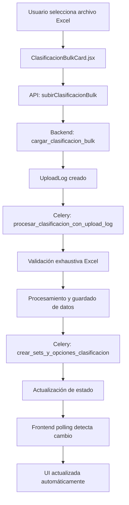
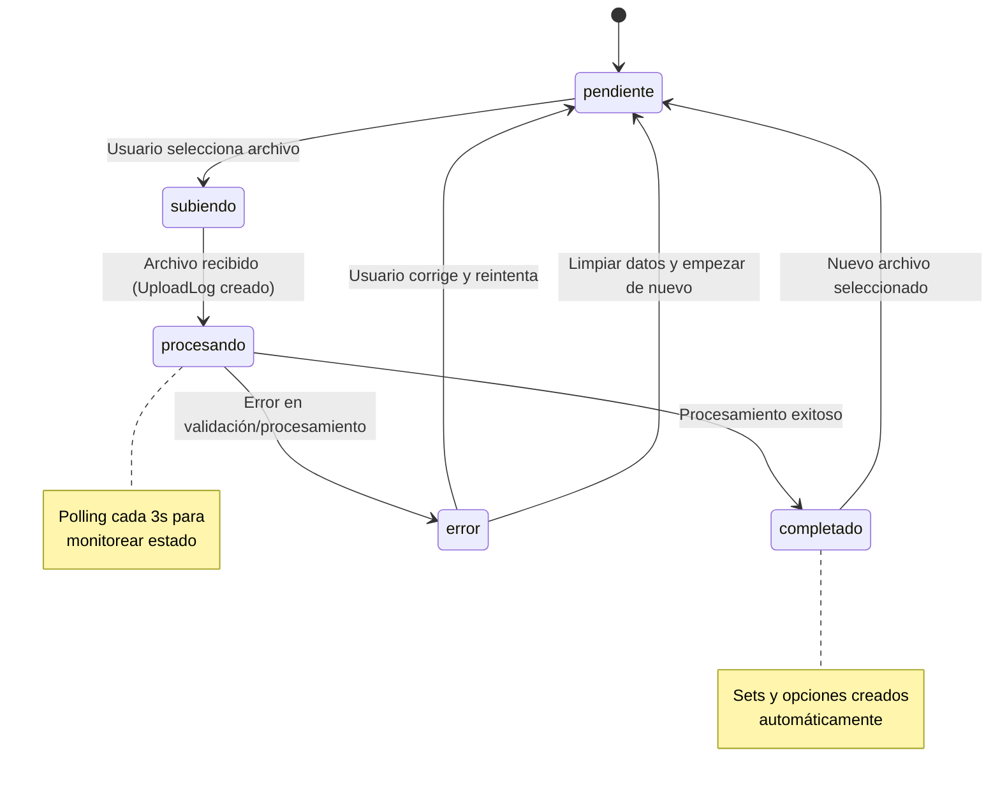

# 📋 Documentación: ClasificacionBulkCard

## 🎯 Objetivo
Esta documentación explica el funcionamiento completo de la tarjeta de **Clasificación Bulk** desde el frontend hasta el backend, incluyendo los modelos, APIs, validaciones y flujo de datos. El objetivo es servir como referencia para implementar tarjetas similares en el futuro.

**Última actualización:** 23 de junio de 2025

---

## 📐 Arquitectura General



---

## 🎨 Frontend: ClasificacionBulkCard.jsx

### 📍 Ubicación
`/src/components/TarjetasCierreContabilidad/ClasificacionBulkCard.jsx`

### 🎯 Propósito
Permite al usuario subir archivos Excel con clasificaciones contables y monitorea el proceso de subida y procesamiento en tiempo real.

### 📊 Estados Principales

```javascript
// Estados de archivo y procesamiento
const [archivoNombre, setArchivoNombre] = useState("");
const [estado, setEstado] = useState("pendiente");
const [subiendo, setSubiendo] = useState(false);
const [uploads, setUploads] = useState([]);
const [ultimoUpload, setUltimoUpload] = useState(null);
const [registrosRaw, setRegistrosRaw] = useState([]);

// Estados para UploadLog (monitoreo en tiempo real)
const [uploadLogId, setUploadLogId] = useState(null);
const [uploadEstado, setUploadEstado] = useState(null);
const [uploadProgreso, setUploadProgreso] = useState("");

// Estados de UI y manejo de errores
const [error, setError] = useState("");
const [eliminando, setEliminando] = useState(false);
const [errorEliminando, setErrorEliminando] = useState("");
const [notificacion, setNotificacion] = useState({
  visible: false,
  tipo: "",
  mensaje: "",
});

// Estados para modal
const [modalRegistrosRaw, setModalRegistrosRaw] = useState(false);
```

### 🔄 Flujo de Estados



### 🎛️ Funciones Principales

#### 1. **cargar()** - Obtener estado actual y datos
```javascript
const cargar = async () => {
  try {
    // 1. Obtener historial de uploads del cliente
    const data = await obtenerBulkClasificaciones(clienteId);
    setUploads(data);
    const last = data && data.length > 0 ? data[0] : null;
    setUltimoUpload(last);
    
    if (last) {
      // 2. Cargar registros raw si existe el upload
      if (last.id) {
        try {
          const registros = await obtenerClasificacionesArchivo(last.id);
          setRegistrosRaw(registros);
          
          // 3. Determinar estado inteligente basado en datos reales
          const tieneRegistros = registros.length > 0;
          if (tieneRegistros) {
            setEstado(last.estado); // Usar estado del UploadLog
          } else {
            setEstado("pendiente"); // Sin datos = pendiente
          }
          
          // 4. Notificar al componente padre
          if (onCompletado) onCompletado(tieneRegistros);
        } catch (err) {
          console.log("No hay registros raw o error cargándolos:", err);
          setRegistrosRaw([]);
          setEstado("pendiente");
          if (onCompletado) onCompletado(false);
        }
      } else {
        setEstado("pendiente");
        if (onCompletado) onCompletado(false);
      }
    } else {
      // Sin uploads previos
      setEstado("pendiente");
      setRegistrosRaw([]);
      if (onCompletado) onCompletado(false);
    }
  } catch (e) {
    console.error("Error al cargar uploads:", e);
    setEstado("pendiente");
  }
};
```

#### 2. **handleSeleccionArchivo()** - Subir archivo con validación
```javascript
const handleSeleccionArchivo = async (e) => {
  const archivo = e.target.files[0];
  if (!archivo) return;

  // 1. Preparar estado de subida
  setArchivoNombre(archivo.name);
  setSubiendo(true);
  setError("");
  setUploadProgreso("Subiendo archivo...");
  setUploadLogId(null);
  setUploadEstado(null);

  // 2. Crear FormData con cliente y archivo
  const form = new FormData();
  form.append("cliente_id", clienteId);
  form.append("archivo", archivo);

  try {
    const response = await subirClasificacionBulk(form);

    // 3. Configurar monitoreo si retorna upload_log_id
    if (response.upload_log_id) {
      setUploadLogId(response.upload_log_id);
      setUploadProgreso("Archivo recibido, iniciando procesamiento...");
      mostrarNotificacion("info", "📤 Archivo subido correctamente. Procesando...");
    } else {
      // Fallback para compatibilidad
      setEstado("procesando");
      setUploadProgreso("");
      setTimeout(() => cargar(), 1000);
    }
  } catch (e) {
    console.error("Error al subir archivo:", e);
    setSubiendo(false);
    setUploadProgreso("");

    // 4. Manejo específico de errores
    if (e.response?.status === 409) {
      // Conflicto: Ya existen clasificaciones
      const msg = '⚠️ Ya hay clasificaciones existentes para este cliente. Para subir un nuevo archivo, primero debe eliminar las clasificaciones anteriores usando el botón "Eliminar todos" del historial.';
      setError(msg);
      mostrarNotificacion("warning", msg);
    } else if (e.response?.status === 400 && e.response.data?.formato_esperado) {
      // Error de formato de nombre
      const errData = e.response.data;
      setError(`Formato de nombre incorrecto. Esperado: ${errData.formato_esperado}, Recibido: ${errData.archivo_recibido}`);
      mostrarNotificacion("warning", 
        `❌ Nombre de archivo incorrecto\n\n` +
        `📋 Formato requerido: ${errData.formato_esperado}\n` +
        `📁 Archivo enviado: ${errData.archivo_recibido}\n\n` +
        "💡 Asegúrese de que el archivo siga exactamente el formato indicado."
      );
    } else if (e.response?.data?.error) {
      // Error específico del servidor
      setError(e.response.data.error);
      mostrarNotificacion("error", e.response.data.error);
    } else {
      // Error genérico
      setError("Error al subir el archivo. Verifique el formato.");
      mostrarNotificacion("error", "❌ Error al subir el archivo.");
    }
    
    if (onCompletado) onCompletado(false);
  }
};
```

#### 3. **Monitoreo en Tiempo Real con Polling**
```javascript
useEffect(() => {
  if (!uploadLogId || !subiendo) return;

  const monitorearUpload = async () => {
    try {
      const logData = await obtenerEstadoUploadLog(uploadLogId);
      setUploadEstado(logData);
      
      // Actualizar progreso según estado
      if (logData.estado === "procesando") {
        setUploadProgreso("Procesando archivo...");
      } else if (logData.estado === "completado") {
        setUploadProgreso("¡Procesamiento completado!");
        setSubiendo(false);
        setEstado("completado");
        cargar(); // Recargar datos
      } else if (logData.estado === "error") {
        setUploadProgreso("Error en el procesamiento");
        setSubiendo(false);
        setEstado("error");
        setError(logData.errores || "Error en el procesamiento");
      }
    } catch (err) {
      console.error("Error monitoreando upload:", err);
    }
  };

  // Polling cada 3 segundos
  const interval = setInterval(monitorearUpload, 3000);
  return () => clearInterval(interval);
}, [uploadLogId, subiendo]);
```

#### 4. **handleEliminarTodos()** - Limpieza de datos
```javascript
const handleEliminarTodos = async () => {
  setEliminando(true);
  setErrorEliminando("");
  
  try {
    await eliminarTodosBulkClasificacion(clienteId);
    
    // Resetear estado local
    setEstado("pendiente");
    setUploads([]);
    setRegistrosRaw([]);
    
    // Recargar el estado completo
    await cargar();
    if (onCompletado) onCompletado(false);
  } catch (err) {
    setErrorEliminando("Error al eliminar los archivos.");
  } finally {
    setEliminando(false);
  }
};
```

### 🎨 UI Condicional Inteligente

```jsx
{/* Información del estado y resumen - Lógica multicapa para mostrar información relevante */}
<div className="text-xs text-gray-400 italic mt-2">
  {(estado === "completado" || (ultimoUpload && registrosRaw.length > 0)) && ultimoUpload?.resumen ? (
    // CASO 1: Archivo completamente procesado con resumen
    <div className="space-y-2">
      <div className="text-green-400">✔ Archivo procesado correctamente</div>
      
      {/* Estadísticas de procesamiento */}
      <div>
        📊 {ultimoUpload.resumen.registros_guardados || 0} registros guardados de {ultimoUpload.resumen.total_filas || 0} filas
        {ultimoUpload.resumen.filas_vacias > 0 && (
          <span className="text-gray-500"> • {ultimoUpload.resumen.filas_vacias} filas vacías omitidas</span>
        )}
      </div>
      
      {/* Sets encontrados */}
      <div>
        📋 Sets encontrados: {ultimoUpload.resumen.sets_encontrados?.join(", ") || "Ninguno"}
      </div>

      {/* Información de registros cargados */}
      {registrosRaw.length > 0 && (
        <div className="flex items-center gap-2">
          <span>📋 {registrosRaw.length} registros cargados</span>
        </div>
      )}

      {/* Mostrar errores si los hay */}
      {ultimoUpload.resumen.errores_count > 0 && (
        <div className="text-yellow-400">
          ⚠ {ultimoUpload.resumen.errores_count} errores encontrados en el procesamiento
        </div>
      )}
    </div>
  ) : estado === "procesando" ? (
    // CASO 2: Archivo en procesamiento
    <div className="text-blue-400">🔄 Procesando clasificaciones…</div>
  ) : estado === "error" && ultimoUpload?.errores ? (
    // CASO 3: Error en procesamiento
    <div className="text-red-400">❌ Error: {ultimoUpload.errores}</div>
  ) : ultimoUpload && registrosRaw.length > 0 ? (
    // CASO 4: Archivo cargado pero sin resumen completo
    <div className="text-yellow-400">
      📋 Archivo cargado con {registrosRaw.length} registros
    </div>
  ) : ultimoUpload ? (
    // CASO 5: Upload existe pero sin datos procesados
    <div className="text-gray-400">
      📄 Archivo subido: {ultimoUpload.nombre_archivo_original}
    </div>
  ) : (
    // CASO 6: Estado inicial - no hay uploads
    <div>Aún no se ha subido el archivo.</div>
  )}
</div>

{/* Indicador de progreso durante procesamiento */}
{subiendo && uploadEstado && (
  <div className="text-xs bg-blue-900/20 border border-blue-500/30 rounded p-2 mt-2">
    <div className="flex items-center justify-between mb-1">
      <span className="font-medium text-blue-200">Procesando:</span>
      <span className="text-blue-300">{uploadEstado.estado}</span>
    </div>
    
    {/* Mostrar métricas de procesamiento si están disponibles */}
    {uploadEstado.registros_procesados > 0 && (
      <div className="text-blue-300">
        Registros: {uploadEstado.registros_exitosos || 0} exitosos, {uploadEstado.registros_fallidos || 0} fallidos
      </div>
    )}
    
    {uploadEstado.tiempo_procesamiento_segundos && (
      <div className="text-blue-300">
        Tiempo: {uploadEstado.tiempo_procesamiento_segundos}s
      </div>
    )}
  </div>
)}

{/* Mostrar errores con sugerencias */}
{error && (
  <div className="text-xs text-red-400 mt-1 p-2 bg-red-900/20 rounded border border-red-500/30">
    <p className="font-medium">⚠️ {error}</p>
    {error.includes("Eliminar todos") && (
      <p className="mt-1 text-gray-300">
        💡 Tip: Use el botón "Eliminar todos" para limpiar los datos existentes y luego suba el nuevo archivo.
      </p>
    )}
  </div>
)}
```

### 🔧 Componentes Auxiliares

#### **Botones de Acción**
```jsx
<div className="flex gap-2 mt-2">
  <button
    onClick={() => setModalRegistrosRaw(true)}
    className="px-3 py-1 rounded text-sm font-medium transition bg-blue-700 hover:bg-blue-600 text-white flex items-center gap-2"
    disabled={!ultimoUpload?.id}
  >
    <Settings size={16} />
    Ver clasificaciones
  </button>
</div>
```

#### **Formato Requerido**
```jsx
<div className="text-xs text-gray-400 bg-gray-900/50 border border-gray-600 rounded p-2 mb-2">
  <div className="font-medium text-gray-300 mb-1">📋 Formato de archivo requerido:</div>
  <div className="font-mono text-yellow-300">
    {cliente?.rut
      ? `${cliente.rut.replace(/\./g, "").replace("-", "")}_Clasificacion.xlsx`
      : "RUT_Clasificacion.xlsx"}
  </div>
</div>
```

---

## 🌐 APIs del Frontend

### 📍 Ubicación
`/src/api/contabilidad.js`

### 🔗 Endpoints Utilizados

#### 1. **obtenerBulkClasificaciones** - Historial de uploads
```javascript
export const obtenerBulkClasificaciones = async (clienteId) => {
  const res = await api.get(`/contabilidad/clientes/${clienteId}/uploads/`, {
    params: { tipo: "clasificacion" },
  });
  return res.data.uploads;
};
```

#### 2. **subirClasificacionBulk** - Upload de archivo
```javascript
export const subirClasificacionBulk = async (formData) => {
  const res = await api.post(
    "/contabilidad/clasificacion-bulk/subir-archivo/",
    formData,
  );
  return res.data;
};
```

#### 3. **obtenerEstadoUploadLog** - Monitoreo en tiempo real
```javascript
export const obtenerEstadoUploadLog = async (uploadLogId) => {
  const res = await api.get(`/contabilidad/upload-log/${uploadLogId}/estado/`);
  return res.data;
};
```

#### 4. **obtenerClasificacionesArchivo** - Datos procesados
```javascript
export const obtenerClasificacionesArchivo = async (uploadId) => {
  const res = await api.get("/contabilidad/clasificacion-archivo/", {
    params: { upload_log: uploadId },
  });
  return res.data;
};
```

#### 5. **eliminarTodosBulkClasificacion** - Limpieza de datos
```javascript
export const eliminarTodosBulkClasificacion = async (clienteId) => {
  const res = await api.post(
    "/contabilidad/clasificacion-bulk/eliminar-todos/",
    {
      cliente_id: clienteId,
    },
  );
  return res.data;
};
```

#### 6. **obtenerHistorialUploads** - Historial completo
```javascript
export const obtenerHistorialUploads = async (clienteId, tipo = null, limit = 20) => {
  const params = { limit };
  if (tipo) params.tipo = tipo;

  const res = await api.get(`/contabilidad/clientes/${clienteId}/uploads/`, {
    params,
  });
  return res.data;
};
```

#### 7. **descargarPlantillaClasificacionBulk** - Plantilla Excel
```javascript
export const descargarPlantillaClasificacionBulk = () => {
  return `${api.defaults.baseURL}/contabilidad/plantilla-clasificacion-bulk/`;
};
```

---

## ⚙️ Backend: Views y Endpoints

### 📍 Ubicación
`/backend/contabilidad/views.py`

### 🎯 Endpoints Principales

#### 1. **cargar_clasificacion_bulk** - Upload con UploadLog
```python
@api_view(["POST"])
@parser_classes([MultiPartParser])
@permission_classes([IsAuthenticated])
def cargar_clasificacion_bulk(request):
    """
    Endpoint para subir archivos de clasificación usando el sistema UploadLog unificado
    """
    cliente_id = request.data.get("cliente_id")
    archivo = request.FILES.get("archivo")
    cierre_id = request.data.get("cierre_id")  # Opcional desde frontend

    if not cliente_id or not archivo:
        return Response({"error": "cliente_id y archivo son requeridos"}, status=400)

    try:
        cliente = Cliente.objects.get(id=cliente_id)
    except Cliente.DoesNotExist:
        return Response({"error": "Cliente no encontrado"}, status=404)

    try:
        # 1. VALIDACIÓN DE NOMBRE DE ARCHIVO
        es_valido, mensaje = UploadLog.validar_nombre_archivo(
            archivo.name, "Clasificacion", cliente.rut
        )
        if not es_valido:
            if isinstance(mensaje, dict):
                return Response(mensaje, status=400)
            else:
                return Response({"error": mensaje}, status=400)

        # 2. BUSCAR CIERRE ASOCIADO
        cierre_relacionado = None
        
        if cierre_id:
            try:
                cierre_relacionado = CierreContabilidad.objects.get(id=cierre_id, cliente=cliente)
                logger.info(f"✅ Cierre encontrado usando cierre_id del frontend: {cierre_relacionado.id}")
            except CierreContabilidad.DoesNotExist:
                logger.warning(f"❌ Cierre con id {cierre_id} no encontrado")
        
        # Si no se especifica cierre, buscar el más reciente abierto
        if not cierre_relacionado:
            cierre_relacionado = CierreContabilidad.objects.filter(
                cliente=cliente,
                estado__in=['pendiente', 'procesando', 'clasificacion', 'incidencias', 'en_revision']
            ).order_by('-fecha_creacion').first()

        # 3. CREAR UPLOADLOG
        upload_log = UploadLog.objects.create(
            tipo_upload="clasificacion",
            cliente=cliente,
            cierre=cierre_relacionado,
            usuario=request.user,
            nombre_archivo_original=archivo.name,
            tamaño_archivo=archivo.size,
            estado="subido",
            ip_usuario=get_client_ip(request),
        )

        # 4. GUARDAR ARCHIVO TEMPORAL
        # Limpiar archivos temporales anteriores
        patron_temp = f"temp/clasificacion_cliente_{cliente_id}_*"
        archivos_temp = glob.glob(os.path.join(default_storage.location, "temp", f"clasificacion_cliente_{cliente_id}_*"))
        for archivo_temp in archivos_temp:
            try:
                os.remove(archivo_temp)
            except OSError:
                pass

        nombre_archivo = f"temp/clasificacion_cliente_{cliente_id}_{upload_log.id}.xlsx"
        ruta_guardada = default_storage.save(nombre_archivo, archivo)
        upload_log.ruta_archivo = ruta_guardada
        upload_log.save()

        # 5. REGISTRAR ACTIVIDAD
        periodo_actividad = cierre_relacionado.periodo if cierre_relacionado else date.today().strftime("%Y-%m")
        registrar_actividad_tarjeta(
            cliente_id=cliente_id,
            periodo=periodo_actividad,
            tarjeta="clasificacion",
            accion="upload_excel",
            descripcion=f"Subido archivo de clasificaciones: {archivo.name} (UploadLog ID: {upload_log.id})",
            usuario=request.user,
            detalles={
                "nombre_archivo": archivo.name,
                "tamaño_bytes": archivo.size,
                "upload_log_id": upload_log.id,
                "ruta_archivo": ruta_guardada,
                "cierre_id": cierre_relacionado.id if cierre_relacionado else None,
            },
            resultado="exito",
            ip_address=request.META.get("REMOTE_ADDR"),
        )

        # 6. PROCESAR CON CELERY
        procesar_clasificacion_con_upload_log.delay(upload_log.id)

        return Response({
            "mensaje": "Archivo recibido y tarea enviada",
            "upload_log_id": upload_log.id,
            "estado": upload_log.estado,
        })

    except Exception as e:
        logger.exception("Error al crear UploadLog para clasificacion: %s", e)
        return Response(
            {"error": "Error interno al procesar el archivo", "detalle": str(e)},
            status=500,
        )
```

#### 2. **historial_uploads_cliente** - Obtener historial
```python
@api_view(["GET"])
@permission_classes([IsAuthenticated])
def historial_uploads_cliente(request, cliente_id):
    """
    Obtiene el historial de uploads de un cliente específico con filtros
    """
    try:
        cliente = Cliente.objects.get(id=cliente_id)
    except Cliente.DoesNotExist:
        return Response({"error": "Cliente no encontrado"}, status=404)

    tipo_upload = request.GET.get("tipo", None)
    limit = int(request.GET.get("limit", 20))

    try:
        queryset = UploadLog.objects.filter(cliente=cliente).order_by("-fecha_subida")

        if tipo_upload:
            queryset = queryset.filter(tipo_upload=tipo_upload)

        upload_logs = queryset[:limit]

        data = []
        for log in upload_logs:
            data.append({
                "id": log.id,
                "tipo": log.tipo_upload,
                "estado": log.estado,
                "nombre_archivo_original": log.nombre_archivo_original,
                "tamaño_archivo": log.tamaño_archivo,
                "fecha_subida": log.fecha_subida,
                "usuario": log.usuario.correo_bdo if log.usuario else None,
                "tiempo_procesamiento": (
                    str(log.tiempo_procesamiento) if log.tiempo_procesamiento else None
                ),
                "errores": (
                    log.errores[:200] + "..." if log.errores and len(log.errores) > 200 else log.errores
                ),
                "resumen": log.resumen,
                "hash_archivo": log.hash_archivo,
            })

        return Response({
            "cliente_id": cliente.id,
            "cliente_nombre": cliente.nombre,
            "total_uploads": UploadLog.objects.filter(cliente=cliente).count(),
            "uploads": data,
        })

    except Exception as e:
        logger.exception("Error al obtener historial de uploads: %s", e)
        return Response({"error": "Error interno del servidor"}, status=500)
```

#### 3. **estado_upload_log** - Estado en tiempo real
```python
@api_view(["GET"])
@permission_classes([IsAuthenticated])
def estado_upload_log(request, upload_log_id):
    """
    Obtiene el estado actual de un UploadLog específico para monitoreo en tiempo real
    """
    try:
        upload_log = UploadLog.objects.get(id=upload_log_id)
        
        return Response({
            "id": upload_log.id,
            "estado": upload_log.estado,
            "errores": upload_log.errores,
            "resumen": upload_log.resumen,
            "tiempo_procesamiento": str(upload_log.tiempo_procesamiento) if upload_log.tiempo_procesamiento else None,
            "registros_procesados": upload_log.resumen.get("registros_guardados", 0) if upload_log.resumen else 0,
            "registros_exitosos": upload_log.resumen.get("registros_guardados", 0) if upload_log.resumen else 0,
            "registros_fallidos": upload_log.resumen.get("errores_count", 0) if upload_log.resumen else 0,
            "tiempo_procesamiento_segundos": upload_log.tiempo_procesamiento.total_seconds() if upload_log.tiempo_procesamiento else None,
        })
        
    except UploadLog.DoesNotExist:
        return Response({"error": "UploadLog no encontrado"}, status=404)
    except Exception as e:
        logger.exception("Error al obtener estado del UploadLog: %s", e)
        return Response({"error": "Error interno del servidor"}, status=500)
```

---

## 🔄 Backend: Celery Tasks

### 📍 Ubicación
`/backend/contabilidad/tasks.py`

### 🎯 Tareas Principales

#### 1. **procesar_clasificacion_con_upload_log** - Procesamiento principal
```python
@shared_task
def procesar_clasificacion_con_upload_log(upload_log_id):
    """
    Procesa archivo de clasificaciones utilizando el sistema UploadLog con validación exhaustiva
    """
    logger.info(f"Iniciando procesamiento de clasificacion para upload_log_id: {upload_log_id}")

    try:
        upload_log = UploadLog.objects.get(id=upload_log_id)
    except UploadLog.DoesNotExist:
        return f"Error: UploadLog {upload_log_id} no encontrado"

    upload_log.estado = "procesando"
    upload_log.save(update_fields=["estado"])
    inicio = timezone.now()

    try:
        # 1. VALIDACIÓN DE NOMBRE DE ARCHIVO
        es_valido, msg_valid = UploadLog.validar_nombre_archivo(
            upload_log.nombre_archivo_original, "Clasificacion", upload_log.cliente.rut
        )
        if not es_valido:
            upload_log.estado = "error"
            upload_log.errores = f"Nombre de archivo inválido: {msg_valid}"
            upload_log.tiempo_procesamiento = timezone.now() - inicio
            upload_log.save()
            return f"Error: {msg_valid}"

        # 2. VERIFICAR ARCHIVO TEMPORAL
        ruta_relativa = f"temp/clasificacion_cliente_{upload_log.cliente.id}_{upload_log.id}.xlsx"
        ruta_completa = default_storage.path(ruta_relativa)

        if not os.path.exists(ruta_completa):
            upload_log.estado = "error"
            upload_log.errores = f"Archivo temporal no encontrado en: {ruta_relativa}"
            upload_log.tiempo_procesamiento = timezone.now() - inicio
            upload_log.save()
            return "Error: Archivo temporal no encontrado"

        # 3. CALCULAR HASH DEL ARCHIVO
        with open(ruta_completa, "rb") as f:
            contenido = f.read()
            archivo_hash = hashlib.sha256(contenido).hexdigest()

        upload_log.hash_archivo = archivo_hash
        upload_log.save(update_fields=["hash_archivo"])

        # 4. VALIDACIÓN EXHAUSTIVA DEL ARCHIVO EXCEL
        validacion = validar_archivo_clasificacion_excel(ruta_completa, upload_log.cliente.id)
        
        if not validacion['es_valido']:
            error_msg = "Archivo inválido: " + "; ".join(validacion['errores'])
            upload_log.estado = "error"
            upload_log.errores = error_msg
            upload_log.tiempo_procesamiento = timezone.now() - inicio
            upload_log.resumen = {
                'validacion': validacion,
                'archivo_hash': archivo_hash
            }
            upload_log.save()
            return f"Error: {error_msg}"

        # 5. PROCESAMIENTO DEL EXCEL
        df = pd.read_excel(ruta_completa)
        if len(df.columns) < 2:
            raise ValueError("El archivo debe tener al menos 2 columnas")

        columna_cuentas = df.columns[0]
        sets = list(df.columns[1:])

        # Limpiar registros anteriores del mismo upload
        ClasificacionCuentaArchivo.objects.filter(upload_log=upload_log).delete()

        errores = []
        registros = 0
        filas_vacias = 0

        # 6. PROCESAR FILA POR FILA
        for index, row in df.iterrows():
            numero_cuenta = (
                str(row[columna_cuentas]).strip() if not pd.isna(row[columna_cuentas]) else ""
            )
            if not numero_cuenta:
                filas_vacias += 1
                continue
                
            # Extraer clasificaciones de la fila
            clasif = {}
            for set_name in sets:
                valor = row[set_name]
                if not pd.isna(valor) and str(valor).strip() != "":
                    clasif[set_name] = str(valor).strip()
            
            try:
                ClasificacionCuentaArchivo.objects.create(
                    cliente=upload_log.cliente,
                    upload_log=upload_log,
                    numero_cuenta=numero_cuenta,
                    clasificaciones=clasif,
                    fila_excel=index + 2,
                )
                registros += 1
            except Exception as e:
                errores.append(f"Fila {index+2}: {str(e)}")

        # 7. GENERAR RESUMEN COMPLETO
        resumen = {
            "total_filas": len(df),
            "filas_vacias": filas_vacias,
            "sets_encontrados": sets,
            "registros_guardados": registros,
            "errores_count": len(errores),
            "errores": errores[:10],  # Solo primeros 10 errores
            "validacion": {
                "errores": validacion['errores'],
                "advertencias": validacion['advertencias'], 
                "estadisticas": validacion['estadisticas']
            }
        }

        # 8. GUARDAR ARCHIVO PROCESADO
        nombre_final = f"clasificacion_cliente_{upload_log.cliente.id}_{timezone.now().strftime('%Y%m%d_%H%M%S')}.xlsx"
        archivo_existente, created = ClasificacionArchivo.objects.get_or_create(
            cliente=upload_log.cliente,
            defaults={
                "upload_log": upload_log,
                "archivo": ContentFile(contenido, name=nombre_final),
            },
        )
        
        if not created:
            # Actualizar archivo existente
            if archivo_existente.archivo:
                try:
                    archivo_existente.archivo.delete()
                except Exception:
                    pass
            archivo_existente.archivo.save(nombre_final, ContentFile(contenido))
            archivo_existente.upload_log = upload_log
            archivo_existente.fecha_subida = timezone.now()
            archivo_existente.save()

        # 9. COMPLETAR UPLOADLOG
        upload_log.estado = "completado"
        upload_log.tiempo_procesamiento = timezone.now() - inicio
        upload_log.resumen = resumen | {"archivo_hash": archivo_hash}
        upload_log.save()

        # 10. LIMPIAR ARCHIVO TEMPORAL
        try:
            os.remove(ruta_completa)
        except OSError:
            pass

        # 11. REGISTRAR ACTIVIDAD
        periodo_actividad = upload_log.cierre.periodo if upload_log.cierre else date.today().strftime("%Y-%m")
        registrar_actividad_tarjeta(
            cliente_id=upload_log.cliente.id,
            periodo=periodo_actividad,
            tarjeta="clasificacion",
            accion="process_excel",
            descripcion=f"Procesado archivo de clasificacion: {registros} registros",
            usuario=None,
            detalles={"upload_log_id": upload_log.id, "errores": len(errores)},
            resultado="exito",
            ip_address=None,
        )

        # 12. CREAR SETS Y OPCIONES AUTOMÁTICAMENTE
        crear_sets_y_opciones_clasificacion.delay(upload_log.id)

        return f"Completado: {registros} registros"

    except Exception as e:
        upload_log.estado = "error"
        upload_log.errores = str(e)
        upload_log.tiempo_procesamiento = timezone.now() - inicio
        upload_log.save()
        logger.exception("Error en procesamiento de clasificacion")
        return f"Error: {str(e)}"
```

#### 2. **crear_sets_y_opciones_clasificacion** - Post-procesamiento
```python
@shared_task
def crear_sets_y_opciones_clasificacion(upload_log_id):
    """
    Crea automáticamente ClasificacionSet y ClasificacionOption basado en 
    los datos de clasificación encontrados en el archivo subido
    """
    logger.info(f"Iniciando creación de sets y opciones para upload_log_id: {upload_log_id}")
    
    try:
        upload_log = UploadLog.objects.get(id=upload_log_id)
    except UploadLog.DoesNotExist:
        return f"Error: UploadLog {upload_log_id} no encontrado"
    
    try:
        # 1. OBTENER REGISTROS DE CLASIFICACIÓN
        registros_clasificacion = ClasificacionCuentaArchivo.objects.filter(upload_log=upload_log)
        
        if not registros_clasificacion.exists():
            return "Sin registros de clasificación para procesar"
        
        cliente = upload_log.cliente
        sets_creados = 0
        opciones_creadas = 0
        
        # 2. EXTRAER TODOS LOS SETS Y VALORES ÚNICOS
        todos_los_sets = {}
        
        for registro in registros_clasificacion:
            clasificaciones = registro.clasificaciones or {}
            for set_nombre, valor in clasificaciones.items():
                if valor and str(valor).strip():
                    if set_nombre not in todos_los_sets:
                        todos_los_sets[set_nombre] = set()
                    todos_los_sets[set_nombre].add(str(valor).strip())
        
        # 3. CREAR O ACTUALIZAR CLASIFICACIONSET Y SUS OPCIONES
        for set_nombre, valores in todos_los_sets.items():
            # Crear o obtener el ClasificacionSet
            clasificacion_set, set_created = ClasificacionSet.objects.get_or_create(
                cliente=cliente,
                nombre=set_nombre,
                defaults={
                    'descripcion': f'Set de clasificación generado automáticamente desde archivo: {upload_log.nombre_archivo_original}',
                    'idioma': 'es'
                }
            )
            
            if set_created:
                sets_creados += 1
                logger.info(f"Creado nuevo ClasificacionSet: {set_nombre}")
            
            # Crear las opciones para este set
            for valor in valores:
                opcion, opcion_created = ClasificacionOption.objects.get_or_create(
                    set_clas=clasificacion_set,
                    valor=valor,
                    defaults={
                        'descripcion': f'Opción generada automáticamente: {valor}',
                        'parent': None  # Opciones planas por defecto
                    }
                )
                
                if opcion_created:
                    opciones_creadas += 1
        
        # 4. ACTUALIZAR RESUMEN DEL UPLOADLOG
        if upload_log.resumen:
            upload_log.resumen.update({
                'sets_creados': sets_creados,
                'opciones_creadas': opciones_creadas,
                'total_sets_procesados': len(todos_los_sets)
            })
        else:
            upload_log.resumen = {
                'sets_creados': sets_creados,
                'opciones_creadas': opciones_creadas,
                'total_sets_procesados': len(todos_los_sets)
            }
        
        upload_log.save(update_fields=['resumen'])
        
        # 5. REGISTRAR ACTIVIDAD
        periodo_actividad = upload_log.cierre.periodo if upload_log.cierre else date.today().strftime("%Y-%m")
        registrar_actividad_tarjeta(
            cliente_id=cliente.id,
            periodo=periodo_actividad,
            tarjeta="clasificacion",
            accion="create_sets_options",
            descripcion=f"Creados {sets_creados} sets y {opciones_creadas} opciones de clasificación",
            usuario=None,
            detalles={
                "upload_log_id": upload_log.id,
                "sets_creados": sets_creados,
                "opciones_creadas": opciones_creadas,
                "sets_names": list(todos_los_sets.keys())
            },
            resultado="exito",
            ip_address=None,
        )
        
        return f"Completado: {sets_creados} sets y {opciones_creadas} opciones creadas"
        
    except Exception as e:
        logger.exception(f"Error creando sets y opciones para upload_log {upload_log_id}: {str(e)}")
        return f"Error: {str(e)}"
```

#### 3. **validar_archivo_clasificacion_excel** - Validación exhaustiva
```python
def validar_archivo_clasificacion_excel(ruta_archivo, cliente_id):
    """
    Valida exhaustivamente un archivo Excel de clasificaciones antes de procesarlo.
    
    Validaciones incluidas:
    - Estructura básica del archivo (no vacío, formato válido, mínimo 2 columnas)
    - Validación de códigos de cuenta (formato, duplicados)
    - Validación de headers de sets
    - Validación de valores de clasificación
    - Estadísticas detalladas
    
    Returns:
        dict: {
            'es_valido': bool,
            'errores': list[str],
            'advertencias': list[str], 
            'estadisticas': dict
        }
    """
    errores = []
    advertencias = []
    estadisticas = {}
    
    try:
        # 1. VALIDACIONES BÁSICAS DEL ARCHIVO
        if not os.path.exists(ruta_archivo):
            errores.append("El archivo no existe en la ruta especificada")
            return {'es_valido': False, 'errores': errores, 'advertencias': advertencias, 'estadisticas': estadisticas}
        
        if os.path.getsize(ruta_archivo) == 0:
            errores.append("El archivo está vacío (0 bytes)")
            return {'es_valido': False, 'errores': errores, 'advertencias': advertencias, 'estadisticas': estadisticas}
        
        # 2. LEER Y VALIDAR ESTRUCTURA DEL EXCEL
        try:
            df = pd.read_excel(ruta_archivo)
        except Exception as e:
            errores.append(f"Error leyendo el archivo Excel: {str(e)}")
            return {'es_valido': False, 'errores': errores, 'advertencias': advertencias, 'estadisticas': estadisticas}
        
        if len(df) == 0:
            errores.append("El archivo no contiene filas de datos")
            return {'es_valido': False, 'errores': errores, 'advertencias': advertencias, 'estadisticas': estadisticas}
        
        if len(df.columns) < 2:
            errores.append("El archivo debe tener al menos 2 columnas: códigos de cuenta y al menos un set")
            return {'es_valido': False, 'errores': errores, 'advertencias': advertencias, 'estadisticas': estadisticas}
        
        # 3. VALIDAR ESTRUCTURA DE COLUMNAS
        columna_cuentas = df.columns[0]
        sets_columnas = list(df.columns[1:])
        
        # Verificar nombres de sets válidos
        for i, set_nombre in enumerate(sets_columnas, 2):
            if pd.isna(set_nombre) or str(set_nombre).strip() == '':
                errores.append(f"La columna {chr(65+i)} no tiene nombre de set válido")
            elif len(str(set_nombre).strip()) > 100:
                errores.append(f"Nombre de set demasiado largo en columna {chr(65+i)}: máximo 100 caracteres")
        
        # 4. VALIDAR CÓDIGOS DE CUENTA
        cuentas_validas = 0
        cuentas_vacias = 0
        cuentas_formato_invalido = []
        cuentas_duplicadas = []
        
        patron_cuenta = r'^[\d\-]+$'  # Solo números y guiones
        cuentas_vistas = set()
        
        for index, cuenta in df[columna_cuentas].items():
            fila_excel = index + 2
            
            if pd.isna(cuenta) or str(cuenta).strip() == '':
                cuentas_vacias += 1
                continue
            
            cuenta_str = str(cuenta).strip()
            
            # Verificar formato
            if not re.match(patron_cuenta, cuenta_str):
                cuentas_formato_invalido.append(f"Fila {fila_excel}: '{cuenta_str}'")
                continue
            
            # Verificar duplicados
            if cuenta_str in cuentas_vistas:
                cuentas_duplicadas.append(f"Fila {fila_excel}: '{cuenta_str}'")
            else:
                cuentas_vistas.add(cuenta_str)
            
            cuentas_validas += 1
        
        # 5. VALIDAR CLASIFICACIONES
        filas_sin_clasificaciones = []
        clasificaciones_vacias_por_set = {set_name: 0 for set_name in sets_columnas}
        valores_muy_largos = []
        
        for index, row in df.iterrows():
            fila_excel = index + 2
            cuenta = row[columna_cuentas]
            
            if pd.isna(cuenta) or str(cuenta).strip() == '':
                continue
            
            tiene_alguna_clasificacion = False
            
            for set_nombre in sets_columnas:
                valor = row[set_nombre]
                
                if pd.isna(valor) or str(valor).strip() == '':
                    clasificaciones_vacias_por_set[set_nombre] += 1
                else:
                    tiene_alguna_clasificacion = True
                    if len(str(valor).strip()) > 100:
                        valores_muy_largos.append(f"Fila {fila_excel}, Set '{set_nombre}': '{str(valor)[:50]}...'")
            
            if not tiene_alguna_clasificacion:
                filas_sin_clasificaciones.append(f"Fila {fila_excel}: '{str(cuenta).strip()}'")
        
        # 6. GENERAR ERRORES Y ADVERTENCIAS
        if cuentas_formato_invalido:
            errores.append(f"Códigos de cuenta con caracteres inválidos ({len(cuentas_formato_invalido)})")
            errores.append("Los códigos de cuenta solo pueden contener números y guiones (-)")
        
        if cuentas_duplicadas:
            errores.append(f"Códigos de cuenta duplicados ({len(cuentas_duplicadas)})")
        
        if valores_muy_largos:
            errores.append(f"Valores de clasificación demasiado largos (máximo 100 caracteres)")
        
        # Advertencias
        if cuentas_vacias > 0:
            advertencias.append(f"Se encontraron {cuentas_vacias} filas con códigos de cuenta vacíos (serán omitidas)")
        
        if filas_sin_clasificaciones:
            advertencias.append(f"Cuentas sin ninguna clasificación ({len(filas_sin_clasificaciones)})")
        
        # 7. ESTADÍSTICAS DETALLADAS
        estadisticas = {
            'total_filas': len(df),
            'total_sets': len(sets_columnas),
            'sets_nombres': sets_columnas,
            'cuentas_validas': cuentas_validas,
            'cuentas_vacias': cuentas_vacias,
            'cuentas_formato_invalido': len(cuentas_formato_invalido),
            'cuentas_duplicadas': len(cuentas_duplicadas),
            'filas_sin_clasificaciones': len(filas_sin_clasificaciones),
            'clasificaciones_vacias_por_set': clasificaciones_vacias_por_set
        }
        
        es_valido = len(errores) == 0 and cuentas_validas > 0
        
        return {
            'es_valido': es_valido,
            'errores': errores,
            'advertencias': advertencias,
            'estadisticas': estadisticas
        }
        
    except Exception as e:
        errores.append(f"Error inesperado validando archivo: {str(e)}")
        return {'es_valido': False, 'errores': errores, 'advertencias': advertencias, 'estadisticas': estadisticas}
```

---

## 🗄️ Modelos de Base de Datos

### 📍 Ubicación
`/backend/contabilidad/models.py`

### 🎯 Modelos Principales

#### 1. **UploadLog** - Control centralizado de uploads
```python
class UploadLog(models.Model):
    """
    Modelo unificado para tracking de uploads de todas las tarjetas del sistema
    """
    
    TIPO_CHOICES = [
        ("tipo_documento", "Tipo de Documento"),
        ("clasificacion", "Clasificación Bulk"),
        ("nombres_ingles", "Nombres en Inglés"),
        ("libro_mayor", "Libro Mayor"),
    ]

    ESTADO_CHOICES = [
        ("subido", "Archivo subido"),
        ("procesando", "Procesando"),
        ("completado", "Procesado correctamente"),
        ("error", "Con errores"),
        ("datos_eliminados", "Datos procesados eliminados"),
    ]

    # === IDENTIFICACIÓN ===
    tipo_upload = models.CharField(max_length=20, choices=TIPO_CHOICES)
    cliente = models.ForeignKey(Cliente, on_delete=models.CASCADE)
    cierre = models.ForeignKey(
        "CierreContabilidad", 
        on_delete=models.CASCADE, 
        null=True, 
        blank=True,
        help_text="Cierre de contabilidad asociado al upload"
    )

    # === USUARIO Y TRACKING ===
    usuario = models.ForeignKey(Usuario, on_delete=models.SET_NULL, null=True)
    fecha_subida = models.DateTimeField(auto_now_add=True)

    # === ARCHIVO Y PROCESAMIENTO ===
    nombre_archivo_original = models.CharField(max_length=255)
    ruta_archivo = models.CharField(
        max_length=500, 
        blank=True, 
        help_text="Ruta relativa del archivo en storage"
    )
    tamaño_archivo = models.BigIntegerField(help_text="Tamaño en bytes")
    hash_archivo = models.CharField(
        max_length=64, 
        blank=True, 
        help_text="SHA-256 del archivo para detección de duplicados"
    )

    # === ESTADOS Y RESULTADOS ===
    estado = models.CharField(max_length=20, choices=ESTADO_CHOICES, default="subido")
    errores = models.TextField(blank=True)
    resumen = models.JSONField(
        null=True, 
        blank=True,
        help_text="Resumen detallado del procesamiento"
    )

    # === METADATOS ADICIONALES ===
    tiempo_procesamiento = models.DurationField(null=True, blank=True)
    ip_usuario = models.GenericIPAddressField(null=True, blank=True)

    class Meta:
        verbose_name = "Log de Upload"
        verbose_name_plural = "Logs de Uploads"
        ordering = ["-fecha_subida"]
        indexes = [
            models.Index(fields=["cliente", "tipo_upload"]),
            models.Index(fields=["estado", "fecha_subida"]),
            models.Index(fields=["tipo_upload", "estado"]),
        ]

    def __str__(self):
        return f"{self.get_tipo_upload_display()} - {self.cliente.nombre} - {self.fecha_subida.strftime('%Y-%m-%d %H:%M')}"

    @staticmethod
    def validar_nombre_archivo(nombre_archivo_original, tipo_upload, cliente_rut):
        """
        Valida que el nombre del archivo corresponda al cliente y tipo de upload
        
        Formatos soportados:
        - Clasificación: {rut_limpio}_Clasificacion.xlsx
        - Tipo Documento: {rut_limpio}_TipoDocumento.xlsx
        - Nombres Inglés: {rut_limpio}_NombresIngles.xlsx
        - Libro Mayor: {rut_limpio}_LibroMayor_MMAAAA.xlsx
        
        Returns:
            tuple: (es_valido: bool, mensaje: str|dict)
        """
        # Implementación detallada de validación...
```

#### 2. **ClasificacionCuentaArchivo** - Datos raw del Excel
```python
class ClasificacionCuentaArchivo(models.Model):
    """
    Modelo para guardar las clasificaciones tal como vienen del archivo Excel,
    sin hacer mapeo inmediato a cuentas existentes
    """

    id = models.BigAutoField(primary_key=True)
    cliente = models.ForeignKey(Cliente, on_delete=models.CASCADE)
    upload_log = models.ForeignKey(
        "UploadLog",
        on_delete=models.CASCADE,
        related_name="clasificaciones_archivo",
    )

    # === DATOS DEL ARCHIVO ===
    numero_cuenta = models.CharField(
        max_length=50,
        help_text="Código de cuenta tal como está en el archivo Excel"
    )
    
    clasificaciones = models.JSONField(
        help_text="Clasificaciones por sets dinámico según los sets del cliente. "
                 "Formato: {'SET INFORME': 'Assets', 'SET CATEGORY': 'Current Assets'}"
    )

    # === METADATOS ===
    fila_excel = models.IntegerField(
        null=True, 
        blank=True,
        help_text="Número de fila en el Excel para tracking de errores"
    )
    procesado = models.BooleanField(
        default=False,
        help_text="Si ya se mapeó a cuentas reales del plan contable"
    )
    errores_mapeo = models.TextField(
        blank=True,
        help_text="Errores encontrados al hacer el mapeo real"
    )

    # === REFERENCIAS ===
    cuenta_mapeada = models.ForeignKey(
        "CuentaContable",
        on_delete=models.SET_NULL,
        null=True,
        blank=True,
        related_name="clasificaciones_archivo",
        help_text="Referencia a la cuenta real cuando se procese"
    )

    # === TIMESTAMPS ===
    fecha_creacion = models.DateTimeField(auto_now_add=True)
    fecha_procesado = models.DateTimeField(null=True, blank=True)

    class Meta:
        unique_together = ("upload_log", "numero_cuenta")
        indexes = [
            models.Index(fields=["cliente", "procesado"]),
            models.Index(fields=["upload_log", "procesado"]),
        ]

    def __str__(self):
        return f"{self.numero_cuenta} - {self.cliente.nombre}"
```

#### 3. **ClasificacionSet** - Sets de clasificación
```python
class ClasificacionSet(models.Model):
    """
    Define sets de clasificación para un cliente específico
    """
    cliente = models.ForeignKey(Cliente, on_delete=models.CASCADE)
    nombre = models.CharField(
        max_length=100,
        help_text="Nombre del set, ej: 'SET INFORME', 'SET CATEGORY'"
    )
    descripcion = models.TextField(blank=True)
    idioma = models.CharField(
        max_length=2,
        choices=[("es", "Español"), ("en", "English")],
        default="es",
    )

    class Meta:
        unique_together = ("cliente", "nombre")
        verbose_name = "Set de Clasificación"
        verbose_name_plural = "Sets de Clasificación"

    def __str__(self):
        return f"{self.cliente.nombre} - {self.nombre}"
```

#### 4. **ClasificacionOption** - Opciones de cada set
```python
class ClasificacionOption(models.Model):
    """
    Define las opciones disponibles para cada set de clasificación
    """
    set_clas = models.ForeignKey(
        ClasificacionSet, 
        on_delete=models.CASCADE, 
        related_name="opciones"
    )
    parent = models.ForeignKey(
        "self", 
        null=True, 
        blank=True, 
        on_delete=models.CASCADE, 
        related_name="sub_opciones",
        help_text="Para crear jerarquías de opciones"
    )
    valor = models.CharField(
        max_length=100,
        help_text="Valor de la opción, ej: 'Assets', 'Liabilities', 'Current Assets'"
    )
    descripcion = models.TextField(blank=True)

    class Meta:
        unique_together = ("set_clas", "valor")
        verbose_name = "Opción de Clasificación"
        verbose_name_plural = "Opciones de Clasificación"

    def __str__(self):
        return f"{self.set_clas.nombre} - {self.valor}"
```

#### 5. **ClasificacionArchivo** - Archivo procesado guardado
```python
class ClasificacionArchivo(models.Model):
    """
    Archivo de clasificaciones procesado y guardado para un cliente
    """
    cliente = models.OneToOneField(Cliente, on_delete=models.CASCADE)
    upload_log = models.ForeignKey(
        UploadLog, 
        on_delete=models.SET_NULL, 
        null=True, 
        blank=True,
        help_text="Referencia al último upload que generó este archivo"
    )
    archivo = models.FileField(upload_to="clasificaciones/")
    fecha_subida = models.DateTimeField(auto_now_add=True)

    class Meta:
        verbose_name = "Archivo de Clasificación"
        verbose_name_plural = "Archivos de Clasificación"

    def __str__(self):
        return f"Clasificación - {self.cliente.nombre}"
```

---

## 📋 Formato de Archivo Excel Esperado

### 🎯 Estructura Requerida
```excel
| Código Cuenta | SET INFORME          | SET CATEGORY      | SET SUBCATEGORY     |
|---------------|---------------------|-------------------|---------------------|
| 1-01-001-001  | Assets              | Current Assets    | Cash and Equivalents|
| 1-01-001-002  | Assets              | Current Assets    | Accounts Receivable |
| 1-02-001-001  | Assets              | Non-Current Assets| Property Plant Equip|
| 2-01-001-001  | Liabilities         | Current Liabilities| Accounts Payable   |
| 2-02-001-001  | Liabilities         | Non-Current Liab  | Long Term Debt     |
| 3-01-001-001  | Equity              | Share Capital     | Common Stock       |
| 4-01-001-001  | Revenue             | Operating Revenue | Sales Revenue      |
| 5-01-001-001  | Expenses            | Operating Expenses | Salaries           |
| 5-01-002-001  | Expenses            | Operating Expenses | Rent Expense       |
```

### 📝 Reglas de Naming del Archivo
**Formato obligatorio:** `{RUT_SIN_PUNTOS}_Clasificacion.xlsx`

**Ejemplos válidos:**
- `12345678_Clasificacion.xlsx`
- `987654321_Clasificacion.xlsx`

**Ejemplos inválidos:**
- `12.345.678-9_Clasificacion.xlsx` ❌ (contiene puntos y guión)
- `clasificacion_12345678.xlsx` ❌ (orden incorrecto)
- `12345678_Clasificaciones.xlsx` ❌ (plural no permitido)
- `12345678_clasificacion.xlsx` ❌ (minúsculas no permitidas)

### ✅ Validaciones Aplicadas

#### 🔍 **Validaciones de Estructura**
1. **Archivo no vacío** - Mínimo 1 byte
2. **Formato Excel válido** - Extensión .xlsx, estructura válida
3. **Mínimo 2 columnas** - Códigos + al menos 1 set
4. **Mínimo 1 fila de datos** - Además del header

#### 🔢 **Validaciones de Códigos de Cuenta**
1. **Formato válido** - Solo números y guiones (regex: `^[\d\-]+$`)
2. **No duplicados** - Cada código debe ser único en el archivo
3. **No vacíos** - Filas con códigos vacíos son omitidas automáticamente
4. **Longitud razonable** - Máximo 50 caracteres

#### 📊 **Validaciones de Sets y Clasificaciones**
1. **Nombres de sets válidos** - No vacíos, máximo 100 caracteres
2. **Valores de clasificación** - Máximo 100 caracteres por valor
3. **Al menos una clasificación por cuenta** - Advertencia si una cuenta no tiene ninguna clasificación

#### 📈 **Métricas Calculadas**
- Total de filas procesadas
- Filas vacías omitidas
- Cuentas válidas vs inválidas
- Porcentaje de completitud por set
- Sets encontrados automáticamente
- Errores y advertencias categorizados

### 🚨 Errores Comunes y Soluciones

#### ❌ **"Códigos de cuenta con caracteres inválidos"**
**Problema:** Códigos como `1-01-001-A01` o `Activos 100`
**Solución:** Solo usar números y guiones: `1-01-001-001`

#### ❌ **"Códigos de cuenta duplicados"**
**Problema:** El mismo código aparece en varias filas
**Solución:** Verificar que cada código sea único en el archivo

#### ❌ **"Nombre de archivo incorrecto"**
**Problema:** Archivo nombrado como `Clasificaciones_Cliente.xlsx`
**Solución:** Usar formato exacto: `{RUT}_Clasificacion.xlsx`

#### ⚠️ **"Cuentas sin ninguna clasificación"**
**Problema:** Filas con código pero todas las clasificaciones vacías
**Solución:** Llenar al menos una clasificación por cuenta o eliminar la fila

#### ⚠️ **"Set con muchas clasificaciones vacías"**
**Problema:** Más del 50% de cuentas sin valor en un set específico
**Solución:** Revisar si el set es necesario o completar las clasificaciones faltantes

### 🔧 Herramientas de Ayuda

#### 📥 **Plantilla de Descarga**
- Disponible desde el botón "Descargar Estructura"
- Incluye headers de ejemplo
- Formato preconfigurado
- Ejemplos de datos válidos

#### 🎯 **Modo de Prueba**
- Subir archivo con pocos registros primero
- Verificar que los sets se creen correctamente
- Ajustar formato si es necesario
- Subir archivo completo una vez validado

#### 📊 **Validación en Tiempo Real**
- Errores mostrados inmediatamente después de subir
- Estadísticas detalladas en el resumen
- Advertencias para optimizar el archivo
- Sugerencias específicas para cada tipo de error

---

## 🎨 Patrones de Diseño Implementados

### 1. **Estado Defensivo con Múltiples Fallbacks**
```javascript
// El estado se determina inteligentemente basado en datos reales disponibles
if (last) {
  if (last.id) {
    const registros = await obtenerClasificacionesArchivo(last.id);
    const tieneRegistros = registros.length > 0;
    
    if (tieneRegistros) {
      setEstado(last.estado); // Usar estado del UploadLog si hay datos
    } else {
      setEstado("pendiente"); // Sin datos reales = pendiente
    }
  } else {
    setEstado("pendiente"); // Sin ID = pendiente
  }
} else {
  setEstado("pendiente"); // Sin uploads = pendiente
}
```

### 2. **UI Condicional Jerárquica**
```javascript
// Sistema de cascada para mostrar la información más relevante disponible
{(estado === "completado" || (ultimoUpload && registrosRaw.length > 0)) && ultimoUpload?.resumen ? (
  // NIVEL 1: Información completa con resumen
  <CompletedState />
) : estado === "procesando" ? (
  // NIVEL 2: Estado de procesamiento activo
  <ProcessingState />
) : estado === "error" && ultimoUpload?.errores ? (
  // NIVEL 3: Error específico con detalles
  <ErrorState />
) : ultimoUpload && registrosRaw.length > 0 ? (
  // NIVEL 4: Datos parciales disponibles
  <PartialDataState />
) : ultimoUpload ? (
  // NIVEL 5: Solo metadatos de upload
  <UploadOnlyState />
) : (
  // NIVEL 6: Estado inicial limpio
  <InitialState />
)}
```

### 3. **Polling Inteligente con Gestión de Recursos**
```javascript
// Monitoreo activo solo cuando es necesario
useEffect(() => {
  if (!uploadLogId || !subiendo) return;

  const monitorearUpload = async () => {
    try {
      const logData = await obtenerEstadoUploadLog(uploadLogId);
      
      // Transiciones de estado automáticas
      if (logData.estado === "completado") {
        setSubiendo(false); // Detener polling
        cargar(); // Recargar datos completos
      } else if (logData.estado === "error") {
        setSubiendo(false); // Detener polling
        setError(logData.errores); // Mostrar error
      }
    } catch (err) {
      console.error("Error monitoreando upload:", err);
    }
  };

  const interval = setInterval(monitorearUpload, 3000);
  return () => clearInterval(interval); // Cleanup automático
}, [uploadLogId, subiendo]);
```

### 4. **Pipeline de Procesamiento Asíncrono**
```python
# 1. Upload y creación de UploadLog
upload_log = UploadLog.objects.create(...)
procesar_clasificacion_con_upload_log.delay(upload_log.id)

# 2. Procesamiento principal
@shared_task
def procesar_clasificacion_con_upload_log(upload_log_id):
    # Validación → Procesamiento → Guardado
    upload_log.estado = "completado"
    upload_log.save()
    
    # 3. Post-procesamiento automático
    crear_sets_y_opciones_clasificacion.delay(upload_log.id)

# 4. Frontend detecta cambio via polling
# 5. UI se actualiza automáticamente
```

### 5. **Validación en Capas**
```python
# CAPA 1: Validación básica (views.py)
es_valido, mensaje = UploadLog.validar_nombre_archivo(archivo.name, "Clasificacion", cliente.rut)

# CAPA 2: Validación de estructura (tasks.py)
validacion = validar_archivo_clasificacion_excel(ruta_completa, cliente_id)

# CAPA 3: Validación de procesamiento (por fila)
for index, row in df.iterrows():
    try:
        ClasificacionCuentaArchivo.objects.create(...)
    except Exception as e:
        errores.append(f"Fila {index+2}: {str(e)}")
```

### 6. **Gestión de Estado Centralizada**
```javascript
// Estado único coordinado entre múltiples fuentes
const cargar = async () => {
  const uploads = await obtenerBulkClasificaciones(clienteId); // Historial
  const registros = await obtenerClasificacionesArchivo(last.id); // Datos raw
  
  // Coordinar todos los estados en una sola función
  setUploads(uploads);
  setRegistrosRaw(registros);
  setEstado(determinarEstadoInteligente(uploads, registros));
  setUltimoUpload(uploads[0]);
  
  // Notificar al componente padre
  if (onCompletado) onCompletado(tieneRegistros);
};
```

### 7. **Manejo de Errores Específicos**
```javascript
// Diferentes tipos de error con respuestas específicas
if (e.response?.status === 409) {
  // Conflicto: datos existentes
  mostrarNotificacion("warning", "⚠️ Ya hay clasificaciones existentes...");
} else if (e.response?.status === 400 && e.response.data?.formato_esperado) {
  // Error de formato de nombre
  mostrarNotificacion("warning", `❌ Nombre de archivo incorrecto...`);
} else if (e.response?.data?.error) {
  // Error específico del servidor
  mostrarNotificacion("error", e.response.data.error);
} else {
  // Error genérico con fallback
  mostrarNotificacion("error", "❌ Error al subir el archivo.");
}
```

### 8. **Logging y Auditoría Comprehensiva**
```python
# Registro de todas las actividades importantes
registrar_actividad_tarjeta(
    cliente_id=cliente_id,
    periodo=periodo_actividad,
    tarjeta="clasificacion",
    accion="upload_excel",
    descripcion=f"Subido archivo: {archivo.name}",
    usuario=request.user,
    detalles={
        "nombre_archivo": archivo.name,
        "tamaño_bytes": archivo.size,
        "upload_log_id": upload_log.id,
        "cierre_id": cierre_relacionado.id if cierre_relacionado else None,
    },
    resultado="exito",
    ip_address=get_client_ip(request),
)
```

---

## 🚀 Implementación de Tarjetas Similares

Para implementar una tarjeta similar siguiendo este patrón probado, use esta guía paso a paso:

### 📋 **Checklist de Implementación**

#### 🎨 **1. Frontend Component**
- [ ] **Estados principales**
  ```javascript
  const [archivo, setArchivo] = useState("");
  const [estado, setEstado] = useState("pendiente");
  const [subiendo, setSubiendo] = useState(false);
  const [uploads, setUploads] = useState([]);
  const [ultimoUpload, setUltimoUpload] = useState(null);
  const [datos, setDatos] = useState([]);
  const [uploadLogId, setUploadLogId] = useState(null);
  const [error, setError] = useState("");
  ```

- [ ] **Función cargar() defensiva**
  ```javascript
  const cargar = async () => {
    const uploads = await obtenerUploadsDelTipo(clienteId);
    const last = uploads[0];
    if (last?.id) {
      const datos = await obtenerDatosProcesados(last.id);
      setEstado(datos.length > 0 ? last.estado : "pendiente");
    }
  };
  ```

- [ ] **Upload con validación**
  ```javascript
  const handleUpload = async (archivo) => {
    const form = new FormData();
    form.append("cliente_id", clienteId);
    form.append("archivo", archivo);
    
    const response = await subirArchivo(form);
    if (response.upload_log_id) {
      setUploadLogId(response.upload_log_id);
      // Iniciar polling
    }
  };
  ```

- [ ] **Polling inteligente**
  ```javascript
  useEffect(() => {
    if (!uploadLogId || !subiendo) return;
    const interval = setInterval(async () => {
      const estado = await obtenerEstadoUploadLog(uploadLogId);
      if (estado.estado === "completado") {
        setSubiendo(false);
        cargar();
      }
    }, 3000);
    return () => clearInterval(interval);
  }, [uploadLogId, subiendo]);
  ```

- [ ] **UI condicional jerárquica**
- [ ] **Manejo de errores específicos**
- [ ] **Indicadores de progreso**

#### 🌐 **2. APIs Frontend**
- [ ] **obtenerUploadsDelTipo(clienteId)**
- [ ] **subirArchivo(formData)**
- [ ] **obtenerEstadoUploadLog(uploadLogId)**
- [ ] **obtenerDatosProcesados(uploadId)**
- [ ] **eliminarTodos(clienteId)**
- [ ] **descargarPlantilla()**

#### ⚙️ **3. Backend Views**
- [ ] **Endpoint de upload**
  ```python
  @api_view(["POST"])
  def upload_nuevo_tipo(request):
      # 1. Validar parámetros
      # 2. Validar nombre archivo
      # 3. Buscar cierre asociado
      # 4. Crear UploadLog
      # 5. Guardar archivo temporal
      # 6. Registrar actividad
      # 7. Lanzar tarea Celery
      # 8. Retornar response con upload_log_id
  ```

- [ ] **Endpoint de historial**
  ```python
  @api_view(["GET"])
  def historial_uploads_cliente(request, cliente_id):
      uploads = UploadLog.objects.filter(
          cliente_id=cliente_id, 
          tipo_upload="nuevo_tipo"
      )
      # Serializar y retornar
  ```

- [ ] **Endpoint de estado**
- [ ] **Endpoints CRUD para datos procesados**

#### 🔄 **4. Celery Tasks**
- [ ] **Tarea principal de procesamiento**
  ```python
  @shared_task
  def procesar_nuevo_tipo_con_upload_log(upload_log_id):
      # 1. Obtener UploadLog
      # 2. Cambiar estado a "procesando"
      # 3. Validar nombre archivo
      # 4. Validar contenido archivo
      # 5. Procesar datos
      # 6. Guardar en modelos específicos
      # 7. Actualizar UploadLog con resumen
      # 8. Registrar actividad
      # 9. Lanzar post-procesamiento
  ```

- [ ] **Función de validación específica**
  ```python
  def validar_archivo_nuevo_tipo(ruta_archivo, cliente_id):
      # Validaciones específicas del tipo
      return {
          'es_valido': bool,
          'errores': list,
          'advertencias': list,
          'estadisticas': dict
      }
  ```

- [ ] **Tarea de post-procesamiento** (opcional)

#### 🗄️ **5. Modelos de Base de Datos**
- [ ] **Modelo de datos raw del archivo**
  ```python
  class NuevoTipoArchivo(models.Model):
      cliente = models.ForeignKey(Cliente, on_delete=models.CASCADE)
      upload_log = models.ForeignKey(UploadLog, on_delete=models.CASCADE)
      # Campos específicos del archivo
      fecha_creacion = models.DateTimeField(auto_now_add=True)
  ```

- [ ] **Modelo de archivo procesado** (opcional)
- [ ] **Modelos de estructuras generadas** (opcional)

#### 🔧 **6. Configuración Adicional**
- [ ] **Agregar tipo en UploadLog.TIPO_CHOICES**
- [ ] **Crear plantilla Excel**
- [ ] **Configurar URL patterns**
- [ ] **Agregar validación de nombre en UploadLog.validar_nombre_archivo()**

### 🎯 **Nuevos Tipos Sugeridos**

#### 💰 **Presupuesto Bulk**
- **Formato:** `{RUT}_Presupuesto_MMAAAA.xlsx`
- **Columnas:** Código Cuenta, Enero, Febrero, ..., Diciembre
- **Validaciones:** Montos numéricos, cuentas existentes

#### 📊 **Ratios Financieros**
- **Formato:** `{RUT}_Ratios.xlsx`
- **Columnas:** Nombre Ratio, Fórmula, Categoría, Benchmark
- **Post-procesamiento:** Cálculo automático de ratios

#### 🏷️ **Centros de Costo**
- **Formato:** `{RUT}_CentrosCosto.xlsx`
- **Columnas:** Código, Nombre, Responsable, Departamento
- **Post-procesamiento:** Creación de estructura jerárquica

### ⚡ **Optimizaciones Avanzadas**

#### 🔄 **Polling Adaptativo**
```javascript
// Intervalos que se adaptan al tiempo de procesamiento
const getPollingInterval = (tiempoProcesamiento) => {
  if (tiempoProcesamiento < 30) return 2000;  // 2s para archivos pequeños
  if (tiempoProcesamiento < 120) return 5000; // 5s para archivos medianos
  return 10000; // 10s para archivos grandes
};
```

#### 📊 **Validación en Streaming**
```python
# Para archivos muy grandes, validar por chunks
def validar_archivo_grande(ruta_archivo):
    chunk_size = 1000
    for chunk_df in pd.read_excel(ruta_archivo, chunksize=chunk_size):
        validar_chunk(chunk_df)
```

#### 💾 **Cache Inteligente**
```javascript
// Cache de estados para evitar requests innecesarios
const estadoCache = useRef({});
const getCachedEstado = (uploadLogId) => {
  return estadoCache.current[uploadLogId];
};
```

#### 🔒 **Validación de Permisos**
```python
# Validar que el usuario puede subir archivos para este cliente
@permission_classes([SoloContabilidadAsignadoOGerente])
def upload_nuevo_tipo(request):
    cliente = get_object_or_404(Cliente, id=cliente_id)
    if not request.user.puede_editar_cliente(cliente):
        return Response({"error": "Sin permisos"}, status=403)
```

---

## 🔍 Debugging y Monitoring

### 🖥️ **Frontend Debugging**
```javascript
// Estados para debugging
console.group("ClasificacionBulkCard Debug");
console.log("Estado actual:", estado);
console.log("Upload ID:", uploadLogId);
console.log("Último upload:", ultimoUpload);
console.log("Registros raw cargados:", registrosRaw.length);
console.log("Subiendo actualmente:", subiendo);
console.log("Error actual:", error);
console.groupEnd();

// Monitoreo de cambios de estado
useEffect(() => {
  console.log(`🔄 Estado cambió a: ${estado}`);
}, [estado]);

// Tracking de uploads
useEffect(() => {
  if (uploadLogId) {
    console.log(`📤 Monitoreando upload: ${uploadLogId}`);
  }
}, [uploadLogId]);
```

### 🐍 **Backend Logging**
```python
# En tasks.py - Logging detallado
logger.info(f"🚀 Iniciando procesamiento para upload_log_id: {upload_log_id}")
logger.info(f"📋 Cliente: {upload_log.cliente.nombre} (ID: {upload_log.cliente.id})")
logger.info(f"📄 Archivo: {upload_log.nombre_archivo_original} ({upload_log.tamaño_archivo} bytes)")

# Validación con contexto
if not validacion['es_valido']:
    logger.error(f"❌ Validación falló para {upload_log_id}:")
    for error in validacion['errores']:
        logger.error(f"   • {error}")

# Progreso de procesamiento
logger.info(f"✅ Procesados {registros} registros de {len(df)} filas")
logger.info(f"📊 Sets encontrados: {sets}")

# Advertencias importantes
if validacion['advertencias']:
    logger.warning(f"⚠️ Advertencias para {upload_log_id}:")
    for advertencia in validacion['advertencias']:
        logger.warning(f"   • {advertencia}")
```

### 🔧 **Celery Monitoring**
```bash
# Monitorear workers en tiempo real
celery -A sgm_backend worker --loglevel=info

# Ver tareas en cola
celery -A sgm_backend inspect active

# Ver estadísticas de workers
celery -A sgm_backend inspect stats

# Monitoring web con Flower
pip install flower
celery -A sgm_backend flower

# Ver logs específicos de clasificación
tail -f /var/log/celery/clasificacion.log | grep "upload_log_id"
```

### 📊 **Métricas de Performance**
```python
# En tasks.py - Métricas detalladas
inicio = timezone.now()

# ... procesamiento ...

tiempo_total = timezone.now() - inicio
velocidad_procesamiento = registros / tiempo_total.total_seconds()

logger.info(f"⏱️ Procesamiento completado en {tiempo_total}")
logger.info(f"🚀 Velocidad: {velocidad_procesamiento:.2f} registros/segundo")

# Guardar métricas en resumen
upload_log.resumen = {
    # ... otros datos ...
    "metricas_performance": {
        "tiempo_total_segundos": tiempo_total.total_seconds(),
        "registros_por_segundo": velocidad_procesamiento,
        "memoria_utilizada_mb": psutil.Process().memory_info().rss / 1024 / 1024,
    }
}
```

### 🔍 **Debugging de Estados**
```javascript
// Hook personalizado para debugging de estados
const useStateDebugger = (stateName, state) => {
  useEffect(() => {
    console.log(`🔍 ${stateName}:`, state);
  }, [stateName, state]);
};

// Uso en el componente
useStateDebugger("estado", estado);
useStateDebugger("ultimoUpload", ultimoUpload);
useStateDebugger("registrosRaw", registrosRaw);
```

### 🐛 **Errores Comunes y Soluciones**

#### ❌ **"Upload se queda en 'procesando'"**
**Diagnóstico:**
```bash
# Verificar si la tarea está corriendo
celery -A sgm_backend inspect active

# Ver logs del worker
tail -f /var/log/celery/worker.log
```

**Causas comunes:**
- Worker de Celery caído
- Error no capturado en task
- Archivo temporal borrado prematuramente

#### ❌ **"Frontend no detecta cambio de estado"**
**Diagnóstico:**
```javascript
// Verificar que el polling esté funcionando
useEffect(() => {
  console.log("🔄 Polling activo:", { uploadLogId, subiendo });
}, [uploadLogId, subiendo]);
```

**Causas comunes:**
- UploadLogId null o undefined
- Estado 'subiendo' en false
- Error en API de estado

#### ❌ **"Registros no aparecen en la UI"**
**Diagnóstico:**
```python
# Verificar en Django shell
from contabilidad.models import ClasificacionCuentaArchivo
registros = ClasificacionCuentaArchivo.objects.filter(upload_log_id=UPLOAD_ID)
print(f"Registros en DB: {registros.count()}")
```

### 📈 **Monitoring en Producción**

#### 🚨 **Alertas Automáticas**
```python
# En tasks.py - Alertas para errores críticos
if upload_log.estado == "error":
    send_alert_to_slack(
        f"🚨 Error en clasificación bulk\n"
        f"Cliente: {upload_log.cliente.nombre}\n"
        f"Error: {upload_log.errores[:200]}\n"
        f"Upload ID: {upload_log.id}"
    )
```

#### 📊 **Dashboard de Métricas**
```python
# Endpoint para métricas de administrador
@api_view(["GET"])
def metricas_clasificacion_bulk(request):
    hoy = timezone.now().date()
    
    return Response({
        "uploads_hoy": UploadLog.objects.filter(
            tipo_upload="clasificacion",
            fecha_subida__date=hoy
        ).count(),
        
        "tiempo_promedio_procesamiento": UploadLog.objects.filter(
            tipo_upload="clasificacion",
            estado="completado",
            tiempo_procesamiento__isnull=False
        ).aggregate(Avg("tiempo_procesamiento"))["tiempo_procesamiento__avg"],
        
        "tasa_exito": UploadLog.objects.filter(
            tipo_upload="clasificacion"
        ).aggregate(
            total=Count("id"),
            exitosos=Count("id", filter=Q(estado="completado"))
        )
    })
```

#### 🔧 **Health Checks**
```python
# Endpoint de salud para el sistema
@api_view(["GET"])
def health_check_clasificacion(request):
    checks = {
        "celery_worker": test_celery_connection(),
        "database": test_database_connection(),
        "storage": test_file_storage(),
        "uploads_recientes": UploadLog.objects.filter(
            fecha_subida__gte=timezone.now() - timedelta(hours=1)
        ).exists()
    }
    
    status = 200 if all(checks.values()) else 503
    return Response(checks, status=status)
```

---

## 📊 Métricas y Estadísticas Recolectadas

El sistema recolecta automáticamente métricas comprehensivas en múltiples niveles:

### 📈 **Métricas de Archivo**
```json
{
  "archivo_hash": "sha256_del_archivo",
  "tamaño_archivo": 52384,
  "total_filas": 150,
  "filas_vacias": 5,
  "sets_encontrados": ["SET INFORME", "SET CATEGORY", "SET SUBCATEGORY"],
  "registros_guardados": 145
}
```

### 🔍 **Métricas de Validación**
```json
{
  "validacion": {
    "errores": [],
    "advertencias": [
      "Se encontraron 5 filas con códigos de cuenta vacíos",
      "Set 'SET SUBCATEGORY': 12 cuentas sin clasificación (8.3%)"
    ],
    "estadisticas": {
      "total_filas": 150,
      "total_sets": 3,
      "cuentas_validas": 145,
      "cuentas_vacias": 5,
      "cuentas_formato_invalido": 0,
      "cuentas_duplicadas": 0,
      "filas_sin_clasificaciones": 3,
      "clasificaciones_vacias_por_set": {
        "SET INFORME": 0,
        "SET CATEGORY": 2,
        "SET SUBCATEGORY": 12
      }
    }
  }
}
```

### ⚡ **Métricas de Performance**
```json
{
  "tiempo_procesamiento": "00:00:12.345678",
  "tiempo_procesamiento_segundos": 12.35,
  "registros_por_segundo": 11.74,
  "memoria_utilizada_mb": 156.8,
  "velocidad_validacion": "1200 filas/segundo",
  "velocidad_guardado": "950 registros/segundo"
}
```

### 🔧 **Métricas de Post-Procesamiento**
```json
{
  "sets_creados": 2,
  "opciones_creadas": 15,
  "total_sets_procesados": 3,
  "sets_names": ["SET INFORME", "SET CATEGORY", "SET SUBCATEGORY"],
  "opciones_por_set": {
    "SET INFORME": 4,
    "SET CATEGORY": 6,
    "SET SUBCATEGORY": 5
  }
}
```

### 📊 **Dashboard de Métricas para Administradores**

#### 🎯 **KPIs Principales**
- **Tasa de éxito:** `uploads completados / total uploads * 100`
- **Tiempo promedio de procesamiento:** Media de duración de uploads exitosos
- **Volumen diario:** Cantidad de archivos procesados por día
- **Tamaño promedio:** Media de tamaño de archivos subidos
- **Sets más comunes:** Sets que aparecen en más archivos

#### 📈 **Tendencias Temporales**
- Uploads por hora del día
- Días de la semana con más actividad
- Evolución del tiempo de procesamiento
- Crecimiento del volumen de datos

#### 🚨 **Alertas y Monitores**
- Uploads que fallan consistentemente
- Archivos inusualmente grandes
- Tiempos de procesamiento elevados
- Errores de validación recurrentes

### 🔍 **Métricas de Usuario (Activity Logs)**
```json
{
  "cliente_id": 123,
  "periodo": "2025-06",
  "tarjeta": "clasificacion",
  "accion": "upload_excel",
  "descripcion": "Subido archivo de clasificaciones: 12345678_Clasificacion.xlsx",
  "usuario": "usuario@empresa.com",
  "detalles": {
    "nombre_archivo": "12345678_Clasificacion.xlsx",
    "tamaño_bytes": 52384,
    "upload_log_id": 456,
    "ruta_archivo": "temp/clasificacion_cliente_123_456.xlsx",
    "cierre_id": 789
  },
  "resultado": "exito",
  "ip_address": "192.168.1.100",
  "timestamp": "2025-06-23T15:30:45Z"
}
```

### 📊 **Reportes Automáticos**

#### 📧 **Reporte Semanal**
- Resumen de actividad por cliente
- Archivos procesados exitosamente
- Errores encontrados y solucionados
- Recomendaciones de optimización

#### 📈 **Reporte Mensual**
- Estadísticas de crecimiento
- Comparativa con mes anterior
- Clientes más activos
- Sets de clasificación más utilizados

### 🔧 **APIs de Métricas**

#### 📊 **Endpoint de Estadísticas Generales**
```javascript
GET /contabilidad/estadisticas/clasificacion-bulk/
```
```json
{
  "periodo": "ultimo_mes",
  "total_uploads": 156,
  "uploads_exitosos": 147,
  "uploads_fallidos": 9,
  "tasa_exito": 94.23,
  "tiempo_promedio_procesamiento": "00:00:08.456",
  "clientes_activos": 23,
  "sets_unicos_creados": 67,
  "opciones_unicas_creadas": 234
}
```

#### 📈 **Endpoint de Métricas por Cliente**
```javascript
GET /contabilidad/clientes/{cliente_id}/metricas/clasificacion/
```
```json
{
  "cliente_id": 123,
  "cliente_nombre": "Empresa ABC",
  "uploads_totales": 12,
  "ultimo_upload": "2025-06-23T15:30:45Z",
  "sets_definidos": 5,
  "opciones_totales": 28,
  "archivos_promedio_tamaño": 45.6,
  "tiempo_promedio_procesamiento": "00:00:06.123"
}
```

#### 🎯 **Endpoint de Performance**
```javascript
GET /contabilidad/performance/clasificacion-bulk/
```
```json
{
  "periodo": "24_horas",
  "uploads_procesados": 23,
  "tiempo_total_procesamiento": "00:03:45.123",
  "memoria_promedio_utilizada": 145.6,
  "picos_de_actividad": [
    {"hora": "09:00", "uploads": 5},
    {"hora": "14:00", "uploads": 8},
    {"hora": "16:00", "uploads": 6}
  ],
  "workers_celery_activos": 3,
  "cola_pendiente": 0
}
```

### 🏆 **Métricas de Calidad de Datos**

#### ✅ **Indicadores de Calidad**
- **Completitud:** % de cuentas con todas las clasificaciones
- **Consistencia:** % de valores que siguen patrones esperados
- **Unicidad:** % de códigos de cuenta únicos
- **Validez:** % de valores que pasan validaciones

#### 📊 **Scoring de Archivos**
```python
def calcular_score_calidad(upload_log):
    resumen = upload_log.resumen
    
    # Penalizar errores
    score_errores = max(0, 100 - (resumen['errores_count'] * 10))
    
    # Bonificar completitud
    filas_completas = resumen['registros_guardados'] - resumen.get('filas_sin_clasificaciones', 0)
    score_completitud = (filas_completas / resumen['registros_guardados']) * 100
    
    # Score final ponderado
    score_final = (score_errores * 0.6) + (score_completitud * 0.4)
    
    return {
        'score_total': score_final,
        'score_errores': score_errores,
        'score_completitud': score_completitud,
        'categoria': 'excelente' if score_final >= 90 else 
                    'bueno' if score_final >= 70 else 
                    'mejorable'
    }
```

---

**📝 Nota de Versionado**: Esta documentación se actualiza automáticamente con cada cambio significativo en la funcionalidad. Última actualización: 23 de junio de 2025.

**🔄 Ciclo de Actualización**: Revisión mensual para incorporar nuevas funcionalidades, optimizaciones y lecciones aprendidas del uso en producción.
