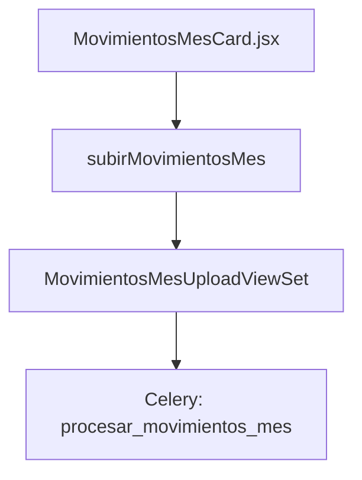

# 📑 Documentación: Tarjeta Movimientos del Mes

## 🎯 Objetivo
Explica el flujo de la tarjeta **Movimientos del Mes** que permite subir el archivo mensual de movimientos desde Talana y monitorear su procesamiento.

## 📐 Arquitectura General


## 🎨 Frontend
Archivo: `src/components/TarjetasCierreNomina/MovimientosMesCard.jsx`.
La tarjeta inicia un polling cada 5 s cuando el estado es `en_proceso`.

```jsx
useEffect(() => {
  if (estado === "en_proceso" && !pollingRef.current && onActualizarEstado) {
    pollingRef.current = setInterval(async () => {
      await onActualizarEstado();
    }, 5000);
  }
}, [estado, onActualizarEstado]);
```
【F:src/components/TarjetasCierreNomina/MovimientosMesCard.jsx†L24-L39】

## 🌐 API del Frontend
Funciones utilizadas desde `src/api/nomina.js`:
- `subirMovimientosMes(cierreId, formData)`
- `obtenerEstadoMovimientosMes(cierreId)`

## ⚙️ Backend
### ViewSet
`MovimientosMesUploadViewSet` maneja el upload y expone el estado.
```python
@action(detail=False, methods=['post'], url_path='subir/(?P<cierre_id>[^/.]+)')
def subir(self, request, cierre_id=None):
    ...
    procesar_movimientos_mes.delay(movimiento.id)
```
【F:backend/nomina/views.py†L496-L513】

### Tarea Celery
Procesa el archivo y actualiza su estado.
```python
@shared_task
def procesar_movimientos_mes(movimiento_id):
    movimiento = MovimientosMesUpload.objects.get(id=movimiento_id)
    movimiento.estado = 'en_proceso'
    movimiento.save()
    resultados = procesar_archivo_movimientos_mes_util(movimiento)
    if resultados.get('errores'):
        movimiento.estado = 'con_error'
    else:
        movimiento.estado = 'procesado'
    movimiento.save()
```
【F:backend/nomina/tasks.py†L152-L178】

## 🗄️ Modelo Involucrado
`MovimientosMesUpload` guarda el archivo subido y su estado, junto con los resultados del procesamiento.

## ✅ Resultado
Cuando la tarea finaliza, el estado pasa a `procesado` (o `con_errores_parciales` si hubo fallos) y la tarjeta deja de hacer polling.
