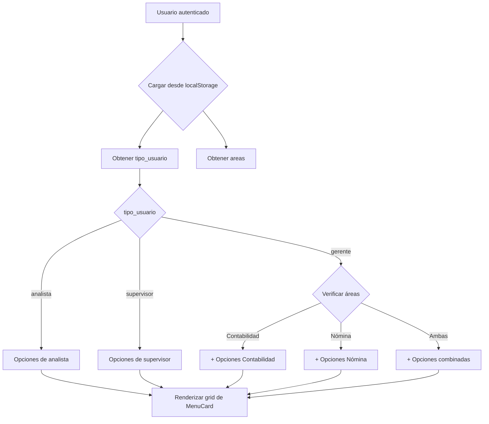

# 📋 Módulo de Menú Principal

**Versión:** 1.0.0  
**Fecha de creación:** 14 de noviembre de 2025  
**Responsable:** Sistema SGM

---

## 📖 Descripción General

El **módulo de menú** proporciona la interfaz principal de navegación del sistema SGM. Gestiona la visualización dinámica de opciones según el tipo de usuario (Analista, Supervisor, Gerente) y las áreas asignadas (Contabilidad, Nómina).

---

## 🎯 Funcionalidades Principales

### 1. **Menú Dinámico por Rol**
- **Analista**: Acceso a clientes asignados y herramientas
- **Supervisor**: Gestión de analistas, clientes y validaciones
- **Gerente**: Vista completa con opciones avanzadas de gestión

### 2. **Menú por Área de Negocio**
- **Contabilidad**: Gestión de cobranza, proyectos BDO, logs de actividad
- **Nómina**: Cierres de nómina, cache Redis, logs específicos
- **Mixto**: Opciones combinadas para gerentes con múltiples áreas

### 3. **Navegación Visual**
- Tarjetas interactivas con iconos de Lucide React
- Animaciones de entrada escalonadas
- Hover effects con transparencia configurable
- Colores distintivos por función

---

## 📦 Componentes Incluidos

### **Páginas**

#### `MenuUsuarioPage.jsx`
**Propósito:** Página principal del menú con renderizado dinámico de opciones

**Características:**
- Extrae usuario del localStorage
- Construye opciones según `tipo_usuario` y `areas`
- Renderiza grid responsivo de tarjetas
- Animaciones CSS inline

**Props:** Ninguna (usa contexto local)

**Exports:**
```jsx
import { MenuUsuarioPage } from '@/modules/menu';
```

### **Componentes**

#### `MenuCard.jsx`
**Propósito:** Tarjeta individual de opción de menú

**Props:**
```typescript
{
  label: string,          // Título de la opción
  descripcion: string,    // Descripción breve
  icon: LucideIcon,       // Icono de Lucide React
  color: string,          // Color hex del icono
  path: string            // Ruta de navegación
}
```

**Características:**
- Navegación con React Router
- Hover effects con scale y shadow
- Transiciones suaves
- Responsive design

---

## 🔧 Utilidades

### `menuConfig.js`
**Propósito:** Configuración centralizada de opciones de menú

**Exports:**
```javascript
export const MENU_OPTIONS = {
  ANALISTA: [...],
  SUPERVISOR: [...],
  GERENTE_CONTABILIDAD: [...],
  GERENTE_NOMINA: [...]
};
```

### `roleHelpers.js`
**Propósito:** Funciones auxiliares para lógica de roles

**Funciones:**
```javascript
getUserMenuOptions(usuario) // Retorna opciones filtradas
hasArea(usuario, areaNombre) // Verifica si tiene área
canAccessRoute(usuario, path) // Validación de acceso
```

---

## 📊 Constantes

### `menu.constants.js`
```javascript
export const CARD_OPACITY = 0.9;
export const ANIMATION_DELAY_STEP = 100; // ms
export const GRID_BREAKPOINTS = {
  sm: 'sm:grid-cols-2',
  lg: 'lg:grid-cols-3'
};
```

---

## 🛣️ Rutas Configuradas

El módulo NO define rutas propias, sino que es la página destino de `/menu` definida en `App.jsx`.

**Rutas de navegación desde el menú:**
```javascript
/menu/clientes                  // Analista, Supervisor, Gerente
/menu/tools                     // Analista, Gerente
/menu/mis-analistas             // Supervisor
/menu/validaciones              // Supervisor
/menu/gestion-cobranza-v2       // Gerente (Contabilidad)
/menu/gerente/logs-actividad    // Gerente
/menu/proyectos-bdo-latam       // Gerente (Contabilidad)
// ... más rutas según rol
```

---

## 🔄 Flujo de Uso



---

## 💻 Ejemplo de Uso

### **Importación Básica**
```jsx
import { MenuUsuarioPage } from '@/modules/menu';

// En App.jsx
<Route path="/menu" element={<MenuUsuarioPage />} />
```

### **Uso del MenuCard Directo**
```jsx
import { MenuCard } from '@/modules/menu';
import { FolderKanban } from 'lucide-react';

<MenuCard 
  label="Clientes"
  descripcion="Ver tus clientes asignados"
  icon={FolderKanban}
  color="#4F46E5"
  path="/menu/clientes"
/>
```

### **Uso de Utilidades**
```jsx
import { getUserMenuOptions } from '@/modules/menu';

const usuario = JSON.parse(localStorage.getItem("usuario"));
const opciones = getUserMenuOptions(usuario);
```

---

## 🎨 Personalización

### **Cambiar Opacidad de Tarjetas**
```jsx
// En menu.constants.js
export const CARD_OPACITY = 0.85; // Valor entre 0.1 y 1.0
```

### **Ajustar Colores**
```jsx
// En menuConfig.js
const MENU_OPTIONS = {
  ANALISTA: [
    { ..., color: "#YOUR_HEX_COLOR" }
  ]
};
```

### **Modificar Animaciones**
```jsx
// En menu.constants.js
export const ANIMATION_DELAY_STEP = 150; // ms entre tarjetas
```

---

## 🐛 Troubleshooting

### **Problema: Opciones no aparecen**
**Solución:** Verificar que `usuario.tipo_usuario` y `usuario.areas` están correctamente en localStorage

```javascript
const usuario = JSON.parse(localStorage.getItem("usuario"));
console.log("Tipo usuario:", usuario.tipo_usuario);
console.log("Áreas:", usuario.areas);
```

### **Problema: Navegación no funciona**
**Solución:** Verificar que las rutas destino están definidas en `App.jsx`

```jsx
// Verificar que existe:
<Route path="/menu/clientes" element={<Clientes />} />
```

### **Problema: Iconos no se muestran**
**Solución:** Verificar importación de Lucide React

```bash
npm install lucide-react
```

---

## 🔐 Consideraciones de Seguridad

1. **Validación de roles**: El menú solo muestra opciones, pero las rutas deben tener `<PrivateRoute>` protegiendo el acceso real
2. **localStorage**: Información del usuario se obtiene del token JWT almacenado
3. **Área de negocio**: La asignación de áreas se valida en el backend

---

## 📈 Futuras Mejoras

- [ ] Agregar badges de notificaciones en tarjetas
- [ ] Implementar búsqueda de opciones
- [ ] Añadir favoritos de usuario
- [ ] Agregar tooltips explicativos
- [ ] Implementar modo oscuro/claro
- [ ] Añadir shortcuts de teclado

---

## 📝 Notas de Migración

Este módulo refactoriza:
- `/src/pages/MenuUsuario.jsx` → `/src/modules/menu/pages/MenuUsuarioPage.jsx`
- `/src/components/OpcionMenu.jsx` → `/src/modules/menu/components/MenuCard.jsx`

**Cambios en nombres:**
- `MenuUsuario` → `MenuUsuarioPage` (más descriptivo)
- `OpcionMenu` → `MenuCard` (nombre más común)

---

## 👥 Responsables

- **Desarrollador:** Sistema SGM
- **Refactorización:** Siguiendo patrón modular establecido en `/auth`
- **Documentación:** README integrado en el módulo

---

## 📚 Referencias

- [Documentación de refactorización](/docs/refactorizacion/)
- [Módulo auth (referencia)](/src/modules/auth/)
- [Lucide React Icons](https://lucide.dev/)
- [React Router v6](https://reactrouter.com/)
