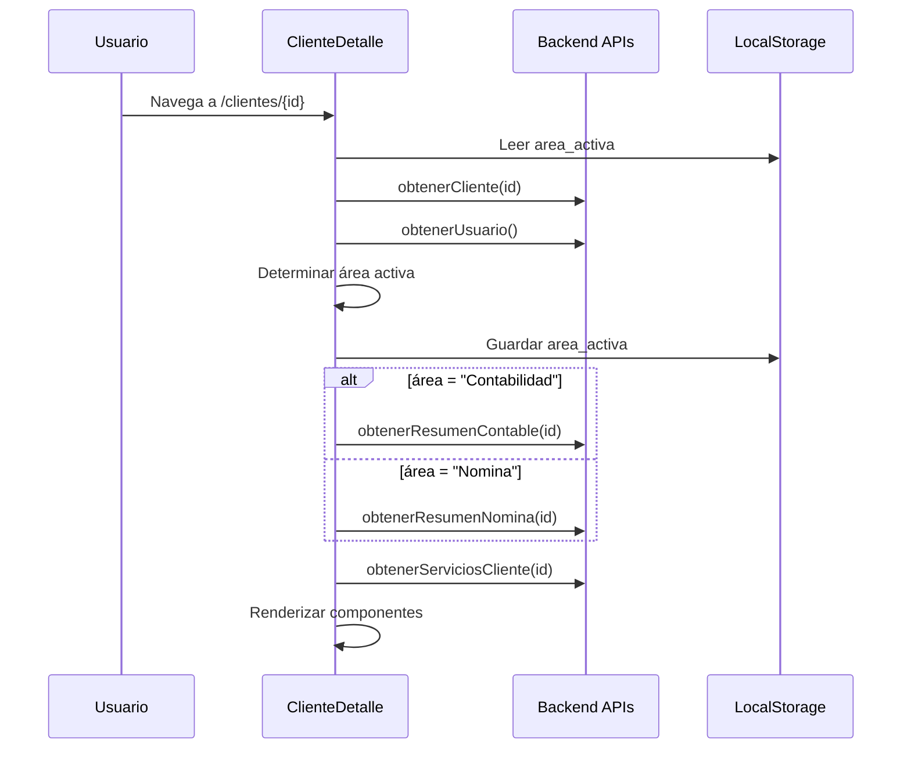

# 👤 ClienteDetalle.jsx - Documentación Detallada

## 🎯 Propósito
Página de detalle específico de un cliente. Muestra información completa, servicios contratados, KPIs y acciones disponibles. El contenido cambia dinámicamente según el área activa (Contabilidad vs Nómina).

## 👤 Usuarios Objetivo
- **Analistas**: Ver detalle de clientes asignados y ejecutar acciones
- **Supervisores**: Revisar estado y supervisar trabajo de analistas  
- **Gerentes**: Vista ejecutiva completa del cliente

## 📋 Funcionalidades

### ✅ Funcionalidades Principales
1. **Vista detallada del cliente**: Información básica y resumen específico por área
2. **Servicios contratados**: Lista de servicios activos del cliente
3. **KPIs dinámicos**: Métricas según el área activa
4. **Botones de acción**: Acciones específicas por área (crear cierre, clasificar, etc.)
5. **Cambio de contexto**: Diferente contenido para Contabilidad vs Nómina

### 🔄 Lógica de Área Activa
```jsx
// Jerarquía de determinación de área:
if (localStorage.getItem("area_activa")) {
  // 1. Usar área persistida localmente
} else if (u.area_activa) {
  // 2. Usar área activa del usuario
} else if (u.areas && u.areas.length > 0) {
  // 3. Usar primera área asignada
} else if (u.area) {
  // 4. Fallback al campo area
} else {
  // 5. Fallback final a "Contabilidad"
}
```

### 📊 Carga de Resumen por Área
```jsx
if (area === "Contabilidad") {
  r = await obtenerResumenContable(id);    // KPIs contables
} else if (area === "Nomina") {
  r = await obtenerResumenNomina(id);      // KPIs de nómina
}
```

---

## 🔗 Dependencias Frontend

### 📦 Componentes Utilizados
```jsx
import ClienteInfoCard from "../components/InfoCards/ClienteInfoCard";      // ✅ Info básica + resumen
import ServiciosContratados from "../components/ServiciosContratados";     // ✅ Lista de servicios
import KpiResumenCliente from "../components/KpiResumenCliente";           // ✅ KPIs/métricas
import ClienteActionButtons from "../components/ClienteActionButtons";     // ✅ Botones de acción
```

### 📚 Hooks y Utils
```jsx
import { useEffect, useState } from "react";          // ✅ Estado y efectos
import { useParams } from "react-router-dom";        // ✅ Obtener ID de URL
import { getAreaColor } from "../constants/areaColors"; // ✅ Colores por área
```

---

## 🌐 Dependencias Backend

### 🔌 APIs Utilizadas
```jsx
import {
  obtenerCliente,                  // Info básica del cliente
  obtenerServiciosCliente,         // Servicios contratados
} from "../api/clientes";

import { obtenerResumenContable } from "../api/contabilidad";  // KPIs contables
import { obtenerResumenNomina } from "../api/nomina";          // KPIs nómina
import { obtenerUsuario } from "../api/auth";                 // Usuario actual
```

### 📊 Endpoints Involucrados

#### 1. **`obtenerCliente(id)`**
- **Método**: GET
- **Endpoint**: `/api/clientes/{id}/`
- **Response**:
```json
{
  "id": number,
  "nombre": string,
  "rut": string,
  "direccion": string,
  "telefono": string,
  "email": string,
  "areas_efectivas": Array
  // ... otros campos básicos
}
```

#### 2. **`obtenerServiciosCliente(id)`**
- **Método**: GET
- **Endpoint**: `/api/clientes/{id}/servicios/`
- **Response**:
```json
[
  {
    "id": number,
    "nombre": string,
    "activo": boolean,
    "area": string
    // ... otros campos del servicio
  }
]
```

#### 3. **`obtenerResumenContable(id)` (Solo si área = Contabilidad)**
- **Método**: GET
- **Endpoint**: `/api/contabilidad/clientes/{id}/resumen/`
- **Response**:
```json
{
  "ultimo_cierre": {...},
  "cierres_pendientes": number,
  "estado_clasificacion": string,
  "total_movimientos": number
  // ... KPIs específicos de contabilidad
}
```

#### 4. **`obtenerResumenNomina(id)` (Solo si área = Nómina)**
- **Método**: GET
- **Endpoint**: `/api/nomina/clientes/{id}/resumen/`  
- **Response**:
```json
{
  "ultimo_periodo": {...},
  "empleados_activos": number,
  "estado_libro": string,
  "incidencias_pendientes": number
  // ... KPIs específicos de nómina
}
```

---

## 💾 Gestión de Estado

### 🔄 Estados Locales (useState)
```jsx
const [cliente, setCliente] = useState(null);        // Datos básicos del cliente
const [resumen, setResumen] = useState(null);        // KPIs específicos por área
const [servicios, setServicios] = useState([]);      // Servicios contratados
const [areaActiva, setAreaActiva] = useState("Contabilidad"); // Área por defecto
```

### 🗃️ Parámetros de URL
```jsx
const { id } = useParams();  // ID del cliente desde /clientes/{id}
```

### 🗂️ LocalStorage
```jsx
localStorage.getItem("area_activa");      // Leer área persistida
localStorage.setItem("area_activa", area); // Persistir área determinada
```

---

## 🎨 UI y Estructura

### 🏗️ Layout de Componentes
```jsx
<div className="text-white space-y-6">
  {/* Header con título y badge de área */}
  <div className="flex items-center gap-4 mb-4">
    <h1>Detalle de Cliente</h1>
    <span className={getAreaColor(areaActiva)}>{areaActiva}</span>
  </div>
  
  {/* Información básica + resumen KPIs */}
  <ClienteInfoCard cliente={cliente} resumen={resumen} areaActiva={areaActiva} />
  
  {/* Servicios contratados */}
  <ServiciosContratados servicios={servicios} areaActiva={areaActiva} />
  
  {/* KPIs adicionales */}
  <KpiResumenCliente />
  
  {/* Botones de acción */}
  <ClienteActionButtons clienteId={cliente.id} areaActiva={areaActiva} />
</div>
```

### 🎨 Sistema de Colores por Área
```jsx
import { getAreaColor } from "../constants/areaColors";
// Retorna clases CSS específicas por área
// "Contabilidad" → bg-blue-600
// "Nomina" → bg-green-600
```

---

## 🔄 Navegación

### 📍 Desde Clientes.jsx
```jsx
// A través del componente ClienteRow
// Navigate hacia /menu/clientes/{id}
```

### 🗺️ Hacia otras páginas
```jsx
// A través de ClienteActionButtons hacia:
// - /menu/clientes/{clienteId}/clasificacion
// - /menu/clientes/{clienteId}/crear-cierre
// - /menu/clientes/{clienteId}/cierres
```

---

## 🧩 Componentes Hijos Críticos

### 1. **ClienteInfoCard**
- **Props**: `{ cliente, resumen, areaActiva }`
- **Responsabilidad**: Mostrar info básica + KPIs principales

### 2. **ServiciosContratados**
- **Props**: `{ servicios, areaActiva }`  
- **Responsabilidad**: Lista de servicios activos/inactivos

### 3. **KpiResumenCliente**
- **Props**: Ninguna (obtiene datos internamente?)
- **Responsabilidad**: Métricas adicionales del cliente

### 4. **ClienteActionButtons**
- **Props**: `{ clienteId, areaActiva }`
- **Responsabilidad**: Botones de navegación a acciones específicas

---

## ⚠️ Problemas Identificados

### 🚨 Lógica de Área Duplicada
```jsx
// ❌ Problema: Misma lógica compleja que en Clientes.jsx
let area = localStorage.getItem("area_activa");
if (!area) {
  if (u.area_activa) {
    area = u.area_activa;
  } else if (u.areas && u.areas.length > 0) {
    area = u.areas[0].nombre || u.areas[0];
  }
  // ... más lógica
}
```
**Recomendación**: Extraer a custom hook `useAreaActiva()`

### 🔄 Carga Secuencial
```jsx
// ❌ Problema: APIs cargadas una tras otra
const c = await obtenerCliente(id);
const u = await obtenerUsuario(); 
const r = await obtenerResumenContable(id);
const s = await obtenerServiciosCliente(id);
```
**Recomendación**: Paralelizar con `Promise.all()` las que no dependan entre sí

### 🎯 Fallback Sin Sentido
```jsx
// ❌ Problema: Área por defecto "Contabilidad" puede ser incorrecta
} else {
  area = "Contabilidad"; // fallback final
}
```
**Recomendación**: Error explícito si no se puede determinar área

### 🔧 Estado de Carga Básico
```jsx
// ⚠️ Mejora: Loading muy básico
if (!cliente || !resumen) {
  return <p>Cargando cliente...</p>;
}
```
**Recomendación**: Skeleton loading específico por componente

---

## 🔒 Consideraciones de Seguridad

### 🛡️ Validación de Acceso
- ✅ **Backend**: Endpoints validan que usuario tenga acceso al cliente
- ⚠️ **Frontend**: No valida si usuario puede ver este cliente específico

### 🔐 Área Activa Persistida
```jsx
localStorage.setItem("area_activa", area);
```
- **Riesgo**: Manipulación para ver datos de área no autorizada
- **Mitigación**: Backend debe revalidar área en cada endpoint

---

## 📊 Flujo de Datos

### 🔄 Diagrama de Carga


---

## 📈 Métricas de Complejidad
- **Líneas de código**: 87
- **Estados locales**: 4
- **Efectos**: 1 (complejo con múltiples APIs)
- **APIs**: 4-5 (dinámico por área)
- **Componentes hijos**: 4
- **Responsabilidades**: 3 (Carga + UI + Navegación)
- **Complejidad**: ⭐⭐⭐ (Media)

---

## 🔍 Siguientes Análisis Requeridos

### 🧩 Componentes Hijos a Documentar
1. **ClienteInfoCard.jsx** - Información básica + resumen
2. **ServiciosContratados.jsx** - Lista de servicios
3. **ClienteActionButtons.jsx** - Botones de acción críticos
4. **KpiResumenCliente.jsx** - KPIs adicionales

### 🔗 Páginas de Destino
1. **PaginaClasificacion.jsx** - Desde action buttons
2. **CrearCierre.jsx** - Desde action buttons
3. **HistorialCierresPage.jsx** - Desde action buttons

---

*Documentado: 21 de julio de 2025*
*Estado: ✅ Completo*
*Complejidad: ⭐⭐⭐ (Requiere refactoring de área activa)*
